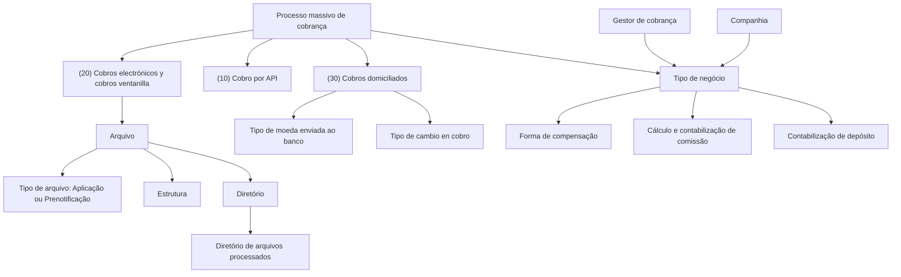

# Definição de Tipos de Negócio por Gestor para Processos Massivos de Cobro

## 1. Metadados do Documento
- **Arquivo de Origem:** Não identificado no conteúdo fornecido
- **Tipo de Documento:** Especificação Técnica / Documentação Funcional
- **Domínio / Sistema:** Processos massivos de cobrança e gestão de recebimentos
- **Público-Alvo:** Desenvolvedores, Arquitetos, Operação e Negócio
- **Data/Versão Identificada:** Não identificada

---

## 2. Resumo Executivo & Contexto de Negócio

O documento descreve a definição de tipos de negócio por tipo de processo massivo de cobrança e por gestor de cobrança. O objetivo é representar os diferentes negócios estabelecidos pela companhia com bancos ou outras instituições para a cobrança massiva de prêmios.

A configuração abrange processos de cobrança por API, cobranças eletrônicas e em guichê, além de cobranças domiciliadas. Cada tipo de negócio é identificado por uma chave, associado a um gestor de cobrança e descrito por um nome de tipo de negócio.

A especificação também define propriedades relacionadas a arquivos de entrada e saída, incluindo tipo de arquivo, estrutura, diretórios, diretórios de arquivos processados e indicação de carga manual. Essas propriedades são aplicáveis quando a carga ou descarga automática de arquivos é utilizada, especialmente em processos de cobranças eletrônicas e cobranças em guichê.

Para processos de domiciliação bancária com recibos em moeda estrangeira, o documento estabelece regras para a moeda enviada ao banco e para a data de recuperação da taxa de câmbio. Também define opções de compensação, contabilização bancária, cálculo de comissão, imposto e contabilização das despesas de comissão.

---

## 3. Arquitetura, Componentes & Tecnologias Envolvidas

Os elementos funcionais identificados são:

- Companhia responsável pelos processos massivos de cobrança.
- Bancos ou outras instituições vinculadas à cobrança massiva de prêmios.
- Gestor de cobrança.
- Tipo de negócio.
- Processo massivo de cobrança.
- Processos de cobrança por API.
- Processos de cobranças eletrônicas e cobranças em guichê.
- Processos de cobranças domiciliadas.
- Arquivos de aplicação ou pré-notificação.
- Diretórios de arquivos de entrada, saída e arquivos processados.
- Regras de compensação, contabilização e comissão bancária.



**Nota de Análise:** O documento não detalha métodos HTTP, contratos JSON, interfaces, tecnologias de implementação, integrações técnicas, servidores, URLs, portas ou mecanismos de autenticação para o processo denominado “Cobro por API”.

---

## 4. Regras de Negócio, Especificações Funcionais & Processos

### Classificação do processo massivo de cobrança

O campo **Proceso masivo de cobro** identifica o tipo de processo massivo de cobrança. Os valores definidos são:

1. **(10) Cobro por API**
2. **(20) Cobros electrónicos y cobros ventanilla**
3. **(30) Cobros domiciliados**

### Classificação do gestor de cobrança

A propriedade **Tipo de gestor** contém a chave da classificação do gestor de cobranças. Os valores apresentados são:

- **(GD) Gestor directo**
- **(AG) Agente**
- **(BA) Banco**
- **(OF) Oficina comercial**
- **(CO) Cobrador**
- **(GP) Líder de coaseguro aceptado**
- **(DB) Débito automático en cuenta**
- **(TA) Débito con tarjeta de crédito**

A propriedade **Gestor de cobro** contém a chave que identifica o gestor de cobrança.

### Identificação do negócio

A propriedade **Negocio** contém a chave que identifica o tipo de negócio. A propriedade **Nombre tipo de negocio** contém a descrição do tipo de negócio associada à chave.

### Regras de arquivo e diretórios

Quando um processo requer um arquivo como origem dos dados a serem processados, a propriedade **Archivo** contém o nome desse arquivo. Segundo o documento, esses processos são do tipo **Cobros electrónicos y cobros ventanilla**.

A propriedade **Tipo de archivo** identifica o tipo do arquivo:

1. **(1) Aplicación**
2. **(2) Prenotificación**

A propriedade **Estructura** contém a chave da estrutura associada ao arquivo.

Quando a carga ou descarga automática de arquivos é utilizada, a propriedade **Directorio** contém a localização do arquivo que será lido ou a localização na qual deverá ser gravado o arquivo gerado.

A propriedade **Directorio procesados** contém o diretório no qual serão deixados os arquivos já processados quando a carga ou descarga automática de arquivos for utilizada.

A propriedade **Carga archivo** determina se, para determinado tipo de processo, é executada uma carga manual de arquivo.

### Regras de moeda para domiciliação bancária

Quando o processo é de domiciliação bancária e o valor do recibo está em moeda estrangeira, a propriedade **Tipo de moneda** determina a moeda na qual a informação será enviada ao banco:

1. **(1) Moneda origen:** o valor do recibo é enviado na própria moeda do recibo.
2. **(2) Moneda país:** o valor do recibo é enviado convertido para a moeda do país.

### Regras de taxa de câmbio na cobrança

Para processos de domiciliação bancária que enviam informações ao banco na moeda do país, a propriedade **Tipo de cambio en cobro** determina a data usada para recuperar a taxa de câmbio:

1. **(1) Valor de cambio del recibo:** a taxa de câmbio é obtida na data de emissão do recibo.
2. **(2) Valor de cambio día de envío:** a taxa de câmbio é obtida na data de execução do processo.

### Regras de compensação

A propriedade **Forma de compensación** determina a forma padrão de compensar transações durante a aplicação das cobranças. O documento informa que esse valor pode ser modificado posteriormente durante a execução do processo.

1. **(1) No compensar:** as transações não são compensadas.
2. **(2) Una sola compensación:** é realizada uma única compensação pelo valor total de todas as transações.
3. **(3) Compensación una a una:** as transações são compensadas individualmente.

A propriedade **Aplica cobro recibo** marca a aplicação automática da cobrança de recibos durante a carga de arquivo no processo de cobranças eletrônicas.

### Regras de cobrança, moeda e agrupamento de conta

A propriedade **Cobro pago** identifica o tipo de cobrança ou pagamento.

A propriedade **Moneda** contém a chave da moeda.

A propriedade **Agrupación de cuenta** define como o banco realiza o agrupamento da conta:

- **Sí:** contabilização detalhada.
- **No:** contabilização agrupada.

### Regras de contabilização de depósito

A propriedade **Contabilización depósito** define como o banco contabiliza o depósito em relação aos casos aprovados e rejeitados:

1. **(1) Registro neto de casos rechazados**
2. **(2) Registra los casos aprobados y los rechazados**

A propriedade **Días contabilización** define a quantidade de dias que o banco utiliza para contabilizar, a partir da data de envio.

### Regras de cálculo de comissão

A propriedade **Cálculo gasto comisión** determina como é calculada a comissão que será cobrada pelo banco pela gestão das cobranças dos recibos:

1. **(1) No calcula:** não calcula comissão.
2. **(2) Porcentaje del importe enviado:** calcula um percentual sobre o valor total das transações.
3. **(3) Importe fijo por transacción:** calcula um valor fixo para cada transação.
4. **(4) Calculable:** calcula a comissão por uma lógica de negócio.

A propriedade **Porcentaje para cálculo de gasto de comisión** contém o percentual utilizado quando o cálculo ocorre por percentual.

A propriedade **Importe de gasto de comisión** contém o valor da despesa de comissão quando o cálculo ocorre por valor fixo.

A propriedade **Lógica de cálculo de comisiones** contém o nome da lógica de negócio responsável pelo cálculo de comissão bancária quando o tipo de cálculo é **Calculable**.

A propriedade **Importe mínimo de gasto de comisión** define o valor mínimo da despesa de comissão.

A propriedade **Impuesto** contém a chave do imposto da despesa de comissão.

A propriedade **Contabilización gasto de comisión** define como o banco contabiliza a despesa de comissão:

1. **(1) Registra el importe neto de los gastos**
2. **(2) Registros separados**

---

## 5. Tabelas de Parâmetros, Ambientes e Estruturas de Dados

| Item / Parâmetro | Descrição / Função | Tipo / Valores / Formato | Ambiente / Observações |
| :--- | :--- | :--- | :--- |
| Proceso masivo de cobro | Identifica o tipo de processo massivo de cobrança | 10: Cobro por API; 20: Cobros electrónicos y cobros ventanilla; 30: Cobros domiciliados | Não detalhado |
| Tipo de gestor | Contém a chave da classificação do gestor de cobranças | GD, AG, BA, OF, CO, GP, DB, TA | Não detalhado |
| Gestor de cobro | Chave que identifica o gestor de cobrança | Chave | Não detalhado |
| Negocio | Chave que identifica o tipo de negócio | Chave | Não detalhado |
| Nombre tipo de negocio | Descrição do tipo de negócio associado à chave | Texto | Não detalhado |
| Archivo | Nome do arquivo de onde serão obtidos dados para processamento | Nome de arquivo | Aplicável a Cobros electrónicos y cobros ventanilla |
| Tipo de archivo | Identifica o tipo de arquivo | 1: Aplicación; 2: Prenotificación | Não detalhado |
| Estructura | Chave da estrutura | Chave | Não detalhado |
| Directorio | Localização do arquivo a ser lido ou gravado | Caminho/localização | Usado em carga ou descarga automática de arquivos |
| Directorio procesados | Diretório destinado aos arquivos já processados | Caminho/localização | Usado em carga ou descarga automática de arquivos |
| Carga archivo | Determina se ocorre carga manual de arquivo | Não detalhado | Aplicável por tipo de processo |
| Cuenta simplificada | Conta simplificada de compensação | Não detalhado | Não detalhado |
| Tipo de moneda | Determina a moeda enviada ao banco em domiciliação com recibo em moeda estrangeira | 1: Moneda origen; 2: Moneda país | Aplicável a Cobros domiciliados |
| Tipo de cambio en cobro | Determina a data de recuperação da taxa de câmbio | 1: Valor de cambio del recibo; 2: Valor de cambio día de envío | Aplicável quando a informação é enviada na moeda do país |
| Forma de compensación | Determina a forma padrão de compensar transações | 1: No compensar; 2: Una sola compensación; 3: Compensación una a una | Pode ser alterada na execução do processo |
| Aplica cobro recibo | Marca a aplicação automática de cobrança de recibos na carga de arquivo | Não detalhado | Aplicável a Cobros electrónicos |
| Cobro pago | Tipo de cobrança ou pagamento | Não detalhado | Não detalhado |
| Moneda | Chave da moeda | Chave | Não detalhado |
| Agrupación de cuenta | Define a forma de agrupamento da conta pelo banco | Sí: contabilização detalhada; No: contabilização agrupada | Não detalhado |
| Contabilización depósito | Define a contabilização do depósito para casos aprovados e rejeitados | 1: Registro neto de casos rechazados; 2: Registra los casos aprobados y los rechazados | Não detalhado |
| Días contabilización | Quantidade de dias usados pelo banco para contabilizar após a data de envio | Quantidade de dias | Não detalhado |
| Cálculo gasto comisión | Define a forma de cálculo da comissão bancária | 1: No calcula; 2: Porcentaje del importe enviado; 3: Importe fijo por transacción; 4: Calculable | Não detalhado |
| Porcentaje para cálculo de gasto de comisión | Percentual utilizado no cálculo de comissão por percentual | Percentual | Aplicável à opção 2 |
| Importe de gasto de comisión | Valor da despesa de comissão fixa | Valor monetário | Aplicável à opção 3 |
| Lógica de cálculo de comisiones | Nome da lógica de negócio de cálculo de comissão | Nome de lógica de negócio | Aplicável à opção 4 |
| Importe mínimo de gasto de comisión | Valor mínimo da despesa de comissão | Valor monetário | Não detalhado |
| Impuesto | Chave do imposto da despesa de comissão | Chave | Não detalhado |
| Contabilización gasto de comisión | Define a forma de contabilização da comissão bancária | 1: Registra el importe neto de los gastos; 2: Registros separados | Não detalhado |

---

## 6. Bateria de Perguntas & Respostas para RAG (FAQ Sintético)

### P1: Qual é o objetivo da definição de tipos de negócio por gestor?
**R:** O objetivo é determinar os diferentes tipos de negócio por tipo de processo e por gestor com os quais a companhia trabalha. O documento relaciona esses negócios a acordos estabelecidos com bancos ou outras instituições para a cobrança massiva de prêmios.

### P2: Quais tipos de processo massivo de cobrança estão definidos?
**R:** O documento define três tipos: **(10) Cobro por API**, **(20) Cobros electrónicos y cobros ventanilla** e **(30) Cobros domiciliados**.

### P3: Quais classificações de gestor de cobrança são suportadas?
**R:** As classificações listadas são: **GD Gestor directo**, **AG Agente**, **BA Banco**, **OF Oficina comercial**, **CO Cobrador**, **GP Líder de coaseguro aceptado**, **DB Débito automático en cuenta** e **TA Débito con tarjeta de crédito**.

### P4: Quando a propriedade Archivo deve ser utilizada?
**R:** A propriedade **Archivo** deve ser utilizada quando o processo requer um arquivo como origem dos dados a serem processados. O documento indica que esses processos são do tipo **Cobros electrónicos y cobros ventanilla**.

### P5: Quais tipos de arquivo podem ser configurados?
**R:** A propriedade **Tipo de archivo** admite os valores **(1) Aplicación** e **(2) Prenotificación**.

### P6: Como a moeda é determinada em um processo de domiciliação bancária com recibo em moeda estrangeira?
**R:** A propriedade **Tipo de moneda** determina a moeda enviada ao banco. Na opção **(1) Moneda origen**, o valor é enviado na moeda do próprio recibo. Na opção **(2) Moneda país**, o valor é enviado convertido para a moeda do país.

### P7: Como é escolhida a data da taxa de câmbio para cobranças em moeda do país?
**R:** A propriedade **Tipo de cambio en cobro** define a data de recuperação da taxa de câmbio. A opção **(1) Valor de cambio del recibo** utiliza a data de emissão do recibo. A opção **(2) Valor de cambio día de envío** utiliza a data de execução do processo.

### P8: Quais opções existem para a forma de compensação das transações?
**R:** A propriedade **Forma de compensación** permite: **(1) No compensar**, sem compensação das transações; **(2) Una sola compensación**, com uma única compensação pelo valor total de todas as transações; e **(3) Compensación una a una**, com compensação individual de cada transação. Esse valor padrão pode ser modificado na execução do processo.

### P9: O que significa Agrupación de cuenta igual a Sí ou No?
**R:** Quando **Agrupación de cuenta** é **Sí**, o banco realiza contabilização detalhada. Quando é **No**, o banco realiza contabilização agrupada.

### P10: Quais são as formas de cálculo da despesa de comissão bancária?
**R:** A propriedade **Cálculo gasto comisión** permite quatro opções: **(1) No calcula**, sem comissão; **(2) Porcentaje del importe enviado**, com percentual sobre o total das transações; **(3) Importe fijo por transacción**, com valor fixo por transação; e **(4) Calculable**, com cálculo realizado por lógica de negócio.

### P11: Quais parâmetros complementam o cálculo da comissão?
**R:** O documento define o **Porcentaje para cálculo de gasto de comisión** para a modalidade percentual, o **Importe de gasto de comisión** para a modalidade de valor fixo, a **Lógica de cálculo de comisiones** para a modalidade calculável, o **Importe mínimo de gasto de comisión** e a chave de **Impuesto** da despesa de comissão.

### P12: Como o banco pode contabilizar o depósito?
**R:** A propriedade **Contabilización depósito** permite **(1) Registro neto de casos rechazados** ou **(2) Registra los casos aprobados y los rechazados**. A propriedade **Días contabilización** determina a quantidade de dias que o banco utiliza para contabilizar a partir da data de envio.

---

## 7. Glossário de Termos, Siglas & Conceitos-Chave

- **AG:** Agente.
- **Aplicación:** Tipo de arquivo identificado pelo código **(1)**.
- **Archivo:** Nome do arquivo a partir do qual são obtidos dados para processamento.
- **BA:** Banco.
- **Cobro por API:** Tipo de processo massivo de cobrança identificado pelo código **(10)**.
- **Cobros domiciliados:** Tipo de processo massivo de cobrança identificado pelo código **(30)**.
- **Cobros electrónicos y cobros ventanilla:** Tipo de processo massivo de cobrança identificado pelo código **(20)**.
- **CO:** Cobrador.
- **DB:** Débito automático em conta.
- **GD:** Gestor direto.
- **GP:** Líder de cosseguro aceito.
- **Moneda origen:** Moeda do próprio recibo.
- **Moneda país:** Moeda do país para a qual o valor do recibo é convertido.
- **OF:** Escritório comercial.
- **Prenotificación:** Tipo de arquivo identificado pelo código **(2)**.
- **TA:** Débito com cartão de crédito.
- **Tipo de negocio:** Identificação do negócio associada ao processo massivo de cobrança e ao gestor.
- **Tipo de gestor:** Classificação do gestor de cobranças.

---

## 8. Notas Críticas, Riscos & Limitações

- O conteúdo fornecido não identifica nome de arquivo, data, versão, autor, sistema específico ou ambiente de execução.
- O documento não detalha formatos físicos de arquivos, extensões, codificação, layout de registros, protocolos de transferência ou permissões para os diretórios.
- O processo **Cobro por API** é listado, mas não há detalhamento de endpoints, métodos HTTP, autenticação, payloads, respostas, contratos ou tratamento de erros.
- A propriedade **Carga archivo** indica a possibilidade de carga manual, mas o documento não informa valores permitidos, critérios de validação ou procedimento operacional.
- As propriedades **Cuenta simplificada**, **Cobro pago**, **Moneda** e **Impuesto** são mencionadas, mas seus tipos, formatos e catálogos de valores não são detalhados.
- A lógica de negócio associada ao cálculo de comissão na modalidade **Calculable** é referenciada somente por nome; sua fórmula, regras e implementação não são descritas.
- A expressão **Registro neto de casos rechazados** é apresentada como opção de contabilização de depósito, sem definição adicional do comportamento contábil.

---

## 9. Conteúdo Bruto Estruturado (Referência Fiel)

```text
--- [PÁGINA 1 DE 6] ---

EN CONSTRUCCIÓN
DEFINICIÓN de tipo de negocio por gestor
Objetivo
Determinar los diferentes tipos de negocios por tipo de proceso y gestor, con que trabaja la
compañía.
Es decir, los diferentes negocios que la compañía ha establecido con bancos u otras instituciones
para el cobro masivo de primas.
Propiedades generales
Propiedades generales
Proceso masivo de cobro
Identifica el tipo de proceso masivo de cobro.
(10)Cobro por API
(20)Cobros electrónicos y cobros ventanilla
(30)Cobros domiciliados
Tipo de gestor
Esta propiedad contiene la clave de la clasificación del gestor de cobros.
 / 
 CF
Inicio Soluciones APIs Documentación Zeus
ES


--- [PÁGINA 2 DE 6] ---

(GD)Gestor directo
(AG)Agente
(BA)Banco
(OF)Oficina comercial
(CO)Cobrador
(GP)Líder de coaseguro aceptado
(DB)Débito automático en cuenta
(TA)Débito con tarjeta de crédito
Gestor de cobro
Clave que identifica el gestor de cobro.
Negocio
Clave que identifica el tipo de negocio.
Nombre tipo de negocio
Descripción del tipo de negocio asociada a la clave.
Archivo
Si el proceso requiere un archivo desde el que se tomarán los datos a procesar, esta propiedad
contiene el nombre de dicho archivo. Estos procesos son de tipo Cobros electrónicos y cobros
ventanilla.
Tipo de archivo
Identifica el tipo de archivo.
(1)Aplicación
(2)Prenotificación
Estructura
Clave de la estructura.
Directorio
Si se utiliza utiliza la carga o descarga de archivos de forma automática, esta propiedad contiene la
ubicación donde se encuentra el archivo a leer o donde se debe dejar el archivo que se genere.


--- [PÁGINA 3 DE 6] ---

Directorio procesados
Directorio de archivos procesados.
Si se utiliza utiliza la carga o descarga de archivos de forma automática, esta propiedad contiene la
ubicación donde se dejarán los archivos ya procesados.
Carga archivo
Determina si para este tipo de proceso se realiza carga de archivo manual.
Cuenta simplificada
Cuenta simplificada compensación.
Tipo de moneda
Cuando el proceso es domiciliación bancaria y el importe del recibo está en moneda extranjera, esta
propiedad determina en que tipo de moneda se envía la información al banco.
(1)Moneda origen
(2)Moneda país
(1)Moneda origen
El importe del recibo se envía en la propia moneda del recibo.
(2)Moneda país
El importe del recibo se envía convertido a la moneda del país.
Tipo de cambio en cobro
En los procesos de domiciliación bancaria que envían la información al banco en moneda del país,
esta propiedad determina la fecha en la que se recupera el tipo de cambio.
(1)Valor de cambio del recibo
(2)Valor de cambio día de envío
(1)Valor de cambio del recibo
El tipo de cambio se toma de la fecha en la que se emitió el recibo.
(2)Valor de cambio dia de envío
El tipo de cambio se toma de la fecha en la que se ejecuta el proceso.


--- [PÁGINA 4 DE 6] ---

Forma de compensación
Determina la forma, por defecto, de compensar las transacciones en la aplicación de los cobros,
aunque posteriormente, en la ejecución del proceso, este valor se puede modificar.
(1)No Compensar
(2)Una sola compensación
(3)Compensación una a una
(1)No compensar
No se compensan las transacciones.
(2)Una sola compensación
Se realiza una sola compensación por el importe total de todas las transacciones.
(3)Compensación una a una
Se compensan las transacciones una a una.
Aplica cobro recibo
Marca aplicar cobro de recibos en la carga del archivo en proceso de cobros electrónicos,
automáticamente.
Cobro pago
Tipo de cobro o pago.
Moneda
Clave de la moneda.
Agrupación de cuenta
Forma en que el banco hace la agrupación de la cuenta.
Si
Contabilización a detalle.
No
Contabilización agrupada.


--- [PÁGINA 5 DE 6] ---

Contabilización depósito
Forma en que el banco contabiliza el deposito respecto a los casos aprobados y rechazados.
(1)Registro neto de casos rechazados
(2)Registra los casos aprobados y los rechazados
Días contabilización
Cantidad de dias que se toma el banco para contabilizar, a partir de la fecha de envío.
Cálculo gasto comisión
Determina la forma en la que se calcula la comisión que cobrará el banco por la gestión de los cobros
de los recibos.
(1)No calcula
(2)Porcentaje del importe enviado
(3)Importe fijo por transacción
(4)Calculable
(1)No calcula
No calcula comisión.
(2)Porcentaje del importe enviado
Se calcula un porcentaje del importe total de las transacciones.
(3)Importe fijo por transacción
Se calcula un importe fijo por cada transacción.
(4)Calculable
Se calcula por una lógica de negocio.
Porcentaje para cálculo de gasto de comisión
Porcentaje para el cálculo del gasto de comisión cuando calcula por porcentaje.
Importe de gasto de comisión
Importe de gastos de comisión cuando el cálculo es por importe fijo.


--- [PÁGINA 6 DE 6] ---

Lógica de cálculo de comisiones
Nombre de la lógica de negocio que contiene calculo comisiones del banco, cuando es calculable.
Importe mínimo de gasto de comisión
Importe mínimo de gasto comisión.
Impuesto
Clave del impuesto del gasto de comisión.
Contabilización gasto de comisión
Forma en que el banco contabiliza el gasto de comisión.
(1)Registra el importe neto de los gastos
(2)Registros separados
```
