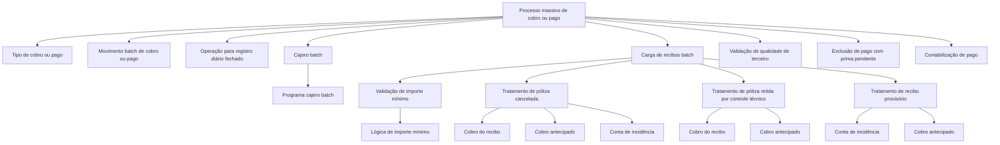

# Definição de Parâmetros para Processos Massivos de Cobro e Pago

## 1. Metadados do Documento
- **Arquivo de Origem:** Não identificado no conteúdo fornecido
- **Tipo de Documento:** Especificação Técnica
- **Domínio / Sistema:** Processos massivos de cobro e pago
- **Público-Alvo:** Desenvolvedores, Arquitetos, Operação e Negócio
- **Data/Versão Identificada:** Não identificada

---

## 2. Resumo Executivo & Contexto de Negócio

O documento define parâmetros para determinar o comportamento dos processos massivos de **cobro** e **pago**. O objetivo explicitamente declarado é estabelecer como esses processos devem operar, incluindo tipos de movimento batch, operações para registros diários fechados, configuração de cajero e regras aplicáveis a recibos e pólizas.

A especificação apresenta propriedades gerais para classificação do processo, como o tipo de cobro ou pago, o tipo de movimento batch e a operação aplicável quando o registro diário está fechado. Também inclui configurações relacionadas ao programa e à chave do cajero batch.

A documentação descreve regras para tratamento de recibos, incluindo ausência de recibo, incidências de cobro, importe mínimo, lógica de obtenção desse importe e carga de recibos batch. O conteúdo também relaciona situações de pólizas canceladas, retidas por controle técnico e com recibos provisórios a alternativas de aplicação de cobro.

O documento não descreve implementações, interfaces, métodos HTTP, contratos de dados, tecnologias, URLs, ambientes específicos ou responsáveis operacionais. As opções numéricas listadas representam comportamentos funcionais, mas não há detalhamento adicional sobre critérios de seleção, persistência ou execução técnica.

---

## 3. Arquitetura, Componentes & Tecnologias Envolvidas

Os elementos funcionais identificados são:

- Processo massivo de cobro ou pago.
- Movimento batch de cobro ou pago.
- Registro diário fechado.
- Cajero batch e programa cajero batch.
- Recibos batch.
- Conta simplificada para ausência de recibo.
- Conta simplificada para incidências de cobro.
- Lógica de importe mínimo.
- Contabilização de pago.
- Validação de qualidade de terceiro.
- Exclusão de pago quando houver prima pendente.
- Pólizas canceladas.
- Pólizas retidas por controle técnico.
- Suplementos de póliza.
- Pólizas com recibos provisórios.
- Cobro antecipado à póliza.
- Conta de incidência.



> **Nota de Análise:** o documento descreve parâmetros e opções funcionais, mas não detalha a arquitetura física, as tecnologias utilizadas, os contratos de integração ou a sequência executável completa do processamento batch.

---

## 4. Regras de Negócio, Especificações Funcionais & Processos

1. O processo deve possuir um parâmetro de **tipo de cobro ou pago**.
2. O processo deve possuir um parâmetro de **tipo de movimento batch de cobro ou pago**.
3. Deve ser definida uma **operação** para a situação em que o **registro diário está fechado**.
4. Deve ser configurada uma **clave cajero batch** e um **programa cajero batch**.
5. Quando o recibo não existir, deve ser utilizada uma **cuenta simplificada no existe recibo**.
6. Incidências nos cobros devem utilizar uma **cuenta simplificada incidencia cobro**.
7. O processamento do recibo depende de um **importe mínimo em moeda do país**.
8. A **lógica importe mínimo** é responsável por devolver o importe mínimo aplicável.
9. O processo deve definir o **tipo de contabilización del pago**.
10. O processo deve validar a **calidad de tercero**.
11. O pagamento deve poder ser excluído quando houver **prima pendiente**.
12. Para póliza cancelada, o documento define três alternativas de aplicação de cobro:
    1. Cobro del recibo.
    2. Cobro anticipado.
    3. Cuenta de incidencia.
13. Para póliza retida por controle técnico, o documento define duas alternativas:
    1. Cobro del recibo; para recibo em situação **EP** e suplemento com data de efeito do recibo e controle técnico, deve ser criado um cobro antecipado à póliza.
    2. Criação de cobro antecipado à póliza se o último suplemento da póliza tiver controle técnico.
14. Para póliza com recibos provisórios, o documento define duas alternativas:
    1. Cuenta de incidencia.
    2. Cobro anticipado.
15. A carga de recibos batch deve possuir um tipo de carga configurável.

> **Nota de Análise:** a sigla ou situação **EP** é mencionada no documento, mas não é expandida ou definida.

---

## 5. Tabelas de Parâmetros, Ambientes e Estruturas de Dados

| Item / Parâmetro | Descrição / Função | Tipo / Valores / Formato | Ambiente / Observações |
| :--- | :--- | :--- | :--- |
| Tipo cobro pago | Define o tipo de cobro ou pago. | Não detalhado | Aplicável ao processo massivo. |
| Proceso masivo de cobro o pago | Define o tipo de movimento batch de cobro ou pago. | Não detalhado | Processo batch. |
| Operación registro diario cerrado | Define o tipo de operação quando o registro diário está fechado. | Não detalhado | Não há regras adicionais. |
| Cajero | Define a clave cajero batch. | Não detalhado | Associado ao programa cajero. |
| Programa cajero | Define o programa cajero batch. | Não detalhado | Não há nome de programa informado. |
| Cuenta simplificada no existe recibo | Define a conta simplificada utilizada quando o recibo não existe. | Tipo de conta simplificada | Aplicável à ausência de recibo. |
| Cuenta simplificada incidencia cobro | Define a conta simplificada para incidências nos cobros. | Tipo de conta simplificada | Aplicável a incidências de cobro. |
| Importe mínimo | Define o valor mínimo para processar o recibo. | Moeda do país | Não há valor numérico informado. |
| Lógica importe mínimo | Retorna o importe mínimo. | Lógica de negócio | Implementação não detalhada. |
| Contabilización de pago | Define o tipo de contabilização do pagamento. | Não detalhado | Não há opções listadas. |
| Calidad de tercero | Realiza validação da qualidade de terceiro. | Validação | Critérios não detalhados. |
| Excluye pago prima pendiente | Exclui o pagamento caso exista prima pendente. | Regra de exclusão | Não há definição de prima pendente. |
| Aplicación cobro póliza cancelada | Define a aplicação de cobro para póliza cancelada. | 1. Cobro del recibo; 2. Cobro anticipado; 3. Cuenta de incidencia | Aplicável a póliza cancelada. |
| Carga recibos batch | Define o tipo de carga de recibos batch. | Não detalhado | Processo batch. |
| Aplicación cobro póliza retenida | Define a aplicação de cobro para póliza retida por controle técnico. | 1. Cobro del recibo; 2. Cobro anticipado | Possui condições complementares para EP e último suplemento. |
| Aplicación cobro póliza recibo provisional | Define a aplicação de cobro para póliza com recibos provisórios. | 1. Cuenta de incidencia; 2. Cobro anticipado | Aplicável a recibos provisórios. |
| Situação EP | Situação de recibo citada na regra de póliza retida. | EP | Significado não informado. |
| Último suplemento da póliza | Elemento avaliado para identificar controle técnico. | Suplemento | Quando possui controle técnico, cria cobro antecipado à póliza. |

---

## 6. Bateria de Perguntas & Respostas para RAG (FAQ Sintético)

### P1: Qual é o objetivo da definição de parâmetros de cobro e pago massivo?
**R:** O objetivo é determinar a forma como os processos massivos de cobro e pago devem se comportar. O documento estabelece propriedades gerais, regras relacionadas a recibos e pólizas e alternativas de aplicação de cobro em cenários específicos.

### P2: Qual parâmetro define o movimento executado por um processo batch?
**R:** O parâmetro **Proceso masivo de cobro o pago** define o tipo de movimento batch de cobro ou pago. O documento não apresenta os valores possíveis para esse tipo de movimento.

### P3: Como o processo deve tratar um registro diário fechado?
**R:** O parâmetro **Operación registro diario cerrado** deve definir o tipo de operação aplicável quando o registro diário está fechado. A ação concreta ou os valores configuráveis não são detalhados no documento.

### P4: O que acontece quando não existe recibo no processo de cobro ou pago?
**R:** Quando o recibo não existe, deve ser utilizada a **Cuenta simplificada no existe recibo**, definida como o tipo de conta simplificada aplicável a essa situação.

### P5: Como são tratadas incidências nos cobros?
**R:** As incidências nos cobros utilizam a **Cuenta simplificada incidencia cobro**, que representa o tipo de conta simplificada destinado às incidências de cobro.

### P6: Como funciona o importe mínimo para processamento de recibos?
**R:** O **Importe mínimo** é o valor mínimo, expresso na moeda do país, necessário para processar um recibo. A **Lógica importe mínimo** é a lógica de negócio responsável por devolver esse importe mínimo. O documento não informa valores nem fórmulas.

### P7: Quais são as opções de aplicação de cobro para uma póliza cancelada?
**R:** Para póliza cancelada, as opções são: **(1) Cobro del recibo**, **(2) Cobro anticipado** e **(3) Cuenta de incidencia**.

### P8: Quando deve ser criado um cobro antecipado para uma póliza retida por controle técnico?
**R:** O documento indica criação de cobro antecipado à póliza em duas situações: para recibo em situação **EP** e suplemento com data de efeito do recibo sob controle técnico; ou quando o último suplemento da póliza possui controle técnico. O significado de EP não é detalhado.

### P9: Quais opções existem para uma póliza que possui recibos provisórios?
**R:** Para póliza com recibos provisórios, as opções de aplicação de cobro são **Cuenta de incidencia** ou **Cobro anticipado**.

### P10: O documento define como validar a calidad de tercero?
**R:** O documento estabelece o parâmetro **Calidad de tercero** com a função de validar a qualidade de terceiro. Contudo, não especifica critérios, regras de elegibilidade, dados de entrada ou resultados da validação.

### P11: O pagamento pode ser excluído por causa de uma prima pendente?
**R:** Sim. O parâmetro **Excluye pago prima pendiente** determina a exclusão do pagamento quando houver prima pendente. O documento não define o conceito de prima pendente nem o mecanismo de verificação.

---

## 7. Glossário de Termos, Siglas & Conceitos-Chave

- **Batch:** Processamento em lote; o documento usa o termo para movimentos, cajero e carga de recibos.
- **Cajero:** Elemento configurado por uma clave cajero batch e por um programa cajero batch.
- **Cobro:** Processo de cobrança referido no documento.
- **Cobro anticipado:** Alternativa de aplicação de cobro à póliza em cenários definidos.
- **Cuenta de incidencia:** Alternativa de tratamento para incidências ou para pólizas com recibos provisórios.
- **Cuenta simplificada:** Tipo de conta utilizado quando não existe recibo ou em incidências de cobro.
- **EP:** Situação de recibo citada para póliza retida; significado não identificado no conteúdo.
- **Importe mínimo:** Valor mínimo, em moeda do país, para processamento do recibo.
- **Pago:** Processo de pagamento referido no documento.
- **Póliza:** Entidade tratada pelas regras de cobro, incluindo estados cancelado, retido e com recibos provisórios.
- **Prima pendiente:** Condição que pode excluir um pagamento; não definida adicionalmente.
- **Recibo provisional:** Recibo associado a uma póliza que pode direcionar a aplicação para conta de incidência ou cobro antecipado.
- **Suplemento:** Elemento da póliza avaliado para identificar controle técnico.

---

## 8. Notas Críticas, Riscos & Limitações

- O documento não identifica nome de arquivo, versão, data, autor, sistema proprietário ou ambiente.
- Não há detalhamento de arquitetura física, integração, APIs, contratos JSON, bancos de dados, filas ou tecnologias.
- Não são informados valores permitidos para a maioria dos parâmetros.
- Não há detalhamento sobre prioridade entre alternativas de aplicação de cobro.
- A sigla **EP** não é definida.
- Os termos **calidad de tercero**, **prima pendiente**, **control técnico**, **cajero** e **cuenta simplificada** não recebem definição funcional adicional.
- Não há critérios explícitos para determinar quando utilizar cada opção de póliza cancelada ou recibo provisório.
- Não são descritos mecanismos de erro, auditoria, reprocessamento, segurança, observabilidade ou contabilização detalhada.

---

## 9. Conteúdo Bruto Estruturado (Referência Fiel)

```text
--- [PÁGINA 1 DE 3] ---

EN CONSTRUCCIÓN
DEFINICIÓN de parámetros de cobro y pago
masivo
Objetivo
Determinar la forma en la que se van a comportar los procesos de cobro y pago masivo.
Propiedades generales
Propiedades generales
Tipo cobro pago
Tipo de cobro o pago.
Proceso masivo de cobro o pago
Tipo de movimiento batch de cobro o pago.
Operación registro diario cerrado
Tipo de operación si el registro diario está cerrado.
Cajero
Clave cajero batch.
 / 
 CF
Inicio Soluciones APIs Documentación Zeus
ES


--- [PÁGINA 2 DE 3] ---

Programa cajero
Programa cajero batch.
Cuenta simplificada no existe recibo
Tipo de cuenta simplificada que se utiliza cuando el recibo no existe.
Cuenta simplificada incidencia cobro
Tipo de cuenta simplificada que se utiliza para incidencias en los cobros.
Importe mínimo
Importe mínimo en moneda del país para procesar el recibo.
Lógica importe mínimo
Lógica de negocio que devuelve el importe mínimo.
Contabilización de pago
Tipo de contabilización del pago.
Calidad de tercero
Validar calidad de tercero.
Excluye pago prima pendiente
Excluir del pago si tiene prima pendiente.
Aplicación cobro póliza cancelada
Tipo aplicación cobro cuando la póliza está cancelada.
(1)Cobro del recibo
(2)Cobro anticipado
(3)Cuenta de incidencia
Carga recibos batch
Tipo de carga de recibos batch.
Aplicación cobro póliza retenida
Tipo aplicación cobro cuando la póliza está retenida por control técnico.


--- [PÁGINA 3 DE 3] ---

(1)Cobro del recibo y para recibo en situación EP y suplemento a fecha efecto del recibo con
control técnico, se crea un cobro anticipado a la póliza.
(2)Creación de cobro anticipado a la póliza si el último suplemento de la póliza tiene control
técnico.
Aplicación cobro póliza recibo provisional
Tipo aplicación cobro cuando la póliza tiene recibos provisionales.
(1)Cuenta de incidencia
(2)Cobro anticipado
```
