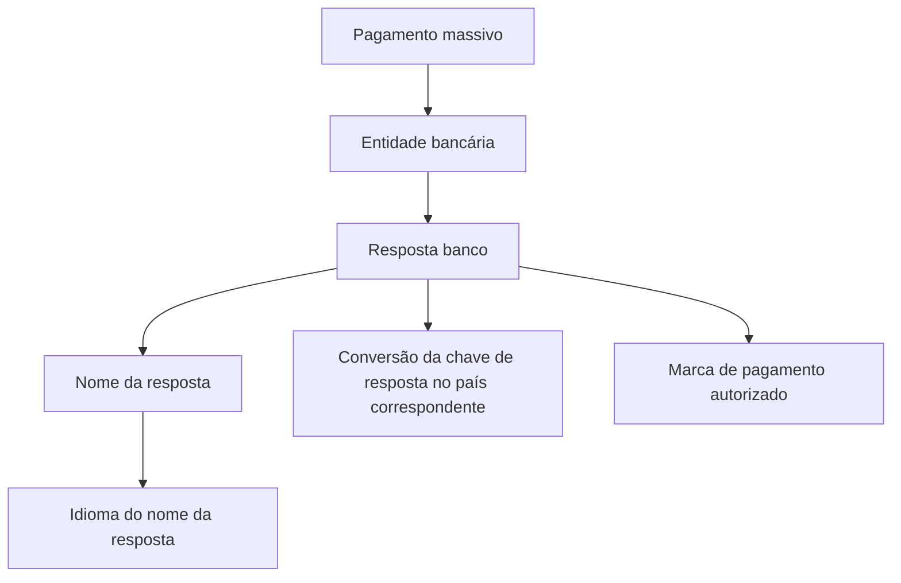

# Definição de Respostas de Bancos para Pagamento Massivo

## 1. Metadados do Documento
- **Arquivo de Origem:** Não identificado no conteúdo fornecido
- **Tipo de Documento:** Especificação Técnica
- **Domínio / Sistema:** Pagamento massivo — Soluciones APIs / Zeus
- **Público-Alvo:** Desenvolvedores, analistas funcionais e equipes de integração bancária
- **Data/Versão Identificada:** Não identificada

---

## 2. Resumo Executivo & Contexto de Negócio

O documento apresenta a definição de respostas de entidades bancárias relacionadas ao processo de pagamento massivo. O objetivo declarado é identificar as respostas que podem ser recebidas dos bancos quando um pagamento massivo é realizado.

A especificação descreve propriedades gerais associadas a cada resposta bancária. Essas propriedades permitem identificar a entidade bancária, a resposta retornada pelo banco, o nome descritivo da resposta, a conversão da chave de resposta equivalente no país correspondente, a indicação de pagamento autorizado e o idioma do nome da resposta.

O conteúdo disponível aparenta pertencer a uma área de documentação de APIs, identificada pelos termos “Soluciones APIs”, “Documentación” e “Zeus”. Contudo, o material não apresenta contratos de API, métodos HTTP, payloads JSON, códigos de erro, URLs operacionais ou detalhes de integração técnica.

A finalidade funcional identificada é a padronização e interpretação de respostas bancárias em um contexto de pagamento massivo, incluindo possíveis conversões de chaves de resposta entre países e suporte a nomes em diferentes idiomas.

---

## 3. Arquitetura, Componentes & Tecnologias Envolvidas

O documento cita os seguintes elementos:

- **Entidade bancária:** identificada por uma chave.
- **Resposta banco:** identificada por uma chave de resposta retornada pelo banco.
- **Nome:** descrição associada à chave da resposta bancária.
- **Conversão de chave de resposta banco:** equivalência da chave de resposta bancária no país correspondente.
- **Pagamento autorizado:** marca que indica autorização de pagamento.
- **Idioma:** chave do idioma no qual o nome da resposta bancária está apresentado.
- **Soluciones APIs / Documentación / Zeus:** referências contextuais à área ou plataforma de documentação.



**Nota de Análise:** O documento não detalha microsserviços, bancos de dados, protocolos, endpoints, métodos HTTP, contratos JSON, mecanismos de autenticação ou ambientes técnicos.

---

## 4. Regras de Negócio, Especificações Funcionais & Processos

1. O processo de pagamento massivo pode receber respostas provenientes de bancos.
2. Cada entidade bancária é identificada por uma chave.
3. Cada resposta bancária é identificada por uma chave de resposta de banco.
4. O nome representa a descrição associada à chave da resposta bancária.
5. A conversão de chave de resposta bancária representa a equivalência da chave de resposta no país correspondente.
6. A marca de pagamento autorizado identifica se o pagamento foi autorizado.
7. O idioma identifica, por meio de uma chave, o idioma em que o nome da resposta bancária é apresentado.

**Nota de Análise:** O documento não informa quais valores representam pagamento autorizado, quais chaves de entidades bancárias existem, quais respostas são possíveis, nem as regras para conversão entre países.

---

## 5. Tabelas de Parâmetros, Ambientes e Estruturas de Dados

| Item / Parâmetro | Descrição / Função | Tipo / Valores / Formato | Ambiente / Observações |
| :--- | :--- | :--- | :--- |
| Entidade bancária | Chave que identifica a entidade bancária. | Chave; formato não detalhado. | Associada a respostas de bancos no pagamento massivo. |
| Resposta banco | Chave que identifica a resposta do banco. | Chave; formato não detalhado. | Resposta recebida de uma entidade bancária. |
| Nome | Descrição associada à chave da resposta do banco. | Texto; formato não detalhado. | O idioma é identificado por uma chave específica. |
| Conversão chave resposta banco | Conversão da chave de resposta bancária equivalente no país correspondente. | Chave equivalente; formato não detalhado. | O país correspondente não é identificado. |
| Pagamento autorizado | Marca que identifica pagamento autorizado. | Marca; valores não detalhados. | Relacionada ao resultado do pagamento massivo. |
| Idioma | Chave do idioma em que o nome da resposta bancária está apresentado. | Chave; formato não detalhado. | Aplicável ao campo Nome. |
| Soluciones APIs | Referência exibida na navegação do documento. | Não aplicável. | Não há detalhamento adicional. |
| Documentación | Referência exibida na navegação do documento. | Não aplicável. | Não há detalhamento adicional. |
| Zeus | Referência exibida na navegação do documento. | Não aplicável. | Não há detalhamento adicional. |

---

## 6. Bateria de Perguntas & Respostas para RAG (FAQ Sintético)

### P1: Qual é o objetivo da definição de respostas de bancos para pagamento massivo?
**R:** O objetivo é identificar as respostas que podem chegar dos bancos durante a realização de um pagamento massivo.

### P2: Como a entidade bancária é identificada?
**R:** A entidade bancária é identificada por uma chave. O documento não especifica o formato nem os valores possíveis dessa chave.

### P3: O que representa o campo “Resposta banco”?
**R:** “Resposta banco” representa a chave que identifica uma resposta retornada pelo banco no contexto de pagamento massivo.

### P4: Para que serve o campo “Nome” da resposta bancária?
**R:** O campo “Nome” contém a descrição associada à chave da resposta do banco.

### P5: Como o idioma do nome da resposta bancária é identificado?
**R:** O idioma é identificado por uma chave correspondente ao idioma no qual o nome da resposta do banco está apresentado.

### P6: O que é a conversão da chave de resposta do banco?
**R:** É a conversão da chave de resposta bancária para uma chave equivalente no país correspondente. O documento não detalha países, regras de conversão ou tabelas de equivalência.

### P7: O documento define quais códigos bancários indicam pagamento autorizado?
**R:** Não. O documento apenas informa a existência de uma marca para pagamento autorizado, sem apresentar códigos, valores ou critérios de preenchimento.

### P8: Existem endpoints ou métodos HTTP para consultar respostas de bancos?
**R:** Não. O conteúdo fornecido não apresenta endpoints, URLs de API, métodos HTTP, exemplos de requisição ou contratos de resposta.

### P9: Qual plataforma ou área de documentação é citada no material?
**R:** O material exibe as referências “Soluciones APIs”, “Documentación” e “Zeus”, mas não explica tecnicamente a função de cada uma.

### P10: O documento informa como tratar respostas bancárias rejeitadas ou com erro?
**R:** Não. O documento limita-se a definir propriedades gerais das respostas bancárias e não descreve classificação de falhas, códigos de rejeição ou procedimentos de tratamento.

---

## 7. Glossário de Termos, Siglas & Conceitos-Chave

- **Pagamento massivo:** Processo no qual pagamentos são realizados em massa e podem receber respostas das entidades bancárias.
- **Entidade bancária:** Banco identificado por uma chave no contexto das respostas de pagamento massivo.
- **Resposta banco:** Resposta emitida por um banco, identificada por uma chave.
- **Conversão de chave de resposta banco:** Equivalência de uma chave de resposta bancária no país correspondente.
- **Pagamento autorizado:** Marca que identifica que o pagamento foi autorizado.
- **Idioma:** Chave que identifica o idioma do nome associado à resposta bancária.
- **Zeus:** Termo exibido na navegação do documento; o conteúdo não define seu significado ou função.
- **Soluciones APIs:** Termo exibido na navegação do documento; o conteúdo não detalha sua função.

---

## 8. Notas Críticas, Riscos & Limitações

- O arquivo de origem não foi identificado no conteúdo fornecido.
- Não há data, versão, autor, responsável ou histórico de alterações identificável.
- O documento não define valores, formatos ou catálogos para as chaves de entidade bancária, resposta bancária ou idioma.
- Não há especificação de contratos de API, métodos HTTP, URLs, autenticação, payloads, códigos de status ou exemplos de integração.
- A marca de pagamento autorizado é mencionada, mas seus valores e regras de interpretação não são detalhados.
- A conversão de chaves de resposta por país é mencionada sem informar países suportados, critérios de equivalência ou fonte de manutenção.
- **Nota de Análise:** O documento apresenta propriedades gerais, mas não fornece detalhamento adicional suficiente para implementar uma integração bancária completa.

---

## 9. Conteúdo Bruto Estruturado (Referência Fiel)

```text
--- [PÁGINA 1 DE 2] ---

EN CONSTRUCCIÓN
DEFINICIÓN de respuestas de bancos para
pago masivo
Objetivo
Identifica las respuestas que pueden llegar de los bancos al realizar el pago masivo.
Propiedades generales
Propiedades generales
Entidad bancaria
Clave que identifica la entidad bancaria.
Respuesta banco
Clave que identifica la respuesta del banco.
Nombre
Descripción asociada a la clave de la respuesta del banco .
Conversión clave respuesta banco
Conversion de la clave de respuesta del banco equivalente, en el país correspondiente.
 /
 CF
Inicio Soluciones APIs Documentación Zeus
ES


--- [PÁGINA 2 DE 2] ---

Pago autorizado
Marca pago autorizado.
Idioma
Clave del idioma en el que está el nombre del la respuesta del banco.
```
