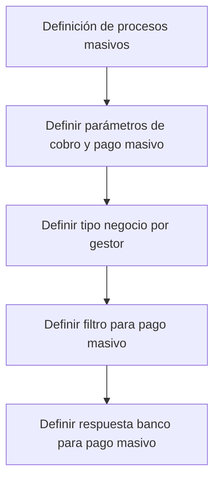
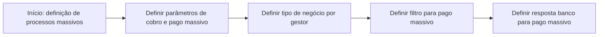

# Definición de Procesos Masivos de Tesorería de Cobros y Pagos

## 1. Metadados do Documento
- **Arquivo de Origem:** Não identificado; conteúdo bruto fornecido pelo usuário.
- **Tipo de Documento:** Procedimento / apresentação resumida.
- **Domínio / Sistema:** Tesorería de cobros y pagos; Home Solutions APIs Documentation Zeus.
- **Público-Alvo:** Negócio, operação, analistas funcionais e equipes técnicas responsáveis por processos massivos.
- **Data/Versão Identificada:** Não identificada.

---

## 2. Resumo Executivo & Contexto de Negócio

O documento apresenta a **definição de processos massivos** voltados à tesouraria de cobranças (*cobros*) e pagamentos (*pagos*). O objetivo declarado é estabelecer as definições necessárias para o funcionamento desses processos massivos.

A estrutura do conteúdo organiza o processo em quatro definições sequenciais: parâmetros de cobrança e pagamento massivo, tipo de negócio por gestor, filtro para pagamento massivo e resposta bancária para pagamento massivo. Essas definições representam elementos funcionais que precisam ser configurados ou estabelecidos para operar o processo.

O texto não descreve detalhes de implementação, sistemas integrados, contratos de API, campos, regras de cálculo, formatos de arquivo, métodos HTTP ou critérios de validação. A referência a “Home Solutions APIs Documentation Zeus” aparece no rodapé do conteúdo, sem explicação adicional sobre sua relação com os processos massivos de tesouraria.

---

## 3. Arquitetura, Componentes & Tecnologias Envolvidas

Os componentes ou conceitos explicitamente citados são:

- **Processos masivos:** processos de tesouraria para cobranças e pagamentos.
- **Parámetros de cobro y pago masivo:** parâmetros para cobrança e pagamento em massa.
- **Tipo negocio por gestor:** tipo de negócio associado a um gestor.
- **Filtro para pago masivo:** filtro aplicável ao pagamento massivo.
- **Respuesta banco para pago masivo:** resposta do banco associada ao pagamento massivo.
- **Home Solutions APIs Documentation Zeus:** referência textual exibida no rodapé.
- **CF:** sigla exibida no rodapé, sem definição no documento.



**Nota de Análise:** O documento apresenta uma sequência de quatro etapas de definição, mas não detalha integrações, sistemas de origem e destino, persistência de dados, protocolos, APIs, tecnologias ou responsabilidades por componente.

---

## 4. Regras de Negócio, Especificações Funcionais & Processos

O documento estabelece que o funcionamento dos processos massivos de tesouraria de cobranças e pagamentos requer as seguintes definições:

1. **Definir parâmetros de cobrança e pagamento massivo**
   - Devem ser definidos os parâmetros relacionados a cobranças e pagamentos executados de forma massiva.
   - O documento não especifica quais parâmetros são obrigatórios, seus tipos, valores aceitos ou mecanismos de manutenção.

2. **Definir tipo de negócio por gestor**
   - Deve ser definido o tipo de negócio associado a cada gestor.
   - O documento não define o significado de “gestor”, os tipos de negócio possíveis, critérios de associação ou regras de exceção.

3. **Definir filtro para pagamento massivo**
   - Deve ser definido um filtro para o processo de pagamento massivo.
   - O documento não informa os atributos filtráveis, operadores permitidos, condições de seleção ou comportamento quando não houver registros elegíveis.

4. **Definir resposta bancária para pagamento massivo**
   - Deve ser definida a resposta do banco relacionada ao pagamento massivo.
   - O documento não detalha códigos de retorno bancário, mensagens, status, tratamento de rejeições ou reconciliação.

### Fluxo funcional identificado



---

## 5. Tabelas de Parâmetros, Ambientes e Estruturas de Dados

| Item / Parâmetro | Descrição / Função | Tipo / Valores / Formato | Ambiente / Observações |
| :--- | :--- | :--- | :--- |
| Parâmetros de cobrança e pagamento massivo | Definições necessárias para cobrança e pagamento em processos massivos. | Não especificado. | O documento não lista campos, valores ou regras de preenchimento. |
| Tipo de negócio por gestor | Associação de um tipo de negócio a um gestor. | Não especificado. | Não há definição de gestor ou catálogo de tipos de negócio. |
| Filtro para pagamento massivo | Filtro utilizado no pagamento massivo. | Não especificado. | Não há critérios, atributos ou operadores documentados. |
| Resposta bancária para pagamento massivo | Definição da resposta do banco para o processo de pagamento massivo. | Não especificado. | Não há códigos, mensagens, estados ou contratos de resposta. |
| Home Solutions APIs Documentation Zeus | Referência textual presente no rodapé do conteúdo. | Não especificado. | A relação com os processos de tesouraria não é explicada. |
| CF | Sigla ou marcador presente no rodapé. | Não especificado. | Sem expansão ou contexto no conteúdo fornecido. |
| EN | Marcador textual presente no rodapé. | Não especificado. | Sem explicação no conteúdo fornecido. |

---

## 6. Bateria de Perguntas & Respostas para RAG (FAQ Sintético)

### P1: Qual é o objetivo do documento “Definición de procesos masivos”?
**R:** O objetivo do documento é apresentar as definições necessárias para o funcionamento de processos massivos de tesouraria relacionados a cobranças e pagamentos.

### P2: Quais são as etapas indicadas para definir os processos massivos?
**R:** O documento indica quatro etapas: definir parâmetros de cobrança e pagamento massivo; definir tipo de negócio por gestor; definir filtro para pagamento massivo; e definir resposta bancária para pagamento massivo.

### P3: O documento descreve parâmetros específicos para cobrança e pagamento massivo?
**R:** Não. O documento informa que os parâmetros de cobrança e pagamento massivo devem ser definidos, mas não especifica nomes de parâmetros, formatos, valores aceitos ou obrigatoriedade.

### P4: O que deve ser definido em relação ao gestor?
**R:** Deve ser definido o tipo de negócio por gestor. O documento não explica quais tipos de negócio existem nem como ocorre a associação entre gestor e tipo de negócio.

### P5: O documento detalha como funciona o filtro de pagamento massivo?
**R:** Não. O documento apenas determina que deve existir uma definição de filtro para pagamento massivo, sem informar campos filtráveis, regras de seleção ou condições de elegibilidade.

### P6: Qual informação bancária deve ser definida no processo de pagamento massivo?
**R:** Deve ser definida a resposta do banco para pagamento massivo. O conteúdo não apresenta códigos bancários, mensagens de retorno, estados de processamento ou tratamento de falhas.

### P7: Existe uma API ou contrato técnico documentado para os processos massivos?
**R:** Não. Embora o texto mencione “Home Solutions APIs Documentation Zeus”, não há métodos HTTP, endpoints, contratos JSON, autenticação, formatos de requisição ou formatos de resposta descritos.

### P8: O documento identifica ambientes, servidores ou URLs?
**R:** Não. O conteúdo fornecido não contém URLs, nomes de servidores, ambientes de desenvolvimento, homologação ou produção, portas ou caminhos de logs.

### P9: O processo descrito inclui cobranças e pagamentos?
**R:** Sim. O objetivo menciona processos massivos de tesouraria de cobranças e pagamentos, e a primeira etapa trata de parâmetros de cobrança e pagamento massivo.

### P10: Há regras de negócio detalhadas para aprovação, rejeição ou reconciliação bancária?
**R:** Não. O documento menciona a necessidade de definir a resposta bancária para pagamento massivo, mas não detalha regras de aprovação, rejeição, reconciliação, retentativas ou exceções.

---

## 7. Glossário de Termos, Siglas & Conceitos-Chave

- **Cobro:** cobrança; termo em espanhol utilizado no documento para processos de recebimento.
- **Pago:** pagamento; termo em espanhol utilizado no documento para processos de desembolso.
- **Proceso masivo:** processo executado em massa, aplicado no documento ao contexto de cobranças e pagamentos de tesouraria.
- **Tesorería:** tesouraria; domínio citado como responsável pelos processos massivos de cobranças e pagamentos.
- **Gestor:** entidade ou função à qual deve ser associado um tipo de negócio; o documento não fornece definição adicional.
- **Filtro para pago masivo:** filtro que deve ser definido para o processo de pagamento massivo, sem critérios detalhados.
- **Respuesta banco:** resposta bancária que deve ser definida para o processo de pagamento massivo.
- **CF:** sigla presente no rodapé; significado não identificado no conteúdo.
- **EN:** marcador presente no rodapé; significado não identificado no conteúdo.
- **Zeus:** nome citado na expressão “Home Solutions APIs Documentation Zeus”; função não detalhada.

---

## 8. Notas Críticas, Riscos & Limitações

- O conteúdo possui caráter resumido e não descreve os detalhes necessários para implementação técnica dos processos massivos.
- Não foram identificados campos, parâmetros concretos, regras de validação, formatos de dados, códigos bancários ou critérios de filtragem.
- Não foram identificadas integrações, endpoints, métodos HTTP, contratos de API, tecnologias, bancos de dados, filas ou mecanismos de segurança.
- Não há definição dos papéis responsáveis por configurar parâmetros, tipos de negócio, filtros ou respostas bancárias.
- Não há informações sobre tratamento de erros, reprocessamento, idempotência, auditoria, conciliação ou monitoramento.
- **Nota de Análise:** O documento lista “Home Solutions APIs Documentation Zeus”, porém não detalha APIs, métodos HTTP ou contratos expostos.
- **Nota de Análise:** As siglas “CF” e o marcador “EN” aparecem no conteúdo, mas não possuem explicação contextual.

---

## 9. Conteúdo Bruto Estruturado (Referência Fiel)

```text
--- [PÁGINA 1 DE 1] ---

DEFINICIÓN de procesos masivos
Objetivo
Definiciones necesarias para el funcionamiento de los procesos masivos de tesorería de cobros y
pagos.
Pasos a seguir
DEFINIR
Parámetros de
cobro y pago
masivo
(1)
DEFINIR
Tipo negocio
por gestor
(2)
DEFINIR
Filtro para
pago masivo
(3)
DEFINIR
Respuesta
banco para
pago masivo
(4)
1. DEFINIR Parámetros de cobro y pago masivo
2. DEFINIR Tipo negocio por gestor
3. DEFINIR Filtro para pago masivo
4. DEFINIR Respuesta banco para pago masivo
 / 
 CF
Home Solutions APIs Documentation Zeus
EN
```
