# Definições e Parâmetros do Módulo de Tesouraria no Reef.core

## 1. Metadados do Documento
- **Arquivo de Origem:** `Não identificado — texto bruto fornecido na solicitação`
- **Tipo de Documento:** `Apresentação Executiva`
- **Domínio / Sistema:** `Tesouraria / Reef.core / MAPFRE`
- **Público-Alvo:** `Não identificado; conteúdo aplicável a negócio, configuração funcional, operação e suporte`
- **Data/Versão Identificada:** `Não identificada`

---

## 2. Resumo Executivo & Contexto de Negócio

O documento apresenta a estrutura de definições necessária para configurar o módulo de Tesouraria no sistema Reef.core. A organização separa definições comuns, necessárias para a operação geral da companhia, de definições específicas que condicionam o funcionamento do módulo de Tesouraria.

No nível comum, o documento inclui usuários, programas, companhia, moeda, estrutura comercial, terceiros, agentes, seguradoras, bancos, plano de pagamento, suplementos, datas de processo, exercício contábil, plano de contas e conceito contábil. Esses elementos estabelecem cadastros, estruturas organizacionais, períodos contábeis e referências econômicas utilizadas pela companhia.

No nível de Tesouraria, o documento define elementos voltados a cobranças e pagamentos, incluindo caixas/operadores de tesouraria, contas contábeis por tipo de atualização, contas simplificadas, gestores de cobrança, cobranças antecipadas, ordens de pagamento, autorização de ordens de pagamento, conceitos de cobrança e pagamento, impostos, cartões de crédito, parâmetros de Tesouraria e processos massivos.

A apresentação descreve principalmente o propósito de cada definição, sem detalhar telas, métodos HTTP, contratos de integração, regras de cálculo numéricas, permissões por perfil, URLs, ambientes técnicos ou procedimentos operacionais passo a passo.

---

## 3. Arquitetura, Componentes & Tecnologias Envolvidas

Os elementos identificados no documento são organizados em dois grupos funcionais: **Comum** e **Tesouraria**. O grupo Comum concentra definições transversais necessárias para a configuração da companhia e para a operação do módulo. O grupo Tesouraria contém parâmetros e cadastros específicos de cobranças, pagamentos, impostos e processamento massivo.

Tecnologias, sistemas e referências citadas:
- **Reef.core:** sistema que realizará operações com as divisas definidas para a companhia.
- **MAPFRE:** entidade mencionada no contexto de terceiros que podem ter relação com a entidade MAPFRE.
- **Home Solutions APIs Documentation Zeus:** texto listado na apresentação, sem contexto técnico adicional.
- **CF:** sigla listada ao lado de Companhia e Moeda, sem explicação no conteúdo fornecido.

```mermaid
graph TD
    A[Definições para Tesouraria] --> B[Comum]
    A --> C[Tesouraria]

    B --> B1[Usuários]
    B --> B2[Programas]
    B --> B3[Companhia]
    B --> B4[Moeda]
    B --> B5[Estrutura Comercial]
    B --> B6[Terceiros]
    B --> B7[Agente]
    B --> B8[Subvenção Agente]
    B --> B9[Conceito Econômico Comissão]
    B --> B10[Seguradora]
    B --> B11[Bancos]
    B --> B12[Plano de Pagamento]
    B --> B13[Suplementos]
    B --> B14[Datas de Processo]
    B --> B15[Exercício Contábil]
    B --> B16[Plano de Contas]
    B --> B17[Conceito Contábil]

    C --> C1[Caixa]
    C --> C2[Conta por Tipo de Atualização]
    C --> C3[Conta Simplificada]
    C --> C4[Gestor de Cobrança]
    C --> C5[Cobranças Antecipadas]
    C --> C6[Ordem de Pagamento]
    C --> C7[Autorização de Ordem de Pagamento]
    C --> C8[Conceito Cobrança Pagamento]
    C --> C9[Imposto]
    C --> C10[Cartões de Crédito]
    C --> C11[Parâmetros e Definições Tesouraria]
    C --> C12[Processo Massivo]
```



> **Nota de Análise:** O documento não descreve uma arquitetura técnica de infraestrutura, microsserviços, banco de dados, interfaces, APIs ou integrações entre sistemas. O diagrama representa exclusivamente a hierarquia funcional apresentada.

---

## 4. Regras de Negócio, Especificações Funcionais & Processos

### 4.1. Estrutura de definições comuns

1. **Usuários:** devem ser definidas as pessoas que podem acessar o sistema e os papéis atribuídos a essas pessoas.
2. **Programas:** devem ser definidas as operações contempladas pelo sistema e as características de cada operação.
3. **Companhia:** deve ser definida a entidade, ou as entidades, com as quais serão criadas as apólices e, consequentemente, os demais elementos.
4. **Moeda:** devem ser definidas as divisas com as quais o Reef.core realizará as operações da companhia.
5. **Estrutura Comercial:** deve ser definida a forma de organização territorial da companhia.
6. **Terceiros:** devem ser definidas as pessoas físicas ou jurídicas que podem manter alguma relação com a entidade MAPFRE.
7. **Agente:** devem ser definidos os terceiros que atuarão como intermediários entre o cliente e a companhia.
8. **Subvenção Agente:** devem ser definidas as características das subvenções de comissões de agentes.
9. **Conceito Econômico Comissão:** devem ser definidos os conceitos econômicos cujos valores serão liquidados no processo de liquidação de comissões.
10. **Seguradora:** devem ser definidas as propriedades específicas dos terceiros que atuam como entidades seguradoras e que podem manter relação com a MAPFRE.
11. **Bancos:** devem ser definidas as propriedades específicas dos terceiros que atuam como entidades bancárias.
12. **Plano de Pagamento:** deve ser definido como o pagamento do seguro será fracionado.
13. **Suplementos:** devem ser definidos os tipos de modificações que podem afetar as apólices, incluindo anulação, reabilitação e renovação.
14. **Datas de Processo:** devem ser definidas as datas nas quais a informação será contabilizada.
15. **Exercício Contábil:** deve ser definido o período durante o qual as operações contábeis serão realizadas.
16. **Novo Exercício:** após cada fechamento de exercício, um novo exercício deve ser definido.
17. **Plano de Contas:** devem ser definidas as contas usadas pela companhia dentro do exercício contábil e os parâmetros correspondentes a cada conta.
18. **Conceito Contábil:** deve ser definido o identificador que agrupa os lançamentos contábeis para consulta posterior.

### 4.2. Definições específicas de Tesouraria

1. **Caixa:** devem ser definidos os usuários do sistema que podem trabalhar com o módulo de Tesouraria.
2. **Conta por Tipo de Atualização:** devem ser definidas as contas contábeis utilizadas conforme a operação do registro diário.
3. **Conta Simplificada:** devem ser definidas as chaves que identificam as contas contábeis.
4. **Gestor de Cobrança:** devem ser identificados os diferentes tipos de gestores de cobrança que podem gerenciar a cobrança dos recibos.
5. **Cobranças Antecipadas:** devem ser definidos os tipos de cobranças antecipadas permitidos e suas características.
6. **Ordem de Pagamento:** deve ser definida a informação necessária para criar ordens de pagamento.
7. **Autorização de Ordem de Pagamento:** devem ser definidos os dados que determinam quando uma ordem de pagamento requer autorização e quem pode autorizá-la.
8. **Conceito Cobrança Pagamento:** deve ser definido o detalhamento econômico das ordens de pagamento para detalhar o gasto.
9. **Imposto:** devem ser definidos os tipos de obrigações tributárias a considerar, suas características e formas de cálculo.
10. **Cartões de Crédito:** devem ser identificados e caracterizados os cartões de crédito que podem ser usados em cobranças.
11. **Parâmetros e Definições Tesouraria:** devem ser definidos os parâmetros que condicionam o funcionamento do módulo de Tesouraria.
12. **Processo Massivo:** devem ser definidas as configurações necessárias para o funcionamento dos processos massivos de cobranças e pagamentos.

> **Nota de Análise:** O documento declara que os impostos possuem “formas de cálculo”, mas não apresenta fórmulas, alíquotas, bases de cálculo ou condições tributárias específicas.

---

## 5. Tabelas de Parâmetros, Ambientes e Estruturas de Dados

| Item / Parâmetro | Descrição / Função | Tipo / Valores / Formato | Ambiente / Observações |
| :--- | :--- | :--- | :--- |
| Usuários | Define pessoas com acesso ao sistema e os papéis atribuídos. | Pessoas e papéis. | Definição comum. |
| Programas | Define operações do sistema e suas características. | Operações e características. | Definição comum. |
| Companhia | Define entidade ou entidades para criação de apólices e demais elementos. | Entidade ou entidades. | Definição comum. |
| Moeda | Define divisas usadas pelo Reef.core nas operações da companhia. | Divisas. | Definição comum. |
| Estrutura Comercial | Define a organização territorial da companhia. | Organização territorial. | Definição comum. |
| Terceiros | Define pessoas físicas ou jurídicas relacionadas à entidade MAPFRE. | Pessoa física ou jurídica. | Definição comum. |
| Agente | Define terceiros intermediários entre cliente e companhia. | Terceiros intermediários. | Definição comum. |
| Subvenção Agente | Define características de subvenções de comissões de agentes. | Características de subvenção. | Definição comum. |
| Conceito Econômico Comissão | Define conceitos econômicos liquidados no processo de liquidação de comissões. | Conceitos econômicos e valores. | Definição comum. |
| Seguradora | Define propriedades de terceiros que atuam como entidades seguradoras. | Propriedades específicas. | Relação potencial com MAPFRE. |
| Bancos | Define propriedades de terceiros que atuam como entidades bancárias. | Propriedades específicas. | Definição comum. |
| Plano de Pagamento | Define o fracionamento do pagamento do seguro. | Forma de fracionamento. | Definição comum. |
| Suplementos | Define modificações que podem afetar apólices. | Anulação, reabilitação, renovação e outros não detalhados. | Definição comum. |
| Datas de Processo | Define datas de contabilização da informação. | Datas. | Definição comum. |
| Exercício Contábil | Define período para realização de operações contábeis. | Período de tempo. | Novo exercício deve ser definido após cada fechamento. |
| Plano de Contas | Define contas utilizadas pela companhia e parâmetros correspondentes. | Contas contábeis e parâmetros. | Associado ao exercício contábil. |
| Conceito Contábil | Define identificador de agrupamento de lançamentos contábeis. | Identificador. | Permite consulta posterior. |
| Caixa | Define usuários que podem operar o módulo de Tesouraria. | Usuários do sistema. | Definição específica de Tesouraria. |
| Conta por Tipo de Atualização | Define contas contábeis conforme a operação do registro diário. | Contas contábeis por operação. | Definição específica de Tesouraria. |
| Conta Simplificada | Define chaves de identificação de contas contábeis. | Chaves. | Definição específica de Tesouraria. |
| Gestor de Cobrança | Identifica tipos de gestores que administram cobranças de recibos. | Tipos de gestor de cobrança. | Definição específica de Tesouraria. |
| Cobranças Antecipadas | Define tipos permitidos e características das cobranças antecipadas. | Tipos e características. | Definição específica de Tesouraria. |
| Ordem de Pagamento | Define informações necessárias para criar ordens de pagamento. | Informação de criação. | Definição específica de Tesouraria. |
| Autorização de Ordem de Pagamento | Determina necessidade de autorização e respectivos autorizadores. | Dados de condição e autorização. | Definição específica de Tesouraria. |
| Conceito Cobrança Pagamento | Define detalhamento econômico das ordens de pagamento para detalhar gasto. | Desglose/detalhamento econômico. | Definição específica de Tesouraria. |
| Imposto | Define obrigações tributárias, características e formas de cálculo. | Tipos de obrigações e formas de cálculo. | Cálculos não detalhados. |
| Cartões de Crédito | Identifica e caracteriza cartões utilizáveis em cobranças. | Cartões de crédito e características. | Definição específica de Tesouraria. |
| Parâmetros e Definições Tesouraria | Define parâmetros que condicionam o funcionamento do módulo. | Parâmetros e definições. | Valores não apresentados. |
| Processo Massivo | Define elementos necessários aos processos massivos de cobranças e pagamentos. | Definições operacionais. | Regras de execução não apresentadas. |

---

## 6. Bateria de Perguntas & Respostas para RAG (FAQ Sintético)

### P1: Qual é o objetivo das definições comuns no contexto do módulo de Tesouraria?
**R:** As definições comuns reúnem cadastros e parâmetros que não pertencem exclusivamente ao módulo de Tesouraria, mas são necessários para sua definição e operação. Entre esses elementos estão usuários, programas, companhia, moeda, terceiros, bancos, exercício contábil, plano de contas e conceito contábil.

### P2: Como o documento define os usuários do sistema e os usuários de Tesouraria?
**R:** Em Usuários, o documento define as pessoas que podem acessar o sistema e os papéis atribuídos a essas pessoas. Em Caixa, que pertence às definições específicas de Tesouraria, o documento define os usuários do sistema que podem trabalhar com o módulo de Tesouraria.

### P3: Qual é a relação entre Companhia, Moeda e Reef.core?
**R:** Companhia define a entidade ou entidades com as quais serão criadas as apólices e os demais elementos. Moeda define as divisas com as quais o Reef.core realizará as diferentes operações da companhia. O documento não apresenta códigos de moeda, regras de conversão ou parâmetros técnicos do Reef.core.

### P4: Como são definidos terceiros, agentes, seguradoras e bancos?
**R:** Terceiros são pessoas físicas ou jurídicas que podem ter relação com a entidade MAPFRE. Agentes são os terceiros que atuam como intermediários entre o cliente e a companhia. Seguradoras e bancos correspondem a terceiros cujas propriedades específicas devem ser definidas conforme atuem como entidades seguradoras ou bancárias.

### P5: O que deve ser configurado para a contabilização no módulo descrito?
**R:** O documento indica a necessidade de definir datas de processo, exercício contábil, plano de contas e conceito contábil. As datas de processo determinam quando a informação será contabilizada; o exercício contábil delimita o período das operações; o plano de contas reúne as contas e seus parâmetros; e o conceito contábil agrupa lançamentos para consulta posterior.

### P6: O que acontece após o fechamento de um exercício contábil?
**R:** Após cada fechamento de exercício, deve ser definido um novo exercício. O documento não detalha as etapas de fechamento, critérios de bloqueio, movimentações de saldo ou validações necessárias para essa transição.

### P7: Como o documento trata as ordens de pagamento?
**R:** Ordem de Pagamento define as informações necessárias para criar ordens de pagamento. Autorização de Ordem de Pagamento define os dados usados para determinar quando uma ordem precisa de autorização e quem pode autorizá-la. Conceito Cobrança Pagamento define o detalhamento econômico das ordens de pagamento para detalhar o gasto.

### P8: Como são tratadas as cobranças no módulo de Tesouraria?
**R:** O documento aborda cobranças por meio de Gestor de Cobrança, Cobranças Antecipadas, Cartões de Crédito e Processo Massivo. Gestor de Cobrança identifica tipos de gestores que podem gerenciar a cobrança de recibos; Cobranças Antecipadas define tipos permitidos e características; Cartões de Crédito identifica cartões utilizáveis em cobranças; e Processo Massivo reúne definições necessárias para processos massivos de cobranças e pagamentos.

### P9: O que é uma Conta por Tipo de Atualização?
**R:** Conta por Tipo de Atualização é a definição das contas contábeis que serão utilizadas conforme a operação do registro diário. O documento não lista os tipos de atualização, as contas correspondentes nem critérios de seleção.

### P10: Qual é a finalidade da Conta Simplificada?
**R:** Conta Simplificada define as chaves que identificam as contas contábeis. O documento não especifica o formato dessas chaves, a estrutura de composição ou as validações aplicáveis.

### P11: Quais modificações de apólices são contempladas por Suplementos?
**R:** Suplementos define os tipos de modificações que podem afetar apólices. A apresentação cita expressamente anulação, reabilitação e renovação, utilizando “etc.” para indicar que podem existir outros tipos não detalhados.

### P12: Quais informações o documento fornece sobre impostos?
**R:** Imposto define os tipos de obrigações tributárias que devem ser considerados, suas características e formas de cálculo. O documento não informa tributos específicos, alíquotas, fórmulas, bases de cálculo ou regras de incidência.

---

## 7. Glossário de Termos, Siglas & Conceitos-Chave

- **APIs:** termo presente na expressão “Home Solutions APIs Documentation Zeus”; não há detalhamento de APIs no documento.
- **Caixa:** usuários do sistema que podem trabalhar com o módulo de Tesouraria.
- **CF:** sigla apresentada na página inicial, sem expansão ou definição no conteúdo fornecido.
- **Cobranças Antecipadas:** tipos de cobranças antecipadas permitidos e suas características.
- **Conceito Contábil:** identificador que agrupa lançamentos contábeis para consulta posterior.
- **Conceito Econômico Comissão:** conceitos econômicos cujos valores são liquidados no processo de liquidação de comissões.
- **Conta Simplificada:** chaves que identificam contas contábeis.
- **Exercício Contábil:** período de tempo no qual são realizadas operações contábeis.
- **MAPFRE:** entidade mencionada como referência para terceiros que podem manter relação com ela.
- **Plano de Contas:** contas utilizadas pela companhia dentro do exercício contábil e parâmetros correspondentes.
- **Reef.core:** sistema que realiza operações da companhia com as divisas definidas.
- **Suplementos:** modificações que podem afetar apólices, tais como anulação, reabilitação e renovação.
- **Tesouraria:** módulo cujas definições específicas abrangem cobranças, pagamentos, contas contábeis, impostos, cartões e processos massivos.

---

## 8. Notas Críticas, Riscos & Limitações

- O documento não identifica arquivo de origem, autor, data, versão, responsáveis, ambiente ou ciclo de aprovação.
- A apresentação não fornece valores de parâmetros, códigos, identificadores, formatos de campos, regras de validação, matrizes de perfil ou critérios de autorização.
- Não há especificação de integrações, APIs, serviços, rotas, autenticação, URLs, infraestrutura, logs ou mecanismos de monitoramento.
- O documento menciona cálculos de impostos, mas não apresenta fórmulas, alíquotas, bases tributárias ou exceções.
- A autorização de ordens de pagamento é citada, mas não detalha limites, níveis de aprovação, papéis autorizadores ou fluxos de exceção.
- O processo massivo é citado sem informar agendamento, volume, entrada, saída, tratamento de erros ou controles operacionais.
- A expressão “Home Solutions APIs Documentation Zeus” aparece isoladamente e sem relação funcional ou técnica explicitada.
- O conteúdo deve ser tratado como catálogo funcional de definições; não deve ser usado como especificação técnica completa para implementação sem fontes complementares.

---

## 9. Conteúdo Bruto Estruturado (Referência Fiel)

```text
--- [PÁGINA 1 DE 4] ---

DEFINICIÓN DE TESORERÍA
 Elementos que intervienen en la definición y orden en el que se debe realizar.
COMÚN
En este nivel se encuentran definiciones que no pertenecen
exclusivamente al módulo de tesorería, pero son necesarias para poder
realizar la definición de dicho módulo.
USUARIOS
Definición de las personas que pueden
acceder al sistema así como los roles que
tienen asignados
PROGRAMAS
Definición de las distintas operaciones que
contempla el sistema y sus características
COMPAÑÍA
 MONEDA
 / 
 CF
Home Solutions APIs Documentation Zeus
EN


--- [PÁGINA 2 DE 4] ---

Definición de la entidad o entidades con las
que se van a crear las pólizas y por
consiguiente el resto de elementos
Definición de las divisas con las que
Reef.core va a realizar las distintas
operaciones de la compañía
ESTRUCTURA COMERCIAL
Definición de como se va a establecer la
organización territorial de la compañía
TERCEROS
Definición de las personas físicas o jurídicas
que pueden tener alguna relación con la
entidad MAPFRE.
AGENTE
Definición de los terceros que ejercerán de
intermediarios entre el cliente y la compañía
SUBVENCIÓN AGENTE
Definición de las características de
subvenciones de comisiones de agentes
CONCEPTO ECONÓMICO COMISIÓN
Definición de los conceptos económicos
cuyos importes serán liquidados en el proceso
de liquidación de comisiones
ASEGURADORA
Definición de las propiedades específicas de
los terceros que actúan como entidades
aseguradoras y que pueden tener relación
con MAPFRE
BANCOS
Definición de las propiedades específicas de
los terceros que actúan como entidades
bancarias
PLAN PAGO
Definir como se va a fraccionar el pago del
seguro
SUPLEMENTOS
Tipos de modificaciones que podrán sufrir las
pólizas (anulación, rehabilitación, renovación,
etc.)
FECHAS DE PROCESO
Definir las fechas en las que se contabiliza la
información
EJERCICIO CONTABLE
Se define el periodo de tiempo en el que se
realizarán las operaciones contables.
PLAN DE CUENTAS
Definición de las cuentas utilizadas por la
compañía dentro del ejercicio contable y los
parámetros correspondientes a cada cuenta


--- [PÁGINA 3 DE 4] ---

Después de cada cierre de ejercicio se debe
definir el nuevo ejercicio
CONCEPTO CONTABLE
Se define el identificador que agrupa los
apuntes contables para su posterior consulta
TESORERÍA
Definiciones específicas del módulo de Tesorería
CAJERO
Definición de los usuarios del sistema que
pueden trabajar con el módulo de Tesorería
CUENTA POR TIPO ACTUALIZACIÓN
Definición de las cuentas contables que se
utilizarán según la operación del registro
diario
CUENTA SIMPLIFICADA
Se definen las claves que identifican las
cuentas contables
GESTOR COBRO
Identificación de los distintos tipos de gestor
de cobro que pueden gestionar el cobro de
los recibos
COBROS ANTICIPADOS
Definición de los tipos de cobros anticipados
que se permiten y sus características
ORDEN PAGO
Definición de la información necesaria para la
creación de órdenes de pago
AUTORIZACIÓN ORDEN PAGO
Datos para determinar cuándo es necesario
autorizar una orden de pago y quien puede
autorizarla
CONCEPTO COBRO PAGO
Definición del desglose económico que
llevarán las órdenes de pago para detallar el
gasto
IMPUESTO
 TARJETAS CRÉDITO


--- [PÁGINA 4 DE 4] ---

Definir los tipos de obligaciones tributarias
que se deben tener en cuenta, así como sus
características y formas de cálculo
Identificación y características de las tarjetas
de crédito que pueden ser utilizadas en
cobros
PARÁMETROS Y DEFINICIONES
TESORERÍA
Definiciones y parámetros que condicionarán
el funcionamiento del módulo de tesorería
PROCESO MASIVO
Definiciones necesarias para el
funcionamiento de los procesos masivos de
cobros y pagos
```
