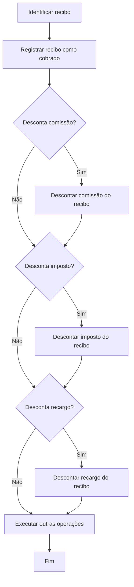

# Processo de Cobrança de Recibo de Prêmio de Apólice

## 1. Metadados do Documento
- **Arquivo de Origem:** `Não identificado no conteúdo extraído`
- **Tipo de Documento:** `Procedimento`
- **Domínio / Sistema:** `Cobrança de recibo de prêmio de apólice`
- **Público-Alvo:** `Agentes, Operação, Contabilidade, Analistas Funcionais e Desenvolvedores`
- **Data/Versão Identificada:** `Não identificada`

---

## 2. Resumo Executivo & Contexto de Negócio

O documento descreve o processo de cobrança de um recibo de prêmio de apólice. O processo consiste em registrar o dinheiro entregue pelo cliente para quitar o prêmio devido em uma apólice, considerando um período determinado.

A cobrança busca registrar a entrada financeira na contabilidade e atualizar a situação do recibo para cobrado. O processo também contempla descontos aplicáveis ao valor recebido.

Os agentes podem descontar comissões, impostos e recargos durante a cobrança do recibo. Quando um desconto é realizado, o valor descontado deve ser registrado separadamente para cada conceito: comissão, imposto ou recargo.

O fluxo apresentado inicia após a identificação do recibo, registra o recibo como cobrado e verifica sequencialmente se existem descontos de comissão, imposto e recargo. Ao final, o processo executa outras operações não detalhadas no conteúdo fornecido.

---

## 3. Arquitetura, Componentes & Tecnologias Envolvidas

O conteúdo não descreve uma arquitetura técnica de software, integrações, contratos de API, tecnologias, ambientes ou infraestrutura. São mencionadas as referências “Home Solutions APIs Documentation Zeus” e um enlace para “visión técnica”, mas não há detalhes técnicos suficientes para caracterizar componentes, endpoints, protocolos ou responsabilidades sistêmicas.

O processo funcional envolve os seguintes elementos de domínio:

- Cliente que entrega o valor para liquidação do prêmio.
- Recibo associado a uma apólice.
- Agente que pode aplicar descontos.
- Contabilidade que recebe o registro da cobrança.
- Operações de registro de cobrança, comissão, imposto, recargo e outras operações.



> **Nota de Análise:** O documento menciona “Home Solutions APIs Documentation Zeus” e um enlace com visão técnica, porém não detalha APIs, métodos HTTP, contratos JSON, autenticação, URLs ou integrações.

---

## 4. Regras de Negócio, Especificações Funcionais & Processos

1. O processo de cobrança é aplicável quando existe um recibo de prêmio devido em uma apólice para determinado período de tempo.
2. O cliente entrega dinheiro para saldar o prêmio pendente associado ao recibo.
3. Antes do fluxo de cobrança, o recibo deve ser identificado.
4. O processo deve registrar a recepção do dinheiro correspondente ao recibo na contabilidade.
5. O processo deve atualizar a situação do recibo para cobrado.
6. O agente pode descontar comissão do valor cobrado.
7. Quando houver desconto de comissão, o valor descontado deve ser registrado como comissão do recibo.
8. O agente pode descontar imposto do valor cobrado.
9. Quando houver desconto de imposto, o valor descontado deve ser registrado como imposto do recibo.
10. O agente pode descontar recargo do valor cobrado.
11. Quando houver desconto de recargo, o valor descontado deve ser registrado como recargo do recibo.
12. Os descontos são verificados sequencialmente na seguinte ordem:
    1. Comissão.
    2. Imposto.
    3. Recargo.
13. Após as verificações e os descontos aplicáveis, o processo executa outras operações.
14. O conteúdo não detalha quais operações estão incluídas em “EXECUTAR outras operações”.

---

## 5. Tabelas de Parâmetros, Ambientes e Estruturas de Dados

| Item / Parâmetro | Descrição / Função | Tipo / Valores / Formato | Ambiente / Observações |
| :--- | :--- | :--- | :--- |
| Recibo | Documento ou registro utilizado no processo de cobrança do prêmio. | Não especificado. | Deve ser identificado antes da execução do fluxo. |
| Prêmio | Valor devido pelo cliente em relação à apólice para determinado período. | Valor monetário; formato não especificado. | É o valor a ser quitado pelo cliente. |
| Apólice | Referência contratual associada ao prêmio e ao recibo. | Não especificado. | O recibo corresponde a uma apólice. |
| Cliente | Parte que entrega o dinheiro para saldar o prêmio devido. | Entidade de negócio. | Não são informados dados cadastrais ou critérios de identificação. |
| Agente | Parte que pode descontar comissão, imposto e recargo durante a cobrança. | Entidade de negócio. | O documento não detalha permissões nem regras de cálculo. |
| Comissão | Conceito que pode ser descontado do valor cobrado. | Valor monetário; formato não especificado. | Deve ser registrado quando descontado. |
| Imposto | Conceito que pode ser descontado do valor cobrado. | Valor monetário; formato não especificado. | Deve ser registrado quando descontado. |
| Recargo | Conceito que pode ser descontado do valor cobrado. | Valor monetário; formato não especificado. | Deve ser registrado quando descontado. |
| Situação do recibo | Estado do recibo após o registro da cobrança. | `Cobrado`. | Atualizado durante o processo de cobrança. |
| Registro contábil | Registro da recepção do dinheiro correspondente ao recibo. | Não especificado. | Executado como objetivo do processo. |
| Outras operações | Etapa posterior aos descontos de comissão, imposto e recargo. | Não especificado. | Não há detalhamento funcional ou técnico. |
| Home Solutions APIs Documentation Zeus | Referência textual exibida no documento. | Não especificado. | Não há informações sobre acesso, conteúdo ou integração. |
| Visão técnica | Enlace mencionado junto ao título “COBRAR recibo prima”. | Não especificado. | O conteúdo do enlace não foi disponibilizado na extração. |

---

## 6. Bateria de Perguntas & Respostas para RAG (FAQ Sintético)

### P1: Qual é o objetivo do processo de cobrança de recibo de prêmio?
**R:** O objetivo é realizar os passos necessários para registrar na contabilidade a recepção do dinheiro correspondente a um recibo, atualizar a situação desse recibo como cobrado e permitir descontos de comissão, imposto e recargo sobre o valor cobrado.

### P2: O que significa cobrar um recibo de prêmio?
**R:** Cobrar um recibo de prêmio consiste em registrar o dinheiro entregue pelo cliente para saldar o prêmio devido em uma apólice, considerando um determinado período de tempo.

### P3: Quem pode aplicar descontos durante o processo de cobrança?
**R:** Os agentes podem aplicar descontos durante o processo de cobrança. Os conceitos de desconto previstos no documento são comissão, imposto e recargo.

### P4: Quais descontos podem ser aplicados ao valor cobrado de um recibo?
**R:** O documento prevê três tipos de desconto: comissão, imposto e recargo. Cada desconto, quando realizado, deve ter o respectivo valor registrado por conceito.

### P5: Qual é a sequência de validação dos descontos no fluxo de cobrança?
**R:** Após registrar o recibo como cobrado, o fluxo verifica primeiro se há desconto de comissão, depois se há desconto de imposto e, por último, se há desconto de recargo.

### P6: O que acontece quando existe desconto de comissão?
**R:** Quando existe desconto de comissão, o processo executa a operação “DESCONTAR comissão recibo”. O documento estabelece que o importe descontado deve ser registrado para o conceito de comissão.

### P7: O que acontece quando existe desconto de imposto?
**R:** Quando existe desconto de imposto, o processo executa a operação “DESCONTAR impostos recibo”. O valor descontado deve ser registrado para o conceito de imposto.

### P8: O que acontece quando existe desconto de recargo?
**R:** Quando existe desconto de recargo, o processo executa a operação “DESCONTAR recargo recibo”. O valor descontado deve ser registrado para o conceito de recargo.

### P9: Qual é a condição necessária antes de iniciar o fluxo de cobrança?
**R:** O recibo precisa ser identificado. O documento afirma que, uma vez identificado o recibo, o processo executa as etapas de registro de cobrança e de avaliação dos descontos aplicáveis.

### P10: Qual é o estado final do recibo após a cobrança?
**R:** O processo deve atualizar a situação do recibo para cobrado. O documento não informa outros estados possíveis, transições, códigos de situação ou condições de reversão.

### P11: O que são as “outras operações” executadas ao final do fluxo?
**R:** “EXECUTAR outras operações” é uma etapa explicitamente listada após os descontos de comissão, imposto e recargo. O documento não descreve quais operações são executadas nessa fase.

### P12: O documento especifica APIs ou contratos técnicos para a cobrança de recibos?
**R:** Não. Embora o documento mencione “Home Solutions APIs Documentation Zeus” e uma ligação para visão técnica, a extração não apresenta endpoints, métodos HTTP, payloads, autenticação, URLs, tecnologias ou contratos de integração.

---

## 7. Glossário de Termos, Siglas & Conceitos-Chave

- **Apólice:** Referência associada ao prêmio devido e ao recibo que será cobrado.
- **Cliente:** Parte que entrega o dinheiro para saldar o prêmio devido.
- **Cobrança de recibo:** Processo de registrar o pagamento recebido para quitar o prêmio de uma apólice.
- **Comissão:** Conceito de desconto que pode ser aplicado pelo agente ao valor cobrado.
- **Imposto:** Conceito de desconto que pode ser aplicado pelo agente ao valor cobrado.
- **Prêmio:** Valor devido na apólice para um determinado período de tempo.
- **Recargo:** Conceito de desconto que pode ser aplicado pelo agente ao valor cobrado.
- **Recibo:** Registro relacionado ao prêmio devido em uma apólice e utilizado no processo de cobrança.
- **Situação “cobrado”:** Estado atribuído ao recibo após o registro da recepção do dinheiro.
- **Zeus:** Termo presente na referência “Home Solutions APIs Documentation Zeus”; seu significado não é definido no conteúdo fornecido.

---

## 8. Notas Críticas, Riscos & Limitações

- O documento não identifica o arquivo de origem, versão, data, autor, sistema proprietário ou ambiente de execução.
- O conteúdo não especifica cálculos, fórmulas, alíquotas, limites ou critérios para os descontos de comissão, imposto e recargo.
- Não há detalhamento sobre a forma de identificação do recibo.
- Não há definição sobre campos obrigatórios, estrutura de dados, persistência, trilha de auditoria ou lançamento contábil.
- Não são descritos tratamentos para erros, pagamento parcial, pagamento excedente, cancelamento, estorno ou reprocessamento da cobrança.
- A etapa “EXECUTAR outras operações” não possui detalhamento funcional.
- A referência a “Home Solutions APIs Documentation Zeus” não contém especificações técnicas utilizáveis na extração fornecida.
- Não há contratos de API, métodos HTTP, URLs, credenciais, ambientes, logs ou mecanismos de integração descritos.

---

## 9. Conteúdo Bruto Estruturado (Referência Fiel)

```text
--- [PÁGINA 1 DE 2] ---

EN CONSTRUCCIÓN
COBRAR recibo prima ([enlace con visión
técnica][Tecnica])
¿En qué consiste?
Se trata de registrar el dinero entregado, por parte del cliente, para saldar la prima adeudada en la
póliza, para un determinado período de tiempo.
En el proceso de cobro de recibo los agentes podrán descontarse las comisiones, recargos e
impuestos, en cuyo caso habrá que registrar el importe descontado por cada concepto.
Objetivo
Realizar los pasos necesarios para registrar la recepción del dinero correspondiente a un recibo en la
contabilidad y actualizar la situación del recibo como cobrado, así como permitir descontar del
importe cobrado las comisiones, recargos e impuestos.
Proceso a seguir
Una vez identificado el recibo el proceso realiza los siguientes pasos:
SI
NO
SI
NO
SI
NO
REGISTRAR
recibo
cobrado (1)
¿Descuenta
comision?
DESCONTAR
comision
recibo (2)
¿Descuenta
impuesto?
DESCONTAR
impuesto
recibo (3)
¿Descuenta
recargo?
DESCONTAR
recargo
recibo (4)
EJECUTAR
otras
operaciones (5)
FIN
 /
 CF
Home Solutions APIs Documentation Zeus
EN


--- [PÁGINA 2 DE 2] ---

1. REGISTRAR recibo cobrado
2. DESCONTAR comisión recibo
3. DESCONTAR impuestos recibo
4. DESCONTAR recargo recibo
5. EJECUTAR otras operaciones
```
