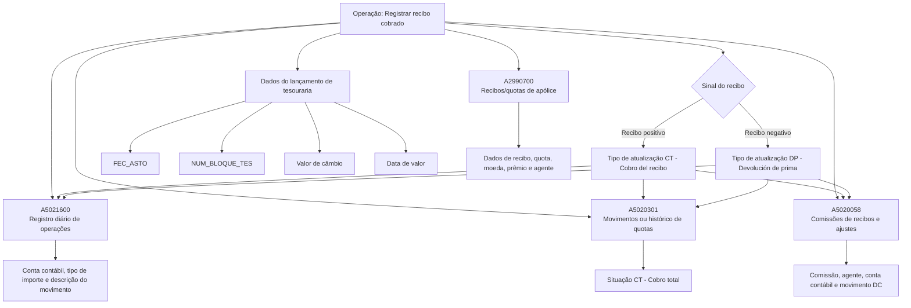

# Registrar Recibo Cobrado — Visão Técnica, Modelo de Dados e Regras de Persistência

## 1. Metadados do Documento
- **Arquivo de Origem:** Não identificado no conteúdo extraído
- **Tipo de Documento:** Especificação Técnica
- **Domínio / Sistema:** Registro de recibos cobrados, tesouraria, contabilidade, quotas e comissões de seguros
- **Público-Alvo:** Desenvolvedores, Arquitetos, Analistas Funcionais e Operação
- **Data/Versão Identificada:** Não identificada

---

## 2. Resumo Executivo & Contexto de Negócio

O documento descreve a operação técnica de **registrar um recibo cobrado** e os impactos dessa operação em tabelas de operações contábeis, histórico de quotas, recibos/quotas de apólices e comissões. A documentação apresenta regras de preenchimento de colunas, obrigatoriedade e condições de alteração de valores para cada estrutura de dados envolvida.

A operação trata recibos positivos como cobrança de recibo e recibos negativos como devolução de prêmio. Essa distinção influencia, entre outros campos, o tipo de atualização, a situação do recibo, o tipo de importe contábil e a causa de anulação.

A tabela `A5021600` registra operações diárias e o lançamento contábil associado ao recebimento. A tabela `A5020301` registra movimentos ou histórico de quotas. A tabela `A2990700` representa recibos/quotas de uma apólice. A tabela `A5020058` registra comissões de recibos e ajustes.

O documento também define dependências com dados de tesouraria, como data do lançamento, bloco de tesouraria, número de transação, valor de câmbio e data de valor. Alguns atributos dependem de permissões funcionais, especialmente a permissão para alterar a data de câmbio ou o gestor de cobrança.

> **Nota de Análise:** O documento descreve regras de persistência em tabelas, mas não detalha interfaces, métodos HTTP, contratos JSON, serviços, APIs, processos assíncronos ou mecanismos de transação entre as tabelas.

---

## 3. Arquitetura, Componentes & Tecnologias Envolvidas

### Componentes e estruturas identificadas

| Componente / Tabela | Descrição identificada | Papel na operação |
| :--- | :--- | :--- |
| `A5021600` | Registro diário de operações | Registra o lançamento operacional/contábil associado ao recibo cobrado. |
| `A5020301` | Movimentos ou histórico de quotas | Registra o movimento da quota/recibo após a cobrança. |
| `A2990700` | Recibos/quotas de uma apólice | Representa os dados do recibo ou quota da apólice afetada pela cobrança. |
| `A5020058` | Comissões de recibos e ajustes | Registra comissões e ajustes relacionados ao recibo. |
| Tesouraria | Origem de datas, bloco e número de lançamento | Fornece informações de lançamento de tesouraria, como `NUM_BLOQUE_TES`, `FEC_ASTO` e data de câmbio. |
| Estrutura comercial | Níveis comerciais, agente, setor e ramo | Fornece classificações comerciais utilizadas em operações, quotas e comissões. |
| Gestor de cobrança | Tipo e código do gestor | Pode ser alterado quando a operação permitir mudar o gestor no recebimento. |
| Contabilidade | Contas, agrupações e natureza contábil | Define conta, descrição de movimento, tipo de importe e lançamento contábil. |



> **Nota de Análise:** O diagrama representa relações inferidas exclusivamente a partir das tabelas e regras descritas. O conteúdo original não apresenta um diagrama de arquitetura, integrações de rede, serviços, bancos de dados ou ordem transacional explícita.

---

## 4. Regras de Negócio, Especificações Funcionais & Processos

### 4.1. Regras gerais para registro do recibo cobrado

1. O registro envolve as tabelas `A5021600`, `A5020301`, `A2990700` e `A5020058`.
2. Campos marcados como alteráveis quando houver mudança em relação à situação anterior devem ser atualizados somente nessa condição.
3. A data do lançamento de tesouraria é origem para múltiplos campos, incluindo:
   - `FEC_ASTO`;
   - `FEC_SITUACION`;
   - `FEC_MVTO`;
   - `ANIO_MES`;
   - valor de câmbio, quando aplicável.
4. Quando for permitido alterar a data do tipo de câmbio:
   - a data indicada pelo usuário deve ser usada;
   - se a alteração não for permitida, deve ser usada a data do lançamento de tesouraria.
5. Quando o recibo estiver em moeda diferente da moeda do país:
   - `IMP_MON_PAIS` deve receber o importe do recibo convertido pelo tipo de câmbio.
6. Quando existir cobrança antecipada para o recibo:
   - `NUM_CRUCE` deve receber o número de cruzamento que identifica a cobrança antecipada.
7. Quando for permitido alterar o gestor de cobrança:
   - `TIP_GESTOR` deve receber o novo tipo de gestor;
   - `COD_GESTOR` deve receber o novo código de gestor.

### 4.2. Regras de sinal do recibo

| Condição | Campo afetado | Valor / Regra |
| :--- | :--- | :--- |
| Recibo positivo | `TIP_ACTU` em `A5021600` | `CT` — Cobro del recibo |
| Recibo negativo | `TIP_ACTU` em `A5021600` | `DP` — Devolución de prima |
| Recibo positivo | `TIP_IMP` em `A5021600` | `H` — Haber |
| Devolução de prêmio | `TIP_IMP` em `A5021600` | `D` — Debe |
| Recibo positivo | `TIP_SITUACION` em `A5020058` | `CT` — Cobro del recibo |
| Recibo negativo | `TIP_SITUACION` em `A5020058` | `DP` — Devolución de prima |
| Movimento de quota | `TIP_SITUACION` em `A5020301` | `CT` — Cobro total |
| Recibo/quota de apólice | `TIP_SITUACION` em `A2990700` | `CT` — Cobro total |
| Devolução de prêmio | `COD_CAUSA_ANU` | Deve receber valor quando aplicável. |

### 4.3. Regras para `A5021600` — Registro diário de operações

- `COD_CIA`, `FEC_ASTO`, `NUM_ASTO`, `COD_CTA`, `COD_MON`, `TIP_IMP`, `NUM_BLOQUE_TES`, `COD_CAJERO` e `FEC_ACTU` são obrigatórios conforme a extração.
- `NUM_OPER_ASTO` recebe valor sequencial.
- `NOM_MOVIM` recebe a descrição da agrupação contábil correspondente ao tipo de atualização.
- `FEC_VALOR` recebe:
  - a data informada pelo usuário, se a data do tipo de câmbio puder ser alterada;
  - a data do lançamento de tesouraria, caso contrário.
- `IMP_MON_EXT` recebe o valor do recibo na moeda original.
- `VAL_CAMBIO` recebe o tipo de câmbio da data do lançamento de cobrança.
- `TIP_ENTORNO` recebe o valor `1` — Entorno de recibos.
- `TIP_COBRO` recebe o valor `3` — Por parte de tesoreria.
- `COD_CAUSA_ANU` recebe valor somente quando houver devolução de prêmio.
- Campos bancários, cartão, IVA, retenção, transferência, documento de terceiro e campos auxiliares são apresentados predominantemente como não aplicáveis (`N.A.`) ou não obrigatórios no fluxo documentado.

### 4.4. Regras para `A5020301` — Movimentos ou histórico de quotas

- A chave funcional documentada inclui companhia, apólice, suplemento, aplicação, suplemento da aplicação, quota e recibo.
- `NUM_MVTO` deve ser incrementado em `1` a partir do maior número de movimento existente para o recibo.
- `TIP_SITUACION` recebe `CT` — Cobro total.
- `FEC_SITUACION` recebe a data do lançamento de tesouraria.
- `VAL_CAMBIO` recebe o tipo de câmbio da data do lançamento de cobrança.
- `NUM_BLOQUE_TES` recebe o número do bloco de tesouraria do lançamento.
- `TIP_COBRO` recebe `3` — Por parte de tesoreria.
- `FEC_AUX1` segue a mesma regra de data de valor:
  - data informada pelo usuário, quando permitida a mudança;
  - data do lançamento de tesouraria, quando não permitida.
- `MCA_DCTO_COMIS` é considerado quando comissões são descontadas na cobrança.
- `MCA_DTO_IMPTO` é considerado quando impostos são descontados na cobrança.
- `MCA_DTO_RECARGO` é considerado quando recargos são descontados na cobrança.
- `FEC_CTABLE` é alterável em relação à situação anterior e é descrito como referente ao lançamento de emissão ou à data correspondente no texto extraído.

### 4.5. Regras para `A2990700` — Recibos/quotas de uma apólice

- A tabela armazena os identificadores de companhia, apólice, suplemento, aplicação, quota e recibo.
- `TIP_SITUACION` recebe `CT` — Cobro total.
- `FEC_VALOR` é alterada se houver alteração da data de valor na cobrança do recibo.
- Valores de recibo, prêmio líquido, recargo, imposto e bonificação são informados como atributos do recibo.
- `IMP_COMIS` é não obrigatório.
- `COD_NIVEL3` é não obrigatório nessa tabela, embora seja obrigatório em outras estruturas documentadas.
- `MCA_CA` e `MCA_CV` identificam, respectivamente, situações associadas a mudança de agente e mudança de plano de pagamento.
- Diversos campos de documento, juros, desconto de comissão, desconto de imposto e desconto de recargo são apresentados como não aplicáveis ou não obrigatórios no fluxo.

### 4.6. Regras para `A5020058` — Comissões de recibos e ajustes

- `COD_MVTO` recebe `DC` — Devengo de comisiones.
- `COD_AGT` recebe a chave do agente pai.
- `TIP_DOCUM_AGT` recebe o tipo de documento do agente pai.
- `COD_DOCUM_AGT` recebe o código de documento do agente pai.
- `COD_CTA` recebe o número da conta contábil do agente.
- `IMP_RECIBO` recebe:
  - `0` quando forem comissões por outros conceitos;
  - o importe total do recibo para as demais comissões.
- `IMP_MVTO` recebe o valor da comissão.
- `FEC_MVTO` recebe a data do lançamento de tesouraria.
- `ANIO_MES` recebe o mês e o ano da data do lançamento de tesouraria.
- `FOR_ACTUACION` depende do intermediário:
  - `P` — Agente principal;
  - `1`, `2` ou `3` — Agentes secundários;
  - `O` — Organizador;
  - `A` — Assessor.
- `NUM_MVTO_301` recebe o número correspondente ao movimento na tabela histórica de movimentos de recibos.
- `COD_TIP_COMISION` recebe valor quando a informação inserida for de comissões não padronizadas.
- `IMP_MVTO_RECA` recebe o importe da comissão sobre recargo quando a informação inserida for de comissões padronizadas.
- `COD_HIJO_AGT` recebe o código do agente principal.
- `NUM_BLOQUE_TES` recebe o número do bloco de tesouraria do lançamento.

---

## 5. Tabelas de Parâmetros, Ambientes e Estruturas de Dados

### 5.1. Estruturas de dados envolvidas

| Item / Parâmetro | Descrição / Função | Tipo / Valores / Formato | Ambiente / Observações |
| :--- | :--- | :--- | :--- |
| `A5021600` | Registro diário de operações | Tabela | Associada ao lançamento de cobrança e contabilidade. |
| `A5020301` | Movimentos ou histórico de quotas | Tabela | Registra movimento posterior da quota/recibo. |
| `A2990700` | Recibos/quotas de uma apólice | Tabela | Mantém atributos de recibos e quotas da apólice. |
| `A5020058` | Comissões de recibos e ajustes | Tabela | Registra movimentos de comissão e ajustes. |
| `CT` | Cobro del recibo / Cobro total | Código de situação ou atualização | Utilizado para cobranças positivas e movimentos de quota. |
| `DP` | Devolución de prima | Código de atualização ou situação | Aplicável a recibos negativos/devolução de prêmio. |
| `H` | Haber | Tipo de importe contábil | Aplicável a cobrança de recibo positivo. |
| `D` | Debe | Tipo de importe contábil | Aplicável a devolução de prêmio. |
| `1` | Entorno de recibos | `TIP_ENTORNO` | Valor fixo em `A5021600`. |
| `3` | Por parte de tesoreria | `TIP_COBRO` | Valor fixo documentado em `A5021600` e `A5020301`. |
| `DC` | Devengo de comisiones | `COD_MVTO` | Valor fixo documentado em `A5020058`. |

### 5.2. Campos relevantes de `A5021600`

| Item / Parâmetro | Descrição / Função | Tipo / Valores / Formato | Ambiente / Observações |
| :--- | :--- | :--- | :--- |
| `COD_CIA` | Companhia | Obrigatório | Alterável quando houver mudança em relação à situação anterior. |
| `FEC_ASTO` | Data do lançamento | Obrigatório | Alterável quando houver mudança em relação à situação anterior. |
| `NUM_ASTO` | Número do lançamento | Obrigatório | Alterável quando houver mudança em relação à situação anterior. |
| `NUM_OPER_ASTO` | Número de operação do lançamento | Sequencial | Recebe valor sequencial. |
| `COD_NIVEL1` | Nível 1 da estrutura comercial | Não obrigatório | Alterável quando houver mudança. |
| `COD_NIVEL2` | Nível 2 da estrutura comercial | Não obrigatório | Alterável quando houver mudança. |
| `COD_NIVEL3` | Nível 3 da estrutura comercial | Obrigatório | Alterável quando houver mudança. |
| `TIP_ACTU` | Tipo de atualização | `CT` ou `DP` | `CT` para recibo positivo; `DP` para recibo negativo. |
| `COD_CTA` | Conta contábil | Obrigatório | Alterável quando houver mudança. |
| `FEC_VALOR` | Data de valor | Obrigatório | Data do usuário quando permitida; caso contrário, data do lançamento de tesouraria. |
| `NUM_CRUCE` | Número de cruzamento | Não obrigatório | Preenchido se existir cobrança antecipada do recibo. |
| `NOM_MOVIM` | Descrição do movimento | Obrigatório | Descrição da agrupação contábil do tipo de atualização. |
| `COD_CAUSA_ANU` | Causa de anulação | Não obrigatório | Recebe valor na devolução de prêmio. |
| `TIP_GESTOR` | Tipo de gestor de cobrança | Não obrigatório | Novo valor se for permitida a mudança de gestor. |
| `COD_GESTOR` | Código do gestor de cobrança | Não obrigatório | Novo valor se for permitida a mudança de gestor. |
| `IMP_MON_PAIS` | Importe na moeda do país | Obrigatório | Recibo em moeda distinta: valor convertido por tipo de câmbio. |
| `IMP_MON_EXT` | Importe na moeda estrangeira/original | Não obrigatório | Recebe o valor do recibo na moeda original. |
| `COD_MON` | Moeda | Obrigatório | Sem regra adicional detalhada. |
| `VAL_CAMBIO` | Valor do tipo de câmbio | Não obrigatório | Tipo de câmbio na data do lançamento de cobrança. |
| `TIP_IMP` | Tipo de importe contábil | `H` ou `D` | `H` para cobrança positiva; `D` para devolução de prêmio. |
| `TIP_ENTORNO` | Tipo de ambiente | `1` | Entorno de recibos. |
| `NUM_BLOQUE_TES` | Número do bloco de tesouraria | Obrigatório | Número do bloco de tesouraria do lançamento. |
| `COD_CAJERO` | Caixa/caixeiro | Obrigatório | Alterável quando houver mudança. |
| `FEC_ACTU` | Data de atualização da linha | Obrigatório | Alterável quando houver mudança. |
| `TIP_COBRO` | Tipo de cobrança | `3` | Por parte de tesoreria. |

### 5.3. Campos relevantes de `A5020301`

| Item / Parâmetro | Descrição / Função | Tipo / Valores / Formato | Ambiente / Observações |
| :--- | :--- | :--- | :--- |
| `COD_CIA` | Companhia | Obrigatório | Identificador da companhia. |
| `NUM_POLIZA` | Apólice | Obrigatório | Identificador da apólice. |
| `NUM_SPTO` | Número de suplemento | Obrigatório | Identificador do suplemento. |
| `NUM_APLI` | Número de aplicação | Obrigatório | Identificador da aplicação. |
| `NUM_SPTO_APLI` | Suplemento da aplicação | Obrigatório | Identificador do suplemento da aplicação. |
| `NUM_CUOTA` | Quota | Obrigatório | Identificador da quota. |
| `NUM_RECIBO` | Recibo | Obrigatório | Identificador do recibo. |
| `NUM_MVTO` | Número do movimento | Obrigatório | Incrementa em 1 o maior número de movimento do recibo. |
| `MCA_CA` | Marca de mudança de agente | Obrigatório | Identifica linha associada a mudança de agente. |
| `MCA_CV` | Marca de mudança de plano de pagamento | Obrigatório | Identifica linha associada a mudança de plano de pagamento. |
| `TIP_GESTOR` | Tipo de gestor | Obrigatório | Tipo de gestor de cobrança. |
| `COD_GESTOR` | Gestor de cobrança | Obrigatório | Código do gestor. |
| `TIP_SITUACION` | Situação | `CT` | Cobro total. |
| `FEC_SITUACION` | Data da situação | Não obrigatório | Data do lançamento de tesouraria. |
| `COD_MON` | Moeda | Obrigatório | Moeda do recibo. |
| `VAL_CAMBIO` | Tipo de câmbio | Não obrigatório | Tipo de câmbio da data do lançamento de cobrança. |
| `IMP_RECIBO` | Total do recibo | Obrigatório | Valor total do recibo. |
| `IMP_COMIS` | Importe de comissão | Obrigatório | Valor de comissão. |
| `COD_NIVEL3` | Nível 3 comercial | Obrigatório | Nível 3 da estrutura comercial. |
| `COD_AGT` | Agente | Obrigatório | Agente associado. |
| `COD_CAUSA_ANU` | Causa de anulação | Não obrigatório | Aplicável à devolução de prêmio. |
| `NUM_BLOQUE_TES` | Bloco de tesouraria | Não obrigatório | Número de bloco da transação de tesouraria. |
| `TIP_COBRO` | Tipo de cobrança | `3` | Por parte de tesoreria. |
| `FEC_AUX1` | Data auxiliar | Não obrigatório | Data do usuário quando autorizada; senão, data de tesouraria. |
| `COD_USR` | Usuário de atualização | Obrigatório | Usuário que atualizou a linha. |
| `FEC_ACTU` | Data de atualização | Obrigatório | Data de atualização da linha. |
| `MCA_DCTO_COMIS` | Indicador de desconto de comissão | Não obrigatório | Aplicável quando comissões são descontadas na cobrança. |
| `MCA_DTO_IMPTO` | Indicador de desconto de imposto | Não obrigatório | Aplicável quando impostos são descontados na cobrança. |
| `MCA_DTO_RECARGO` | Indicador de desconto de recargo | Não obrigatório | Aplicável quando recargos são descontados na cobrança. |

### 5.4. Campos relevantes de `A2990700`

| Item / Parâmetro | Descrição / Função | Tipo / Valores / Formato | Ambiente / Observações |
| :--- | :--- | :--- | :--- |
| `COD_CIA` | Companhia | Obrigatório | Companhia da apólice. |
| `NUM_POLIZA` | Apólice | Obrigatório | Identificador da apólice. |
| `NUM_SPTO` | Suplemento | Obrigatório | Número de suplemento. |
| `NUM_APLI` | Aplicação | Obrigatório | Número de aplicação. |
| `NUM_SPTO_APLI` | Suplemento da aplicação | Obrigatório | Suplemento da aplicação. |
| `NUM_CUOTA` | Quota | Obrigatório | Quota do recibo. |
| `NUM_RECIBO` | Recibo | Obrigatório | Recibo associado. |
| `FEC_EFEC_RECIBO` | Data de efeito do recibo | Obrigatório | Sem regra adicional detalhada. |
| `FEC_VCTO_RECIBO` | Data de vencimento do recibo | Obrigatório | Sem regra adicional detalhada. |
| `TIP_GESTOR` | Tipo de gestor | Obrigatório | Tipo de gestor de cobrança. |
| `COD_GESTOR` | Código do gestor | Obrigatório | Gestor de cobrança. |
| `TIP_SITUACION` | Situação | `CT` | Cobro total. |
| `FEC_VALOR` | Data de valor | Não obrigatório | Alterada quando a data de valor do recebimento for alterada. |
| `COD_MON` | Moeda | Obrigatório | Moeda do recibo. |
| `IMP_RECIBO` | Total do recibo | Obrigatório | Importe total do recibo. |
| `IMP_NETA` | Prêmio líquido | Obrigatório | Prêmio líquido do recibo. |
| `IMP_RECARGO` | Recargo | Obrigatório | Importe de recargo. |
| `IMP_IMPTOS` | Impostos | Obrigatório | Importe de imposto. |
| `IMP_BONI` | Bonificação | Obrigatório | Importe de bonificação. |
| `IMP_COMIS` | Comissão | Não obrigatório | Importe de comissão. |
| `TIP_COASEGURO` | Tipo de co-seguro | Obrigatório | Tipo de co-seguro. |
| `COD_AGT` | Agente | Obrigatório | Agente associado. |
| `MCA_CA` | Marca de mudança de agente | Obrigatório | Identifica mudança de agente. |
| `MCA_CV` | Marca de mudança de plano de pagamento | Obrigatório | Identifica mudança de plano de pagamento. |

### 5.5. Campos relevantes de `A5020058`

| Item / Parâmetro | Descrição / Função | Tipo / Valores / Formato | Ambiente / Observações |
| :--- | :--- | :--- | :--- |
| `COD_CIA` | Companhia | Obrigatório | Companhia associada à comissão. |
| `NUM_RECIBO` | Recibo | Não obrigatório | Recibo relacionado. |
| `NUM_POLIZA` | Apólice | Não obrigatório | Apólice relacionada. |
| `NUM_CUOTA` | Quota | Não obrigatório | Quota relacionada. |
| `TIP_SITUACION` | Situação | `CT` ou `DP` | `CT` para recibo positivo; `DP` para devolução de prêmio. |
| `COD_NIVEL2` | Nível 2 comercial | Obrigatório | Nível 2 da estrutura comercial. |
| `COD_NIVEL3` | Nível 3 comercial | Obrigatório | Nível 3 da estrutura comercial. |
| `TIP_DOCUM` | Tipo de documento do tomador | Não obrigatório | Obtido do tomador da apólice. |
| `COD_DOCUM` | Documento do tomador | Não obrigatório | Obtido do tomador da apólice. |
| `COD_AGT` | Agente | Não obrigatório | Chave do agente pai. |
| `TIP_DOCUM_AGT` | Tipo de documento do agente | Não obrigatório | Tipo de documento do agente pai. |
| `COD_DOCUM_AGT` | Documento do agente | Não obrigatório | Código de documento do agente pai. |
| `TIP_AGT` | Tipo de agente | Não obrigatório | Alterável quando houver mudança em relação à situação anterior. |
| `COD_MVTO` | Código do movimento | `DC` | Devengo de comisiones. |
| `COD_CTA` | Conta contábil | Não obrigatório | Número da conta contábil do agente. |
| `COD_MON` | Moeda | Obrigatório | Moeda do movimento. |
| `VAL_CAMBIO` | Valor do tipo de câmbio | Não obrigatório | Tipo de câmbio na data do lançamento de cobrança. |
| `IMP_RECIBO` | Importe do recibo | Não obrigatório | Zero para outros conceitos; total do recibo nas demais comissões. |
| `IMP_MVTO` | Importe do movimento | Não obrigatório | Valor da comissão. |
| `FEC_MVTO` | Data do movimento | Não obrigatório | Data do lançamento de tesouraria. |
| `ANIO_MES` | Ano e mês | Não obrigatório | Ano e mês da data do lançamento de tesouraria. |
| `FOR_ACTUACION` | Forma de atuação | `P`, `1`, `2`, `3`, `O`, `A` | Determinada pelo tipo de intermediário. |
| `NUM_MVTO_301` | Movimento histórico de recibo | Não obrigatório | Número correspondente ao movimento histórico de recibos. |
| `COD_TIP_COMISION` | Tipo de comissão | Não obrigatório | Aplicável a comissões não padronizadas. |
| `IMP_MVTO_RECA` | Comissão sobre recargo | Não obrigatório | Aplicável a comissões padronizadas. |
| `COD_HIJO_AGT` | Código do agente principal | Não obrigatório | Recebe o código do agente principal. |
| `NUM_BLOQUE_TES` | Bloco de tesouraria | Não obrigatório | Número do bloco de tesouraria do lançamento. |

---

## 6. Bateria de Perguntas & Respostas para RAG (FAQ Sintético)

### P1: Quais tabelas são atualizadas durante o registro de um recibo cobrado?
**R:** O documento identifica quatro tabelas envolvidas na operação: `A5021600` para registro diário de operações, `A5020301` para movimentos ou histórico de quotas, `A2990700` para recibos/quotas de uma apólice e `A5020058` para comissões de recibos e ajustes.

### P2: Como o sistema diferencia a cobrança de um recibo positivo de uma devolução de prêmio?
**R:** Em `A5021600`, um recibo positivo deve utilizar `TIP_ACTU = CT`, correspondente a “Cobro del recibo”, enquanto um recibo negativo deve utilizar `TIP_ACTU = DP`, correspondente a “Devolución de prima”. O tipo de importe também muda: recibo positivo usa `TIP_IMP = H` — Haber; devolução de prêmio usa `TIP_IMP = D` — Debe.

### P3: Como é definido o número de movimento do recibo em `A5020301`?
**R:** O campo `NUM_MVTO` deve incrementar em `1` o maior número de movimento já existente para o recibo. Essa regra cria uma sequência de movimentos para o mesmo recibo no histórico de quotas.

### P4: Qual valor deve ser utilizado em `TIP_COBRO` durante a cobrança registrada por tesouraria?
**R:** Tanto em `A5021600` quanto em `A5020301`, o campo `TIP_COBRO` deve receber o valor `3`, descrito como “Por parte de tesoreria”.

### P5: Como a data de valor é definida quando existe permissão para alterar a data do tipo de câmbio?
**R:** Quando a alteração é permitida, deve ser utilizada a data informada pelo usuário. Quando não existe permissão para alterar a data do tipo de câmbio, deve ser utilizada a data do lançamento de tesouraria. Essa regra aparece para `FEC_VALOR` em `A5021600` e para `FEC_AUX1` em `A5020301`.

### P6: Em que situação `NUM_CRUCE` deve ser preenchido em `A5021600`?
**R:** `NUM_CRUCE` deve receber o número de cruzamento que identifica a cobrança antecipada quando existir cobrança antecipada para o recibo. O documento não estabelece regra de preenchimento para esse campo quando não houver cobrança antecipada.

### P7: Qual é a origem de `NOM_MOVIM` no registro diário de operações?
**R:** O campo `NOM_MOVIM` deve receber a descrição da agrupação contábil correspondente ao tipo de atualização aplicado ao recibo.

### P8: Como é definido o valor de `IMP_MON_PAIS` para recibos em moeda diferente da moeda do país?
**R:** Quando o recibo estiver em moeda diferente da moeda do país, `IMP_MON_PAIS` deve receber o importe do recibo após a aplicação do tipo de câmbio. `IMP_MON_EXT`, por sua vez, recebe o valor do recibo na moeda original.

### P9: Qual situação deve ser registrada no histórico de quotas e nos recibos/quotas da apólice?
**R:** Em `A5020301` e `A2990700`, o campo `TIP_SITUACION` deve receber o valor `CT`, descrito como “Cobro total”.

### P10: Como são registradas comissões na tabela `A5020058`?
**R:** Em `A5020058`, `COD_MVTO` recebe `DC` — Devengo de comisiones. `IMP_MVTO` recebe o valor da comissão, `FEC_MVTO` recebe a data do lançamento de tesouraria e `NUM_MVTO_301` recebe o número correspondente ao movimento na tabela histórica de movimentos de recibos.

### P11: Quando `IMP_RECIBO` deve ser zero no registro de comissões?
**R:** Em `A5020058`, `IMP_RECIBO` deve receber zero quando a comissão corresponder a outros conceitos. Para as demais comissões, o campo deve receber o importe total do recibo.

### P12: Como `FOR_ACTUACION` é determinado para comissões?
**R:** `FOR_ACTUACION` depende do intermediário: `P` para agente principal; `1`, `2` ou `3` para agentes secundários; `O` para organizador; e `A` para assessor.

---

## 7. Glossário de Termos, Siglas & Conceitos-Chave

- **A5021600:** Tabela de registro diário de operações.
- **A5020301:** Tabela de movimentos ou histórico de quotas.
- **A2990700:** Tabela de recibos/quotas de uma apólice.
- **A5020058:** Tabela de comissões de recibos e ajustes.
- **CT:** Código associado a “Cobro del recibo” ou “Cobro total”, conforme a tabela.
- **DP:** “Devolución de prima”; utilizado para recibo negativo ou devolução de prêmio.
- **H:** “Haber”; tipo de importe para cobrança de recibo positivo.
- **D:** “Debe”; tipo de importe para devolução de prêmio.
- **N.A.:** Não aplicável, conforme indicado no conteúdo extraído.
- **Tesouraria:** Origem de lançamentos, datas, bloco de tesouraria e informação de câmbio no fluxo descrito.
- **Quota:** Unidade de cobrança associada ao recibo e à apólice.
- **Apólice / Póliza:** Contrato de seguro ao qual recibos, quotas, suplementos e aplicações estão associados.
- **Suplemento / SPTO:** Identificador de suplemento da apólice ou aplicação.
- **Agente pai:** Agente do qual são obtidos chave e documentos para registro de comissão.
- **Devengo de comisiones:** Código de movimento `DC` para apropriação/registro de comissões.
- **Recargo:** Valor adicional ao prêmio, referenciado em valores de recibo e comissão.
- **Cobrança antecipada:** Cobrança que deve ser identificada por `NUM_CRUCE`, quando existir.
- **MCA_CA:** Marca relacionada a mudança de agente.
- **MCA_CV:** Marca relacionada a mudança de plano de pagamento.

---

## 8. Notas Críticas, Riscos & Limitações

- O documento não identifica arquivo de origem, versão, data, responsável, sistema proprietário, banco de dados, ambiente ou mecanismo de execução.
- O conteúdo não especifica chaves primárias, chaves estrangeiras, índices, tipos físicos de dados, tamanhos de colunas ou restrições de integridade das tabelas.
- Não foram documentados serviços, APIs, endpoints, eventos, filas, transações distribuídas, logs, tratamento de erro ou processo de rollback.
- Há vários trechos truncados pela extração, especialmente nas descrições e comentários de colunas. Os nomes de campos e as regras explicitamente legíveis foram preservados sem completar lacunas.
- Campos apresentados como `N.A.` não devem ser interpretados como inexistentes na tabela; a documentação apenas os classifica como não aplicáveis no fluxo de cobrança descrito.
- O documento menciona permissões para mudar a data de câmbio e o gestor de cobrança, mas não identifica o mecanismo de autorização, perfis, regras de segurança ou origem dessas permissões.
- A ordem exata de persistência entre `A5021600`, `A5020301`, `A2990700` e `A5020058` não é definida.
- Não há detalhamento sobre o tratamento de arredondamento, precisão monetária, moeda-base, taxas de câmbio indisponíveis ou inconsistências entre o lançamento de tesouraria e os dados do recibo.

---

## 9. Conteúdo Bruto Estruturado (Referência Fiel)

```text
[PÁGINAS 1–29 — SÍNTESE FIEL DA EXTRAÇÃO FORNECIDA]

Título identificado:
EN CONSTRUCCIÓN
REGISTRAR recibo cobrado (visión técnica)
Modelo de datos involucrado

Tabelas identificadas:
- A5021600 — REGISTRO DIARIO DE OPERACIONES
- A5020301 — MOVIMIENTOS O HISTORICO DE CUOTAS
- A2990700 — RECIBOS/CUOTAS DE UNA POLIZA
- A5020058 — COMISIONES DE RECIBOS Y AJUSTES

Regras literais relevantes extraídas:

A5021600:
- NUM_OPER_ASTO: “Toma valor secuencial”.
- TIP_ACTU: “Si el recibo es positivo toma el valor CT- Cobro del recibo. Si el recibo es negativo toma el valor DP - Devolucion de prima”.
- FEC_VALOR: “Si se permite cambiar la fecha del tipo de cambio toma la fecha indicada por el usuario. Si no se permite cambiar toma la fecha del asiento de tesoreria”.
- NUM_CRUCE: “Si existe cobro anticipado para el recibo toma el valor del numero de cruce que identifica el cobro anticipado”.
- NOM_MOVIM: “Toma la descripcion de la agrupacion contable correspondiente al tipo de actualizacion”.
- COD_CAUSA_ANU: “Toma valor cuando es devolucion de prima”.
- TIP_GESTOR: “Si se permite cambiar el gestor de cobro en el cobro del recibo toma el nuevo tipo de gestor”.
- COD_GESTOR: “Si se permite cambiar el gestor de cobro en el cobro del recibo toma el nuevo codigo de gestor”.
- IMP_MON_PAIS: “Si el recibo es en una moneda distinta a la del pais toma el valor del importe del recibo aplicando el tipo de cambio”.
- IMP_MON_EXT: “Toma el valor del recibo en la moneda original”.
- VAL_CAMBIO: “Toma el valor del tipo de cambio a la fecha del asiento del cobro”.
- TIP_IMP: “Si es un cobro de un recibo positivo toma el valor H - Haber. Si es una devolucion de prima toma el valor D - Debe”.
- TIP_ENTORNO: “Toma el valor 1 - Entorno de recibos”.
- NUM_BLOQUE_TES: “Toma el valor del numero de bloque de tesoreria del asiento”.
- TIP_COBRO: “Toma el valor 3 - Por parte de tesoreria”.

A5020301:
- NUM_MVTO: “Incrementa en 1 el numero del maximo movimiento del recibo”.
- TIP_SITUACION: “Toma el valor CT - Cobro total”.
- FEC_SITUACION: “Toma el valor de la fecha del asiento de tesoreria”.
- VAL_CAMBIO: “Toma el valor del tipo de cambio a la fecha del asiento del cobro”.
- NUM_BLOQUE_TES: “Toma el valor del numero de bloque de tesoreria del asiento”.
- TIP_COBRO: “Toma el valor 3 - Por parte de tesoreria”.
- FEC_AUX1: “Si se permite cambiar la fecha del tipo de cambio toma la fecha indicada por el usuario. Si no se permite cambiar toma la fecha del asiento de tesorería”.
- MCA_DCTO_COMIS: “Cuando se descuentan comisiones en el cobro”.
- MCA_DTO_IMPTO: “Cuando se descuentan impuestos en el cobro”.
- MCA_DTO_RECARGO: “Cuando se descuentan recargos en el cobro”.

A2990700:
- TIP_SITUACION: “Toma el valor CT - Cobro total”.
- FEC_VALOR: “Si se cambia la fecha de valor en el cobro de recibo”.
- Campos de importe identificados: IMP_RECIBO, IMP_NETA, IMP_RECARGO, IMP_IMPTOS, IMP_BONI, IMP_COMIS.
- Campos de controle identificados: MCA_CA, MCA_CV, MCA_DCTO_COMIS, MCA_DTO_IMPTO, MCA_DTO_RECARGO.

A5020058:
- TIP_SITUACION: “Si el recibo es positivo toma el valor CT- Cobro del recibo. Si el recibo es negativo toma el valor DP - Devolucion de prima”.
- TIP_DOCUM: “Toma el valor del tipo de documento del tomador de la poliza”.
- COD_DOCUM: “Toma el valor del codigo de documento del tomador de la poliza”.
- COD_AGT: “Toma el valor de la clave del agente padre”.
- TIP_DOCUM_AGT: “Toma el valor del tipo de documento del agente padre”.
- COD_DOCUM_AGT: “Toma el valor del código de documento del agente padre”.
- COD_MVTO: “Toma el valor DC - Devengo de comisiones”.
- COD_CTA: “Toma el valor del número de cuenta contable del agente”.
- VAL_CAMBIO: “Toma el valor del tipo de cambio a la fecha del asiento del cobro”.
- IMP_RECIBO: “Toma valor 0 cuando son comisiones por otros conceptos. Toma el valor del importe total del recibo para el resto de comisiones”.
- IMP_MVTO: “Toma el valor de la comisión”.
- FEC_MVTO: “Toma el valor de la fecha del asiento de tesoreria”.
- ANIO_MES: “Toma el valor del mes y año de la fecha del asiento de tesoreria”.
- FOR_ACTUACION: “Toma el valor dependiendo del intermediario: P-Agente principal 1,2 o 3-Agentes secundarios O-Organizador A-asesor”.
- NUM_MVTO_301: “Toma el número correspondiente al movimiento en la tabla historica de movimientos de recibos”.
- COD_TIP_COMISION: “Cuando la información que se inserta es de comisiones no estandar”.
- IMP_MVTO_RECA: “Cuando la información que se inserta es de comisiones estandar toma el importe de la comision sobre recargo”.
- COD_HIJO_AGT: “Toma el valor del código del agente principal”.
- NUM_BLOQUE_TES: “Toma el valor del numero de bloque de tesoreria del asiento”.
```
