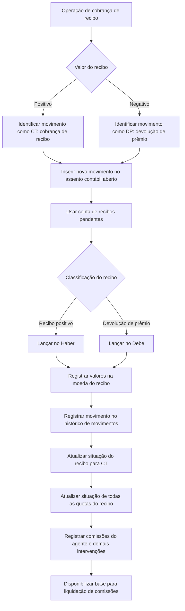

# Registro de Recibo Cobrado — Processo Contábil, Histórico, Situação e Comissões

## 1. Metadados do Documento
- **Arquivo de Origem:** `Não identificado (texto bruto fornecido)`
- **Tipo de Documento:** `Procedimento`
- **Domínio / Sistema:** `Registro de recibos, contabilidade e comissões de apólices`
- **Público-Alvo:** `Operação, Negócio, Contabilidade e Desenvolvimento`
- **Data/Versão Identificada:** `Não identificada`

---

## 2. Resumo Executivo & Contexto de Negócio

O documento descreve o processo automático para registrar o recebimento associado à cobrança de um recibo. O objetivo do processo é contabilizar o valor recebido, atualizar a situação do recibo para indicar que foi cobrado e registrar as comissões relacionadas às intervenções da apólice.

A operação cria um lançamento no registro diário e identifica o movimento conforme o sinal do valor do recibo. Quando o recibo possui valor positivo, o movimento é classificado como cobrança de recibo (`CT`); quando possui valor negativo, o movimento é classificado como devolução de prêmio (`DP`).

O lançamento contábil é criado como novo movimento no assento contábil aberto, utilizando a conta de recibos pendentes. O valor é lançado no crédito/Haber para recibos positivos e no débito/Debe para devoluções de prêmio. Todos os valores são registrados na moeda do próprio recibo.

Além do registro contábil, o processo mantém rastreabilidade no histórico de movimentos, atualiza a situação de todas as parcelas que compõem o recibo cobrado e registra as comissões devidas ao agente e às demais intervenções da apólice. As comissões registradas servem como base para o processo posterior de liquidação de comissões.

---

## 3. Arquitetura, Componentes & Tecnologias Envolvidas

O texto não identifica tecnologias, URLs, métodos HTTP, contratos JSON, servidores ou microsserviços. O documento apresenta exclusivamente um fluxo funcional e contábil relacionado ao recebimento de recibos.

Componentes funcionais identificados:

- Operação de cobrança de recibo.
- Registro diário.
- Assento contábil aberto.
- Conta de recibos pendentes.
- Registro histórico de movimentos.
- Situação do recibo.
- Parcelas ou quotas que compõem o recibo.
- Registro de comissões.
- Agente e demais intervenções da apólice.
- Processo de liquidação de comissões.



> *Nota de Análise: O documento não detalha interfaces técnicas, integrações entre sistemas, persistência de dados, regras de cálculo de comissão, nem contratos de serviço.*

---

## 4. Regras de Negócio, Especificações Funcionais & Processos

### Processo automático de registro de recibo cobrado

O processo de cobrança de recibo executa automaticamente os passos abaixo:

1. Registrar o valor recebido pela cobrança do recibo no registro diário.
2. Atualizar o recibo correspondente para indicar que o recibo foi cobrado.
3. Registrar o valor de comissão que deve ser pago ao agente.
4. Registrar valores de comissão relacionados às demais intervenções da apólice.
5. Criar um novo movimento no assento contábil que estiver aberto.
6. Utilizar a conta de recibos pendentes no lançamento contábil.
7. Registrar o movimento no histórico de movimentos do recibo.
8. Atualizar a situação de todas as quotas que compõem o recibo cobrado.
9. Disponibilizar os registros de comissão como base para a liquidação de comissões.

### Regras para classificação do movimento

- Um recibo com valor positivo deve gerar um movimento identificado como cobrança de recibo (`CT`).
- Um recibo com valor negativo deve gerar um movimento identificado como devolução de prêmio (`DP`).
- A situação do recibo é atualizada para `CT` quando ocorre a cobrança.
- O documento utiliza `CT` tanto para identificar o movimento de cobrança de recibo quanto para a situação de recibo cobrado.

### Regras contábeis

- O lançamento é gerado como novo movimento no assento contábil aberto.
- A conta utilizada no lançamento é a conta de recibos pendentes.
- Para recibo positivo, o lançamento na conta de recibos pendentes é realizado no **Haber**.
- Para devolução de prêmio, o lançamento na conta de recibos pendentes é realizado no **Debe**.
- Os valores devem ser registrados sempre na moeda do recibo.

### Regras de histórico e situação

- Todo movimento realizado sobre um recibo deve ficar refletido no registro histórico de movimentos.
- O movimento de cobrança deve ser registrado no histórico de movimentos do recibo.
- A cobrança de um recibo atualiza a situação de todas as quotas que compõem o recibo cobrado.

### Regras de comissões

- O processo de cobrança registra as comissões geradas pelo recebimento do recibo.
- As comissões incluem o agente e as demais intervenções da apólice.
- As informações registradas de comissão são a base para o processo de liquidação de comissões.

> *Nota de Análise: O documento não especifica percentuais, fórmulas, critérios de elegibilidade, periodicidade ou responsáveis pelo cálculo das comissões.*

---

## 5. Tabelas de Parâmetros, Ambientes e Estruturas de Dados

| Item / Parâmetro | Descrição / Função | Tipo / Valores / Formato | Ambiente / Observações |
| :--- | :--- | :--- | :--- |
| Recibo | Entidade cujo recebimento é registrado e cuja situação é atualizada. | Valor positivo ou negativo. | O documento não detalha a estrutura do recibo. |
| Valor do recibo | Determina a classificação do movimento e a posição contábil do lançamento. | Positivo ou negativo. | Registrado sempre na moeda do recibo. |
| CT | Identificação de cobrança de recibo e situação de recibo cobrado. | Código. | Aplicável quando o recibo possui valor positivo e na atualização da situação de cobrado. |
| DP | Identificação de devolução de prêmio. | Código. | Aplicável quando o recibo possui valor negativo. |
| Registro diário | Registro que recebe o lançamento da operação de cobrança do recibo. | Registro contábil. | O documento não informa estrutura, sistema ou campos. |
| Assento contábil aberto | Assento no qual é criado o novo movimento da cobrança ou devolução. | Estado contábil: aberto. | O lançamento ocorre no assento que estiver aberto. |
| Conta de recibos pendentes | Conta utilizada no novo movimento contábil. | Conta contábil. | Crédito/Haber para recibo positivo; débito/Debe para devolução de prêmio. |
| Haber | Posição contábil para lançamento de recibo positivo. | Crédito. | Associado à conta de recibos pendentes. |
| Debe | Posição contábil para lançamento de devolução de prêmio. | Débito. | Associado à conta de recibos pendentes. |
| Moeda do recibo | Moeda em que os valores são registrados. | Moeda do recibo. | Não são citadas conversões cambiais. |
| Registro histórico de movimentos | Registro que preserva os movimentos realizados sobre o recibo. | Histórico de movimentos. | Deve refletir qualquer movimento executado sobre o recibo. |
| Situação do recibo | Estado funcional atualizado após o recebimento. | `CT`. | A atualização alcança todas as quotas do recibo cobrado. |
| Quotas do recibo | Componentes do recibo cuja situação é atualizada durante a cobrança. | Não detalhado. | Não há descrição de quantidade, estrutura ou regras específicas. |
| Comissão do agente | Comissão devida ao agente pela cobrança do recibo. | Valor de comissão. | Serve de base para liquidação de comissões. |
| Demais intervenções da apólice | Participantes adicionais cujas comissões são registradas. | Não detalhado. | O documento não identifica quais intervenções existem. |
| Liquidação de comissões | Processo posterior baseado nas comissões registradas durante a cobrança. | Processo de negócio. | Não há detalhamento do fluxo de liquidação. |

---

## 6. Bateria de Perguntas & Respostas para RAG (FAQ Sintético)

### P1: Qual é o objetivo do processo de registro de recibo cobrado?
**R:** O processo registra o valor recebido pela cobrança de um recibo no registro diário, atualiza o recibo para indicar que foi cobrado e registra as comissões devidas ao agente e às demais intervenções da apólice.

### P2: Qual código identifica uma cobrança de recibo com valor positivo?
**R:** Um recibo com valor positivo é identificado como cobrança de recibo pelo código `CT`.

### P3: Qual código identifica um recibo negativo no processo de cobrança?
**R:** Um recibo com valor negativo é identificado como devolução de prêmio pelo código `DP`.

### P4: Em qual conta é registrado o novo movimento contábil da cobrança?
**R:** O novo movimento é registrado na conta de recibos pendentes, dentro do assento contábil que estiver aberto.

### P5: Em qual posição contábil um recibo positivo é lançado?
**R:** Quando o recibo é positivo, o valor é imputado no **Haber**, ou crédito, da conta de recibos pendentes.

### P6: Em qual posição contábil uma devolução de prêmio é lançada?
**R:** Quando o recibo representa uma devolução de prêmio, identificado como `DP`, o valor é imputado no **Debe**, ou débito, da conta de recibos pendentes.

### P7: Em qual moeda os valores da cobrança são registrados?
**R:** Os valores são registrados sempre na moeda do próprio recibo. O documento não descreve conversão de moedas ou regras cambiais.

### P8: O que acontece no histórico de movimentos quando um recibo é cobrado?
**R:** O movimento de cobrança é registrado no registro histórico de movimentos, que deve refletir qualquer movimento realizado sobre um recibo.

### P9: A atualização da situação afeta somente o recibo principal?
**R:** Não. Ao cobrar um recibo, o processo atualiza a situação de todas as quotas que compõem o recibo cobrado.

### P10: Para que servem as comissões registradas no processo de cobrança?
**R:** As comissões registradas para o agente e para as demais intervenções da apólice servem como base para o processo de liquidação de comissões.

### P11: O documento define como as comissões são calculadas?
**R:** Não. O documento informa que as comissões são registradas durante a cobrança, mas não apresenta fórmulas, percentuais, condições de cálculo ou critérios de distribuição.

### P12: O documento especifica métodos HTTP ou contratos de integração para o processo?
**R:** Não. O conteúdo fornecido não descreve métodos HTTP, endpoints, contratos JSON, microsserviços, tecnologias ou interfaces técnicas.

---

## 7. Glossário de Termos, Siglas & Conceitos-Chave

- **CT:** Código que identifica a cobrança de recibo quando o recibo possui valor positivo; também é a situação atribuída ao recibo após sua cobrança.
- **DP:** Código que identifica uma devolução de prêmio quando o recibo possui valor negativo.
- **Recibo:** Entidade associada à cobrança cujo valor, situação, histórico e comissões são processados.
- **Registro diário:** Registro no qual a operação de cobrança do recibo cria um lançamento.
- **Assento contábil:** Registro contábil que recebe um novo movimento quando está aberto.
- **Conta de recibos pendentes:** Conta utilizada para o lançamento contábil da cobrança ou devolução de prêmio.
- **Haber:** Posição de crédito utilizada para imputar o valor de um recibo positivo.
- **Debe:** Posição de débito utilizada para imputar o valor de uma devolução de prêmio.
- **Devolução de prêmio:** Movimento associado a um recibo negativo, identificado pelo código `DP`.
- **Registro histórico de movimentos:** Registro que deve refletir os movimentos efetuados sobre um recibo.
- **Quota:** Componente do recibo cuja situação também é atualizada quando ocorre a cobrança.
- **Intervenções da apólice:** Participantes, além do agente, para os quais podem ser registradas comissões.
- **Liquidação de comissões:** Processo que utiliza como base as informações de comissão registradas na cobrança.

---

## 8. Notas Críticas, Riscos & Limitações

- O texto não identifica o arquivo de origem, data, versão, autor ou sistema responsável pelo processo.
- Não há detalhamento de APIs, métodos HTTP, endpoints, contratos de dados, esquemas de persistência ou mecanismos de integração.
- O documento não define fórmulas, percentuais, moedas alternativas, arredondamentos ou regras de cálculo das comissões.
- Não são descritos tratamentos para falhas, reversões, duplicidade de cobrança, concorrência, validações prévias ou recuperação de processamento.
- Não há detalhamento sobre os critérios para localizar o assento contábil aberto.
- O documento não especifica quais são as demais intervenções da apólice nem como suas comissões são distribuídas.
- A expressão “todas as quotas” é mencionada, mas a estrutura e os critérios de atualização das quotas não são detalhados.

---

## 9. Conteúdo Bruto Estruturado (Referência Fiel)

```text
--- [PÁGINA 1 DE 2] ---

EN CONSTRUCCIÓN
REGISTRAR recibo cobrado (enlace con visión
técnica)
¿En qué consiste?
Se trata de registrar el importe recibido por el cobro del recibo en el registro diario, además de
actualizar el recibo correspondiente para identificar que ha sido cobrado y registrar el importe que se
debe pagar como comisión al agente y otras intervenciones de la póliza.
Objetivo
Realizar los pasos necesarios para registrar el importe cobrado en la contabilidad y dejar constancia
de la nueva situación del recibo como cobrado, además de registrar el importe de las comisiones
correspondientes por el cobro del recibo.
Proceso a seguir
El proceso comprende los siguientes pasos que se hacen de forma automática:
Insertar registro diario
La operación de cobro de recibo registra un apunte en el registro diario, identificando el movimiento
como cobro de recibo (CT) si el importe del recibo es positivo, o como una devolución del prima (DP),
cuando el recibo es negativo.
 /
 CF
Home Solutions APIs Documentation Zeus
EN


--- [PÁGINA 2 DE 2] ---

Este apunte se generará como un nuevo movimiento en el asiento contable que esté abierto, a la
cuenta de recibos pendientes, imputado en el Haber cuando el recibo sea positivo o en el Debe
cuando se trate de una devolución de prima.
Los importes se registran siempre en la moneda del recibo
Registrar movimiento histórico
Registra el movimiento de cobro del recibo en el registro histórico de movimientos, donde debe
quedar reflejado cualquier movimiento que se realice sobre un recibo.
Actualizar situación recibo
Realiza la actualización de la situación del recibo para indicar que ha sido cobrado (CT). Al realizar el
cobro de un recibo se actualiza la situación en todas las cuotas que componen el recibo cobrado.
Registrar comisiones
En el proceso de cobro se registran las comisiones devengadas por el cobro del recibo, tanto para el
agente como para el resto de intervenciones de la póliza. Esta información servirá de base para el
proceso de liquidación de comisiones.
```
