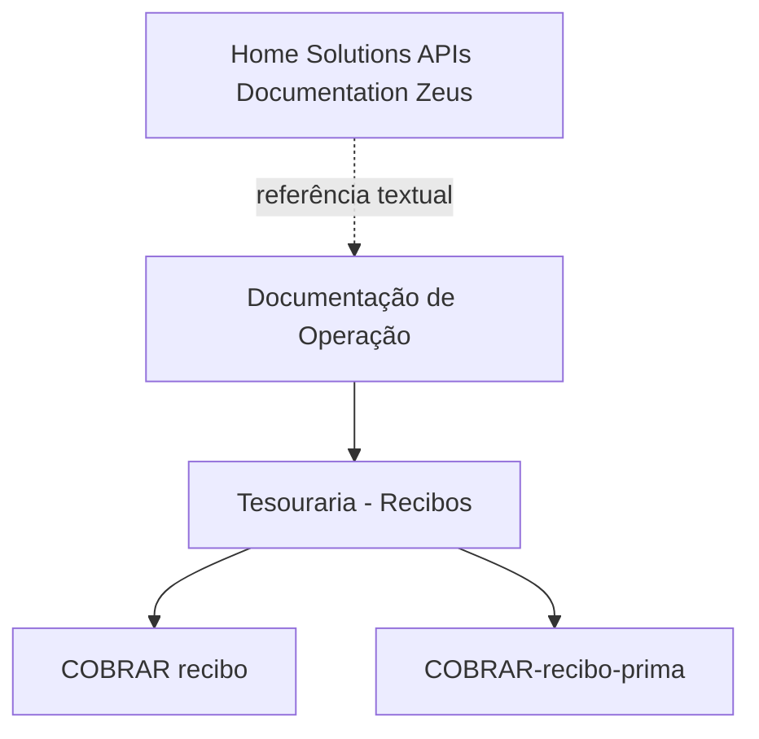

# Documentação de Operação de Tesouraria — Recibos

## 1. Metadados do Documento
- **Arquivo de Origem:** `Não identificado`
- **Tipo de Documento:** Manual Operacional
- **Domínio / Sistema:** Tesouraria — Recibos; Home Solutions APIs Documentation Zeus
- **Público-Alvo:** Operação
- **Data/Versão Identificada:** Não identificada

---

## 2. Resumo Executivo & Contexto de Negócio

O conteúdo identifica uma documentação de operação referente ao domínio de **Tesouraria — Recibos**. O material apresenta referências a ações de cobrança de recibos, incluindo as expressões `[COBRAR recibo]` e `[COBRAR-recibo-prima]`.

O texto também associa o conteúdo a **Home Solutions APIs Documentation Zeus**, embora não descreva contratos de API, endpoints, métodos HTTP, autenticação, payloads ou integrações técnicas.

A expressão **“EN CONSTRUCCIÓN”** indica que a documentação ou funcionalidade referenciada pode estar em construção. Não há detalhamento adicional sobre escopo, responsáveis, cronograma, dependências ou estado de entrega.

---

## 3. Arquitetura, Componentes & Tecnologias Envolvidas

| Componente / Referência | Evidência no conteúdo | Detalhamento disponível |
| :--- | :--- | :--- |
| Tesouraria — Recibos | “DOCUMENTACIÓN de OPERACIÓN de TESORERÍA - RECIBOS” | Domínio operacional mencionado; sem regras ou arquitetura detalhadas. |
| Cobrar recibo | `[COBRAR recibo]` | Ação ou funcionalidade referenciada; sem fluxo, validações ou parâmetros. |
| Cobrar recibo-prima | `[COBRAR-recibo-prima]` | Ação ou funcionalidade referenciada; sem contrato técnico ou funcional. |
| Home Solutions APIs Documentation Zeus | “Home Solutions APIs Documentation Zeus” | Referência documental/sistêmica; sem informações de integração. |
| CF | “CF” | Sigla citada sem expansão ou contexto suficiente. |
| EN | “EN” | Marcador citado sem definição explícita. |



> *Nota de Análise: o conteúdo não detalha arquitetura de software, camadas, microsserviços, bancos de dados, URLs, ambientes, tecnologias ou contratos de integração.*

---

## 4. Regras de Negócio, Especificações Funcionais & Processos

1. O documento referencia operações associadas à cobrança de recibos no contexto de Tesouraria.
2. As ações textualmente identificadas são:
   - `COBRAR recibo`
   - `COBRAR-recibo-prima`
3. Não foram fornecidos critérios de elegibilidade, regras de cálculo, estados de processamento, validações, exceções, aprovações ou etapas operacionais.
4. O documento contém o marcador `EN CONSTRUCCIÓN`, sem explicar se o marcador se aplica à documentação, à operação de cobrança, às APIs Zeus ou a outro elemento.
5. Não há informação suficiente para definir diferenças funcionais entre `COBRAR recibo` e `COBRAR-recibo-prima`.

> *Nota de Análise: o documento lista ações de cobrança, porém não detalha os procedimentos operacionais, métodos HTTP, contratos JSON, regras de negócio ou efeitos esperados de cada ação.*

---

## 5. Tabelas de Parâmetros, Ambientes e Estruturas de Dados

| Item / Parâmetro | Descrição / Função | Tipo / Valores / Formato | Ambiente / Observações |
| :--- | :--- | :--- | :--- |
| `COBRAR recibo` | Ação referenciada para cobrança de recibo. | Texto entre colchetes. | Sem ambiente, endpoint ou parâmetros informados. |
| `COBRAR-recibo-prima` | Ação referenciada para cobrança de recibo-prima. | Texto entre colchetes. | Sem ambiente, endpoint ou parâmetros informados. |
| `CF` | Sigla ou marcador citado no conteúdo. | Texto. | Significado não identificado. |
| `Home Solutions APIs Documentation Zeus` | Referência a documentação de APIs ou sistema Zeus. | Texto. | Não há URLs, versões ou contratos técnicos. |
| `EN` | Marcador textual presente no conteúdo. | Texto. | Significado não identificado. |
| `EN CONSTRUCCIÓN` | Indicação textual de conteúdo em construção. | Texto em espanhol. | Escopo da indicação não especificado. |

---

## 6. Bateria de Perguntas & Respostas para RAG (FAQ Sintético)

### P1: Qual é o domínio funcional principal da documentação?
**R:** O domínio funcional indicado é **Tesouraria — Recibos**, conforme o título “DOCUMENTACIÓN de OPERACIÓN de TESORERÍA - RECIBOS”.

### P2: Quais ações de cobrança são citadas no documento?
**R:** O documento cita as ações `[COBRAR recibo]` e `[COBRAR-recibo-prima]`. Não há explicação adicional sobre suas diferenças, pré-condições ou resultados.

### P3: O documento especifica como executar a cobrança de um recibo?
**R:** Não. O conteúdo apenas referencia a ação `[COBRAR recibo]`; não apresenta procedimento passo a passo, parâmetros, validações ou tratamento de erros.

### P4: Existe documentação técnica de API para a operação de cobrança?
**R:** O texto menciona “Home Solutions APIs Documentation Zeus”, mas não contém endpoints, métodos HTTP, autenticação, esquemas de requisição, respostas ou códigos de erro.

### P5: O que significa a indicação “EN CONSTRUCCIÓN”?
**R:** O conteúdo apresenta a expressão “EN CONSTRUCCIÓN”, que indica algo em construção. Entretanto, o documento não esclarece qual funcionalidade, seção ou documentação está nesse estado.

### P6: Quais ambientes estão documentados para a operação de Tesouraria — Recibos?
**R:** Nenhum ambiente é identificado. O texto não contém URLs, nomes de servidores, variáveis de ambiente, credenciais ou configurações.

### P7: O documento define o significado da sigla CF?
**R:** Não. A sigla `CF` aparece no conteúdo, mas não possui expansão ou definição contextual disponível.

### P8: Há regras de negócio para cobrança de recibo-prima?
**R:** Não há regras de negócio descritas. A expressão `[COBRAR-recibo-prima]` é apenas citada, sem critérios de processamento, cálculo, validação ou exceção.

### P9: O documento apresenta fluxos entre sistemas ou microsserviços?
**R:** Não. Não há descrição de sistemas integrados, microsserviços, filas, bancos de dados ou troca de mensagens. A única referência técnica é “Home Solutions APIs Documentation Zeus”.

### P10: É possível identificar a versão ou data da documentação?
**R:** Não. O conteúdo fornecido não contém data, versão, autoria, histórico de alterações ou identificação de arquivo.

---

## 7. Glossário de Termos, Siglas & Conceitos-Chave

- **Tesouraria:** Domínio operacional citado no título da documentação, relacionado a recibos.
- **Recibos:** Entidade ou domínio de negócio mencionado no título.
- **COBRAR recibo:** Ação textual referenciada para cobrança de recibo.
- **COBRAR-recibo-prima:** Ação textual referenciada para cobrança de recibo-prima.
- **CF:** Sigla presente no conteúdo; significado não definido.
- **EN:** Marcador presente no conteúdo; significado não definido.
- **EN CONSTRUCCIÓN:** Expressão em espanhol que indica “em construção”.
- **Home Solutions APIs Documentation Zeus:** Nome ou referência textual associada a documentação de APIs e Zeus; sem detalhamento adicional.
- **Zeus:** Termo citado como parte de “Home Solutions APIs Documentation Zeus”; significado não definido no conteúdo.

---

## 8. Notas Críticas, Riscos & Limitações

- O conteúdo disponível é extremamente resumido e não permite documentar procedimentos operacionais executáveis.
- Não foram identificados endpoints, URLs, métodos HTTP, contratos de API, parâmetros, autenticação ou ambientes.
- Não há definição para `CF`, `EN` ou `Zeus` fora do nome textual apresentado.
- Não existem regras para diferenciar `COBRAR recibo` de `COBRAR-recibo-prima`.
- A indicação `EN CONSTRUCCIÓN` sugere potencial incompletude, mas o escopo dessa condição não é informado.
- Qualquer detalhamento adicional sobre arquitetura, APIs, regras de negócio ou operação exigiria fonte documental complementar.

---

## 9. Conteúdo Bruto Estruturado (Referência Fiel)

```text
--- [PÁGINA 1 DE 1] ---

EN CONSTRUCCIÓN
DOCUMENTACIÓN de OPERACIÓN de
TESORERÍA - RECIBOS
OPERACIONES
[COBRAR recibo][COBRAR-recibo-prima]
 / 
 CF
Home Solutions APIs Documentation Zeus
EN
```
