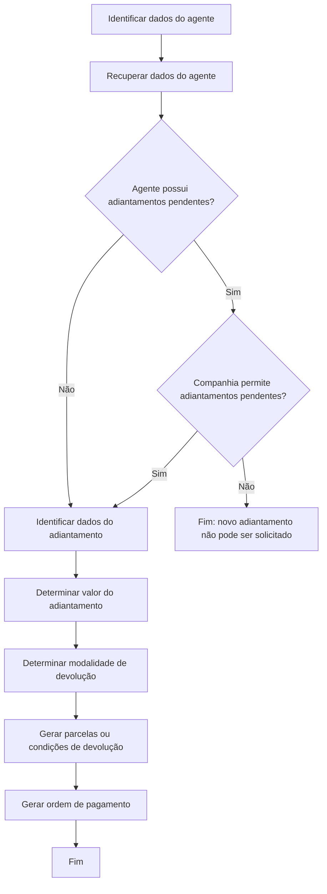

# Especificação Funcional — Criação de Adiantamento de Comissão para Agente

## 1. Metadados do Documento
- **Arquivo de Origem:** Não identificado no conteúdo fornecido
- **Tipo de Documento:** Especificação Técnica / Procedimento Funcional
- **Domínio / Sistema:** Operação `Crear anticipo comisión agente`; referência textual a “Home Solutions APIs Documentation Zeus”
- **Público-Alvo:** Analistas funcionais, desenvolvedores, operação financeira e gestão comercial
- **Data/Versão Identificada:** Não identificada

---

## 2. Resumo Executivo & Contexto de Negócio

O documento especifica a operação de criação de um adiantamento de comissão solicitado por um agente. A operação registra as informações do adiantamento, identifica o agente e a oficina comercial à qual o gasto será imputado, gera uma ordem de pagamento e define como o agente devolverá o valor antecipado.

A solicitação de um novo adiantamento depende da situação de adiantamentos anteriores do agente. Quando existem adiantamentos pendentes, o novo pedido somente pode prosseguir se a companhia permitir a geração de adiantamentos simultâneos. Caso a companhia não permita, o agente deve devolver o adiantamento anterior antes de realizar uma nova solicitação.

A operação considera dados financeiros e contábeis, incluindo tipo de documento, conceito de cobrança e pagamento, moeda, câmbio, valor-base, impostos e retenções. O tipo de documento selecionado determina se impostos e retenções serão calculados.

A devolução do adiantamento pode ocorrer por número de parcelas, em parcela única com vencimento acordado ou por percentual descontado nas liquidações de comissão do agente. Cada modalidade possui propriedades próprias, critérios de geração de parcelas e possibilidades específicas de alteração de datas e valores.

---

## 3. Arquitetura, Componentes & Tecnologias Envolvidas

O conteúdo não descreve arquitetura de software, microsserviços, métodos HTTP, contratos JSON, bancos de dados ou integrações técnicas. O documento apresenta uma operação funcional com validações, geração de ordem de pagamento e cálculo de devolução de adiantamento.

Componentes funcionais identificados:

- **Agente:** solicitante do adiantamento de comissão.
- **Oficina de imputação:** oficina comercial à qual o gasto do adiantamento será atribuído.
- **Companhia:** entidade que define se agentes com adiantamentos pendentes podem solicitar novos adiantamentos.
- **Tipo de documento:** determina regras de impostos e retenções na ordem de pagamento.
- **Conceito de adiantamento:** conceito de cobrança e pagamento usado para gerar a ordem de pagamento.
- **Moeda dos valores:** moeda em que o adiantamento é expresso.
- **Tipo de câmbio:** recuperado quando a moeda do adiantamento for diferente da moeda local.
- **Liquidações de comissão:** utilizadas na modalidade de devolução por percentual.
- **Parcelas de devolução:** obrigações geradas conforme a modalidade de devolução escolhida.



> **Nota de Análise:** O documento cita “Home Solutions APIs Documentation Zeus”, mas não detalha a função dessa referência, nem descreve APIs, endpoints, autenticação, métodos HTTP ou contratos de integração.

---

## 4. Regras de Negócio, Especificações Funcionais & Processos

### 4.1. Objetivo da operação

A operação registra a informação de um adiantamento de comissão solicitado por um agente. Também registra a forma de devolução escolhida pelo agente e gera as parcelas correspondentes à modalidade de devolução.

### 4.2. Processo funcional principal

1. Identificar os dados do agente solicitante.
2. Recuperar as informações do agente.
3. Verificar se o agente está excluído do pagamento de comissões.
4. Verificar se o agente possui adiantamentos anteriores pendentes.
5. Se não houver adiantamentos pendentes, continuar a solicitação.
6. Se houver adiantamentos pendentes, verificar se a companhia permite gerar novos adiantamentos nessa situação.
7. Se a companhia não permitir adiantamentos pendentes, impedir a nova solicitação até que o adiantamento anterior seja devolvido à companhia.
8. Identificar os dados do novo adiantamento.
9. Determinar o valor do adiantamento.
10. Determinar a modalidade de devolução.
11. Gerar as parcelas ou condições de devolução conforme a modalidade escolhida.
12. Gerar a ordem de pagamento associada ao adiantamento.

### 4.3. Regras relacionadas ao agente

- O campo **Agente** identifica o agente que solicita o adiantamento.
- A informação do agente é usada para recuperar seus dados.
- O sistema deve verificar se o agente está excluído do pagamento de comissões.
- A existência de adiantamentos anteriores pendentes influencia a autorização de uma nova solicitação.
- Um agente com adiantamentos pendentes somente pode solicitar um novo adiantamento quando a companhia permitir essa condição.

### 4.4. Regras relacionadas à oficina de imputação

- A **Oficina de imputação** identifica a oficina comercial à qual será imputado o gasto do adiantamento.
- Por padrão, a operação mostra a oficina à qual pertence o agente solicitante.
- A oficina padrão pode ser alterada por qualquer outra oficina pertencente à estrutura comercial.

### 4.5. Regras relacionadas ao tipo de documento

- O **Tipo de documento** registra o tipo de documento de compra e venda utilizado para gerar a ordem de pagamento.
- O tipo de documento selecionado determina se haverá cálculo de impostos e retenções.
- O tipo de documento aplicável à operação deve ser:
  - um tipo de documento de cobrança ou pagamento para pagamentos, identificado por **P**; ou
  - um tipo de documento de cobrança e pagamentos, identificado por **A**.

### 4.6. Regras relacionadas ao tipo e conceito de adiantamento

- O **Tipo de adiantamento** identifica o tipo de adiantamento de comissão solicitado.
- Para esta operação, o valor do tipo de adiantamento é **adiantamento (1)**.
- Após identificar o tipo de adiantamento, é verificada a existência de outros adiantamentos pendentes para o agente.
- Quando houver adiantamentos pendentes, a solicitação somente continua se a companhia permitir gerar adiantamentos nessa condição.
- O **Conceito de adiantamento** é o conceito de cobrança e pagamento utilizado para gerar a ordem de pagamento.
- O conceito deve pertencer ao agrupamento contábil de adiantamentos de comissões, identificado por **PC**.
- O conceito deve ser classificado como:
  - tipo de conceito de agentes e comissões, identificado por **AC**;
  - tipo de movimento de pagamento, identificado por **P**.

### 4.7. Regras relacionadas a moeda, câmbio, valores e impostos

- A **Moeda dos valores** identifica a moeda dos valores do adiantamento solicitado.
- Se a moeda selecionada for diferente da moeda local, deve ser recuperado o tipo de câmbio da moeda informada em relação à moeda local.
- O tipo de câmbio deve corresponder à data da solicitação do adiantamento.
- O **Valor-base** representa o valor que se deseja antecipar, expresso na moeda identificada.
- A partir do valor-base informado, devem ser recuperados:
  - dados de impostos, quando o documento de cobrança e pagamento incluir impostos;
  - valor do adiantamento e impostos na moeda do país;
  - total do adiantamento, incluindo impostos, tanto na moeda do adiantamento quanto na moeda do país.

### 4.8. Modalidade 1 — Devolução por número de parcelas

A devolução por número de parcelas indica que o valor antecipado será devolvido em uma quantidade determinada de parcelas acordada com o agente.

Regras aplicáveis:

- Deve ser informado o **Número de parcelas**.
- Deve ser informada a **Data de início das parcelas**.
- A data de início das parcelas coincide com a data de vencimento da primeira parcela.
- A cada parcela subsequente, deve ser acrescentado um mês à data de vencimento anterior.
- O valor calculado para cada parcela é proporcional à quantidade de parcelas.
- O valor de cada parcela é obtido pela divisão do valor total do adiantamento pelo número de parcelas.
- É possível alterar as datas de vencimento das parcelas geradas.
- É possível alterar os valores das parcelas geradas.
- A soma dos valores das parcelas deve ser igual ao valor total do adiantamento solicitado.

### 4.9. Modalidade 2 — Devolução no vencimento

A devolução no vencimento indica que o valor será devolvido em uma única parcela com vencimento acordado com o agente.

Regras aplicáveis:

- Deve ser informada a **Data de vencimento** da parcela.
- O valor da parcela corresponde ao valor total do adiantamento solicitado.
- A data de vencimento da parcela gerada pode ser alterada.

### 4.10. Modalidade 3 — Devolução por percentual

A devolução por percentual indica que um percentual do adiantamento será cancelado em cada liquidação de comissão do agente, até a data de vencimento acordada.

Regras aplicáveis:

- Deve ser informado o **Percentual (%)** do adiantamento a ser cancelado em cada liquidação de comissões do agente.
- Deve ser informada a **Data de início**, a partir da qual o percentual de desconto será aplicado na liquidação de comissão.
- Deve ser informada a **Data de vencimento**, data em que o valor total do adiantamento deve estar cancelado.
- Na data de vencimento, o valor restante deve ser cancelado para que a devolução seja concluída totalmente.
- O valor total do adiantamento deve ser apresentado como referência do montante a ser cancelado até o vencimento.
- A data de vencimento da devolução pode ser ajustada.

### 4.11. Descrição opcional

- A propriedade **Descrição** é opcional.
- A descrição pode ser informada para o movimento de adiantamento que está sendo gerado.

---

## 5. Tabelas de Parâmetros, Ambientes e Estruturas de Dados

| Item / Parâmetro | Descrição / Função | Tipo / Valores / Formato | Ambiente / Observações |
| :--- | :--- | :--- | :--- |
| Agente | Identifica o agente que solicita o adiantamento. | Não especificado | Permite recuperar os dados do agente e verificar se está excluído do pagamento de comissões. |
| Oficina de imputação | Identifica a oficina comercial à qual o gasto será imputado. | Não especificado | Por padrão, utiliza a oficina do agente; pode ser alterada para outra oficina da estrutura comercial. |
| Tipo de documento | Define o tipo de documento de compra e venda usado na ordem de pagamento. | `P` ou `A` | Determina se impostos e retenções são calculados. Deve ser de cobrança/pagamento para pagamentos (`P`) ou para cobrança e pagamentos (`A`). |
| Tipo de adiantamento | Identifica o tipo de adiantamento de comissão solicitado. | `1` = adiantamento | A identificação aciona a verificação de adiantamentos pendentes do agente. |
| Conceito de adiantamento | Conceito de cobrança e pagamento usado para gerar a ordem de pagamento. | Agrupamento contábil `PC`; conceito `AC`; movimento `P` | Deve atender simultaneamente às três classificações descritas. |
| Moeda dos valores | Identifica a moeda em que os valores do adiantamento são expressos. | Não especificado | Quando diferente da moeda local, requer recuperação de tipo de câmbio na data da solicitação. |
| Tipo de câmbio | Conversão da moeda do adiantamento para a moeda local. | Não especificado | Recuperado somente quando a moeda do adiantamento for diferente da moeda local. |
| Valor-base | Valor que se deseja antecipar. | Valor monetário na moeda selecionada | Origina dados de impostos, valores em moeda do país e total do adiantamento. |
| Impostos | Dados fiscais associados ao adiantamento. | Não especificado | Recuperados quando o documento de cobrança e pagamento incluir impostos. |
| Total do adiantamento | Valor do adiantamento incluindo impostos. | Moeda do adiantamento e moeda do país | Utilizado na geração e validação das devoluções. |
| Devolução | Define a forma de devolução do adiantamento pelo agente. | `1`, `2` ou `3` | Cada tipo exige propriedades e regras próprias. |
| Número de parcelas | Quantidade de parcelas da devolução. | Número não especificado | Aplicável somente à devolução por número de parcelas. |
| Data de início das parcelas | Data de vencimento da primeira parcela. | Data | Aplicável somente à devolução por número de parcelas; cada parcela seguinte soma um mês. |
| Data de vencimento | Data em que uma parcela ou o adiantamento deve vencer. | Data | Aplicável à devolução no vencimento e à devolução por percentual. |
| Percentual (%) | Percentual do adiantamento cancelado em cada liquidação de comissão. | Percentual | Aplicável somente à devolução por percentual. |
| Data de início | Data a partir da qual o percentual é descontado das liquidações. | Data | Aplicável somente à devolução por percentual. |
| Descrição | Texto opcional para o movimento de adiantamento. | Texto | Opcional. |

### Tipos de devolução

| Código | Tipo de devolução | Geração da devolução | Regras de alteração |
| :--- | :--- | :--- | :--- |
| `1` | Devolução por número de parcelas | Gera parcelas proporcionais ao número de parcelas informado. | Datas e valores podem ser alterados se a soma das parcelas for igual ao total do adiantamento. |
| `2` | Devolução no vencimento | Gera uma única parcela no valor total do adiantamento. | A data de vencimento da parcela pode ser alterada. |
| `3` | Devolução por percentual | Cancela percentual em cada liquidação de comissão; o restante é cancelado até o vencimento. | A data de vencimento pode ser ajustada. |

---

## 6. Bateria de Perguntas & Respostas para RAG (FAQ Sintético)

### P1: Qual é a finalidade da operação de criação de adiantamento de comissão para agente?
**R:** A operação registra um adiantamento de comissão solicitado por um agente, gera a ordem de pagamento correspondente e registra a forma pela qual o agente devolverá o valor. A modalidade de devolução escolhida gera parcelas ou condições de cancelamento específicas.

### P2: Um agente com adiantamentos pendentes pode solicitar um novo adiantamento?
**R:** Sim, somente se a companhia permitir a geração de novos adiantamentos quando o agente possuir adiantamentos anteriores pendentes. Se a companhia não permitir, o agente não poderá solicitar um novo adiantamento até devolver o adiantamento anterior à companhia.

### P3: Qual é a validação realizada ao identificar o agente solicitante?
**R:** Ao identificar o agente, a operação recupera suas informações e verifica se o agente está excluído do pagamento de comissões. O documento não detalha o comportamento posterior caso o agente esteja excluído.

### P4: Qual oficina comercial é utilizada para imputar o gasto do adiantamento?
**R:** Por padrão, a operação apresenta a oficina à qual o agente solicitante pertence. Essa oficina de imputação pode ser modificada para outra oficina pertencente à estrutura comercial.

### P5: Quais tipos de documento podem ser usados para gerar a ordem de pagamento?
**R:** O tipo de documento deve ser um documento de cobrança ou pagamento para pagamentos, identificado por `P`, ou um documento de cobrança e pagamentos, identificado por `A`. O documento escolhido determina se impostos e retenções serão calculados.

### P6: Quais classificações são obrigatórias para o conceito de adiantamento?
**R:** O conceito usado para gerar a ordem de pagamento deve pertencer ao agrupamento contábil de adiantamentos de comissões (`PC`), ser classificado como conceito de agentes e comissões (`AC`) e possuir tipo de movimento de pagamento (`P`).

### P7: Quando o tipo de câmbio é recuperado?
**R:** O tipo de câmbio é recuperado quando a moeda informada para o adiantamento for diferente da moeda local. A conversão deve considerar a data da solicitação do adiantamento.

### P8: Como é calculado o valor das parcelas na devolução por número de parcelas?
**R:** O valor de cada parcela é calculado proporcionalmente, dividindo-se o valor total do adiantamento pelo número de parcelas definido. A primeira parcela vence na data de início das parcelas, e cada parcela seguinte vence um mês depois da anterior.

### P9: É permitido alterar valores ou vencimentos das parcelas geradas?
**R:** Na devolução por número de parcelas, podem ser alterados tanto os vencimentos quanto os valores das parcelas, desde que a soma dos valores de todas as parcelas permaneça igual ao valor total do adiantamento solicitado.

### P10: Como funciona a devolução no vencimento?
**R:** A devolução no vencimento gera uma única parcela, cujo valor corresponde ao total do adiantamento solicitado. A data de vencimento é acordada com o agente e pode ser modificada posteriormente.

### P11: Como funciona a devolução por percentual?
**R:** Na devolução por percentual, um percentual do valor antecipado é cancelado em cada liquidação de comissões do agente, a partir de uma data de início. Até a data de vencimento acordada, o valor restante deve ser cancelado para que a devolução seja concluída totalmente.

### P12: A descrição do movimento de adiantamento é obrigatória?
**R:** Não. A propriedade Descrição é opcional e pode ser usada para registrar uma descrição do movimento de adiantamento gerado.

---

## 7. Glossário de Termos, Siglas & Conceitos-Chave

- **AC:** Tipo de conceito de agentes e comissões. O conceito de adiantamento deve possuir essa classificação.
- **Adiantamento de comissão:** Valor antecipado solicitado por um agente e posteriormente devolvido à companhia conforme uma modalidade de devolução.
- **Agrupamento contábil:** Classificação contábil à qual o conceito de adiantamento deve pertencer.
- **Companhia:** Entidade que define se agentes com adiantamentos pendentes podem solicitar novos adiantamentos.
- **Conceito de adiantamento:** Conceito de cobrança e pagamento utilizado para gerar a ordem de pagamento do adiantamento.
- **Liquidação de comissões:** Processo no qual o percentual definido na devolução por percentual é aplicado ao agente.
- **Moeda local:** Moeda de referência usada para conversão quando o adiantamento é solicitado em moeda diferente.
- **Oficina de imputação:** Oficina comercial à qual o gasto do adiantamento é atribuído.
- **Ordem de pagamento:** Ordem gerada para o pagamento do adiantamento.
- **P:** Tipo de documento de cobrança ou pagamento para pagamentos; também identifica o tipo de movimento de pagamento exigido para o conceito.
- **PC:** Agrupamento contábil de adiantamentos de comissões.
- **Tipo de câmbio:** Conversão da moeda do adiantamento em relação à moeda local na data da solicitação.

---

## 8. Notas Críticas, Riscos & Limitações

- O documento não informa o nome do arquivo de origem, data, versão, autor ou responsável pelo processo.
- O conteúdo não descreve implementação técnica, APIs, serviços, banco de dados, interfaces, permissões, logs, mensagens de erro ou contratos de integração.
- Não são informados os critérios usados pela companhia para permitir ou bloquear adiantamentos simultâneos.
- Não foram especificadas regras de arredondamento para divisão do valor total entre parcelas.
- Não foram detalhadas regras de cálculo para impostos, retenções, conversão cambial ou valor residual na devolução por percentual.
- Não foram definidos limites mínimos ou máximos para valor-base, quantidade de parcelas ou percentual aplicado em liquidações.
- Não foram descritos os comportamentos do sistema em caso de agente excluído do pagamento de comissões.
- A referência a “Home Solutions APIs Documentation Zeus” não possui detalhamento adicional no conteúdo fornecido.

---

## 9. Conteúdo Bruto Estruturado (Referência Fiel)

```text
--- [PÁGINA 1 DE 7] ---

EN CONSTRUCCIÓN
CREAR anticipo comisión agente
¿En que consiste?
Esta operación registra la información de un anticipo de comisión que solicita un agente.
Desde esta operación se registra también la forma en la que el agente devolverá el importe del
anticipo, generando las cuotas correspondientes a la forma de devolución elegida por el agente.
Premisas
Si un agente tiene anticipos anteriores pendientes, solo podrá solicitar un nuevo anticipo si la
compañía lo permite, de lo contrario no podrá solicitar nuevos anticipos hasta que el anticipo anterior
haya sido devuelto a la compañía por parte del agente.
Proceso a seguir
A continuación se detallan las propiedades que pueden participar en esta operación.
SI
NO
NO
SIIdentificar
datos agente
Identificar datos
del anticipo
¿Hay anticipos
pendientes?
¿Permite
anticipos
pendientes?
Determinar importe
del anticipo
Determinar forma
de devolución
FIN
 /
CF
Home Solutions APIs Documentation Zeus
EN


--- [PÁGINA 2 DE 7] ---

Propiedades del agente
Propiedades del anticipo
Propiedades de importes del anticipo
Propiedades de devolución
Propiedad descripción
Propiedades del agente
Agente
Identifica el agente que solicita el anticipo.
Con este dato se recupera la información del agente y se comprueba que dicho agente no esté
excluido del pago de comisiones.
Oficina de imputación
Identifica la oficina comercial a la que se le va a imputar el gasto, por defecto se muestra la oficina a
la que pertenece el agente que solicita el anticipo, pero puede modificarse por cualquier otra oficina
de la estructura comercial.


--- [PÁGINA 3 DE 7] ---

Propiedades del anticipo
Tipo de documento
Registra el tipo de documento de compra/venta que se va a utilizar en la generación de la orden de
pago.
El tipo de documento elegido determinará si se calculan o no impuestos y retenciones.
El tipo de documento a utilizar para esta operación debe ser un tipo de documento de cobro o pago
para pagos (P) o para cobro y pagos (A).
Tipo de anticipo
Identifica el tipo de anticipo de comisión que se está solicitando, siendo anticipo (1) el valor que
corresponde a esta operación.
Una vez identificado el tipo de anticipo, se verifica si el agente tiene otros anticipos pendientes, en
cuyo caso, solamente se puede continuar con la solicitud de un nuevo anticipo, si la compañía
permite generar anticipos con otros anticipos pendientes.
Concepto de anticipo
Se trata del concepto de cobro y pago que se va a utilizar para generar la orden de pago del anticipo.
Dicho concepto debe pertenecer a la [agrupación contable][agrupacion-contable] de anticipo de
comisiones (PC) y debe estar clasificado como tipo de concepto de agentes y comisiones (AC) y
como tipo de movimiento de pago (P).
Propiedades de importes del anticipo
Moneda de los importes
Con esta propiedad se identifica la moneda en la que están expresados los importes del anticipo
solicitado.
En caso de ser una moneda distinta a la moneda local, se recupera el tipo de cambio de la moneda
indicada, con respecto a la moneda local, a la fecha de la solicitud del anticipo.
Importe base
En esta propiedad se especifica el importe que se quiere rescatar, expresado en la moneda
identificada en la propiedad Moneda de los importes.
A partir del importe indicado se recuperan el resto de datos para el anticipo:
- Datos de impuestos si el documento de cobro y pago incluye impuestos
Importe de anticipo y de impuestos en moneda del país
Total del anticipo, incluyendo los impuestos, tanto en la moneda del anticipo como en la moneda
del país


--- [PÁGINA 4 DE 7] ---

Propiedades de devolución
Devolución
Esta propiedad identifica como va a devolver el anticipo el agente, según los tipos de devolución
previamente definidos en el sistema.
Según el tipo de devolución se solicitan distintos datos y se generan las cuotas de forma diferente.
Tipos de devolución
1 - Devolución por número de cuotas
2 - Devolución a vencimiento
3 - Devolución por porcentaje
1 - Devolución por número de cuotas
Indica que el importe anticipado se va a devolver en un número de cuotas determinadas que se
acordarán con el agente.
Propiedades:
Número de cuotas
Indica el número de cuotas en las que se va a devolver el importe del anticipo.
Fecha inicio cuotas
Identifica la fecha a partir de la que se generan las cuotas. Esta fecha coincide con la fecha de
vencimiento de la primera cuota y a partir de esta fecha se suma un mes por cada cuota, para
generar la fecha de vencimiento correspondiente a cada una de ellas.
El importe calculado para cada cuota es proporcional al número de cuotas, es decir, se obtiene
dividiendo el importe total del anticipo por el número de cuotas.


--- [PÁGINA 5 DE 7] ---

Es posible modificar tanto la fecha de vencimiento de las cuotas generadas como los importes,
siempre que el valor de la suma del importe de las cuotas sea igual al total del importe del anticipo
solicitado.
2 - Devolución a vencimiento
Indica que el importe se va a devolver en una única cuota, cuyo vencimiento se acuerda con el
agente.
Propiedades:
Fecha de vencimiento
Identifica la fecha de vencimiento de la cuota.
El importe de la cuota corresponde al importe total del anticipo solicitado.


--- [PÁGINA 6 DE 7] ---

Es posible modificar la fecha de vencimiento de la cuota generada.
3 - Devolución por porcentaje
Este tipo de devolución indica que se aplicará un porcentaje sobre el anticipo solicitado, que se irá
cancelando en cada una de las liquidaciones de comisiones del agente, hasta llegar a la fecha de
vencimiento del anticipo, que se cancelará el importe restante para dejar la devolución cancelada
totalmente.
Propiedades:
Porcentaje (%)
Identifica el porcentaje del anticipo solicitado, a cancelar en cada liquidación de comisiones del
agente.
Fecha de inicio
Indica la fecha a partir de la cual se empieza a aplicar el porcentaje del descuento en la
liquidación de comisiones del agente.
Fecha de vencimiento
Identifica la fecha a la que debe quedar cancelado el total del anticipo solicitado.
Se muestra el importe total del anticipo, que debe quedar cancelado a la fecha de vencimiento
acordada.


--- [PÁGINA 7 DE 7] ---

Es posible ajustar la fecha de vencimiento de la devolución del anticipo.
Propiedad descripción
Descripción
Opcionalmente se puede dar una descripción al movimiento de anticipo que se está generando.
```
