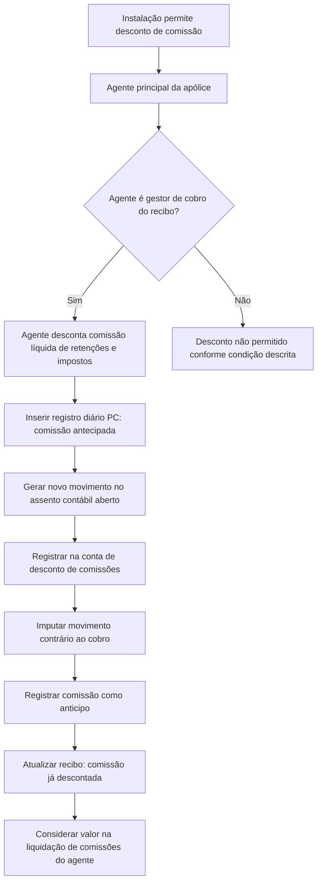

# Desconto de Comissão no Cobro de Recibo — Registro de Comissão Antecipada

## 1. Metadados do Documento
- **Arquivo de Origem:** `Não identificado no conteúdo fornecido`
- **Tipo de Documento:** `Especificação Técnica / Procedimento Funcional`
- **Domínio / Sistema:** `Cobro de recibos, comissões de agentes e contabilidade`
- **Público-Alvo:** `Operação, negócio, desenvolvedores e equipes contábeis`
- **Data/Versão Identificada:** `Não identificada`

---

## 2. Resumo Executivo & Contexto de Negócio

O documento descreve a funcionalidade de desconto de comissão no momento do cobro de um recibo. Cada instalação pode decidir se autoriza que o agente desconte, diretamente do valor entregue pelo cliente, a comissão associada ao recibo.

A comissão descontada pelo agente deve ser líquida de retenções e impostos. O valor é tratado contabilmente como um anticipo de comissão, permitindo que a liquidação posterior de comissões do agente considere o montante já recebido e o desconte da liquidação.

A elegibilidade para realizar o desconto é restrita ao agente principal da apólice, desde que esse agente também seja o gestor de cobro do recibo. O documento não detalha como a instalação configura essa permissão nem como o sistema valida as condições de agente principal e gestor de cobro.

O processo é automático e produz três efeitos principais: criação de um registro no diário contábil, registro do valor como anticipo de comissão e atualização do recibo para indicar que a comissão já foi descontada.

---

## 3. Arquitetura, Componentes & Tecnologias Envolvidas

O conteúdo fornecido não identifica tecnologias, APIs, microsserviços, bancos de dados, versões, URLs de ambiente ou contratos de integração. São mencionados apenas elementos funcionais e contábeis:

- Instalação configurável para permitir ou não o desconto de comissão.
- Agente principal da apólice.
- Gestor de cobro do recibo.
- Recibo.
- Movimento de cobro.
- Registro diário.
- Assento contábil aberto.
- Conta de desconto de comissões.
- Liquidação de comissões do agente.
- Informação do recibo atualizada.



> **Nota de Análise:** O documento não detalha métodos HTTP, eventos, interfaces, estruturas JSON, tabelas físicas, mecanismos de persistência ou regras técnicas de configuração por instalação.

---

## 4. Regras de Negócio, Especificações Funcionais & Processos

### 4.1 Objetivo funcional

O objetivo é registrar antecipadamente o cobro de comissão pelo agente da apólice quando o agente desconta a comissão no momento do cobro do recibo.

### 4.2 Regra de habilitação por instalação

Cada instalação pode decidir se permite que um agente desconte a comissão correspondente ao recibo no momento do cobro.

O documento não especifica:

- O parâmetro técnico que controla a habilitação.
- O valor padrão da configuração.
- Os perfis autorizados a alterar a configuração.
- A unidade organizacional exata representada por “instalação”.
- O comportamento do sistema quando a funcionalidade está desabilitada.

### 4.3 Regra de elegibilidade do agente

Somente o agente principal da apólice pode descontar a comissão, desde que também seja o gestor de cobro do recibo.

| Condição | Resultado |
| :--- | :--- |
| Agente é o agente principal da apólice e é o gestor de cobro do recibo | O desconto de comissão pode ocorrer, caso a instalação o permita. |
| Agente não é o agente principal da apólice | O documento estabelece que o desconto não pode ser realizado por esse agente. |
| Agente principal não é o gestor de cobro do recibo | O documento estabelece que o desconto não pode ser realizado. |

### 4.4 Cálculo e natureza do valor descontado

- O agente desconta diretamente a comissão do valor entregue pelo cliente.
- O valor da comissão é líquido de retenções e impostos.
- O documento classifica o movimento como um anticipo de comissão.
- Todos os importes são registrados na mesma moeda do recibo.
- O documento não informa fórmulas de cálculo, percentuais, impostos aplicáveis, tipos de retenção ou regras de arredondamento.

### 4.5 Registro no diário contábil

O processo insere um apontamento no registro diário. O apontamento identifica o movimento como comissão antecipada, com código `PC`.

O importe registrado no diário corresponde à comissão líquida de retenções e impostos.

### 4.6 Movimento no assento contábil

O apontamento de comissão antecipada é gerado como um novo movimento no assento contábil que estiver aberto. O movimento é registrado na conta de desconto de comissões e deve possuir sentido contrário ao movimento de cobro no qual ocorre o desconto.

| Cenário de cobro | Sentido do movimento de comissão antecipada |
| :--- | :--- |
| Cobro de recibo positivo | Deve (`D`) |
| Devolução de prima | Haber (`H`) |

### 4.7 Registro da comissão como anticipo

A comissão descontada é refletida como anticipo de comissão, utilizando as classificações descritas no documento:

- Tipo de devolução vencimento: `2`.
- Tipo de anticipo, montos: `3`.

O tipo de devolução vencimento `2` indica que o valor está sendo descontado no momento do cobro e não corresponde a um anticipo real.

O tipo de anticipo, montos `3` indica que o registro representa um importe e que o valor não foi calculado a partir de um percentual.

Na liquidação de comissões do agente, o importe registrado como anticipo deve ser considerado para desconto da liquidação.

### 4.8 Identificação do desconto no recibo

O movimento atualiza a informação do recibo para deixar registrado que a comissão já foi descontada.

O documento não especifica o campo, a flag, o estado, a tabela ou o atributo utilizado para armazenar essa indicação.

---

## 5. Tabelas de Parâmetros, Ambientes e Estruturas de Dados

| Item / Parâmetro | Descrição / Função | Tipo / Valores / Formato | Ambiente / Observações |
| :--- | :--- | :--- | :--- |
| Permissão por instalação | Define se o agente pode descontar a comissão no momento do cobro do recibo. | Permitido ou não permitido; valores técnicos não detalhados. | Configuração por instalação. |
| Agente principal da apólice | Agente elegível para descontar a comissão. | Condição funcional obrigatória. | Deve também ser gestor de cobro do recibo. |
| Gestor de cobro do recibo | Papel exigido para que o agente principal possa aplicar o desconto. | Condição funcional obrigatória. | O mecanismo de identificação não é detalhado. |
| Comissão descontada | Valor que o agente desconta diretamente do importe entregue pelo cliente. | Importe líquido de retenções e impostos. | Registrado na moeda do recibo. |
| Código de movimento | Identifica o apontamento no registro diário. | `PC` — comissão antecipada. | Inserido automaticamente. |
| Registro diário | Recebe o apontamento referente à comissão antecipada. | Novo apontamento. | O documento não detalha a estrutura do registro. |
| Assento contábil | Assento aberto que recebe o novo movimento de comissão antecipada. | Assento contábil aberto. | O critério de seleção do assento aberto não é detalhado. |
| Conta de desconto de comissões | Conta contábil utilizada para o novo movimento. | Conta contábil; código não informado. | Movimento possui sentido contrário ao cobro. |
| Sentido para recibo positivo | Sentido contábil da comissão quando o desconto ocorre no cobro de recibo positivo. | Deve (`D`). | Aplicado no novo movimento contábil. |
| Sentido para devolução de prima | Sentido contábil da comissão quando o desconto ocorre em devolução de prima. | Haber (`H`). | Aplicado no novo movimento contábil. |
| Tipo de devolução vencimento | Identifica que o desconto ocorre no momento do cobro e não como anticipo real. | `2`. | Aplicado ao anticipo de comissão. |
| Tipo de anticipo, montos | Indica que o anticipo representa um importe, sem cálculo por percentual. | `3`. | Aplicado ao anticipo de comissão. |
| Moeda do registro | Moeda usada para registrar os importes de comissão. | Mesma moeda do recibo. | Aplicável a todos os importes. |
| Indicador de comissão descontada | Informação atualizada no recibo para indicar que a comissão já foi descontada. | Campo ou estrutura não especificados. | Atualizado pelo movimento. |
| Liquidação de comissões | Processo que deve considerar o importe já descontado. | Desconto do importe na liquidação. | Regras de calendário e processamento não detalhadas. |

---

## 6. Bateria de Perguntas & Respostas para RAG (FAQ Sintético)

### P1: Qual é o objetivo do desconto de comissão no cobro de recibo?
**R:** O objetivo é registrar o cobro antecipado da comissão pelo agente da apólice. O agente desconta a comissão do valor entregue pelo cliente no momento do cobro, e esse valor é registrado como anticipo de comissão para ser considerado posteriormente na liquidação de comissões.

### P2: Qualquer agente da apólice pode descontar a comissão durante o cobro do recibo?
**R:** Não. Somente o agente principal da apólice pode realizar o desconto, e apenas quando esse agente também for o gestor de cobro do recibo.

### P3: A funcionalidade de desconto de comissão é obrigatória para todas as instalações?
**R:** Não. Cada instalação pode decidir se permite ou não que o agente desconte a comissão no momento do cobro do recibo. O documento não detalha o parâmetro técnico dessa configuração.

### P4: O valor da comissão antecipada é registrado com ou sem retenções e impostos?
**R:** O valor registrado corresponde à comissão líquida de retenções e impostos.

### P5: Qual código identifica o movimento de comissão antecipada no registro diário?
**R:** O movimento é identificado como comissão antecipada pelo código `PC`.

### P6: Em qual assento contábil é criado o movimento de desconto de comissão?
**R:** O apontamento é criado como um novo movimento no assento contábil que estiver aberto, utilizando a conta de desconto de comissões.

### P7: Qual é o sentido contábil do movimento quando a comissão é descontada de um recibo positivo?
**R:** Quando a comissão é descontada de um cobro de recibo positivo, o movimento de comissão antecipada é imputado no Deve (`D`), em sentido contrário ao movimento de cobro.

### P8: Qual é o sentido contábil do movimento em uma devolução de prima?
**R:** Quando o desconto de comissão ocorre em uma devolução de prima, o novo movimento é imputado no Haber (`H`), em sentido contrário ao movimento de cobro correspondente.

### P9: Em qual moeda a comissão descontada deve ser registrada?
**R:** Todos os importes, incluindo a comissão descontada e os movimentos associados, são registrados na moeda do recibo.

### P10: O que representa o tipo de devolução vencimento `2`?
**R:** O tipo de devolução vencimento `2` indica que o importe está sendo descontado no momento do cobro e que não se trata de um anticipo real.

### P11: O que representa o tipo de anticipo, montos `3`?
**R:** O tipo de anticipo, montos `3` indica que o registro representa um importe e que esse importe não foi calculado por um percentual.

### P12: Como o desconto de comissão afeta a liquidação de comissões do agente?
**R:** O importe descontado é registrado como anticipo de comissão. Na liquidação de comissões do agente, esse importe deve ser considerado para desconto da liquidação.

### P13: O recibo é atualizado após o desconto da comissão?
**R:** Sim. O movimento atualiza a informação do recibo para registrar que a comissão já foi descontada. O documento não informa qual campo ou estrutura armazena essa indicação.

---

## 7. Glossário de Termos, Siglas & Conceitos-Chave

- **PC:** Código que identifica o movimento de comissão antecipada no registro diário.
- **Agente principal da apólice:** Agente que pode descontar a comissão, desde que também seja gestor de cobro do recibo.
- **Gestor de cobro:** Papel associado ao recebimento do recibo; é uma condição necessária para que o agente principal possa descontar a comissão.
- **Cobro de recibo:** Processo de recebimento associado a um recibo.
- **Comissão antecipada:** Comissão descontada pelo agente no momento do cobro e registrada como anticipo.
- **Anticipo de comissão:** Registro da comissão já descontada, considerado posteriormente na liquidação de comissões.
- **Registro diário:** Registro que recebe o apontamento identificado como comissão antecipada.
- **Assento contábil:** Estrutura contábil aberta na qual é criado um novo movimento de comissão antecipada.
- **Conta de desconto de comissões:** Conta utilizada para imputar o movimento contábil relacionado ao desconto da comissão.
- **Deve (`D`):** Sentido de imputação indicado para o desconto de comissão em um cobro de recibo positivo.
- **Haber (`H`):** Sentido de imputação indicado para o desconto de comissão em uma devolução de prima.
- **Devolução de prima:** Cenário em que o movimento de comissão antecipada deve ser imputado no Haber (`H`).
- **Tipo de devolução vencimento (`2`):** Classificação que identifica um desconto no momento do cobro, e não um anticipo real.
- **Tipo de anticipo, montos (`3`):** Classificação que indica que o anticipo é um importe e não foi calculado por percentual.
- **Liquidação de comissões:** Processo no qual o importe antecipado deve ser descontado da liquidação do agente.

---

## 8. Notas Críticas, Riscos & Limitações

- O documento não identifica o nome do sistema, versão, data, proprietário funcional ou arquivo de origem.
- A configuração que permite o desconto por instalação é citada, mas não possui nome de parâmetro, valores possíveis, regras de administração ou comportamento padrão.
- Não são detalhados os mecanismos de validação para confirmar que o agente é simultaneamente agente principal da apólice e gestor de cobro do recibo.
- O documento não apresenta fórmula de cálculo da comissão, alíquotas, percentuais, impostos, retenções, arredondamentos ou tratamento de divergências.
- Não são fornecidos códigos da conta de desconto de comissões, plano contábil, critérios para seleção do assento aberto ou estratégia de erro quando não houver assento aberto.
- Não há detalhamento sobre reversão, estorno, reprocessamento, duplicidade de desconto, concorrência, auditoria ou trilha de alterações.
- O campo ou estrutura que marca o recibo como “comissão já descontada” não é identificado.
- O documento não detalha como a liquidação de comissões consome o anticipo registrado.
- Não há endpoints, contratos de integração, bancos de dados, tecnologias, ambientes ou requisitos não funcionais descritos.

---

## 9. Conteúdo Bruto Estruturado (Referência Fiel)

```text
--- [PÁGINA 1 DE 2] ---

EN CONSTRUCCIÓN
DESCONTAR comisión en el cobro de recibo
(enlace con visión técnica)
¿En qué consiste?
Cada instalación podrá decidir si permite que un agente se descuente la comisión, correspondiente al
recibo, en el momento del cobro. En este caso, el agente descuenta directamente la comisión, neta
de retención, del importe entregado por el cliente, considerándose este movimiento como un anticipo
de comisión.
Solamente podrá descontarse la comisión el agente principal de la póliza, siempre que sea el gestor
de cobro del recibo.
Objetivo
Registrar el cobro de la comisión, por parte del agente de la póliza, de forma anticipada.
Proceso a seguir
El proceso comprende los siguientes pasos que se hacen de forma automática:
Insertar registro diario
Se realiza un apunte en el registro diario, identificando el movimiento como comisión anticipada (PC),
el importe de la comisión que se registra es neto de retenciones e impuestos.
 / 
 CF
Home Solutions APIs Documentation Zeus
EN


--- [PÁGINA 2 DE 2] ---

Este apunte se generará como un nuevo movimiento en el asiento contable que esté abierto, en la
cuenta de descuento de comisiones, imputado de forma contraria al movimiento al movimiento de
cobro en el que se realiza el descuento, es decir, en el Debe (D) cuando la comisión se descuenta
del cobro de un recibo positivo, o en el Haber (H) cuando se trata de una devolución de prima.
Los importes se registran siempre en la moneda del recibo.
Registrar comisiones como anticipo
La comisión descontada se refleja como un anticipo de comisión, identificado como tipo de
devolución vencimiento (2), que refleja que este importe se está descontando en el momento del
cobro y no como un anticipo real, y tipo de anticipo, montos (3) que indica que es un importe y no se
ha calculado por un porcentaje. De esta forma, en la liquidación de comisiones del agente, se tendrá
en cuenta este importe para descontarlo de la liquidación.
Identificar descuento de comisión en recibo
En este movimiento, se actualiza la información del recibo para dejar reflejado que la comisión ya ha
sido descontada.
```
