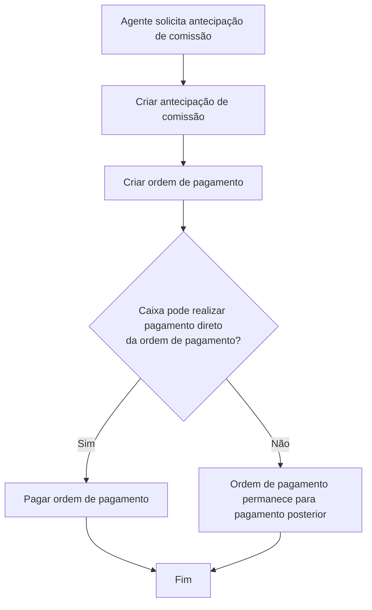

# Criação de Antecipação de Comissão e Ordem de Pagamento

## 1. Metadados do Documento
- **Arquivo de Origem:** Não identificado
- **Tipo de Documento:** Procedimento
- **Domínio / Sistema:** Antecipação de comissão para agentes / ordens de pagamento
- **Público-Alvo:** Operação, negócio, analistas funcionais e equipes responsáveis por ordens de pagamento
- **Data/Versão Identificada:** Não identificada

---

## 2. Resumo Executivo & Contexto de Negócio

O documento descreve a operação de **criação de antecipação de comissão** para agentes. A operação permite que um agente solicite o pagamento antecipado de determinado valor que será descontado ou devolvido posteriormente conforme o acordo realizado na solicitação da antecipação.

O pagamento ao agente ocorre por meio de uma **ordem de pagamento**. Portanto, a criação da antecipação de comissão implica a geração da ordem de pagamento correspondente ao valor antecipado.

O pagamento da ordem de pagamento pode ocorrer posteriormente. Há uma exceção operacional: caso o caixa tenha capacidade para realizar o pagamento direto de ordens de pagamento, a mesma operação pode criar e pagar a ordem de pagamento.

O fluxo apresentado é composto por três etapas: criar a antecipação de comissão, criar a ordem de pagamento e, condicionalmente, pagar a ordem de pagamento. O documento não detalha interfaces, dados obrigatórios, validações, métodos, contratos de integração ou regras de devolução da antecipação.

---

## 3. Arquitetura, Componentes & Tecnologias Envolvidas

Os componentes e conceitos explicitamente citados são:

- **Agente:** entidade que solicita o pagamento antecipado de um valor a conta de suas comissões.
- **Antecipação de comissão:** operação que cria o pagamento antecipado solicitado pelo agente.
- **Ordem de pagamento:** mecanismo pelo qual os pagamentos aos agentes são realizados.
- **Caixa / cajero:** componente ou função operacional que pode realizar pagamento direto de ordens de pagamento.
- **Home Solutions APIs Documentation Zeus:** texto presente no rodapé da extração; o documento não explica se representa uma plataforma, sistema, portal ou repositório documental.
- **CF:** sigla exibida no documento, sem definição adicional.



**Nota de Análise:** O documento apresenta um fluxo funcional de criação e eventual pagamento da ordem de pagamento, mas não detalha sistemas, APIs, protocolos, ambientes, tecnologias, métodos HTTP ou contratos JSON.

---

## 4. Regras de Negócio, Especificações Funcionais & Processos

### Finalidade da operação

A operação de criação de antecipação de comissão permite que um agente solicite o pagamento antecipado de um importe a conta de suas comissões.

### Obrigação de devolução

O agente deverá devolver posteriormente o valor antecipado conforme a forma acordada no momento da solicitação da antecipação.

### Regra de geração da ordem de pagamento

Os pagamentos destinados aos agentes são realizados sempre por meio de ordens de pagamento. Consequentemente, a criação de uma antecipação de comissão deve gerar a ordem de pagamento correspondente ao pagamento da antecipação.

### Regra de pagamento da ordem

O pagamento da ordem de pagamento ocorre em momento posterior à sua criação, exceto quando o caixa puder efetuar o pagamento direto de ordens de pagamento.

### Condição de pagamento direto

Se o caixa puder realizar o pagamento direto da ordem de pagamento, a ordem de pagamento criada para a antecipação deve ficar paga na própria operação.

### Fluxo operacional

1. Criar a antecipação de comissão.
2. Criar a ordem de pagamento correspondente.
3. Avaliar se existe pagamento direto da ordem de pagamento pelo caixa.
4. Se houver pagamento direto, pagar a ordem de pagamento na mesma operação.
5. Se não houver pagamento direto, a ordem de pagamento será paga em outro momento.

**Nota de Análise:** O documento não informa critérios para aprovação da antecipação, limites monetários, cálculo de comissões, método de devolução, prazo de devolução, perfis autorizados, estados da ordem de pagamento ou tratamento de erros.

---

## 5. Tabelas de Parâmetros, Ambientes e Estruturas de Dados

| Item / Parâmetro | Descrição / Função | Tipo / Valores / Formato | Ambiente / Observações |
| :--- | :--- | :--- | :--- |
| Agente | Solicita o pagamento antecipado de um valor a conta de suas comissões. | Entidade de negócio | O documento não detalha identificação, perfil ou elegibilidade do agente. |
| Antecipação de comissão | Operação para solicitar e criar o pagamento antecipado. | Operação de negócio | O valor será devolvido posteriormente conforme acordo realizado na solicitação. |
| Importe antecipado | Valor solicitado antecipadamente pelo agente. | Valor monetário; formato não informado | O documento não define limites, moeda, cálculo ou validações. |
| Comissão | Base à qual o pagamento antecipado está associado. | Conceito de negócio | O documento não detalha cálculo, saldo ou regras de compensação. |
| Ordem de pagamento | Instrumento obrigatório para realizar pagamentos a agentes. | Registro ou documento de pagamento; estrutura não informada | Deve ser criada como parte da operação de antecipação. |
| Pagamento direto | Pagamento da ordem realizado pelo caixa na mesma operação. | Condição Sim/Não | Aplicável quando o caixa pode pagar diretamente ordens de pagamento. |
| Caixa / cajero | Responsável ou capacidade operacional para pagamento direto da ordem. | Papel ou componente; não detalhado | Não são descritos permissões, sistema ou processo de caixa. |
| Home Solutions APIs Documentation Zeus | Texto exibido na extração do documento. | Referência não classificada | Sem detalhamento adicional no conteúdo disponível. |
| CF | Sigla exibida no documento. | Não identificado | Sem definição no conteúdo disponível. |

---

## 6. Bateria de Perguntas & Respostas para RAG (FAQ Sintético)

### P1: Em que consiste a operação de criação de antecipação de comissão?
**R:** A operação permite que um agente solicite o pagamento antecipado de um valor a conta de suas comissões. O valor antecipado deverá ser devolvido posteriormente de acordo com a forma combinada quando a antecipação foi solicitada.

### P2: Quem pode solicitar uma antecipação de comissão?
**R:** O documento informa que um agente pode solicitar o pagamento antecipado de um importe a conta de suas comissões. Não há detalhamento sobre perfis, permissões ou critérios de elegibilidade do agente.

### P3: Como os pagamentos aos agentes são realizados?
**R:** Os pagamentos aos agentes são realizados sempre por meio de ordens de pagamento. Por isso, a operação de antecipação de comissão gera uma ordem de pagamento correspondente ao valor antecipado.

### P4: A criação da antecipação de comissão gera uma ordem de pagamento?
**R:** Sim. Como os pagamentos aos agentes ocorrem por ordens de pagamento, a operação de criação de antecipação gera a ordem de pagamento correspondente ao pagamento do anticipo.

### P5: A ordem de pagamento é sempre paga no momento em que é criada?
**R:** Não. O documento determina que o pagamento da ordem será realizado em outro momento, exceto quando o caixa puder realizar o pagamento direto de ordens de pagamento.

### P6: O que acontece se o caixa puder realizar pagamento direto da ordem de pagamento?
**R:** Quando o caixa puder realizar o pagamento direto de ordens de pagamento, a ordem gerada pela antecipação será paga na própria operação.

### P7: Qual é a sequência do processo de antecipação de comissão?
**R:** A sequência apresentada é: criar a antecipação de comissão, criar a ordem de pagamento e verificar se existe pagamento direto da ordem. Se houver pagamento direto, a ordem é paga; caso contrário, o pagamento ocorrerá posteriormente.

### P8: Como o agente devolve o valor da antecipação de comissão?
**R:** O documento informa somente que o agente devolverá o valor da forma acordada ao solicitar a antecipação. Não são especificados método, prazo, parcelas, compensação em comissão ou regras de cobrança.

### P9: O documento define o valor máximo que um agente pode antecipar?
**R:** Não. O documento menciona um importe antecipado, mas não define limites, moedas, fórmulas de cálculo, saldos de comissão exigidos ou regras de validação.

### P10: Quais tecnologias ou APIs são usadas para criar ou pagar a ordem de pagamento?
**R:** O conteúdo disponível não detalha tecnologias, APIs, endpoints, métodos HTTP, contratos JSON, sistemas de integração ou ambientes. A expressão “Home Solutions APIs Documentation Zeus” aparece no documento, mas não recebe explicação adicional.

---

## 7. Glossário de Termos, Siglas & Conceitos-Chave

- **Antecipação de comissão / anticipo comisión:** pagamento antecipado solicitado por um agente a conta de suas comissões.
- **Agente:** entidade que solicita a antecipação de comissão.
- **Comissão:** referência financeira associada ao valor antecipado pelo agente.
- **Ordem de pagamento / orden de pago:** mecanismo utilizado para realizar pagamentos aos agentes.
- **Pagamento direto / pago directo:** pagamento da ordem de pagamento durante a própria operação, quando o caixa possui essa capacidade.
- **Caixa / cajero:** papel ou capacidade operacional capaz de realizar pagamento direto de ordens de pagamento.
- **CF:** sigla presente na extração sem significado definido.
- **Home Solutions APIs Documentation Zeus:** expressão presente no rodapé da extração sem definição no conteúdo fornecido.

---

## 8. Notas Críticas, Riscos & Limitações

- O documento não identifica o arquivo de origem, versão, data, autoria ou sistema proprietário do processo.
- Não são descritos dados de entrada, campos obrigatórios, estruturas de dados, telas, APIs, endpoints ou contratos de integração.
- Não há definição de limites para o importe antecipado, moeda, cálculo de comissão, aprovação, elegibilidade ou tratamento de saldo insuficiente.
- O mecanismo de devolução da antecipação é mencionado, mas não há detalhamento sobre prazo, forma de cobrança, parcelamento ou compensação com comissões futuras.
- Não há descrição de estados da ordem de pagamento, reversão, cancelamento, auditoria, idempotência ou tratamento de falhas.
- A capacidade do caixa de efetuar pagamento direto é uma condição decisiva no fluxo, mas o documento não define como essa capacidade é identificada ou validada.
- A referência a “Home Solutions APIs Documentation Zeus” não permite concluir a existência de uma API, arquitetura específica ou integração técnica.

---

## 9. Conteúdo Bruto Estruturado (Referência Fiel)

```text
--- [PÁGINA 1 DE 2] ---

EN CONSTRUCCIÓN
CREAR anticipo comisión
¿En que consiste?
Esta operación permite que un agente solicite el pago anticipado de un importe, a cuenta de sus
comisiones, que posteriormente devolverá de la forma que haya acordado al solicitar el anticipo.
Premisas
Los pagos que se hacen a los agentes, se hacen siempre a través de órdenes de pago, por tanto, en
esta operación se genera la orden de pago correspondiente al pago del anticipo.El pago de dicha
orden se hará en otro momento, a no ser que el cajero pueda realizar el pago directo de órdenes de
pago, en cuyo caso, la orden quedará pagada en esta misma operación.
Proceso a seguir
SI
NO
1. CREAR anticipo
comisión
2. CREAR orden
de pago
¿Pago directo
de la
orden de pago? 3. PAGAR orden
de pago
FIN
 /
 CF
Home Solutions APIs Documentation Zeus
EN


--- [PÁGINA 2 DE 2] ---

1. CREAR anticipo comisión
2. CREAR order de pago
3. PAGAR order de pago
```
