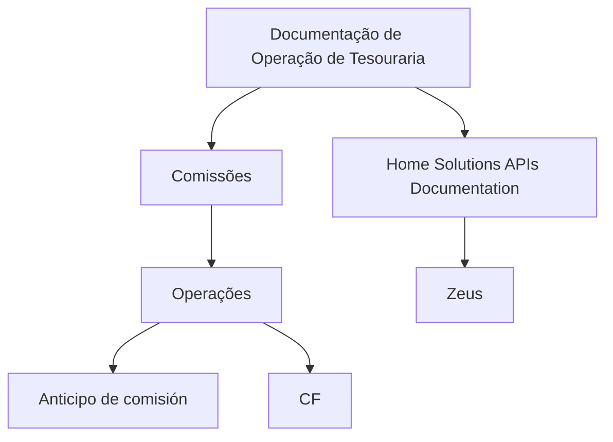

# Documentação de Operação de Tesouraria — Comissões (Conteúdo Parcial Extraído)

## 1. Metadados do Documento
- **Arquivo de Origem:** Não identificado
- **Tipo de Documento:** Procedimento
- **Domínio / Sistema:** Tesouraria — Comissões
- **Público-Alvo:** Operação
- **Data/Versão Identificada:** Não identificada

---

## 2. Resumo Executivo & Contexto de Negócio

O conteúdo fornecido apresenta uma referência a uma documentação de operação para o domínio de **Tesouraria**, especificamente relacionada a **Comissões**. O texto identifica os termos “OPERACIONES”, “Anticipo de comisión” e “CF”, sugerindo tópicos operacionais associados ao tratamento de antecipação de comissão.

A extração também cita “Home Solutions APIs Documentation Zeus”, mas não descreve a finalidade dessa documentação, os serviços envolvidos, contratos de integração, métodos HTTP, URLs, autenticação ou formatos de dados.

O material possui conteúdo extremamente resumido e inclui a indicação “EN CONSTRUCCIÓN”. Portanto, não há detalhamento suficiente para estabelecer regras de negócio, arquitetura técnica, responsabilidades operacionais, parâmetros ou procedimentos executáveis.

**Nota de Análise:** o conteúdo cita Tesouraria, Comissões, Anticipo de comisión, CF, Home Solutions, APIs Documentation e Zeus, porém não define os significados, relações ou comportamentos desses termos.

---

## 3. Arquitetura, Componentes & Tecnologias Envolvidas

Os seguintes elementos são mencionados no conteúdo bruto:

| Componente / Termo | Evidência no conteúdo | Detalhamento disponível |
| :--- | :--- | :--- |
| Tesouraria | “DOCUMENTACIÓN de OPERACIÓN de TESORERÍA (Comisiones)” | Associada à documentação operacional de comissões. |
| Comissões | “TESORERÍA (Comisiones)” | Não há regras, cálculo ou fluxo descritos. |
| Operações | “OPERACIONES” | Não há lista ou descrição das operações. |
| Anticipo de comisión | “Anticipo de comisión” | Mencionado sem detalhamento funcional ou operacional. |
| CF | “CF” | Sigla não expandida no conteúdo. |
| Home Solutions | “Home Solutions APIs Documentation” | Não há descrição do sistema ou produto. |
| APIs Documentation | “Home Solutions APIs Documentation” | Não há endpoints, contratos ou especificações expostos. |
| Zeus | “Zeus” | Não há descrição do papel, tecnologia ou integração. |



**Nota de Análise:** o diagrama representa somente associações textuais presentes na extração. O documento não confirma fluxo de integração, direção de chamadas, dependências técnicas ou troca de dados entre Tesouraria, Home Solutions e Zeus.

---

## 4. Regras de Negócio, Especificações Funcionais & Processos

O conteúdo bruto não apresenta regras de negócio, critérios de elegibilidade, fórmulas de comissão, políticas de aprovação, condições de erro, responsabilidades por etapa ou procedimentos operacionais.

Os tópicos identificados são:

1. **Comissões:** citadas no título da documentação de operação de Tesouraria.
2. **Operações:** citadas como uma seção ou categoria, sem detalhamento.
3. **Anticipo de comisión:** citado como uma operação ou assunto, sem definição de entrada, saída, validação ou processamento.
4. **CF:** citado isoladamente, sem expansão da sigla ou descrição.
5. **Home Solutions APIs Documentation Zeus:** citado como texto de navegação, referência documental ou sistema relacionado, sem especificação adicional.

**Nota de Análise:** não é possível derivar processos passo a passo, regras de cálculo ou requisitos funcionais com fidelidade a partir do conteúdo fornecido.

---

## 5. Tabelas de Parâmetros, Ambientes e Estruturas de Dados

| Item / Parâmetro | Descrição / Função | Tipo / Valores / Formato | Ambiente / Observações |
| :--- | :--- | :--- | :--- |
| Tesouraria | Domínio mencionado no título da documentação. | Não informado | Associado a comissões. |
| Comisiones | Tema associado à Tesouraria. | Não informado | O conteúdo não descreve cálculo ou processamento. |
| OPERACIONES | Texto que indica operações. | Não informado | Não há operações enumeradas. |
| Anticipo de comisión | Operação ou tópico citado no conteúdo. | Não informado | Sem fluxo, critérios ou contrato descritos. |
| CF | Sigla citada. | Não informado | Significado não identificado. |
| Home Solutions | Nome citado na expressão “Home Solutions APIs Documentation”. | Não informado | Papel não detalhado. |
| APIs Documentation | Referência a documentação de APIs. | Não informado | Não há URLs, métodos, payloads ou autenticação. |
| Zeus | Nome citado no conteúdo. | Não informado | Relação com os demais termos não detalhada. |
| Estado do documento | Indicação de construção incompleta. | “EN CONSTRUCCIÓN” | Sugere material não finalizado. |

---

## 6. Bateria de Perguntas & Respostas para RAG (FAQ Sintético)

### P1: Qual é o domínio principal da documentação fornecida?
**R:** O domínio principal identificado é **Tesouraria**, com foco em **Comissões**, conforme o texto “DOCUMENTACIÓN de OPERACIÓN de TESORERÍA (Comisiones)”.

### P2: Qual operação relacionada a comissões é mencionada no documento?
**R:** O conteúdo menciona **“Anticipo de comisión”**. Não há descrição adicional sobre o objetivo da operação, critérios de execução, etapas, responsáveis ou dados processados.

### P3: O documento especifica como calcular comissões?
**R:** Não. O conteúdo apenas menciona Tesouraria e Comissões, sem apresentar fórmulas, taxas, percentuais, bases de cálculo, periodicidade ou regras de arredondamento.

### P4: O que significa a sigla CF no contexto do documento?
**R:** O significado de **CF** não é identificado no conteúdo fornecido. A sigla aparece isoladamente, sem expansão ou contexto operacional adicional.

### P5: Quais APIs são documentadas para Home Solutions?
**R:** O conteúdo contém a expressão “Home Solutions APIs Documentation Zeus”, mas não identifica APIs específicas, endpoints, métodos HTTP, contratos JSON, mecanismos de autenticação ou ambientes.

### P6: Qual é o papel de Zeus na operação de Tesouraria?
**R:** O papel de **Zeus** não é detalhado. O termo é citado junto de “Home Solutions APIs Documentation”, sem evidência suficiente para afirmar se Zeus é uma aplicação, ambiente, módulo, serviço ou repositório documental.

### P7: O documento apresenta um fluxo operacional para antecipação de comissão?
**R:** Não. “Anticipo de comisión” é mencionado, mas não há sequência de etapas, regras de aprovação, eventos de entrada, sistemas envolvidos ou tratamento de exceções.

### P8: Há informações de ambiente, servidor, URL ou credenciais?
**R:** Não. O conteúdo fornecido não inclui URLs, nomes de servidores, portas, variáveis de configuração, usuários, credenciais ou instruções de acesso.

### P9: O documento está concluído?
**R:** O texto inclui a expressão **“EN CONSTRUCCIÓN”**, indicando que o material estava em construção ou não possuía conteúdo completo na extração disponibilizada.

### P10: Quem é o público-alvo identificado para a documentação?
**R:** O título indica que o material é uma “DOCUMENTACIÓN de OPERACIÓN”, portanto o público mais diretamente inferível é a área de Operação. Não há indicação explícita de equipes, cargos ou perfis adicionais.

---

## 7. Glossário de Termos, Siglas & Conceitos-Chave

- **Tesouraria:** domínio mencionado no título do documento; o conteúdo não detalha seu escopo.
- **Comisiones / Comissões:** tema associado à documentação de Tesouraria; não há definição de cálculo ou processamento.
- **OPERACIONES / Operações:** termo citado como seção ou categoria; operações específicas não são descritas.
- **Anticipo de comisión:** expressão citada no conteúdo; aparenta representar uma operação ou tópico de antecipação de comissão, sem detalhamento adicional.
- **CF:** sigla não definida no conteúdo.
- **Home Solutions:** nome citado em “Home Solutions APIs Documentation”; não há descrição do sistema.
- **APIs Documentation:** referência a documentação de APIs; não há especificações técnicas disponíveis.
- **Zeus:** termo citado sem definição contextual.
- **EN CONSTRUCCIÓN:** expressão em espanhol que indica que o material está em construção.

---

## 8. Notas Críticas, Riscos & Limitações

- O conteúdo extraído é insuficiente para documentar uma arquitetura técnica, processo operacional ou regra de negócio completa.
- Não há definição para a sigla **CF**.
- Não há contratos de API, endpoints, URLs, métodos HTTP, payloads, autenticação ou códigos de erro.
- Não há detalhamento sobre o relacionamento entre **Home Solutions**, **APIs Documentation** e **Zeus**.
- Não há informações sobre cálculo, aprovação, contabilização ou liquidação de comissões.
- A indicação **“EN CONSTRUCCIÓN”** representa risco de incompletude documental.
- Não foram disponibilizadas notas de apresentador, páginas adicionais, imagens interpretáveis ou metadados do arquivo original.

---

## 9. Conteúdo Bruto Estruturado (Referência Fiel)

```text
--- [PÁGINA 1 DE 1] ---

EN CONSTRUCCIÓN
DOCUMENTACIÓN de OPERACIÓN de
TESORERÍA (Comisiones)
Imagen comisiones
OPERACIONES
Anticipo de comisión
 /
 CF
Home Solutions APIs Documentation Zeus
EN
```
