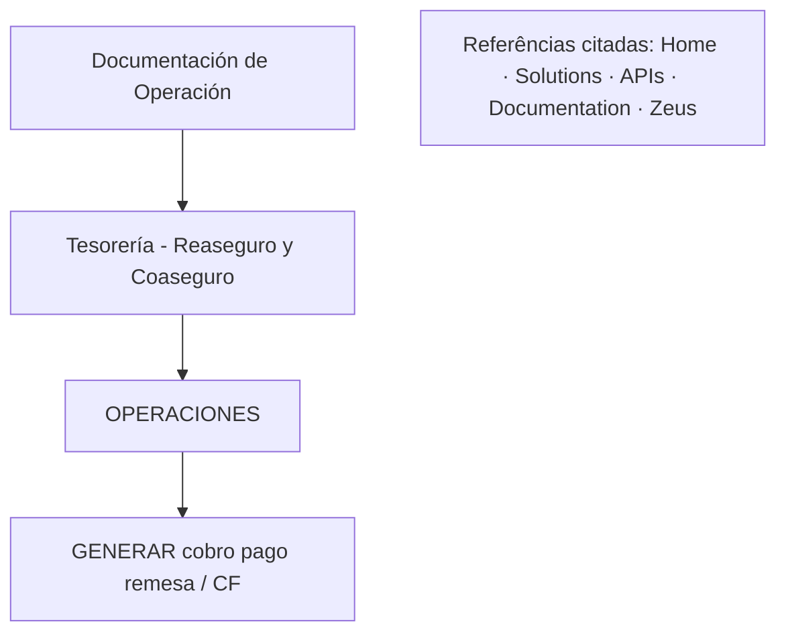

# Documentação de Operação de Tesorería — Reaseguro y Coaseguro: Gerar Cobro/Pago de Remesa / CF

## 1. Metadados do Documento
- **Arquivo de Origem:** Não identificado
- **Tipo de Documento:** Manual Operacional
- **Domínio / Sistema:** Tesorería — Reaseguro y Coaseguro; OPERACIONES
- **Público-Alvo:** Operação
- **Data/Versão Identificada:** Não identificada

---

## 2. Resumo Executivo & Contexto de Negócio

O conteúdo identifica uma documentação de operação do domínio **TESORERÍA - REASEGURO Y COASEGURO**, associada ao contexto de **OPERACIONES** e ao tópico **GENERAR cobro pago remesa / CF**.

A indicação **EN CONSTRUCCIÓN** demonstra que o material estava em elaboração. A fonte não apresenta objetivo operacional detalhado, responsáveis, critérios de processamento, instruções executáveis, entradas, saídas ou exceções do processo de geração de cobranças, pagamentos ou remessas.

O documento também contém os termos **Home**, **Solutions**, **APIs**, **Documentation** e **Zeus**. A extração não permite determinar se esses termos representam sistemas, menus, portais, produtos, componentes técnicos, equipes ou referências de navegação.

Não foram identificadas regras de negócio, cálculos, contratos de integração, URLs, ambientes, servidores, rotas de log ou procedimentos operacionais detalhados. Esta análise preserva exclusivamente as associações confirmadas pelo conteúdo de origem.

---

## 3. Arquitetura, Componentes & Tecnologias Envolvidas

A fonte cita **TESORERÍA - REASEGURO Y COASEGURO**, **OPERACIONES**, **GENERAR cobro pago remesa / CF**, **Home**, **Solutions**, **APIs**, **Documentation** e **Zeus**. Não há arquitetura de software, tecnologias, integrações, protocolos, ambientes ou fluxo de dados formalmente descritos.



> **Nota de Análise:** O documento cita “APIs” e “Zeus”, porém não detalha métodos HTTP, contratos JSON, endpoints, autenticação, ambientes ou integração com Tesorería — Reaseguro y Coaseguro.

---

## 4. Regras de Negócio, Especificações Funcionais & Processos

### Tópicos funcionais identificados

1. O material é denominado **DOCUMENTACIÓN de OPERACIÓN de TESORERÍA - REASEGURO Y COASEGURO**.
2. O contexto ou área **OPERACIONES** é explicitamente mencionado.
3. O tópico **GENERAR cobro pago remesa / CF** é explicitamente mencionado.
4. O estado **EN CONSTRUCCIÓN** é explicitamente mencionado.

### Detalhamento disponível

A fonte não define etapas, pré-condições, pós-condições, responsáveis, eventos de entrada, saídas, exceções, aprovações, cálculos, validações, regras de elegibilidade ou critérios de processamento para **GENERAR cobro pago remesa / CF**.

O conteúdo não separa nem define os termos **cobro**, **pago** e **remesa**. Portanto, não é possível afirmar se são etapas distintas, ações alternativas ou um único processo. A sigla **CF** também não é definida.

---

## 5. Tabelas de Parâmetros, Ambientes e Estruturas de Dados

| Item / Parâmetro | Descrição / Função | Tipo / Valores / Formato | Ambiente / Observações |
| :--- | :--- | :--- | :--- |
| Estado do documento | Indica que a documentação está em elaboração. | `EN CONSTRUCCIÓN` | Não há versão, data ou ambiente identificado. |
| Domínio | Área identificada no título da documentação. | `TESORERÍA - REASEGURO Y COASEGURO` | Não há escopo funcional detalhado. |
| Contexto operacional | Área ou seção mencionada no conteúdo bruto. | `OPERACIONES` | Não há responsáveis nem procedimento associado. |
| Tópico operacional | Assunto citado no documento. | `GENERAR cobro pago remesa / CF` | Não há fluxo, regras nem definição de `CF`. |
| Referência visual | Menção a uma imagem relacionada ao domínio. | `Imagen reaseguro-coaseguro` | A imagem não está disponível na extração textual. |
| Referências citadas | Termos presentes no conteúdo bruto. | `Home`, `Solutions`, `APIs`, `Documentation`, `Zeus` | Relação funcional, técnica ou organizacional não detalhada. |
| Fragmento adicional | Fragmento presente no conteúdo bruto. | `EN` | Sem contexto adicional na fonte. |

---

## 6. Bateria de Perguntas & Respostas para RAG (FAQ Sintético)

### P1: Qual é o domínio principal da documentação apresentada?
**R:** O domínio principal identificado é **TESORERÍA - REASEGURO Y COASEGURO**. O conteúdo não detalha os processos, sistemas ou componentes internos desse domínio.

### P2: Qual é o estado da documentação de operação de Tesorería?
**R:** A documentação está identificada como **EN CONSTRUCCIÓN**. A fonte não informa versão, data de conclusão, proprietário ou cronograma.

### P3: Qual operação é mencionada no documento?
**R:** A operação mencionada é **GENERAR cobro pago remesa / CF**. O documento não descreve seu fluxo, suas regras, suas aprovações ou seus critérios de execução.

### P4: O documento explica como gerar um cobro, pago ou remesa?
**R:** Não. A fonte somente cita “GENERAR cobro pago remesa / CF”, sem apresentar passos, entradas, saídas, validações, responsáveis, exceções ou evidências de conclusão.

### P5: A documentação diferencia cobro, pago e remesa?
**R:** Não. Os termos aparecem juntos no tópico operacional e não possuem definições individuais. Não é possível confirmar se representam transações, etapas ou alternativas do processo.

### P6: O significado de CF está definido?
**R:** Não. A sigla **CF** aparece somente na expressão “GENERAR cobro pago remesa / CF” e não recebe expansão ou explicação.

### P7: Existem APIs descritas para gerar cobro, pago ou remesa?
**R:** Não. Embora o termo **APIs** seja citado, não há endpoints, métodos HTTP, contratos, autenticação, mensagens de erro ou relação técnica confirmada com a operação mencionada.

### P8: Quais referências aparecem além de Tesorería e OPERACIONES?
**R:** A extração contém **Home**, **Solutions**, **APIs**, **Documentation** e **Zeus**. A fonte não determina se são sistemas, produtos, menus, portais, serviços ou equipes.

### P9: O documento apresenta ambientes, URLs, servidores ou logs?
**R:** Não. Não foram extraídos URLs, ambientes, servidores, portas, caminhos de log, variáveis de configuração ou procedimentos de diagnóstico.

### P10: O que a menção “Imagen reaseguro-coaseguro” acrescenta ao processo?
**R:** A menção indica a existência de uma imagem relacionada a reaseguro e coaseguro, mas o conteúdo visual não está presente na extração. Nenhuma regra ou fluxo pode ser inferido a partir dela.

### P11: Qual fluxo operacional pode ser confirmado?
**R:** Somente pode ser confirmada a associação textual entre a documentação de operação, **TESORERÍA - REASEGURO Y COASEGURO**, **OPERACIONES** e o tópico **GENERAR cobro pago remesa / CF**. Não há sequência operacional formal descrita.

---

## 7. Glossário de Termos, Siglas & Conceitos-Chave

- **Tesorería:** Termo citado como domínio da documentação, associado a Reaseguro y Coaseguro.
- **Reaseguro:** Termo presente no título do domínio; não definido na fonte.
- **Coaseguro:** Termo presente no título do domínio; não definido na fonte.
- **OPERACIONES:** Termo citado em maiúsculas; a fonte não define área, equipe ou processo correspondente.
- **GENERAR cobro pago remesa:** Tópico operacional citado; não possui fluxo ou regras especificados.
- **CF:** Sigla citada ao lado do tópico operacional; significado não definido.
- **APIs:** Termo citado sem especificação de interfaces de programação.
- **Zeus:** Termo citado sem definição de função, sistema ou relacionamento.
- **EN CONSTRUCCIÓN:** Indicação de que o documento está em elaboração.

---

## 8. Notas Críticas, Riscos & Limitações

- A fonte é extremamente resumida e marcada como **EN CONSTRUCCIÓN**.
- Não há procedimento operacional executável para gerar cobro, pago ou remesa.
- O significado de **CF** é desconhecido, gerando ambiguidade para busca e interpretação.
- A referência à imagem não contém conteúdo visual recuperável.
- Os termos Home, Solutions, APIs, Documentation e Zeus não possuem contexto verificável.
- Não há dados sobre ambientes, integrações, segurança, logs, dependências ou critérios de aprovação.

---

## 9. Conteúdo Bruto Estruturado (Referência Fiel)

```text
--- [PÁGINA 1 DE 1] ---

EN CONSTRUCCIÓN
DOCUMENTACIÓN de OPERACIÓN de
TESORERÍA - REASEGURO Y COASEGURO
Imagen reaseguro-coaseguro
OPERACIONES
GENERAR cobro pago remesa
 /
 CF
Home Solutions APIs Documentation Zeus
EN
```
