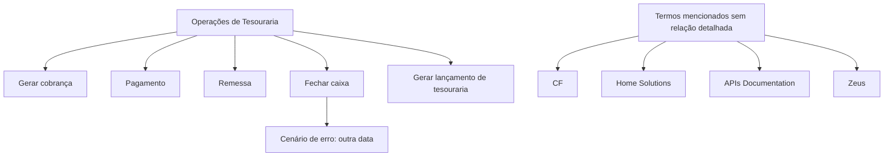

# Documentação de Operação de Tesouraria — Fechamento de Caixa

## 1. Metadados do Documento
- **Arquivo de Origem:** `Não identificado`
- **Tipo de Documento:** `Manual Operacional`
- **Domínio / Sistema:** `Tesouraria / Fechamento de Caixa`
- **Público-Alvo:** `Operação`
- **Data/Versão Identificada:** `Não identificada`

---

## 2. Resumo Executivo & Contexto de Negócio

O documento apresenta uma documentação de operação para o processo de **Tesouraria — Fechamento de Caixa**. O material está marcado como **“EN CONSTRUCCIÓN”**, indicando que o conteúdo encontra-se em construção ou não está finalizado.

O escopo operacional listado inclui geração de cobrança, pagamento, remessa, fechamento de caixa, tratamento de erro relacionado a outra data e geração de lançamento contábil de tesouraria.

O documento também menciona os termos **CF**, **Home Solutions**, **APIs Documentation** e **Zeus**, sem explicar as relações funcionais, técnicas ou organizacionais entre esses elementos.

Não há detalhamento sobre pré-requisitos, responsáveis, permissões, telas, APIs, regras de cálculo, formatos de arquivo, contratos de integração ou critérios de sucesso para as operações listadas.

---

## 3. Arquitetura, Componentes & Tecnologias Envolvidas

### Componentes, sistemas e termos identificados

| Componente / Termo | Papel identificado no documento | Detalhamento disponível |
| :--- | :--- | :--- |
| Tesouraria | Domínio do processo de fechamento de caixa | O documento não detalha módulos ou regras do domínio |
| Fechamento de Caixa | Processo operacional central | São listadas operações de fechamento e um cenário de erro por outra data |
| Operações | Seção que agrupa atividades de tesouraria | Não há fluxo detalhado |
| Cobro | Operação listada como “GENERAR cobro” | Não há definição adicional |
| Pago | Operação listada como “pago” | Não há definição adicional |
| Remesa | Operação listada como “remesa” | Não há definição adicional |
| Asiento tesorería | Operação de geração de lançamento de tesouraria | Não há detalhamento contábil ou técnico |
| CF | Termo mencionado no rodapé | Significado não identificado |
| Home Solutions | Termo mencionado no rodapé | Relação com Tesouraria não detalhada |
| APIs Documentation | Termo mencionado no rodapé | Não há URLs, contratos ou especificações de API |
| Zeus | Termo mencionado no rodapé | Relação funcional ou técnica não detalhada |



> **Nota de Análise:** O diagrama organiza as operações explicitamente listadas no documento. O texto não confirma ordem de execução, dependências, interfaces, protocolos de integração ou fluxo de dados entre as operações.

---

## 4. Regras de Negócio, Especificações Funcionais & Processos

O documento identifica as seguintes operações no contexto de Tesouraria:

1. **GENERAR cobro:** operação explicitamente listada.
2. **pago:** operação explicitamente listada.
3. **remesa:** operação explicitamente listada.
4. **CERRAR cajero:** operação de fechamento de caixa.
5. **CERRAR cajero error otra fecha:** cenário de erro associado ao fechamento de caixa e à existência de outra data.
6. **GENERAR asiento tesorería:** operação de geração de lançamento de tesouraria.

O conteúdo não especifica:

- A sequência obrigatória entre geração de cobrança, pagamento, remessa, fechamento de caixa e geração de lançamento de tesouraria.
- As condições que provocam o erro de fechamento de caixa para “outra data”.
- As validações, mensagens de erro, ações de correção ou procedimento de contingência.
- Os critérios para geração do lançamento de tesouraria.
- Os campos, valores, cálculos ou regras contábeis usados no lançamento de tesouraria.
- Os responsáveis operacionais por cada etapa.
- As APIs, telas, serviços, endpoints ou contratos envolvidos.

> **Nota de Análise:** O documento lista o cenário **“CERRAR cajero error otra fecha”**, porém não detalha a causa técnica, a regra de validação de data, a mensagem apresentada ao operador ou o procedimento de resolução.

---

## 5. Tabelas de Parâmetros, Ambientes e Estruturas de Dados

| Item / Parâmetro | Descrição / Função | Tipo / Valores / Formato | Ambiente / Observações |
| :--- | :--- | :--- | :--- |
| Estado do documento | Indica a maturidade do material | `EN CONSTRUCCIÓN` | O conteúdo aparenta estar em construção |
| Domínio | Área funcional abordada | `TESORERÍA` | Relacionada ao fechamento de caixa |
| Processo principal | Fechamento de caixa | `CIERRE DE CAJERO` / `CERRAR cajero` | Não há fluxo operacional detalhado |
| Operação | Geração de cobrança | `GENERAR cobro` | Sem parâmetros identificados |
| Operação | Pagamento | `pago` | Sem parâmetros identificados |
| Operação | Remessa | `remesa` | Sem parâmetros identificados |
| Cenário de erro | Erro no fechamento de caixa relacionado a outra data | `CERRAR cajero error otra fecha` | Sem causa, tratamento ou mensagem detalhados |
| Operação | Geração de lançamento de tesouraria | `GENERAR asiento tesorería` | Sem estrutura contábil identificada |
| Termo citado | Sigla ou referência denominada CF | `CF` | Significado não informado |
| Termo citado | Referência denominada Home Solutions | `Home Solutions` | Relação com o processo não informada |
| Termo citado | Referência a documentação de APIs | `APIs Documentation` | Nenhuma URL ou contrato informado |
| Termo citado | Referência denominada Zeus | `Zeus` | Relação com o processo não informada |

---

## 6. Bateria de Perguntas & Respostas para RAG (FAQ Sintético)

### P1: Qual é o processo principal documentado no material?
**R:** O processo principal é a operação de **Tesouraria — Fechamento de Caixa**, identificada no documento como “DOCUMENTACIÓN de OPERACIÓN de TESORERÍA - CIERRE DE CAJERO”.

### P2: O documento está finalizado?
**R:** Não. O texto contém a indicação **“EN CONSTRUCCIÓN”**, sinalizando que a documentação está em construção.

### P3: Quais operações de tesouraria são mencionadas?
**R:** O documento lista: geração de cobrança, pagamento, remessa, fechamento de caixa, cenário de erro de fechamento para outra data e geração de lançamento de tesouraria.

### P4: O que significa a operação “CERRAR cajero”?
**R:** “CERRAR cajero” é a operação de fechamento de caixa mencionada no documento. O conteúdo não apresenta etapas, pré-requisitos, validações ou responsáveis para sua execução.

### P5: Qual erro de fechamento de caixa é citado?
**R:** O documento cita o cenário **“CERRAR cajero error otra fecha”**, que associa um erro de fechamento de caixa à existência de outra data. Não há explicação adicional sobre a causa ou resolução.

### P6: O documento explica como resolver o erro de outra data no fechamento de caixa?
**R:** Não. O material apenas lista “CERRAR cajero error otra fecha”; não descreve procedimentos corretivos, mensagens de erro, validações ou regras de negócio.

### P7: Existe detalhamento da geração do lançamento de tesouraria?
**R:** Não. O documento menciona “GENERAR asiento tesorería”, mas não informa estrutura do lançamento, contas contábeis, critérios de geração, campos ou regras de cálculo.

### P8: O documento fornece endpoints, URLs ou contratos de APIs?
**R:** Não. Embora o texto mencione “APIs Documentation”, não apresenta URLs, métodos HTTP, contratos JSON, autenticação, parâmetros ou integrações técnicas.

### P9: Quais sistemas ou referências adicionais são citados?
**R:** O documento menciona **CF**, **Home Solutions**, **APIs Documentation** e **Zeus**. Não há explicação sobre o significado de CF nem sobre as relações desses termos com o processo de Tesouraria.

### P10: Há uma sequência confirmada entre cobrança, pagamento, remessa e fechamento de caixa?
**R:** Não. Essas operações são listadas sob “OPERACIONES”, mas o documento não confirma ordem de execução, dependências ou critérios de transição entre elas.

---

## 7. Glossário de Termos, Siglas & Conceitos-Chave

- **APIs Documentation:** Termo citado no documento; não são apresentados contratos, URLs ou detalhes de APIs.
- **Asiento tesorería:** Lançamento de tesouraria; o documento menciona sua geração sem detalhar estrutura ou regras.
- **CF:** Sigla citada no documento sem significado explicitado.
- **Cierre de cajero:** Fechamento de caixa.
- **Cobro:** Cobrança; aparece como uma operação a ser gerada.
- **Home Solutions:** Termo citado no documento sem relação detalhada com o processo.
- **Pago:** Pagamento; aparece como uma operação listada.
- **Remesa:** Remessa; aparece como uma operação listada.
- **Tesorería:** Tesouraria; domínio funcional do documento.
- **Zeus:** Termo citado no documento sem relação funcional ou técnica detalhada.

---

## 8. Notas Críticas, Riscos & Limitações

- O documento está explicitamente marcado como **“EN CONSTRUCCIÓN”**.
- Não há versão, data, autoria, ambiente, sistema de origem ou nome de arquivo identificados.
- Não há detalhamento dos fluxos operacionais, pré-requisitos, responsáveis ou critérios de conclusão.
- Não são descritos contratos de API, URLs, métodos HTTP, credenciais, integrações ou formatos de dados.
- O cenário **“CERRAR cajero error otra fecha”** é mencionado sem diagnóstico, impacto, regra de validação ou ação corretiva.
- A geração do lançamento de tesouraria não possui regras contábeis, estrutura de dados ou critérios de contabilização descritos.
- Os termos **CF**, **Home Solutions**, **APIs Documentation** e **Zeus** são citados sem definição suficiente para estabelecer dependências ou arquitetura.

---

## 9. Conteúdo Bruto Estruturado (Referência Fiel)

```text
--- [PÁGINA 1 DE 1] ---

EN CONSTRUCCIÓN
DOCUMENTACIÓN de OPERACIÓN de
TESORERÍA - CIERRE DE CAJERO
Imagen cierre-cajero
OPERACIONES
GENERAR cobro pago remesa
CERRAR cajero
CERRAR cajero error otra fecha
GENERAR asiento tesorería
 / 
 CF
Home Solutions APIs Documentation Zeus
EN
```
