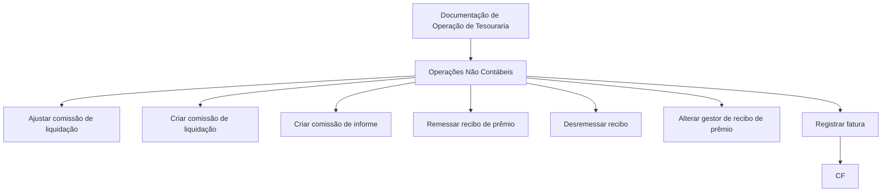

# Documentação de Operação de Tesouraria — Operações Não Contábeis

## 1. Metadados do Documento
- **Arquivo de Origem:** Não identificado no conteúdo fornecido
- **Tipo de Documento:** Manual Operacional
- **Domínio / Sistema:** Tesouraria — Operações Não Contábeis
- **Público-Alvo:** Operação, Negócio e equipes de suporte
- **Data/Versão Identificada:** Não identificada

---

## 2. Resumo Executivo & Contexto de Negócio

O conteúdo fornecido identifica uma documentação de operação para o domínio de **Tesouraria**, especificamente voltada a **operações não contábeis**. O texto apresenta uma relação de atividades operacionais disponíveis, sem detalhar procedimentos, pré-requisitos, responsáveis, telas, integrações, regras de validação ou efeitos em sistemas externos.

As operações listadas abrangem o ajuste e a criação de comissões, o tratamento de recibos de prêmio, a alteração do gestor responsável por um recibo e o registro de faturas. Esses itens indicam que o escopo operacional envolve processos financeiros e administrativos associados a liquidações, comissões, recebíveis e faturamento.

O documento também contém referências a “Home Solutions”, “APIs Documentation” e “Zeus”, mas não explica a natureza dessas referências, sua relação com a Tesouraria ou como devem ser utilizadas durante as operações. Não há evidência textual suficiente para afirmar que sejam sistemas integrados, ambientes, módulos ou portais.

---

## 3. Arquitetura, Componentes & Tecnologias Envolvidas

O conteúdo menciona os seguintes elementos:

| Componente / Termo | Contexto identificado | Detalhamento disponível |
| :--- | :--- | :--- |
| Tesouraria | Domínio da documentação operacional | Operações não contábeis |
| Operações Não Contábeis | Escopo funcional principal | Contém operações sobre comissões, recibos e faturas |
| Home Solutions | Referência textual ao final do conteúdo | Não detalhado |
| APIs Documentation | Referência textual ao final do conteúdo | Não detalhado |
| Zeus | Referência textual ao final do conteúdo | Não detalhado |
| CF | Sigla exibida junto ao registro de fatura | Não detalhada |
| EN | Texto isolado no encerramento do conteúdo | Não detalhado |



> **Nota de Análise:** O conteúdo não descreve arquitetura de software, APIs, protocolos, tecnologias, contratos de integração, endpoints, ambientes ou fluxos de dados entre os elementos citados.

---

## 4. Regras de Negócio, Especificações Funcionais & Processos

As operações explicitamente identificadas no documento são:

1. **Ajustar comissão de liquidação**
   - O documento lista uma operação para ajustar uma comissão relacionada à liquidação.
   - Não informa critérios de ajuste, campos envolvidos, cálculos, perfis autorizados, estados anteriores ou posteriores, nem impactos financeiros.

2. **Criar comissão de liquidação**
   - O documento lista uma operação para criação de comissão de liquidação.
   - Não especifica dados obrigatórios, regras de elegibilidade, fórmula de comissão, aprovação ou persistência da operação.

3. **Criar comissão de informe**
   - O documento lista uma operação para criação de comissão de informe.
   - Não esclarece o significado operacional de “informe”, nem diferencia essa comissão da comissão de liquidação.

4. **Remessar recibo de prêmio**
   - O documento lista uma operação para remessa de recibo de prêmio.
   - Não detalha destino da remessa, canais, lotes, estados do recibo ou validações necessárias.

5. **Desremessar recibo**
   - O documento lista uma operação para desremessa de recibo.
   - Não descreve em quais condições a desremessa é permitida, se exige reversão ou quais efeitos produz sobre o recibo.

6. **Alterar gestor de recibo de prêmio**
   - O documento lista uma operação para mudança do gestor associado a um recibo de prêmio.
   - Não detalha critérios de seleção do novo gestor, rastreabilidade, autorização ou impactos sobre o processo de cobrança.

7. **Registrar fatura**
   - O documento lista uma operação de registro de fatura.
   - A sigla **CF** aparece associada visualmente a essa operação, mas o conteúdo não define seu significado ou relação funcional.

> **Nota de Análise:** Não há instruções passo a passo, regras de cálculo, estados de workflow, matrizes de aprovação, validações, mensagens de erro ou contratos de dados no trecho fornecido.

---

## 5. Tabelas de Parâmetros, Ambientes e Estruturas de Dados

| Item / Parâmetro | Descrição / Função | Tipo / Valores / Formato | Ambiente / Observações |
| :--- | :--- | :--- | :--- |
| Ajustar comissão de liquidação | Operação listada para ajuste de comissão vinculada à liquidação | Não informado | Sem regras ou parâmetros detalhados |
| Criar comissão de liquidação | Operação listada para criação de comissão de liquidação | Não informado | Sem regras ou parâmetros detalhados |
| Criar comissão de informe | Operação listada para criação de comissão de informe | Não informado | O termo “informe” não é definido |
| Remessar recibo de prêmio | Operação listada para remessa de recibo de prêmio | Não informado | Sem destino, estado ou processo descrito |
| Desremessar recibo | Operação listada para desremessa de recibo | Não informado | Sem condições de reversão descritas |
| Alterar gestor de recibo de prêmio | Operação listada para alterar o gestor de um recibo de prêmio | Não informado | Sem critérios de autorização ou rastreabilidade |
| Registrar fatura | Operação listada para registro de fatura | Não informado | Associada visualmente à sigla CF |
| CF | Sigla apresentada junto ao registro de fatura | Não informado | Significado não identificado |
| Home Solutions | Referência textual | Não informado | Não há relação funcional descrita |
| APIs Documentation | Referência textual | Não informado | Não há URLs, contratos ou métodos apresentados |
| Zeus | Referência textual | Não informado | Não há função ou integração descrita |
| EN | Texto isolado | Não informado | Significado não identificado |

---

## 6. Bateria de Perguntas & Respostas para RAG (FAQ Sintético)

### P1: Qual é o escopo principal da documentação apresentada?
**R:** A documentação trata de **Tesouraria — Operações Não Contábeis** e lista atividades operacionais relacionadas a comissões, recibos de prêmio, gestores de recibos e faturas.

### P2: Quais operações de comissão são mencionadas?
**R:** O conteúdo menciona três operações: **ajustar comissão de liquidação**, **criar comissão de liquidação** e **criar comissão de informe**.

### P3: O documento explica como calcular ou ajustar uma comissão de liquidação?
**R:** Não. O documento apenas lista a operação “ajustar comissão de liquidação”; não apresenta fórmula, parâmetros, validações, perfis autorizados ou etapas operacionais.

### P4: Quais operações sobre recibos de prêmio foram identificadas?
**R:** As operações identificadas são **remessar recibo de prêmio**, **desremessar recibo** e **alterar gestor de recibo de prêmio**.

### P5: O documento define o que acontece ao desremessar um recibo?
**R:** Não. A operação “desremessar recibo” é listada, mas não há detalhes sobre condições, reversões, estados ou consequências operacionais.

### P6: Existe um procedimento detalhado para alterar o gestor de um recibo de prêmio?
**R:** Não. O conteúdo confirma a existência da operação “alterar gestor de recibo de prêmio”, porém não descreve passos, permissões, dados necessários ou trilha de auditoria.

### P7: A sigla CF é definida no documento?
**R:** Não. A sigla **CF** aparece próxima à operação “registrar fatura”, mas seu significado e sua relação com o registro de faturas não são explicados.

### P8: Quais referências técnicas ou sistêmicas aparecem no conteúdo?
**R:** O conteúdo menciona “Home Solutions”, “APIs Documentation” e “Zeus”. Não há informações suficientes para classificar esses termos como sistemas, módulos, APIs, portais ou ambientes.

### P9: O documento fornece URLs, endpoints ou contratos de API?
**R:** Não. Apesar da referência textual a “APIs Documentation”, o trecho não apresenta URLs, métodos HTTP, endpoints, payloads, autenticação ou contratos de integração.

### P10: Quais dados são exigidos para registrar uma fatura?
**R:** O documento não informa os campos, anexos, validações, responsáveis, estados ou demais requisitos necessários para o registro de uma fatura.

---

## 7. Glossário de Termos, Siglas & Conceitos-Chave

- **Tesouraria:** Domínio identificado no título da documentação; o trecho fornecido não apresenta definição adicional.
- **Operações Não Contábeis:** Escopo funcional indicado no documento para operações de comissão, recibos e faturas.
- **Comissão de liquidação:** Tipo de comissão mencionado nas operações de ajuste e criação; sem definição operacional adicional.
- **Comissão de informe:** Tipo de comissão mencionado em uma operação de criação; o termo “informe” não é definido.
- **Recibo de prêmio:** Entidade operacional associada às ações de remessa e alteração de gestor.
- **Remessar:** Ação operacional listada para um recibo de prêmio; sem procedimento detalhado.
- **Desremessar:** Ação operacional listada para um recibo; sem definição das condições de reversão.
- **Gestor:** Papel associado a um recibo de prêmio; sem definição de responsabilidades ou permissões.
- **CF:** Sigla não definida, exibida junto à operação de registro de fatura.
- **Home Solutions:** Referência textual sem definição contextual.
- **APIs Documentation:** Referência textual sem URLs, contratos ou descrição técnica.
- **Zeus:** Referência textual sem definição contextual.
- **EN:** Texto isolado não definido no conteúdo.

---

## 8. Notas Críticas, Riscos & Limitações

- O conteúdo fornecido parece ser um índice, slide resumido ou capa de documentação, e não um manual operacional completo.
- Não foram identificados procedimentos passo a passo para nenhuma das operações listadas.
- Não foram fornecidos perfis de acesso, responsáveis, aprovações, segregação de funções ou trilhas de auditoria.
- Não existem regras de negócio detalhadas para comissões, recibos ou faturas.
- Não há dados sobre integrações, APIs, ambientes, URLs, logs, erros, monitoramento ou contingência.
- As referências “Home Solutions”, “APIs Documentation” e “Zeus” não podem ser interpretadas além do texto literal apresentado.
- A sigla **CF** não está definida e requer confirmação documental antes de ser usada como conceito de negócio ou técnico.

---

## 9. Conteúdo Bruto Estruturado (Referência Fiel)

```text
--- [PÁGINA 1 DE 1] ---

EN CONSTRUCCIÓN
DOCUMENTACIÓN de OPERACIÓN de
TESORERÍA - OPERACIONES NO CONTABLES
Imagen operacion-no-contable
OPERACIONES
AJUSTAR comisión liquidación
CREAR comisión liquidación
CREAR comisión informe
REMESAR recibo prima
DESREMESAR recibo
CAMBIAR recibo prima gestor
REGISTRAR factura
 / 
 CF
Home Solutions APIs Documentation Zeus
EN
```
