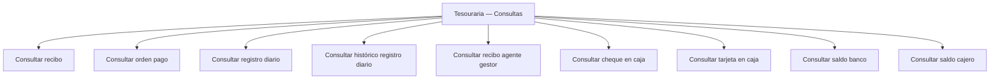

# Documentação de Operação de Tesouraria — Consultas

## 1. Metadados do Documento
- **Arquivo de Origem:** Não identificado
- **Tipo de Documento:** Manual Operacional
- **Domínio / Sistema:** Tesouraria — Consultas
- **Público-Alvo:** Não identificado
- **Data/Versão Identificada:** Não identificada

---

## 2. Resumo Executivo & Contexto de Negócio

O documento apresenta uma seção intitulada **“DOCUMENTACIÓN de OPERACIÓN de TESORERÍA - CONSULTAS”**, identificada como **“EN CONSTRUCCIÓN”**. O conteúdo lista operações de consulta relacionadas ao domínio de Tesouraria.

As operações apresentadas abrangem consultas de recibos, ordens de pagamento, registros diários, itens de caixa, saldos bancários e saldo de caixa/cajero. O documento não descreve procedimentos operacionais, critérios de pesquisa, permissões, campos de entrada, respostas ou regras de validação para essas consultas.

O material também contém referências textuais a **CF**, **Home Solutions**, **APIs Documentation**, **Zeus** e **EN**. O documento não explica o papel, a relação arquitetural ou o significado desses termos no contexto de Tesouraria.

---

## 3. Arquitetura, Componentes & Tecnologias Envolvidas

O documento não especifica arquitetura de software, tecnologias, protocolos, integrações, ambientes, microsserviços, contratos de API ou fluxos de dados. As únicas evidências estruturais são a área funcional de **Tesouraria — Consultas** e a lista de operações disponíveis.



> **Nota de Análise:** O documento menciona “Home Solutions”, “APIs Documentation” e “Zeus”, mas não detalha componentes, endpoints, métodos HTTP, contratos JSON, responsabilidades ou integrações associadas.

---

## 4. Regras de Negócio, Especificações Funcionais & Processos

O documento não apresenta regras de negócio explícitas, fórmulas, condições de validação, critérios de elegibilidade, fluxos de aprovação, perfis de acesso ou etapas operacionais detalhadas.

As funcionalidades listadas são exclusivamente operações de consulta:

1. Consultar recibo.
2. Consultar orden pago.
3. Consultar registro diario.
4. Consultar histórico registro diario.
5. Consultar recibo agente gestor.
6. Consultar cheque en caja.
7. Consultar tarjeta en caja.
8. Consultar saldo banco.
9. Consultar saldo cajero.

> **Nota de Análise:** Não há detalhamento sobre quais filtros, identificadores, períodos, contas, caixas, agentes gestores ou critérios devem ser utilizados em cada operação de consulta.

---

## 5. Tabelas de Parâmetros, Ambientes e Estruturas de Dados

| Item / Parâmetro | Descrição / Função | Tipo / Valores / Formato | Ambiente / Observações |
| :--- | :--- | :--- | :--- |
| Estado do documento | Indica que a documentação está em construção. | `EN CONSTRUCCIÓN` | Não há versão ou data identificada. |
| Consultar recibo | Operação de consulta de recibo. | Não detalhado | Não há filtros, campos ou procedimento descritos. |
| Consultar orden pago | Operação de consulta de ordem de pagamento. | Não detalhado | O documento utiliza o termo `orden pago`. |
| Consultar registro diario | Operação de consulta de registro diário. | Não detalhado | Não há definição do conteúdo do registro. |
| Consultar histórico registro diario | Operação de consulta de histórico de registro diário. | Não detalhado | Não há período, retenção ou critério de histórico informado. |
| Consultar recibo agente gestor | Operação de consulta de recibo associado a agente gestor. | Não detalhado | O termo `agente gestor` não é definido. |
| Consultar cheque en caja | Operação de consulta de cheque em caixa. | Não detalhado | Não há definição de caixa, status ou dados retornados. |
| Consultar tarjeta en caja | Operação de consulta de cartão em caixa. | Não detalhado | Não há definição do tipo de cartão ou do fluxo de consulta. |
| Consultar saldo banco | Operação de consulta de saldo bancário. | Não detalhado | Não há bancos, contas ou moeda identificados. |
| Consultar saldo cajero | Operação de consulta de saldo de cajero. | Não detalhado | Não há definição de `cajero`. |
| CF | Referência textual presente no documento. | Não detalhado | Significado não informado. |
| Home Solutions | Referência textual presente no documento. | Não detalhado | Relação com Tesouraria não informada. |
| APIs Documentation | Referência textual presente no documento. | Não detalhado | Não há URLs, endpoints ou contratos. |
| Zeus | Referência textual presente no documento. | Não detalhado | Papel não informado. |
| EN | Referência textual presente no documento. | Não detalhado | Significado não informado. |

---

## 6. Bateria de Perguntas & Respostas para RAG (FAQ Sintético)

### P1: Qual é o escopo principal da documentação de Tesouraria?
**R:** A documentação trata de operações de consulta no domínio de Tesouraria. O material lista consultas relacionadas a recibos, ordens de pagamento, registros diários, itens de caixa, saldo bancário e saldo de cajero.

### P2: A documentação de Tesouraria está finalizada?
**R:** Não. O documento contém a indicação explícita `EN CONSTRUCCIÓN`, indicando que a documentação está em construção.

### P3: Quais operações de consulta de recibos são mencionadas?
**R:** O documento menciona duas operações: `CONSULTAR recibo` e `CONSULTAR recibo agente gestor`. Não há detalhamento dos filtros, campos, identificadores ou resultados dessas consultas.

### P4: Existe uma consulta para ordens de pagamento?
**R:** Sim. A lista de operações inclui `CONSULTAR orden pago`. O documento não especifica quais dados da ordem de pagamento podem ser consultados.

### P5: Quais consultas de registro diário estão previstas?
**R:** O documento prevê `CONSULTAR registro diario` e `CONSULTAR histórico registro diario`. Não são informados os critérios para diferenciar registro diário atual de histórico de registro diário.

### P6: Quais consultas de caixa são listadas no documento?
**R:** O documento lista `CONSULTAR cheque en caja`, `CONSULTAR tarjeta en caja` e `CONSULTAR saldo cajero`. Não há descrição de caixas, cartões, cheques, operadores ou regras de conciliação.

### P7: A documentação apresenta uma operação para consultar saldo bancário?
**R:** Sim. A operação `CONSULTAR saldo banco` está listada. O documento não informa banco, conta, moeda, data de saldo ou mecanismo de consulta.

### P8: O documento define APIs ou endpoints para as operações de Tesouraria?
**R:** Não. Embora apareça a referência textual `APIs Documentation`, o documento não fornece endpoints, URLs, métodos HTTP, autenticação, parâmetros de requisição ou estruturas de resposta.

### P9: Qual é a relação entre Zeus e as operações de Tesouraria?
**R:** O termo `Zeus` aparece no conteúdo bruto, mas o documento não define seu significado nem estabelece uma relação explícita entre Zeus e as operações de consulta de Tesouraria.

### P10: O documento informa como executar as consultas?
**R:** Não. O material apenas lista os nomes das operações. Não há instruções de navegação, passos operacionais, perfis autorizados, telas, parâmetros ou exemplos de uso.

---

## 7. Glossário de Termos, Siglas & Conceitos-Chave

- **Tesouraria:** Domínio funcional indicado no título da documentação.
- **Consultas:** Categoria de operações apresentada pelo documento.
- **Recibo:** Entidade consultável mencionada como `recibo`; sem definição adicional.
- **Orden pago:** Termo apresentado para uma operação de consulta; sem definição adicional.
- **Registro diario:** Termo apresentado para uma operação de consulta; sem definição adicional.
- **Histórico registro diario:** Termo apresentado para uma operação de consulta; sem definição adicional.
- **Agente gestor:** Termo associado à consulta de recibo; sem definição adicional.
- **Cheque en caja:** Termo associado à consulta de cheque em caixa; sem definição adicional.
- **Tarjeta en caja:** Termo associado à consulta de cartão em caixa; sem definição adicional.
- **Saldo banco:** Termo associado à consulta de saldo bancário; sem definição adicional.
- **Saldo cajero:** Termo associado à consulta de saldo de cajero; sem definição adicional.
- **CF:** Referência textual presente no documento; significado não informado.
- **Home Solutions:** Referência textual presente no documento; significado ou papel não informado.
- **APIs Documentation:** Referência textual presente no documento; não há documentação de API detalhada no conteúdo fornecido.
- **Zeus:** Referência textual presente no documento; significado ou papel não informado.
- **EN:** Referência textual presente no documento; significado não informado.

---

## 8. Notas Críticas, Riscos & Limitações

- O documento está marcado como `EN CONSTRUCCIÓN`.
- Não há data, versão, autor, responsável, sistema de origem ou nome do arquivo identificados.
- Não há procedimentos para executar as operações de consulta listadas.
- Não há arquitetura, diagrama original, tecnologias, servidores, ambientes, URLs, portas, logs ou credenciais documentados.
- Não há definição de campos, parâmetros, filtros, regras de validação, permissões ou estruturas de dados.
- Os termos `CF`, `Home Solutions`, `APIs Documentation`, `Zeus` e `EN` aparecem sem contextualização suficiente para estabelecer significado técnico ou funcional.
- O diagrama Mermaid desta análise representa apenas a hierarquia entre Tesouraria — Consultas e as operações explicitamente listadas; não representa integrações técnicas ou fluxos de dados.

---

## 9. Conteúdo Bruto Estruturado (Referência Fiel)

```text
--- [PÁGINA 1 DE 2] ---

EN CONSTRUCCIÓN
DOCUMENTACIÓN de OPERACIÓN de
TESORERÍA - CONSULTAS
Imagen consultas
OPERACIONES
CONSULTAR recibo
CONSULTAR orden pago
CONSULTAR registro diario
CONSULTAR histórico registro diario
CONSULTAR recibo agente gestor
CONSULTAR cheque en caja
CONSULTAR tarjeta en caja
CONSULTAR saldo banco
 / 
 CF
Home Solutions APIs Documentation Zeus
EN


--- [PÁGINA 2 DE 2] ---

OPERACIONES
CONSULTAR saldo cajero
```
