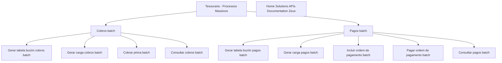

# Documentação de Operação de Tesouraria — Processos Massivos

## 1. Metadados do Documento
- **Arquivo de Origem:** Não identificado no conteúdo fornecido
- **Tipo de Documento:** Manual Operacional
- **Domínio / Sistema:** Tesouraria — Processos Massivos
- **Público-Alvo:** Operação
- **Data/Versão Identificada:** Não identificada

---

## 2. Resumo Executivo & Contexto de Negócio

O documento apresenta uma visão resumida de operações de Tesouraria relacionadas a processos massivos (*batch*). O conteúdo destaca atividades de geração, consulta, inclusão, cobrança e pagamento associadas a cobros e pagos.

As operações de cobrança incluem a geração de tabela de buzón de cobros *batch*, a geração de carga de cobros *batch*, a cobrança de prima *batch* e a consulta de cobros *batch*. As operações de pagamento incluem geração de tabela de buzón de pagos *batch*, geração de carga de pagos *batch*, inclusão de ordem de pagamento *batch*, pagamento de ordem de pagamento *batch* e consulta de pagos *batch*.

O texto também menciona “Home Solutions APIs Documentation Zeus”, sem fornecer explicação sobre a relação entre Home Solutions, APIs, Documentation e Zeus. Não são apresentados detalhes de contratos de API, métodos HTTP, tecnologias, ambientes, regras de validação, responsáveis operacionais ou procedimentos de execução.

A informação disponível deve ser tratada como um inventário inicial de capacidades operacionais. O documento não contém detalhamento suficiente para definir arquitetura técnica, fluxo transacional completo ou regras de negócio adicionais.

---

## 3. Arquitetura, Componentes & Tecnologias Envolvidas

Os elementos explicitamente mencionados são:

- **Tesouraria**
- **Processos Massivos / Batch**
- **Cobros**
- **Pagos**
- **Prima**
- **Tabela buzón de cobros batch**
- **Tabela buzón de pagos batch**
- **Ordem de pagamento batch**
- **Home Solutions APIs Documentation Zeus**
- **CF**

Não há informações suficientes para identificar microsserviços, protocolos, integrações, bancos de dados, servidores, tecnologias de implementação, URLs ou ambientes.



**Nota de Análise:** o diagrama representa apenas o agrupamento conceitual das operações listadas. O documento não especifica uma ordem obrigatória de execução, interfaces entre componentes ou fluxo de dados entre as operações.

---

## 4. Regras de Negócio, Especificações Funcionais & Processos

### Operações de cobros batch

1. **Gerar tabela buzón cobros batch**
   - O documento lista uma operação para gerar uma tabela de buzón associada a cobros em modalidade *batch*.
   - Não são definidos campos, formato, origem dos dados, destino da tabela ou critérios de geração.

2. **Gerar carga cobros batch**
   - O documento lista uma operação para gerar carga de cobros em modalidade *batch*.
   - Não há especificação sobre layout de arquivo, validações, periodicidade, volume ou mecanismo de carga.

3. **Cobrar prima batch**
   - O documento lista uma operação de cobrança de prima em modalidade *batch*.
   - Não são descritos critérios de elegibilidade, cálculo, valores, moeda, estados ou regras de aprovação.

4. **Consultar cobros batch**
   - O documento lista uma operação para consulta de cobros *batch*.
   - Não são definidos filtros de pesquisa, campos retornados, autorização ou comportamento para registros inexistentes.

### Operações de pagos batch

1. **Gerar tabela buzón pagos batch**
   - O documento lista uma operação para gerar uma tabela de buzón associada a pagos em modalidade *batch*.
   - Não são informados campos, formato, origem, destino ou critérios de processamento.

2. **Gerar carga pagos batch**
   - O documento lista uma operação para gerar carga de pagos *batch*.
   - O conteúdo não descreve formato da carga, validações ou etapa posterior de processamento.

3. **Incluir ordem de pagamento batch**
   - O documento lista uma operação para incluir uma ordem de pagamento em modalidade *batch*.
   - Não há detalhes sobre dados obrigatórios, estados possíveis, aprovação ou integração com sistemas externos.

4. **Pagar ordem de pagamento batch**
   - O documento lista uma operação para pagar uma ordem de pagamento em modalidade *batch*.
   - Não são documentados critérios de execução, confirmações, reversões ou tratamento de falhas.

5. **Consultar pagos batch**
   - O documento lista uma operação para consulta de pagos *batch*.
   - Não há informações sobre filtros, dados de retorno, permissões ou rastreabilidade.

---

## 5. Tabelas de Parâmetros, Ambientes e Estruturas de Dados

| Item / Parâmetro | Descrição / Função | Tipo / Valores / Formato | Ambiente / Observações |
| :--- | :--- | :--- | :--- |
| Tesouraria | Domínio operacional indicado no documento. | Não especificado | Relacionado a processos massivos. |
| Processos massivos | Contexto de processamento indicado no título. | Batch | Não há periodicidade ou agendamento informado. |
| Gerar tabela buzón cobros batch | Operação de geração de tabela para cobros. | Operação batch | Sem campos, origem ou destino documentados. |
| Gerar carga cobros batch | Operação de geração de carga de cobros. | Operação batch | Sem layout ou validações documentados. |
| Cobrar prima batch | Operação de cobrança de prima. | Operação batch | Sem regras de cálculo ou valores documentados. |
| Consultar cobros batch | Operação de consulta de cobros. | Operação batch | Sem filtros ou estrutura de resposta documentados. |
| Gerar tabela buzón pagos batch | Operação de geração de tabela para pagos. | Operação batch | Sem campos, origem ou destino documentados. |
| Gerar carga pagos batch | Operação de geração de carga de pagos. | Operação batch | Sem layout ou validações documentados. |
| Incluir ordem de pagamento batch | Operação de inclusão de ordem de pagamento. | Operação batch | Sem atributos da ordem documentados. |
| Pagar ordem de pagamento batch | Operação de pagamento de ordem de pagamento. | Operação batch | Sem estados, confirmação ou tratamento de erro documentados. |
| Consultar pagos batch | Operação de consulta de pagamentos. | Operação batch | Sem filtros ou estrutura de resposta documentados. |
| Home Solutions APIs Documentation Zeus | Referência textual presente no documento. | Não especificado | Relação com as operações não detalhada. |
| CF | Sigla ou referência textual presente no documento. | Não especificado | Significado não identificado. |

---

## 6. Bateria de Perguntas & Respostas para RAG (FAQ Sintético)

### P1: Qual é o domínio operacional tratado pelo documento?
**R:** O documento trata de **Tesouraria**, especificamente de operações relacionadas a **processos massivos** ou *batch*.

### P2: Quais operações de cobros batch estão listadas?
**R:** As operações de cobros batch listadas são: gerar tabela buzón cobros batch, gerar carga cobros batch, cobrar prima batch e consultar cobros batch.

### P3: Quais operações de pagos batch estão listadas?
**R:** As operações de pagos batch listadas são: gerar tabela buzón pagos batch, gerar carga pagos batch, incluir ordem de pagamento batch, pagar ordem de pagamento batch e consultar pagos batch.

### P4: O documento explica como executar a geração de carga de cobros batch?
**R:** Não. O documento somente lista “GENERAR carga cobros batch” como operação. Não há layout de carga, origem de dados, validações, periodicidade ou instruções de execução.

### P5: Existem regras para cálculo ou cobrança de prima batch?
**R:** Não. O documento cita “COBRAR prima batch”, mas não define regras de cálculo, valores, condições de cobrança, moeda ou critérios de elegibilidade.

### P6: Há detalhes sobre os campos de uma ordem de pagamento batch?
**R:** Não. O documento menciona as operações de incluir e pagar ordem de pagamento batch, mas não informa atributos, campos obrigatórios, estados ou regras de aprovação.

### P7: O documento define filtros para consultar cobros ou pagos batch?
**R:** Não. As operações “CONSULTAR cobros batch” e “CONSULTAR pagos batch” são listadas sem filtros, critérios de busca, dados retornados ou regras de acesso.

### P8: O que significa a referência “Home Solutions APIs Documentation Zeus”?
**R:** O documento contém a expressão “Home Solutions APIs Documentation Zeus”, porém não explica seu significado, sua relação com Tesouraria ou quais APIs e funcionalidades estão envolvidas.

### P9: Há URLs, ambientes ou servidores documentados?
**R:** Não. O conteúdo fornecido não contém URLs, nomes de servidores, portas, ambientes, credenciais, rotas de logs ou variáveis de configuração.

### P10: O fluxo entre geração de carga, inclusão de ordem e pagamento está definido?
**R:** Não. As operações são apresentadas como uma lista. O documento não estabelece dependências, sequência obrigatória, transições de estado ou integrações entre as etapas.

---

## 7. Glossário de Termos, Siglas & Conceitos-Chave

- **Batch:** Modalidade de processamento massivo mencionada nas operações de cobros, pagos, prima e ordens de pagamento.
- **Cobros:** Termo presente no documento para agrupar operações de cobrança.
- **Pagos:** Termo presente no documento para agrupar operações de pagamento.
- **Prima:** Item sujeito à operação “cobrar prima batch”; o documento não define o conceito adicionalmente.
- **Buzón:** Termo usado nos itens “tabela buzón cobros batch” e “tabela buzón pagos batch”; o documento não explica sua estrutura ou finalidade técnica.
- **CF:** Sigla presente no documento sem definição.
- **Home Solutions APIs Documentation Zeus:** Referência textual sem explicação adicional no conteúdo fornecido.
- **Tesouraria:** Domínio de operação identificado no título do documento.
- **Processos massivos:** Processos identificados como *batch* no documento.

---

## 8. Notas Críticas, Riscos & Limitações

- O conteúdo é extremamente resumido e apresenta apenas nomes de operações.
- Não há instruções operacionais passo a passo para executar, monitorar ou corrigir falhas nos processos.
- Não há definição de contratos de API, métodos HTTP, formatos de mensagem, arquivos, tabelas, esquemas ou estruturas de dados.
- Não há informações sobre autenticação, autorização, perfis de acesso ou matriz de responsabilidades.
- Não há ambientes, URLs, servidores, portas, logs, alertas ou mecanismos de observabilidade documentados.
- Não há regras de negócio detalhadas para cobrança de prima, criação de ordens de pagamento ou execução de pagamentos.
- Não há dependências explícitas entre as operações listadas.
- **Nota de Análise:** o documento lista “Home Solutions APIs Documentation Zeus” e “CF”, mas não detalha seus significados ou relações com os processos de Tesouraria.

---

## 9. Conteúdo Bruto Estruturado (Referência Fiel)

```text
--- [PÁGINA 1 DE 2] ---

EN CONSTRUCCIÓN
DOCUMENTACIÓN de OPERACIÓN de
TESORERÍA - PROCESOS MASIVOS
Imagen masivos
OPERACIONES
GENERAR tabla buzón cobros batch
GENERAR carga cobros batch
COBRAR prima batch
CONSULTAR cobros batch
GENERAR Tabla buzón pagos batch
GENERAR carga pagos batch
INCLUIR orden pago batch
PAGAR orden pago batch
 /
 CF
Home Solutions APIs Documentation Zeus
EN


--- [PÁGINA 2 DE 2] ---

OPERACIONES
CONSULTAR pagos batch
```
