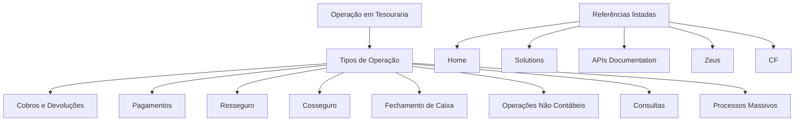

# Operação em Tesouraria — Tipos de Operação e Referências de Soluções

## 1. Metadados do Documento
- **Arquivo de Origem:** Não identificado
- **Tipo de Documento:** Apresentação Executiva
- **Domínio / Sistema:** Operação em Tesouraria
- **Público-Alvo:** Operação
- **Data/Versão Identificada:** Não identificada

---

## 2. Resumo Executivo & Contexto de Negócio

O documento apresenta uma visão resumida de operações em Tesouraria. A documentação é declaradamente orientada à operação por tipo de operação, indicando uma organização funcional baseada nas categorias de atividades executadas pela área.

As categorias citadas abrangem cobros e devoluções, pagamentos, resseguro, cosseguro, fechamento de caixa, operações não contábeis, consultas e processos massivos. O documento não descreve fluxos, regras de validação, responsáveis, sistemas transacionais ou critérios de execução para essas categorias.

Também são mencionadas referências denominadas Home, Solutions, APIs Documentation, Zeus e CF. O conteúdo não estabelece a finalidade, integração, tecnologia, URL, ambiente ou propriedade dessas referências.

> **Nota de Análise:** O documento possui conteúdo resumido e marcado como “EN CONSTRUCCIÓN”. Não há detalhamento funcional, técnico ou operacional adicional para as operações listadas.

---

## 3. Arquitetura, Componentes & Tecnologias Envolvidas

Os elementos identificados no documento são:

| Componente / Referência | Evidência no documento | Detalhamento disponível |
| :--- | :--- | :--- |
| Operação em Tesouraria | Título e contexto principal | Documentação orientada à operação por tipo de operação |
| Home | Listado ao final do conteúdo | Não detalhado |
| Solutions | Listado ao final do conteúdo | Não detalhado |
| APIs Documentation | Listado ao final do conteúdo | Não detalhado |
| Zeus | Listado ao final do conteúdo | Não detalhado |
| CF | Listado ao final do conteúdo | Não detalhado |



> **Nota de Análise:** O diagrama representa somente a taxonomia explícita do documento. Não há evidência de comunicação, dependência, integração ou fluxo de dados entre Home, Solutions, APIs Documentation, Zeus, CF e as operações de Tesouraria.

---

## 4. Regras de Negócio, Especificações Funcionais & Processos

A única diretriz operacional explícita é que a documentação está orientada à operação por tipo de operação.

Os tipos de operação listados são:

1. Cobros e devoluções.
2. Pagamentos.
3. Resseguro.
4. Cosseguro.
5. Fechamento de caixa.
6. Operações não contábeis.
7. Consultas.
8. Processos massivos.

Não foram identificadas regras de negócio detalhadas, critérios de elegibilidade, fórmulas, validações, exceções, parâmetros, estados de processo, contratos de integração, etapas de aprovação ou responsabilidades operacionais.

> **Nota de Análise:** O documento não descreve como executar cada tipo de operação, quais dados devem ser informados, quais sistemas devem ser acessados ou quais resultados são esperados.

---

## 5. Tabelas de Parâmetros, Ambientes e Estruturas de Dados

| Item / Parâmetro | Descrição / Função | Tipo / Valores / Formato | Ambiente / Observações |
| :--- | :--- | :--- | :--- |
| Documentação | Orientada à operação por tipo de operação | Diretriz documental | Nenhum ambiente informado |
| Cobros e devoluções | Tipo de operação de Tesouraria | Categoria funcional | Sem detalhamento adicional |
| Pagamentos | Tipo de operação de Tesouraria | Categoria funcional | Sem detalhamento adicional |
| Resseguro | Tipo de operação de Tesouraria | Categoria funcional | Sem detalhamento adicional |
| Cosseguro | Tipo de operação de Tesouraria | Categoria funcional | Sem detalhamento adicional |
| Fechamento de caixa | Tipo de operação de Tesouraria | Categoria funcional | Sem detalhamento adicional |
| Operações não contábeis | Tipo de operação de Tesouraria | Categoria funcional | Sem detalhamento adicional |
| Consultas | Tipo de operação de Tesouraria | Categoria funcional | Sem detalhamento adicional |
| Processos massivos | Tipo de operação de Tesouraria | Categoria funcional | Sem detalhamento adicional |
| Home | Referência citada | Nome não expandido | Sem URL ou função identificada |
| Solutions | Referência citada | Nome não expandido | Sem URL ou função identificada |
| APIs Documentation | Referência citada | Nome não expandido | Sem URL, contratos ou tecnologia identificados |
| Zeus | Referência citada | Nome não expandido | Sem função identificada |
| CF | Referência citada | Sigla não expandida | Sem significado identificado |

---

## 6. Bateria de Perguntas & Respostas para RAG (FAQ Sintético)

### P1: Qual é o domínio principal abordado pelo documento?
**R:** O domínio principal é a operação em Tesouraria. O documento declara que a documentação é orientada à operação por tipo de operação.

### P2: Quais tipos de operação de Tesouraria são listados?
**R:** O documento lista cobros e devoluções, pagamentos, resseguro, cosseguro, fechamento de caixa, operações não contábeis, consultas e processos massivos.

### P3: O documento detalha o procedimento para executar pagamentos?
**R:** Não. Pagamentos são citados como um tipo de operação, mas não há etapas operacionais, validações, sistemas envolvidos ou regras específicas para sua execução.

### P4: O documento descreve regras para cobros e devoluções?
**R:** Não. Cobros e devoluções aparecem somente como uma categoria de operação de Tesouraria, sem regras de negócio ou fluxo detalhado.

### P5: Quais informações estão disponíveis sobre processos massivos?
**R:** Processos massivos são identificados como um tipo de operação. O documento não informa agendamento, volume, processamento, entradas, saídas ou tratamento de falhas.

### P6: O que é Zeus no contexto do documento?
**R:** Zeus é uma referência listada no final do conteúdo. O documento não define sua função, tecnologia, integração, ambiente ou relação operacional com Tesouraria.

### P7: O documento informa URLs ou ambientes para Home, Solutions ou APIs Documentation?
**R:** Não. Home, Solutions e APIs Documentation são apenas mencionados; não há URLs, ambientes, credenciais, rotas ou contratos de API.

### P8: O que significa a sigla CF?
**R:** A sigla CF é citada no documento, mas seu significado não é expandido ou explicado.

### P9: Há uma arquitetura técnica descrita para a operação de Tesouraria?
**R:** Não. O documento não apresenta arquitetura de software, componentes técnicos, integrações, bancos de dados, protocolos ou fluxos de comunicação.

### P10: O documento está completo para uso como manual operacional?
**R:** Não integralmente. O conteúdo está marcado como “EN CONSTRUCCIÓN” e não contém instruções executáveis, critérios de negócio ou detalhamento dos tipos de operação.

---

## 7. Glossário de Termos, Siglas & Conceitos-Chave

- **APIs Documentation:** Referência citada no documento; não há detalhamento sobre APIs, contratos ou documentação disponível.
- **CF:** Sigla citada sem expansão ou definição.
- **Cobros e devoluções:** Tipo de operação listado no contexto de Tesouraria.
- **Cosseguro:** Tipo de operação listado no contexto de Tesouraria.
- **Fechamento de caixa:** Tipo de operação listado no contexto de Tesouraria.
- **Operações não contábeis:** Tipo de operação listado no contexto de Tesouraria.
- **Processos massivos:** Tipo de operação listado no contexto de Tesouraria.
- **Resseguro:** Tipo de operação listado no contexto de Tesouraria.
- **Tesouraria:** Área operacional que organiza a documentação por tipo de operação.
- **Zeus:** Referência citada sem definição funcional ou técnica.

---

## 8. Notas Críticas, Riscos & Limitações

- O conteúdo está identificado como **“EN CONSTRUCCIÓN”**, sinalizando documentação incompleta.
- Não há versão, data, autoria, arquivo de origem ou sistema proprietário identificados.
- Não há instruções operacionais para executar os tipos de operação listados.
- Não há definição das referências Home, Solutions, APIs Documentation, Zeus e CF.
- Não há URLs, ambientes, parâmetros, matrizes de permissão, logs, contratos de API ou procedimentos de contingência.
- Não há detalhes sobre integrações, dependências entre sistemas ou responsabilidades por operação.

---

## 9. Conteúdo Bruto Estruturado (Referência Fiel)

```text
--- [PÁGINA 1 DE 1] ---

== EN CONSTRUCCIÓN ==
OPERACIÓN en TESORERÍA
 Documentación orientada a la operación por tipo de operación.
TIPOS DE OPERACIÓN
 COBROS Y DEVOLUCIONES
PAGOS
REASEGURO COASEGURO CIERRE DE CAJERO
OPERACIONES NO CONTABLES CONSULTAS
PROCESOS MASIVOS
 / 
 CF
Home Solutions APIs Documentation Zeus
EN
```
