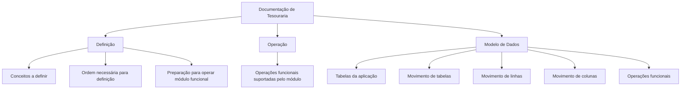
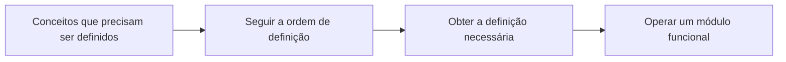

# Documentação de Tesouraria — Definição, Operação e Modelo de Dados

## 1. Metadados do Documento
- **Arquivo de Origem:** `Não identificado no conteúdo fornecido`
- **Tipo de Documento:** `Manual Operacional / Índice de Documentação Funcional`
- **Domínio / Sistema:** `Tesouraria`
- **Público-Alvo:** `Não identificado explicitamente`
- **Data/Versão Identificada:** `Não identificada`

---

## 2. Resumo Executivo & Contexto de Negócio

O documento apresenta a estrutura da **Documentação de Tesouraria**, dedicada à funcionalidade de um sistema ou módulo de tesouraria. O conteúdo declara que as informações funcionais estão organizadas em três grandes categorias: **Definição**, **Operação** e **Modelo de Dados**.

A seção **Definição** reúne documentos destinados a detalhar conceitos que precisam ser definidos e a ordem necessária para realizar a definição requerida antes de operar um módulo funcional. Dessa forma, a documentação posiciona a definição como uma etapa anterior à operação do módulo.

A seção **Operação** reúne documentos relacionados às operações funcionais suportadas pelo módulo de tesouraria. O trecho fornecido não detalha quais operações, transações, regras, usuários ou fluxos específicos são suportados.

A seção **Modelo de Dados** é orientada às tabelas da aplicação. Além de tratar da documentação das tabelas, a seção descreve detalhadamente o movimento de elementos estruturais — tabelas, linhas e colunas — conforme as operações funcionais.

> **Nota de Análise:** O conteúdo fornecido funciona como uma página introdutória ou índice documental. Não há detalhamento sobre arquitetura de software, integrações, serviços, contratos de API, ambientes, URLs operacionais, regras de cálculo ou procedimentos específicos da Tesouraria.

---

## 3. Arquitetura, Componentes & Tecnologias Envolvidas

O conteúdo cita uma navegação com os termos **Home**, **Solutions**, **APIs**, **Documentation**, **Zeus**, **EN** e **CF**, mas não explica a função técnica, responsabilidade ou relação entre esses elementos.

O único domínio funcional explicitamente identificado é **Tesouraria**. A documentação de Tesouraria é estruturada nas categorias funcionais **Definição**, **Operação** e **Modelo de Dados**.



| Componente / Termo | Papel identificado no conteúdo | Tecnologias ou detalhes técnicos |
| :--- | :--- | :--- |
| Documentação de Tesouraria | Área documental dedicada à funcionalidade do sistema de tesouraria. | Não detalhados. |
| Definição | Área documental para conceitos e sequência de definição necessária antes da operação de um módulo funcional. | Não detalhados. |
| Operação | Área documental relacionada às operações funcionais suportadas pelo módulo. | Não detalhados. |
| Modelo de Dados | Área documental dedicada às tabelas da aplicação e ao movimento de tabelas, linhas e colunas. | Não detalhados. |
| Home | Termo apresentado na navegação da página. | Não detalhado. |
| Solutions | Termo apresentado na navegação da página. | Não detalhado. |
| APIs | Termo apresentado na navegação da página. | Não há APIs, métodos, contratos ou endpoints descritos. |
| Documentation | Termo apresentado na navegação da página. | Não detalhado. |
| Zeus | Termo apresentado na navegação da página. | Não detalhado. |
| EN | Termo apresentado na navegação da página. | Não detalhado. |
| CF | Termo apresentado na página inicial. | Não detalhado. |

---

## 4. Regras de Negócio, Especificações Funcionais & Processos

### 4.1 Organização da documentação funcional

A informação relacionada à funcionalidade do sistema de Tesouraria está dividida nos seguintes apartados:

1. **Definição**
2. **Operação**
3. **Modelo de Dados**

### 4.2 Processo de definição antes da operação

A documentação de **Definição** estabelece que determinados conceitos devem ser definidos. O texto também afirma que existe uma ordem a ser seguida para alcançar a definição necessária que permitirá operar um módulo funcional.

Fluxo conceitual extraído:



### 4.3 Operações funcionais

A documentação de **Operação** é composta por documentos relacionados às operações funcionais que o módulo suporta.

> **Nota de Análise:** O documento não identifica os nomes das operações funcionais, os passos de execução, os critérios de validação, as permissões, os resultados esperados ou os tratamentos de erro.

### 4.4 Modelo de dados e movimentação de elementos

A documentação de **Modelo de Dados** é orientada às tabelas da aplicação. Adicionalmente, essa documentação descreve com detalhe o movimento dos seguintes elementos, considerando as operações funcionais:

- Tabelas;
- Linhas;
- Colunas.

> **Nota de Análise:** O conteúdo não fornece nomes de tabelas, nomes de campos, chaves, tipos de dados, relacionamentos, regras de integridade ou exemplos de movimentos.

---

## 5. Tabelas de Parâmetros, Ambientes e Estruturas de Dados

| Item / Parâmetro | Descrição / Função | Tipo / Valores / Formato | Ambiente / Observações |
| :--- | :--- | :--- | :--- |
| Domínio documental | Área abordada pela documentação. | Tesouraria. | Não há ambiente identificado. |
| Categoria documental | Organização principal das informações funcionais. | Definição; Operação; Modelo de Dados. | Estrutura explicitamente informada. |
| Definição | Documentos que detalham conceitos a definir e a ordem necessária para obter a definição requerida. | Categoria documental. | A definição é apresentada como necessária para operar um módulo funcional. |
| Operação | Documentos relacionados às operações funcionais suportadas pelo módulo. | Categoria documental. | As operações específicas não são detalhadas. |
| Modelo de Dados | Documentação orientada às tabelas da aplicação. | Categoria documental. | Também descreve o movimento de tabelas, linhas e colunas conforme as operações funcionais. |
| Tabelas | Elemento da aplicação abordado pelo Modelo de Dados. | Estrutura de dados. | Nomes e estruturas não informados. |
| Linhas | Elemento cujo movimento é descrito no Modelo de Dados. | Estrutura de dados. | Regras de movimentação não informadas. |
| Colunas | Elemento cujo movimento é descrito no Modelo de Dados. | Estrutura de dados. | Nomes, tipos e regras não informados. |
| APIs | Item exibido na navegação da página. | Termo de navegação. | Não há endpoints, métodos HTTP ou contratos JSON apresentados. |
| Zeus | Item exibido na navegação da página. | Termo não detalhado. | Não é possível determinar se representa sistema, produto ou ambiente. |
| EN | Item exibido na navegação da página. | Termo não detalhado. | Não há explicação no conteúdo. |
| CF | Item exibido na página inicial. | Termo não detalhado. | Não há explicação no conteúdo. |

---

## 6. Bateria de Perguntas & Respostas para RAG (FAQ Sintético)

### P1: Qual é o objetivo da Documentação de Tesouraria?
**R:** A Documentação de Tesouraria aborda conteúdos relacionados à funcionalidade do sistema ou módulo de tesouraria. As informações são organizadas nas categorias Definição, Operação e Modelo de Dados.

### P2: Quais seções compõem a documentação funcional de Tesouraria?
**R:** A documentação funcional de Tesouraria é dividida em três apartados: Definição, Operação e Modelo de Dados.

### P3: O que é documentado na seção Definição?
**R:** A seção Definição contém documentos que detalham os conceitos que precisam ser definidos e a ordem que deve ser seguida para alcançar a definição necessária para operar um módulo funcional.

### P4: A definição é necessária antes de operar um módulo funcional?
**R:** Sim. O documento afirma que a seção Definição descreve conceitos e a ordem necessária para obter a definição requerida com a qual é possível operar um módulo funcional.

### P5: O que a seção Operação cobre no módulo de Tesouraria?
**R:** A seção Operação reúne documentos relacionados às operações funcionais suportadas pelo módulo. O conteúdo fornecido não especifica quais operações funcionais são suportadas.

### P6: O que é abordado pela documentação de Modelo de Dados?
**R:** A documentação de Modelo de Dados é orientada às tabelas da aplicação. Também descreve detalhadamente o movimento de tabelas, linhas e colunas de acordo com as operações funcionais.

### P7: O documento informa quais tabelas pertencem ao modelo de dados de Tesouraria?
**R:** Não. O texto informa que o Modelo de Dados é orientado às tabelas da aplicação, mas não fornece nomes de tabelas, campos, chaves, relacionamentos ou tipos de dados.

### P8: O documento descreve o movimento de quais elementos de dados?
**R:** O documento informa que o Modelo de Dados descreve o movimento de tabelas, linhas e colunas, considerando as operações funcionais.

### P9: Existem APIs documentadas para o sistema de Tesouraria?
**R:** Não há APIs documentadas no conteúdo fornecido. O termo “APIs” aparece apenas na navegação da página, sem endpoints, métodos HTTP, contratos, autenticação ou exemplos de requisição e resposta.

### P10: O documento apresenta detalhes de arquitetura, microsserviços ou integrações?
**R:** Não. O conteúdo fornecido não descreve arquitetura de software, microsserviços, integrações, tecnologias, servidores, ambientes, URLs, portas ou fluxos de comunicação entre sistemas.

### P11: Qual é a relação entre operações funcionais e o Modelo de Dados?
**R:** A documentação de Modelo de Dados descreve o movimento de tabelas, linhas e colunas atendendo às operações funcionais. O documento não detalha quais operações produzem quais movimentos.

### P12: O que significa Zeus no contexto da Documentação de Tesouraria?
**R:** O termo “Zeus” aparece na navegação da página, ao lado de Home, Solutions, APIs, Documentation e EN. O conteúdo não fornece definição ou contexto adicional para determinar seu significado.

---

## 7. Glossário de Termos, Siglas & Conceitos-Chave

- **APIs:** Termo exibido na navegação da página. O documento não define APIs nem apresenta interfaces, endpoints ou contratos.
- **CF:** Termo exibido na primeira página. O significado não é informado.
- **Definição:** Categoria documental que detalha conceitos a definir e a ordem necessária para obter uma definição que permita operar um módulo funcional.
- **EN:** Termo exibido na navegação da página. O significado não é informado.
- **Modelo de Dados:** Categoria documental orientada às tabelas da aplicação e ao movimento de tabelas, linhas e colunas em função das operações funcionais.
- **Operação:** Categoria documental relacionada às operações funcionais suportadas pelo módulo.
- **Tesouraria:** Domínio ou módulo funcional abordado pela documentação.
- **Zeus:** Termo exibido na navegação da página; não definido no conteúdo fornecido.

---

## 8. Notas Críticas, Riscos & Limitações

- O nome do arquivo de origem não está presente no conteúdo bruto fornecido.
- Não há data, versão, autoria, classificação documental ou histórico de alterações identificados.
- Não há descrição de arquitetura técnica, integrações, microsserviços, APIs, protocolos, autenticação, infraestrutura, ambientes ou rotas de log.
- A navegação apresenta os termos **Home**, **Solutions**, **APIs**, **Documentation**, **Zeus**, **EN** e **CF**, mas o conteúdo não explica seus significados ou funções.
- A seção **Operação** não lista as operações funcionais efetivamente suportadas pelo módulo de Tesouraria.
- A seção **Modelo de Dados** não apresenta nomes de tabelas, colunas, tipos de dados, relacionamentos, chaves, regras de integridade ou exemplos de movimentação.
- O documento indica que há uma ordem para a definição de conceitos, mas não descreve essa ordem.
- Não foram identificadas matrizes de permissão, critérios de validação, regras de cálculo, parâmetros de configuração, procedimentos de contingência ou fluxos de exceção.

---

## 9. Conteúdo Bruto Estruturado (Referência Fiel)

```text
--- [PÁGINA 1 DE 2] ---

/
CF
Home Solutions APIs Documentation Zeus
EN


--- [PÁGINA 2 DE 2] ---

DOCUMENTACIÓN - TESORERÍA

En este apartado se aborda todo aquello relacionado con la funcionalidad del sistema. La
información se encuentra dividida en los apartados siguientes:

Definición
Operación
Modelo de datos

DEFINICIÓN

Documentos que detallan aquellos conceptos que se han de definir y el orden que se ha de seguir
para conseguir la definición necesaria con lo que poder operar un módulo funcional.

OPERACIÓN

Documentos relacionados con las operaciones funcionales que el módulo soporta.

MODELO DE DATOS

Documentación orientada hacia las tablas de la aplicación. Adicionalmente, se describe con detalle el
movimiento de distintos elementos como tablas, filas y columnas atendiendo a las operaciones
funcionales.
```
