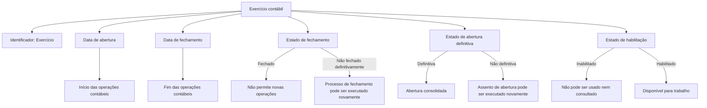
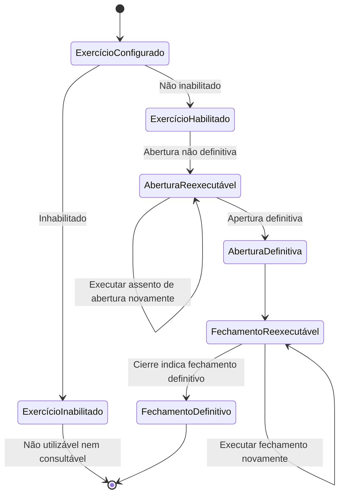

# Definição de Exercício Contábil — Propriedades, Estados e Regras Operacionais

## 1. Metadados do Documento
- **Arquivo de Origem:** Não identificado no conteúdo fornecido
- **Tipo de Documento:** Especificação Técnica / Documentação Funcional
- **Domínio / Sistema:** Exercício contábil; contexto de documentação “CF / Zeus”
- **Público-Alvo:** Analistas funcionais, equipes contábeis, desenvolvedores e operação
- **Data/Versão Identificada:** Não identificada

---

## 2. Resumo Executivo & Contexto de Negócio

O documento define o conceito de **exercício contábil** como o período de tempo em que serão realizadas operações contábeis. Um exercício contábil é identificado por uma chave denominada **Exercício**, possui uma data de início e uma data de término, além de propriedades que controlam seu encerramento, sua abertura definitiva e sua habilitação para uso.

A propriedade **Exercício** funciona como identificador do período contábil. Quando o exercício coincide com o ano natural, a prática indicada é utilizar os dígitos do ano como chave, como `2023`. No entanto, a especificação permite outras codificações, incluindo cenários com mais de um exercício dentro do mesmo ano natural, como `20231` e `20232`.

As propriedades **Fecha de apertura** e **Fecha de cierre** delimitam formalmente o intervalo de vigência operacional do exercício contábil. O documento apresenta exemplos de exercícios anuais, exercícios que atravessam dois anos naturais e múltiplos exercícios em um mesmo ano.

O documento também define controles de estado. A propriedade **Cierre** determina se o exercício está fechado e, consequentemente, se novas operações podem ser realizadas. A propriedade **Apertura definitiva** determina se a abertura do exercício foi consolidada definitivamente. Ambas as operações podem ser executadas mais de uma vez antes de suas respectivas confirmações definitivas.

Por fim, a propriedade **Inhabilitado** controla a disponibilidade do exercício contábil. Um exercício inabilitado não pode ser utilizado, nem mesmo para consulta, sendo tratado como se não existisse para fins operacionais.

---

## 3. Arquitetura, Componentes & Tecnologias Envolvidas

O conteúdo fornecido não descreve arquitetura de software, microsserviços, APIs, bancos de dados, tecnologias, ambientes ou integrações técnicas. A estrutura identificada é funcional e representa o ciclo de configuração e controle de um exercício contábil.

Os componentes funcionais explicitamente identificados são:

- **Exercício:** chave identificadora do exercício contábil.
- **Data de abertura:** data de início do exercício contábil.
- **Data de fechamento:** data de finalização do exercício contábil.
- **Fechamento:** indicador de que o exercício está fechado para novas operações.
- **Abertura definitiva:** indicador de que o lançamento de abertura foi consolidado definitivamente.
- **Inabilitado:** indicador de que o exercício está indisponível inclusive para consulta.



> **Nota de Análise:** O documento não detalha interfaces de usuário, contratos de API, persistência de dados, permissões, métodos HTTP, tecnologias de implementação ou responsáveis pelo processo de fechamento e abertura.

---

## 4. Regras de Negócio, Especificações Funcionais & Processos

### 4.1 Definição de exercício contábil

Um exercício contábil define o período temporal no qual serão realizadas operações contábeis.

### 4.2 Identificação do exercício

A propriedade **Exercício** é a chave de identificação do exercício contábil.

Regras identificadas:

1. Quando o exercício coincide com o ano natural, normalmente a chave utiliza os dígitos do ano.
2. A codificação do exercício não está restrita aos dígitos do ano; outra codificação pode ser utilizada.
3. Quando houver mais de um exercício no mesmo ano natural, os exemplos apresentados utilizam uma extensão numérica da chave anual:
   - Primeiro exercício: `20231`.
   - Segundo exercício: `20232`.

### 4.3 Datas de vigência

A propriedade **Fecha de apertura** indica a data em que o exercício contábil começa.

A propriedade **Fecha de cierre** indica a data em que o exercício contábil termina.

Cenários explicitamente exemplificados:

1. **Exercício coincidente com o ano natural**
   - Exercício: `2023`
   - Data de abertura: `01/01/2023`
   - Data de fechamento: `31/12/2023`

2. **Exercício entre dois anos naturais**
   - Exercício: `2223`
   - Data de abertura: `01/07/2022`
   - Data de fechamento: `30/06/2023`

3. **Mais de um exercício no mesmo ano natural**
   - Primeiro exercício:
     - Exercício: `20231`
     - Data de abertura: `01/01/2023`
     - Data de fechamento: `30/06/2023`
   - Segundo exercício:
     - Exercício: `20232`
     - Data de abertura: `01/07/2023`
     - Data de fechamento: `31/12/2023`

### 4.4 Fechamento do exercício

A propriedade **Cierre** indica se o exercício contábil está fechado.

Regras identificadas:

1. Um exercício fechado não permite a realização de mais operações nesse exercício.
2. O processo de fechamento pode ser executado várias vezes.
3. O exercício é considerado definitivamente fechado quando a propriedade **Cierre** assim indicar.

### 4.5 Abertura definitiva

A propriedade **Apertura definitiva** indica se o exercício está aberto definitivamente.

Regras identificadas:

1. O lançamento de abertura pode ser executado várias vezes.
2. O lançamento de abertura deixa de ser repetível quando a propriedade **Apertura definitiva** indica que a abertura é definitiva.

### 4.6 Habilitação do exercício

A propriedade **Inhabilitado** indica se o exercício está habilitado para trabalho.

Regras identificadas:

1. Um exercício inabilitado não pode ser utilizado.
2. Um exercício inabilitado não pode ser consultado.
3. Um exercício inabilitado deve ser tratado como se não existisse.



---

## 5. Tabelas de Parâmetros, Ambientes e Estruturas de Dados

| Item / Parâmetro | Descrição / Função | Tipo / Valores / Formato | Ambiente / Observações |
| :--- | :--- | :--- | :--- |
| Exercício | Chave que identifica o exercício contábil. | Código livre; exemplos: `2023`, `20231`, `20232`, `2223`. | Normalmente utiliza os dígitos do ano quando coincide com o ano natural, mas outra codificação é permitida. |
| Data de abertura | Indica a data de início do exercício contábil. | Data; exemplos: `01/01/2023`, `01/07/2022`, `01/07/2023`. | Define o início do período em que ocorrem operações contábeis. |
| Data de fechamento | Indica a data de término do exercício contábil. | Data; exemplos: `31/12/2023`, `30/06/2023`. | Define o fim do exercício contábil. |
| Fechamento (`Cierre`) | Indica se o exercício está fechado. | Indicador de estado; valores específicos não detalhados. | Quando fechado, não podem ser realizadas mais operações. O processo pode ser executado várias vezes até o fechamento definitivo. |
| Abertura definitiva (`Apertura definitiva`) | Indica se a abertura do exercício é definitiva. | Indicador de estado; valores específicos não detalhados. | O assento de abertura pode ser executado várias vezes até que a abertura seja marcada como definitiva. |
| Inabilitado (`Inhabilitado`) | Indica se o exercício está disponível para trabalho. | Indicador de estado; valores específicos não detalhados. | Quando inabilitado, não pode ser utilizado nem consultado; é tratado como inexistente. |

| Cenário de exercício | Exercício | Data de abertura | Data de fechamento |
| :--- | :--- | :--- | :--- |
| Único exercício coincidente com o ano natural | `2023` | `01/01/2023` | `31/12/2023` |
| Exercício entre dois anos naturais | `2223` | `01/07/2022` | `30/06/2023` |
| Primeiro exercício em um ano natural | `20231` | `01/01/2023` | `30/06/2023` |
| Segundo exercício em um ano natural | `20232` | `01/07/2023` | `31/12/2023` |

> **Nota de Análise:** O documento não informa tipos técnicos de dados, valores booleanos concretos, validações de formato de data, banco de dados, URL de ambientes, servidores, variáveis de log ou rotas operacionais.

---

## 6. Bateria de Perguntas & Respostas para RAG (FAQ Sintético)

### P1: O que é um exercício contábil no contexto do documento?
**R:** Um exercício contábil é o período de tempo no qual são realizadas operações contábeis. O exercício possui uma chave identificadora, data de abertura, data de fechamento e propriedades que controlam fechamento, abertura definitiva e habilitação.

### P2: Qual propriedade identifica unicamente um exercício contábil?
**R:** A propriedade **Exercício** é a chave utilizada para identificar o exercício contábil. Quando o exercício coincide com o ano natural, normalmente são usados os dígitos do ano, como `2023`, mas o documento permite qualquer outra codificação.

### P3: Como identificar exercícios múltiplos no mesmo ano natural?
**R:** O documento exemplifica exercícios múltiplos no mesmo ano natural com códigos derivados do ano e um sufixo numérico. Para 2023, o primeiro exercício pode ser identificado como `20231` e o segundo como `20232`.

### P4: O que representa a data de abertura de um exercício contábil?
**R:** A data de abertura indica a data em que o exercício contábil se inicia. Por exemplo, um exercício anual de 2023 pode ter data de abertura em `01/01/2023`.

### P5: O que representa a data de fechamento de um exercício contábil?
**R:** A data de fechamento indica a data em que o exercício contábil termina. Em um exercício que coincide com o ano natural de 2023, a data de fechamento exemplificada é `31/12/2023`.

### P6: É possível configurar um exercício contábil que atravesse dois anos naturais?
**R:** Sim. O documento apresenta o exemplo do exercício `2223`, com abertura em `01/07/2022` e fechamento em `30/06/2023`, demonstrando que um exercício pode abranger partes de dois anos naturais.

### P7: O que acontece quando a propriedade de fechamento indica que o exercício está fechado?
**R:** Quando a propriedade **Cierre** indica que o exercício contábil está fechado, não podem ser realizadas mais operações nesse exercício. O processo de fechamento pode ser executado várias vezes, sendo definitivo quando a propriedade assim o indicar.

### P8: O processo de fechamento de exercício pode ser executado mais de uma vez?
**R:** Sim. O documento informa expressamente que o processo de fechamento pode ser executado várias vezes. O exercício somente é considerado fechado definitivamente quando a propriedade **Cierre** indicar essa condição.

### P9: O que significa a propriedade de abertura definitiva?
**R:** A propriedade **Apertura definitiva** indica se o exercício está aberto definitivamente. O assento de abertura pode ser executado várias vezes até que essa propriedade indique que a abertura é definitiva.

### P10: Um exercício inabilitado pode ser consultado?
**R:** Não. Um exercício inabilitado não pode ser utilizado nem mesmo em consulta. O documento estabelece que um exercício inabilitado é tratado como se não existisse.

### P11: Quais são os períodos dos dois exercícios exemplificados para o ano de 2023?
**R:** O primeiro exercício, identificado como `20231`, vai de `01/01/2023` a `30/06/2023`. O segundo exercício, identificado como `20232`, vai de `01/07/2023` a `31/12/2023`.

### P12: O documento define quais tecnologias, APIs ou métodos HTTP controlam os exercícios contábeis?
**R:** Não. O conteúdo fornecido descreve propriedades e regras funcionais do exercício contábil, mas não detalha tecnologias, APIs, métodos HTTP, contratos JSON, banco de dados ou interfaces de integração.

---

## 7. Glossário de Termos, Siglas & Conceitos-Chave

- **Exercício contábil:** Período de tempo durante o qual são realizadas operações contábeis.
- **Exercício:** Propriedade que atua como chave identificadora do exercício contábil.
- **Data de abertura (`Fecha de apertura`):** Data de início do exercício contábil.
- **Data de fechamento (`Fecha de cierre`):** Data de término do exercício contábil.
- **Fechamento (`Cierre`):** Propriedade que indica se o exercício está fechado e, portanto, indisponível para novas operações.
- **Abertura definitiva (`Apertura definitiva`):** Propriedade que indica se a abertura do exercício foi consolidada definitivamente.
- **Assento de abertura:** Operação de abertura do exercício; o documento informa que pode ser executada várias vezes enquanto a abertura não for definitiva.
- **Inabilitado (`Inhabilitado`):** Estado que impede o uso e a consulta de um exercício contábil.
- **Ano natural:** Período anual de 1º de janeiro a 31 de dezembro, conforme os exemplos apresentados.
- **CF:** Sigla exibida no cabeçalho extraído; o conteúdo fornecido não apresenta sua expansão.
- **Zeus:** Termo exibido na navegação do documento; o conteúdo fornecido não detalha seu significado ou relação técnica com o exercício contábil.

---

## 8. Notas Críticas, Riscos & Limitações

- O conteúdo não identifica o nome do arquivo de origem, autor, versão, data de publicação ou controle de revisões.
- O documento não especifica valores técnicos concretos para os indicadores **Cierre**, **Apertura definitiva** e **Inhabilitado**.
- Não há regras explícitas de validação que impeçam datas sobrepostas, datas inválidas, lacunas entre exercícios ou duplicidade da chave de exercício.
- Não são detalhados perfis de acesso, responsabilidades, aprovações ou segregação de funções para abertura, fechamento ou inabilitação.
- O documento não define o comportamento de operações já existentes quando um exercício é inabilitado.
- Não há descrição de tecnologia, banco de dados, APIs, telas, serviços, logs, URLs, servidores ou ambientes.
- **Nota de Análise:** O documento descreve as propriedades funcionais do exercício contábil, mas não detalha o mecanismo técnico de persistência, execução ou auditoria das alterações de estado.

---

## 9. Conteúdo Bruto Estruturado (Referência Fiel)

```text
--- [PÁGINA 1 DE 3] ---

DEFINICIÓN de Ejercicio contable
Objetivo
El objetivo es definir el periodo de tiempo en el que se realizarán las operaciones contables.
Propiedades generales
Propiedades generales
Ejercicio
Esta propiedad será la clave con la que se identifica el ejercicio contable.
Normalmente, si el ejercicio coincide con el año natural, se suelen utilizar como clave los dígitos del
año, pero puede utilizarse cualquier otra codificación.
Ejemplo
Si hay un único ejercicio y coincide con el año
Ejercicio: 2023
Si hay más de un ejercicio en el mismo año
Ejercicio: 20231 (para el primer ejercicio)
Ejercicio: 20232 (para el segundo ejercicio)
Fecha de apertura
Esta propiedad indica la fecha en la que inicia el ejercicio contable.
 / 
 CF
Inicio Soluciones APIs Documentación Zeus
ES


--- [PÁGINA 2 DE 3] ---

Ejemplo
Si el ejercicio se inicia el primer día del año
Fecha de apertura: 01/01/2023
Fecha de cierre
Esta propiedad indica la fecha en la que finaliza el ejercicio contable.
Ejemplo
Si el ejercicio coincide con el año natural
Ejercicio: 2023
Fecha de apertura: 01/01/2023
Fecha de cierre: 31/12/2023
Si el ejercicio está entre dos años naturales
Ejercicio: 2223
Fecha de apertura: 01/07/2022
Fecha de cierre: 30/06/2023
Si hay más de un ejercicio en el mismo año natural
a. Primer ejercicio
Ejercicio: 20231
Fecha de apertura: 01/01/2023
Fecha de cierre: 30/06/2023
b. Segundo ejercicio
Ejercicio: 20232
Fecha de apertura: 01/07/2023
Fecha de cierre: 31/12/2023
Cierre
Esta propiedad indica si el ejercicio contable está cerrado, es decir, no pueden realizarse más
operaciones en este ejercicio.
El proceso de cierre puede ejecutarse varias veces, considerando que el ejercicio está cerrado
definitivamente cuando esta propiedad así lo indica.
Apertura definitiva
Esta propiedad indica si el ejercicio está abierto definitivamente.
El asiento de apertura se puede ejecutar varias veces hasta que en esta propiedad se indique que la
apertura es definitiva.


--- [PÁGINA 3 DE 3] ---

Inhabilitado
Esta propiedad indica si el ejercicio está habilitado o no, para poder trabajar.
Un ejercicio inhabilitado no se puede utilizar, ni siquiera en consulta, es como si no existiera.
```
