# Definição de Parâmetros do Exercício Contábil

## 1. Metadados do Documento
- **Arquivo de Origem:** Não identificado no conteúdo fornecido
- **Tipo de Documento:** Especificação Técnica
- **Domínio / Sistema:** Configuração de exercício contábil
- **Público-Alvo:** Desenvolvedores, analistas funcionais, operação e negócio
- **Data/Versão Identificada:** Não identificada

---

## 2. Resumo Executivo & Contexto de Negócio

O documento define os parâmetros que determinam como o sistema opera durante um período de exercício contábil. O exercício é identificado por uma chave própria e concentra configurações relacionadas à estrutura das contas, captura de movimentos, valores, numeração e controles operacionais.

A especificação descreve comprimentos configuráveis para contas de desenvolvimento e para cinco níveis de conta. Também estabelece opções relacionadas a código auxiliar indicador, estrutura comercial, obrigatoriedade de dígito de controle e alteração de data-valor em cobranças.

O documento inclui parâmetros financeiros, como a identificação da moeda local e a permissão de importes negativos. Adicionalmente, descreve controles por usuário e regras para a numeração de assentos e de IVA.

Não são apresentados contratos de integração, tecnologias, URLs, ambientes, métodos HTTP, estruturas de banco de dados ou fluxos de implementação. O conteúdo é restrito à definição funcional dos parâmetros do exercício contábil.

---

## 3. Arquitetura, Componentes & Tecnologias Envolvidas

Os componentes funcionais explicitamente citados são:

- **Exercício contábil:** entidade identificada por uma chave.
- **Contas de desenvolvimento:** contas cujo comprimento e possível código auxiliar indicador são configuráveis.
- **Níveis de conta 1 a 5:** níveis com quantidade de dígitos configurável.
- **Estrutura comercial:** estrutura utilizada na captura de movimentos.
- **Capturas manuais:** contexto em que o dígito de controle pode ser obrigatório.
- **Cobranças:** contexto em que o caixa pode ou não alterar a data-valor.
- **Moeda local:** identificada por uma chave.
- **Usuários:** sujeitos ao controle de contas por usuário.
- **Assentos:** possuem comprimento configurável para seu número e período de numeração.
- **IVA:** possui numeração no processo de fechamento mensal.

```mermaid
graph TD
    EC[Exercício contábil] --> ID[Chave de identificação do exercício]
    EC --> CE[Estrutura de contas]
    CE --> CD[Conta de desenvolvimento]
    CE --> N1[Comprimento da conta nível 1]
    CE --> N2[Comprimento da conta nível 2]
    CE --> N3[Comprimento da conta nível 3]
    CE --> N4[Comprimento da conta nível 4]
    CE --> N5[Comprimento da conta nível 5]
    EC --> CM[Captura de movimentos]
    CM --> NE[Nível de estrutura comercial]
    CM --> DC[Dígito de controle em capturas manuais]
    EC --> CO[Cobranças]
    CO --> FV[Alteração de data-valor pelo caixa]
    EC --> FC[Configurações financeiras]
    FC --> ML[Moeda local]
    FC --> IN[Permissão de importes negativos]
    EC --> CT[Controles]
    CT --> CU[Contas por usuário]
    EC --> NU[Numeração]
    NU --> NA[Número de assento]
    NU --> PA[Período de numeração de assentos]
    NU --> NI[Numeração de IVA no fechamento mensal]
```



> **Nota de Análise:** o documento não detalha arquitetura de software, serviços, banco de dados, interfaces, tecnologias, ambientes ou integrações externas.

---

## 4. Regras de Negócio, Especificações Funcionais & Processos

1. O **exercício** é a propriedade-chave utilizada para identificar o exercício contábil.
2. A **conta de desenvolvimento** possui uma quantidade configurável de dígitos.
3. Cada nível de conta, do **nível 1** ao **nível 5**, possui uma quantidade configurável de dígitos.
4. O parâmetro **Indicador** determina se as contas de desenvolvimento utilizam um código auxiliar indicador.
5. O **nível de estrutura comercial** determina o nível da estrutura comercial empregado para captura dos movimentos.
6. Os valores explicitamente listados para o nível de estrutura comercial são:
   - Nível 2
   - Nível 3
7. O **dígito de controle** determina se esse dígito é obrigatório nas capturas manuais.
8. O parâmetro **data de valor** determina se o caixa pode alterar a data-valor nas cobranças.
9. A **moeda local** é identificada por uma chave.
10. O parâmetro **importes negativos** determina se o exercício permite importes negativos.
11. O parâmetro **contas por usuário** estabelece o controle de contas por usuário.
12. O **comprimento do número de assento** determina a quantidade de caracteres do número do assento.
13. O número do assento pode possuir, no máximo, **8 caracteres**.
14. A **numeração de IVA** aplica-se ao processo de fechamento mensal.
15. A **numeração de assentos** determina o período de numeração dos assentos.
16. Os períodos explicitamente permitidos para numeração de assentos são:
   - **(M) Mensual**
   - **(D) Diario**
   - **(A) Anual**

---

## 5. Tabelas de Parâmetros, Ambientes e Estruturas de Dados

| Item / Parâmetro | Descrição / Função | Tipo / Valores / Formato | Ambiente / Observações |
| :--- | :--- | :--- | :--- |
| Exercício | Chave com a qual o exercício contábil é identificado | Chave | Não detalhado |
| Comprimento da conta de desenvolvimento | Define o número de dígitos das contas de desenvolvimento | Número de dígitos | Não detalhado |
| Comprimento da conta nível 1 | Define o número de dígitos do primeiro nível de contas | Número de dígitos | Não detalhado |
| Comprimento da conta nível 2 | Define o número de dígitos do segundo nível de contas | Número de dígitos | Não detalhado |
| Comprimento da conta nível 3 | Define o número de dígitos do terceiro nível de contas | Número de dígitos | Não detalhado |
| Comprimento da conta nível 4 | Define o número de dígitos do quarto nível de contas | Número de dígitos | Não detalhado |
| Comprimento da conta nível 5 | Define o número de dígitos do quinto nível de contas | Número de dígitos | Não detalhado |
| Indicador | Informa se as contas de desenvolvimento possuem código auxiliar indicador | Não detalhado | Não detalhado |
| Nível de estrutura comercial | Determina o nível da estrutura comercial usado para captura de movimentos | Nível 2; Nível 3 | Não detalhado |
| Dígito de controle | Informa se o dígito de controle é obrigatório em capturas manuais | Não detalhado | Aplicável a capturas manuais |
| Data de valor | Informa se o caixa pode alterar a data-valor nas cobranças | Não detalhado | Aplicável a cobranças |
| Moeda local | Chave que identifica a moeda local | Chave | Não detalhado |
| Importes negativos | Determina se o exercício permite importes negativos | Não detalhado | Não detalhado |
| Contas por usuário | Define o controle de contas por usuário | Não detalhado | Não detalhado |
| Comprimento do número de assento | Define o número de caracteres do número de assento | Máximo de 8 caracteres | Não detalhado |
| Numeração de IVA | Define a numeração de IVA | Processo de fechamento mensal | Não detalhado |
| Numeração de assentos | Determina o período de numeração dos assentos | (M) Mensual; (D) Diario; (A) Anual | Não detalhado |

---

## 6. Bateria de Perguntas & Respostas para RAG (FAQ Sintético)

### P1: Qual propriedade identifica o exercício contábil?
**R:** A propriedade **Exercício** é a chave utilizada para identificar o exercício contábil.

### P2: Como é configurado o tamanho das contas de desenvolvimento?
**R:** O parâmetro **Longitud cuenta de desarrollo** define o número de dígitos das contas de desenvolvimento. O documento não informa valores mínimos, máximos ou formato adicional.

### P3: Quantos níveis de conta possuem comprimento configurável?
**R:** O documento lista cinco níveis configuráveis: conta de nível 1, nível 2, nível 3, nível 4 e nível 5. Para cada nível, é definido o número de dígitos correspondente.

### P4: O que o parâmetro Indicador controla?
**R:** O parâmetro **Indicador** informa se as contas de desenvolvimento possuem um código auxiliar indicador. O documento não especifica o formato, a origem ou os valores possíveis desse código auxiliar.

### P5: Quais valores são apresentados para o nível de estrutura comercial?
**R:** O documento apresenta os valores **Nível 2** e **Nível 3** para o parâmetro de nível de estrutura comercial, que determina o nível utilizado na captura dos movimentos.

### P6: Em que situação o dígito de controle pode ser obrigatório?
**R:** O parâmetro **Dígito de controle** indica se o dígito de controle é obrigatório nas capturas manuais.

### P7: O caixa pode alterar a data-valor de uma cobrança?
**R:** Isso é determinado pelo parâmetro **Fecha de valor**, que indica se o caixa pode alterar a data-valor nas cobranças. O documento não informa quais valores habilitam ou bloqueiam essa alteração.

### P8: Como a moeda local é identificada no exercício contábil?
**R:** A **moeda local** é identificada por uma chave. O documento não informa o padrão, domínio de valores ou cadastro de moedas associado a essa chave.

### P9: O exercício contábil pode permitir importes negativos?
**R:** Sim. O parâmetro **Importes negativos** determina se o exercício permite importes negativos, mas o documento não detalha condições adicionais nem exemplos de uso.

### P10: Qual é o limite do número de caracteres do número de assento?
**R:** O parâmetro **Longitud número asiento** define o número de caracteres do número do assento, com limite máximo de **8 caracteres**.

### P11: Quais períodos de numeração de assentos são suportados?
**R:** A numeração de assentos pode ser configurada como **(M) Mensual**, **(D) Diario** ou **(A) Anual**.

### P12: Quando a numeração de IVA é utilizada?
**R:** A numeração de IVA é utilizada no processo de **fechamento mensal**.

---

## 7. Glossário de Termos, Siglas & Conceitos-Chave

- **Exercício contábil:** período contábil identificado por uma chave e sujeito às configurações descritas.
- **Conta de desenvolvimento:** conta cujo número de dígitos é configurado por parâmetro.
- **Nível de conta:** nível estrutural de contas; o documento lista os níveis 1 a 5.
- **Código auxiliar indicador:** código auxiliar cuja utilização nas contas de desenvolvimento é determinada pelo parâmetro Indicador.
- **Estrutura comercial:** estrutura cujo nível determina a captura de movimentos.
- **Captura manual:** captura de movimentos para a qual o dígito de controle pode ser obrigatório.
- **Dígito de controle:** dígito cuja obrigatoriedade em capturas manuais é parametrizável.
- **Data-valor:** data que o caixa pode ou não alterar em cobranças, conforme configuração.
- **Moeda local:** moeda identificada por uma chave no exercício.
- **Assento:** registro cujo número possui comprimento configurável de até 8 caracteres.
- **IVA:** termo utilizado pelo documento para a numeração aplicada no processo de fechamento mensal.
- **(M) Mensual:** período mensal para numeração de assentos.
- **(D) Diario:** período diário para numeração de assentos.
- **(A) Anual:** período anual para numeração de assentos.

---

## 8. Notas Críticas, Riscos & Limitações

- O documento não identifica arquivo de origem, autor, versão, data, sistema proprietário ou ambiente.
- Não há detalhamento dos tipos de dados, valores padrão, obrigatoriedade, regras de validação ou mensagens de erro para os parâmetros.
- O documento não informa como são persistidas as configurações do exercício contábil.
- O documento lista os níveis 2 e 3 para estrutura comercial, mas não explica critérios para escolha entre esses níveis.
- Não são apresentados detalhes sobre o cálculo, formato ou algoritmo do dígito de controle.
- Não são especificadas as condições funcionais ou contábeis que autorizam importes negativos.
- Não há descrição de como o controle de contas por usuário é aplicado.
- O documento menciona a numeração de IVA no fechamento mensal, porém não detalha a regra de geração, reinicialização ou validação dessa numeração.
- Não são descritos métodos HTTP, contratos JSON, integrações, tecnologias, URLs, servidores, logs ou dependências externas.

---

## 9. Conteúdo Bruto Estruturado (Referência Fiel)

```text
--- [PÁGINA 1 DE 3] ---

DEFINICIÓN de Parámetros ejercicio contable
Objetivo
El objetivo es definir los parámetros que determinan cómo trabajar en el período del ejercicio
contable.
Propiedades generales
Propiedades generales
Ejercicio
Esta propiedad será la clave con la que se identifica el ejercicio contable.
Longitud cuenta de desarrollo
Número de dígitos de las cuentas de desarrollo.
Longitud cuenta nivel 1
Número de dígitos del primer nivel de cuentas.
Longitud cuenta nivel 2
Número de dígitos del segundo nivel de cuentas.
Longitud cuenta nivel 3
 / 
 CF
Inicio Soluciones APIs Documentación Zeus
ES


--- [PÁGINA 2 DE 3] ---

Número de dígitos del tercer nivel de cuentas.
Longitud cuenta nivel 4
Número de dígitos del cuarto nivel de cuentas.
Longitud cuenta nivel 5
Número de dígitos del quinto nivel de cuentas.
Indicador
Indica si las cuentas de desarrollo llevan un código auxiliar indicador.
Nivel de estructura comercial
Determina el nivel de la estructura comercial de captura de los movimientos.
Nivel 2
Nivel 3
Dígito de control
Indica si el dígito control es obligatorio en las capturas manuales.
Fecha de valor
Indica si el cajero puede cambiar la fecha valor en los cobros.
Moneda local
Clave que identifica la moneda local.
Importes negativos
Determina si el ejercicio permite importes negativos.
Cuentas por usuario
Control de cuentas por usuario.
Longitud número asiento
Número de caracteres para el número del asiento. Como máximo puede tener 8 caracteres.
Numeración IVA


--- [PÁGINA 3 DE 3] ---

Numeración de iva en el proceso de cierre mensual.
Numeración de asientos
Determina el período de numeración de asientos.
(M)Mensual
(D)Diario
(A)Anual
```
