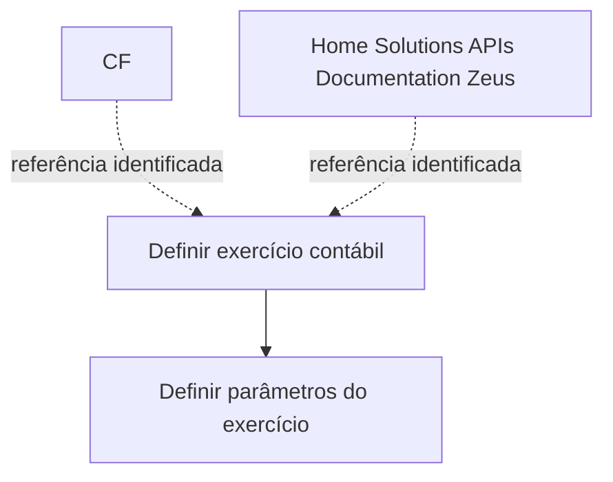

# Definição de Exercício Contábil — Processo e Parâmetros

## 1. Metadados do Documento
- **Arquivo de Origem:** Não identificado
- **Tipo de Documento:** Procedimento
- **Domínio / Sistema:** Exercício contábil; Home Solutions APIs Documentation Zeus; CF
- **Público-Alvo:** Não identificado
- **Data/Versão Identificada:** Não identificada

---

## 2. Resumo Executivo & Contexto de Negócio

O documento apresenta a definição de **exercício contábil** e estabelece como objetivo definir o período temporal no qual serão realizadas operações contábeis.

Além da delimitação do período, o documento informa que devem ser definidas as condições que determinarão a forma de trabalho sobre esse período contábil.

O processo descrito possui duas etapas: primeiro, definir o exercício contábil; depois, definir os parâmetros do exercício. O conteúdo fornecido não detalha critérios, telas, responsáveis, regras de validação ou valores dos parâmetros.

---

## 3. Arquitetura, Componentes & Tecnologias Envolvidas

Os únicos elementos de sistema ou referência tecnológica identificados no conteúdo são **CF**, **Home Solutions APIs Documentation** e **Zeus**. O documento não explica a função, integração, arquitetura, APIs, métodos HTTP ou contratos desses elementos.



**Nota de Análise:** O conteúdo não apresenta arquitetura de software, integrações técnicas, ambientes, componentes internos, endpoints ou tecnologias implementadas.

---

## 4. Regras de Negócio, Especificações Funcionais & Processos

### Objetivo funcional

O exercício contábil deve definir:

1. O período de tempo em que serão realizadas as operações contábeis.
2. As condições que determinarão a forma de trabalhar sobre esse período.

### Processo identificado

1. **Definir exercício contábil**
   - Etapa identificada como item **(1)**.
   - O conteúdo não detalha dados de entrada, critérios de início e fim, responsáveis ou validações.

2. **Definir parâmetros do exercício**
   - Etapa identificada como item **(2)**.
   - O conteúdo não informa quais parâmetros devem ser definidos, seus tipos, valores permitidos ou efeitos operacionais.

---

## 5. Tabelas de Parâmetros, Ambientes e Estruturas de Dados

| Item / Parâmetro | Descrição / Função | Tipo / Valores / Formato | Ambiente / Observações |
| :--- | :--- | :--- | :--- |
| Exercício contábil | Período de tempo no qual serão realizadas operações contábeis. | Não detalhado | Deve ter condições que definam a forma de trabalho sobre o período. |
| Definir exercício contábil | Primeira etapa do processo apresentado. | Etapa (1) | Sem detalhamento adicional. |
| Definir parâmetros do exercício | Segunda etapa do processo apresentado. | Etapa (2) | O documento não lista os parâmetros. |
| CF | Referência textual presente no documento. | Não detalhado | Relação funcional não especificada. |
| Home Solutions APIs Documentation Zeus | Referência textual presente no documento. | Não detalhado | Não há especificação de APIs, rotas ou integrações. |

---

## 6. Bateria de Perguntas & Respostas para RAG (FAQ Sintético)

### P1: Qual é o objetivo da definição de exercício contábil?
**R:** O objetivo é definir o período de tempo no qual serão realizadas as operações contábeis e as condições que determinarão a forma de trabalhar sobre esse período.

### P2: Quais são as etapas do processo de definição de exercício contábil?
**R:** O processo possui duas etapas apresentadas: definir o exercício contábil, como etapa (1), e definir os parâmetros do exercício, como etapa (2).

### P3: O documento informa como determinar as datas de início e término do exercício contábil?
**R:** Não. O documento informa que o exercício contábil define um período de tempo, mas não apresenta critérios, formato de data ou regras para determinar início e término.

### P4: Quais parâmetros devem ser configurados para o exercício contábil?
**R:** O conteúdo indica a etapa “definir parâmetros do exercício”, mas não lista nem descreve os parâmetros que devem ser configurados.

### P5: O que determina a forma de trabalho sobre o período contábil?
**R:** Segundo o objetivo apresentado, as condições definidas para o exercício contábil determinarão a forma de trabalhar sobre o período. Essas condições não são detalhadas.

### P6: O documento descreve validações para a definição do exercício contábil?
**R:** Não. Não foram identificadas regras de validação, condições de aprovação, mensagens de erro ou restrições operacionais.

### P7: Qual é a relação de CF com o exercício contábil?
**R:** O termo “CF” aparece no conteúdo bruto, mas o documento fornecido não explica sua relação funcional ou técnica com o processo de definição do exercício contábil.

### P8: Quais APIs de Zeus são utilizadas no processo?
**R:** O conteúdo menciona “Home Solutions APIs Documentation Zeus”, mas não identifica APIs, endpoints, métodos HTTP, contratos JSON ou fluxos de integração associados.

### P9: O documento identifica ambientes, servidores ou URLs?
**R:** Não. Não foram identificados ambientes, servidores, URLs, portas, caminhos de log ou configurações de implantação.

---

## 7. Glossário de Termos, Siglas & Conceitos-Chave

- **Exercício contábil:** Período de tempo no qual serão realizadas operações contábeis, conforme o objetivo descrito no documento.
- **CF:** Termo citado no conteúdo sem expansão ou definição.
- **Home Solutions APIs Documentation Zeus:** Referência textual citada no conteúdo sem detalhamento de função, produto ou integração.
- **Parâmetros do exercício:** Elementos que devem ser definidos na segunda etapa do processo; o documento não descreve quais são esses elementos.

---

## 8. Notas Críticas, Riscos & Limitações

- O documento apresenta somente o objetivo e duas etapas de alto nível do processo.
- Não há detalhamento dos parâmetros do exercício contábil.
- Não há regras de negócio específicas, critérios de cálculo, condições de validação, exceções ou responsabilidades.
- Não há informações sobre interfaces, arquitetura, APIs, ambientes, servidores, URLs, logs ou integrações.
- **Nota de Análise:** O documento menciona “Home Solutions APIs Documentation Zeus”, porém não detalha métodos HTTP, contratos JSON, operações ou relação com a definição de exercício contábil.

---

## 9. Conteúdo Bruto Estruturado (Referência Fiel)

```text
--- [PÁGINA 1 DE 1] ---

EN CONSTRUCCIÓN
DEFINICIÓN de ejercicio contable
Objetivo
Definir el periodo de tiempo en el que se realizarán las operaciones contables y las condiciones que
determinarán la forma de trabajar sobre este período.
Proceso a seguir
DEFINIR ejercicio
contable
(1)
DEFINIR parámetros
del ejercicio
(2)
1. DEFINIR ejercicio contable
1. DEFINIR parámetros del ejercicio
 / 
 CF
Home Solutions APIs Documentation Zeus
EN
```
