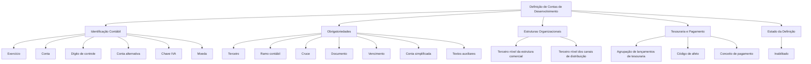

# Definição de Contas de Desenvolvimento — Características e Parâmetros Contábeis

## 1. Metadados do Documento
- **Arquivo de Origem:** Não identificado
- **Tipo de Documento:** Especificação Técnica
- **Domínio / Sistema:** Contas de desenvolvimento / plano de contas contábil
- **Público-Alvo:** Desenvolvedores, Analistas Funcionais, Operação e Negócio
- **Data/Versão Identificada:** Não identificada

---

## 2. Resumo Executivo & Contexto de Negócio

O documento define características e parâmetros aplicáveis às contas de desenvolvimento de um plano de contas. O objetivo explícito é determinar as propriedades gerais e as obrigatoriedades associadas a cada conta contábil.

A definição de uma conta contempla identificadores contábeis, como exercício, conta, dígito de controle, conta alternativa, chave de IVA e moeda. Esses elementos qualificam a conta dentro do contexto do exercício e do plano contábil.

O documento também especifica indicadores de obrigatoriedade para informações de terceiros, ramo contábil, cruzamento, documento, vencimento, conta simplificada e textos auxiliares. Esses indicadores orientam quais dados devem ser fornecidos ao utilizar uma conta.

Há ainda atributos vinculados à estrutura comercial, à estrutura de canais de distribuição, à agrupação de lançamentos de tesouraria, ao código de afeto, ao conceito de pagamento e ao estado de habilitação da definição. O conteúdo não descreve métodos HTTP, contratos JSON, persistência de dados, tecnologias de implementação ou fluxos operacionais detalhados.

---

## 3. Arquitetura, Componentes & Tecnologias Envolvidas

O documento não apresenta uma arquitetura de software, microsserviços, tecnologias, servidores, ambientes ou integrações. O conteúdo descreve uma estrutura funcional para definição de contas de desenvolvimento e seus atributos contábeis.



**Nota de Análise:** O documento não detalha relações de dados, interfaces, mecanismos de integração, responsáveis pelos componentes ou tecnologia subjacente.

---

## 4. Regras de Negócio, Especificações Funcionais & Processos

1. Uma definição de conta de desenvolvimento é associada a um **exercício**, identificado pela chave do exercício para o qual o plano de contas é definido.
2. A **conta** é identificada pela chave da conta contábil.
3. O **dígito de controle** corresponde ao dígito de controle da conta.
4. A **conta alternativa** representa uma chave alternativa da conta contábil.
5. A **chave IVA** corresponde à chave de imposto de IVA.
6. A **moeda** é identificada pela chave da moeda.
7. O atributo **terceiro** determina se o terceiro é obrigatório.
8. O atributo **ramo contábil** determina se o ramo contábil é obrigatório.
9. O atributo **cruce** determina se o número de cruzamento é obrigatório.
10. O atributo **documento** determina se o documento é obrigatório.
11. O atributo **vencimento** determina se a data de vencimento é obrigatória.
12. O atributo **conta simplificada** determina se a conta simplificada é obrigatória.
13. O **primeiro texto auxiliar**, o **segundo texto auxiliar** e o **terceiro texto auxiliar** possuem indicadores que determinam se cada texto é obrigatório.
14. O **terceiro nível da estrutura comercial** identifica a estrutura comercial referenciada como `cod_nivel3`.
15. A **agrupação de lançamentos de tesouraria** é apresentada como atributo da definição, sem detalhamento adicional.
16. O **terceiro nível da estrutura de canais de distribuição** determina se a fonte de produção da estrutura de canais é obrigatória.
17. O campo **afeto** aceita os seguintes códigos:
   - `(1)` Reserva técnica.
   - `(2)` Capital mínimo de garantia.
   - `(0)` Sem afeto.
   - `(3)` Outros passivos.
18. A **marca de conceito de pagamento** é definida pelo atributo conceito de pagamento.
19. O atributo **inabilitado** define se a definição está ativa ou se não pode mais ser considerada.

---

## 5. Tabelas de Parâmetros, Ambientes e Estruturas de Dados

| Item / Parâmetro | Descrição / Função | Tipo / Valores / Formato | Ambiente / Observações |
| :--- | :--- | :--- | :--- |
| Exercício | Chave do exercício para o qual se define o plano de contas. | Chave de exercício. | Não detalhado. |
| Conta | Chave da conta contábil. | Chave de conta contábil. | Não detalhado. |
| Dígito de controle | Dígito de controle da conta. | Não detalhado. | Não detalhado. |
| Conta alternativa | Chave alternativa da conta contábil. | Chave alternativa. | Não detalhado. |
| Chave IVA | Chave de imposto de IVA. | Chave de imposto. | Não detalhado. |
| Moeda | Chave da moeda. | Chave de moeda. | Não detalhado. |
| Terceiro | Define se o terceiro é obrigatório. | Indicador de obrigatoriedade. | Não detalhado. |
| Ramo contábil | Define se o ramo contábil é obrigatório. | Indicador de obrigatoriedade. | Não detalhado. |
| Cruce | Define se o número de cruzamento é obrigatório. | Indicador de obrigatoriedade. | Não detalhado. |
| Documento | Define se o documento é obrigatório. | Indicador de obrigatoriedade. | Não detalhado. |
| Vencimento | Define se a data de vencimento é obrigatória. | Indicador de obrigatoriedade. | Não detalhado. |
| Conta simplificada | Define se a conta simplificada é obrigatória. | Indicador de obrigatoriedade. | Não detalhado. |
| Primeiro texto auxiliar | Define se o primeiro texto auxiliar é obrigatório. | Indicador de obrigatoriedade. | Não detalhado. |
| Segundo texto auxiliar | Define se o segundo texto auxiliar é obrigatório. | Indicador de obrigatoriedade. | Não detalhado. |
| Terceiro texto auxiliar | Define se o terceiro texto auxiliar é obrigatório. | Indicador de obrigatoriedade. | Não detalhado. |
| Terceiro nível da estrutura comercial | Identifica a estrutura comercial. | Referência `cod_nivel3`. | Não detalhado. |
| Agrupação de lançamentos de tesouraria | Atributo relativo à agrupação de lançamentos de tesouraria. | Não detalhado. | O documento não fornece regra complementar. |
| Terceiro nível da estrutura de canais de distribuição | Define se a fonte de produção da estrutura de canais é obrigatória. | Indicador de obrigatoriedade. | Não detalhado. |
| Afeto | Classifica a conta conforme o código de afeto. | `(1)`, `(2)`, `(0)` ou `(3)`. | Ver tabela de códigos de afeto. |
| Conceito de pagamento | Marca de conceito de pagamento. | Marca/indicador não detalhado. | Não detalhado. |
| Inabilitado | Determina se a definição está ativa ou se não pode mais ser considerada. | Indicador de estado. | Não detalhado. |

| Código de Afeto | Descrição / Função | Tipo / Valores / Formato | Ambiente / Observações |
| :--- | :--- | :--- | :--- |
| `(1)` | Reserva técnica. | Código de afeto. | Não detalhado. |
| `(2)` | Capital mínimo de garantia. | Código de afeto. | Não detalhado. |
| `(0)` | Sem afeto. | Código de afeto. | Não detalhado. |
| `(3)` | Outros passivos. | Código de afeto. | Não detalhado. |

---

## 6. Bateria de Perguntas & Respostas para RAG (FAQ Sintético)

### P1: Qual é o objetivo da definição de contas de desenvolvimento?
**R:** O objetivo é determinar as características e os parâmetros das contas de desenvolvimento, incluindo propriedades gerais, chaves contábeis, obrigatoriedades de campos e classificações específicas.

### P2: O que identifica o campo exercício na definição de uma conta?
**R:** O campo exercício representa a chave do exercício para o qual o plano de contas é definido.

### P3: Qual é a finalidade da conta alternativa?
**R:** A conta alternativa é uma chave alternativa da conta contábil.

### P4: O que a chave IVA representa?
**R:** A chave IVA representa a chave de imposto de IVA associada à definição da conta.

### P5: Quais campos podem ter obrigatoriedade definida para uma conta?
**R:** O documento indica obrigatoriedade para terceiro, ramo contábil, número de cruzamento, documento, data de vencimento, conta simplificada, primeiro texto auxiliar, segundo texto auxiliar e terceiro texto auxiliar.

### P6: O que determina o atributo terceiro?
**R:** O atributo terceiro determina se o terceiro é obrigatório para a conta definida.

### P7: Como o documento trata a estrutura comercial?
**R:** O terceiro nível da estrutura comercial identifica a estrutura comercial por meio da referência `cod_nivel3`.

### P8: Qual é a regra descrita para o terceiro nível da estrutura de canais de distribuição?
**R:** O terceiro nível da estrutura de canais de distribuição determina se a fonte de produção da estrutura de canais é obrigatória.

### P9: Quais valores são permitidos para o código de afeto?
**R:** Os valores apresentados são `(1)` para Reserva técnica, `(2)` para Capital mínimo de garantia, `(0)` para Sem afeto e `(3)` para Outros passivos.

### P10: O que significa marcar uma definição como inabilitada?
**R:** Uma definição inabilitada deixa de poder ser considerada. Caso contrário, a definição permanece ativa.

### P11: O documento detalha o comportamento da agrupação de lançamentos de tesouraria?
**R:** Não. O documento apenas lista a agrupação de lançamentos de tesouraria como atributo, sem fornecer regras adicionais, valores, formato ou processo operacional.

### P12: O documento informa tecnologias, URLs, serviços ou contratos de integração?
**R:** Não. O documento não apresenta tecnologias, URLs, microsserviços, contratos de API, ambientes, métodos HTTP ou formatos de integração.

---

## 7. Glossário de Termos, Siglas & Conceitos-Chave

- **IVA:** Imposto sobre o valor agregado, conforme a expressão “clave impuesto de iva” no documento.
- **Exercício:** Período identificado por uma chave para o qual o plano de contas é definido.
- **Conta contábil:** Conta identificada por uma chave dentro do plano de contas.
- **Dígito de controle:** Dígito associado à conta para controle.
- **Conta alternativa:** Chave alternativa da conta contábil.
- **Terceiro:** Entidade cuja obrigatoriedade pode ser determinada na definição da conta.
- **Ramo contábil:** Informação contábil cuja obrigatoriedade pode ser determinada.
- **Cruce:** Número de cruzamento cuja obrigatoriedade pode ser determinada.
- **Vencimento:** Data de vencimento cuja obrigatoriedade pode ser determinada.
- **Estrutura comercial:** Estrutura identificada pelo terceiro nível, referenciado como `cod_nivel3`.
- **Estrutura de canais de distribuição:** Estrutura cujo terceiro nível determina a obrigatoriedade da fonte de produção.
- **Afeto:** Código que classifica a conta como Reserva técnica, Capital mínimo de garantia, Sem afeto ou Outros passivos.
- **Inabilitado:** Estado que indica que uma definição não pode mais ser considerada.

---

## 8. Notas Críticas, Riscos & Limitações

- O documento não identifica arquivo de origem, versão, data, autor, sistema corporativo ou responsável funcional.
- Não há descrição de arquitetura de software, componentes técnicos, banco de dados, APIs, integrações, ambientes, URLs ou rotas de logs.
- Os tipos de dados, formatos, tamanhos, valores booleanos e regras de validação para os indicadores de obrigatoriedade não são especificados.
- O documento cita a agrupação de lançamentos de tesouraria, mas não detalha regras, critérios de agrupamento ou comportamento operacional.
- O documento lista o campo conceito de pagamento, porém não define valores aceitos, efeitos funcionais ou critérios de utilização.
- A referência `cod_nivel3` é apresentada para a estrutura comercial, mas não há definição adicional do código ou de sua origem.
- Não há detalhamento sobre como uma definição é habilitada, inabilitada, criada, alterada ou validada.

---

## 9. Conteúdo Bruto Estruturado (Referência Fiel)

```text
--- [PÁGINA 1 DE 3] ---

DEFINICIÓN de Cuentas de desarrollo
Objetivo
Determinar las características y parámetros de las cuentas de desarrollo.
Propiedades generales
Propiedades generales
Ejercicio
Clave del ejercicio para el que se define el plan de cuentas.
Cuenta
Clave de la cuenta contable.
Dígito de control
Dígito de control de la cuenta.
Cuenta alternativa
Clave alternativa de la cuenta contable.
Clave IVA
 / 
 CF
Inicio Soluciones APIs Documentación Zeus
ES


--- [PÁGINA 2 DE 3] ---

Clave impuesto de iva.
Moneda
Clave de la moneda.
Tercero
Determina si el tercero es obligatorio.
Ramo contable
Determina si el ramo contable es obligatorio.
Cruce
Determina si el número de cruce es obligatorio.
Documento
Determina si el documento es obligatorio.
Vencimiento
Determina si la fecha de vencimiento es obligatoria.
Cuenta simplificada
Determina si la cuenta simplificada es obligatoria.
Primer texto auxiliar
Determina si el primer texto auxiliar es obligatorio.
Segundo texto auxiliar
Determina si el segundo texto auxiliar es obligatorio.
Tercer texto auxiliar
Determina si el tercer texto auxiliar es obligatorio.
Tercer nivel de la estructura comercial
Identifica la [estructura comercial][cod_nivel3].
Detalle


--- [PÁGINA 3 DE 3] ---

Agrupación de asientos de tesorería.
Tercer nivel de la estructura de canales de distribución
Determina si la fuente de producción de la estructura de canales es obligatoria.
Afecto
Código de afecto
(1)Reserva técnica
(2)Capital mínimo de garantía
(0)Sin afecto
(3)Otros pasivos
Concepto de pago
Marca de concepto de pago.
Inhabilitado
En este punto se determina si la definición está activa, o por el contrario ya no puede tenerse en
cuenta.
```
