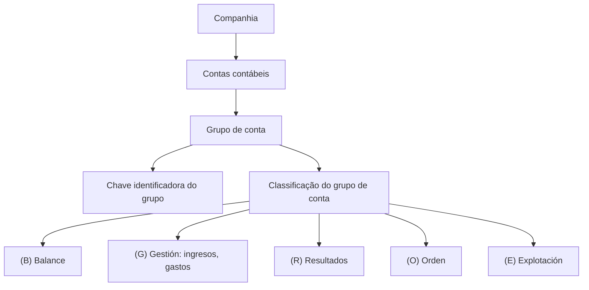

# Definição de Grupos de Conta Contábil

## 1. Metadados do Documento
- **Arquivo de Origem:** Não identificado
- **Tipo de Documento:** Especificação Técnica
- **Domínio / Sistema:** Grupos de conta contábil
- **Público-Alvo:** Negócio, analistas funcionais e desenvolvedores
- **Data/Versão Identificada:** Não identificada

---

## 2. Resumo Executivo & Contexto de Negócio

O documento define o conceito de **grupos de conta** para a organização das contas contábeis utilizadas pela companhia. O objetivo explicitamente apresentado é estabelecer uma agrupação das contas contábeis.

A estrutura descrita possui uma propriedade denominada **Grupo de conta**, definida como a chave que identifica um grupo de contas contábeis. Essa propriedade permite identificar a classificação associada a um conjunto de contas.

O documento também apresenta a propriedade **Classificação grupo conta**, que representa o tipo de conta. As classificações disponíveis incluem Balance, Gestión, Resultados, Orden e Explotación.

Não foram apresentados detalhes adicionais sobre regras de criação, manutenção, relacionamentos entre contas e grupos, persistência de dados, integrações, métodos HTTP, contratos JSON, ambientes ou mecanismos de validação.

---

## 3. Arquitetura, Componentes & Tecnologias Envolvidas

O conteúdo não descreve arquitetura de software, serviços, bancos de dados, integrações, tecnologias ou ambientes. A única estrutura funcional identificada é a relação entre uma chave de grupo de conta e uma classificação de grupo de conta.



> **Nota de Análise:** O documento não detalha componentes técnicos, fluxos de integração, serviços, tecnologias ou contratos expostos.

---

## 4. Regras de Negócio, Especificações Funcionais & Processos

1. A companhia utiliza contas contábeis.
2. As contas contábeis devem ser agrupadas por meio do conceito de **Grupo de conta**.
3. Um **Grupo de conta** é identificado por uma chave.
4. A **Classificação grupo conta** representa o tipo de conta associado ao grupo.
5. As classificações explicitamente listadas são:
   - **(B) Balance**
   - **(G) Gestión:** ingresos, gastos
   - **(R) Resultados**
   - **(O) Orden**
   - **(E) Explotación**

> **Nota de Análise:** O documento não especifica se as classificações são mutuamente exclusivas, obrigatórias, configuráveis, nem quais validações devem ser aplicadas à chave identificadora do grupo de conta.

---

## 5. Tabelas de Parâmetros, Ambientes e Estruturas de Dados

| Item / Parâmetro | Descrição / Função | Tipo / Valores / Formato | Ambiente / Observações |
| :--- | :--- | :--- | :--- |
| Grupo de conta | Chave que identifica o grupo de contas contábeis. | Chave; formato não informado. | Aplicável às contas contábeis utilizadas pela companhia. |
| Classificação grupo conta | Define o tipo de conta do grupo de conta. | Classificação; valores listados no documento. | Não há ambiente informado. |
| (B) Balance | Classificação de grupo de conta. | Código `B`. | Sem detalhamento adicional. |
| (G) Gestión | Classificação de grupo de conta associada a ingresos e gastos. | Código `G`. | O documento associa explicitamente Gestión a ingresos e gastos. |
| (R) Resultados | Classificação de grupo de conta. | Código `R`. | Sem detalhamento adicional. |
| (O) Orden | Classificação de grupo de conta. | Código `O`. | Sem detalhamento adicional. |
| (E) Explotación | Classificação de grupo de conta. | Código `E`. | Sem detalhamento adicional. |

---

## 6. Bateria de Perguntas & Respostas para RAG (FAQ Sintético)

### P1: Qual é o objetivo da definição de grupos de conta?
**R:** O objetivo é definir a agrupação das contas contábeis utilizadas pela companhia.

### P2: O que é um grupo de conta?
**R:** Um grupo de conta é uma estrutura usada para agrupar contas contábeis utilizadas pela companhia. O documento indica que o grupo de conta possui uma chave identificadora.

### P3: Qual propriedade identifica um grupo de contas contábeis?
**R:** A propriedade **Grupo de conta** é definida como a chave que identifica o grupo de contas contábeis.

### P4: O que representa a classificação de grupo de conta?
**R:** A **Classificação grupo conta** representa o tipo de conta associado ao grupo de conta, incluindo classificações como Balance, Gestión, Resultados, Orden e Explotación.

### P5: Qual código representa a classificação Balance?
**R:** O código **(B)** representa a classificação **Balance**.

### P6: O que significa a classificação Gestión no documento?
**R:** A classificação **(G) Gestión** é apresentada como relacionada a **ingresos** e **gastos**.

### P7: Qual código representa a classificação Resultados?
**R:** O código **(R)** representa a classificação **Resultados**.

### P8: Quais classificações de grupo de conta são listadas?
**R:** As classificações listadas são **(B) Balance**, **(G) Gestión: ingresos, gastos**, **(R) Resultados**, **(O) Orden** e **(E) Explotación**.

### P9: O documento define o formato técnico da chave do grupo de conta?
**R:** Não. O documento informa apenas que o grupo de conta é uma chave que identifica o grupo de contas contábeis, sem definir formato, tamanho, tipo de dado ou regra de geração.

### P10: O documento informa APIs, integrações ou contratos de dados para grupos de conta?
**R:** Não. O conteúdo não detalha APIs, métodos HTTP, integrações, contratos JSON, persistência de dados ou tecnologias relacionadas aos grupos de conta.

---

## 7. Glossário de Termos, Siglas & Conceitos-Chave

- **Grupo de conta:** Chave que identifica o grupo de contas contábeis.
- **Classificação grupo conta:** Tipo de conta associado a um grupo de conta.
- **(B) Balance:** Classificação de grupo de conta denominada Balance.
- **(G) Gestión:** Classificação de grupo de conta associada a ingresos e gastos.
- **Ingresos:** Termo apresentado no documento como associado à classificação Gestión.
- **Gastos:** Termo apresentado no documento como associado à classificação Gestión.
- **(R) Resultados:** Classificação de grupo de conta denominada Resultados.
- **(O) Orden:** Classificação de grupo de conta denominada Orden.
- **(E) Explotación:** Classificação de grupo de conta denominada Explotación.

---

## 8. Notas Críticas, Riscos & Limitações

- O arquivo de origem, a data e a versão não foram identificados no conteúdo fornecido.
- O documento não especifica o formato, a unicidade ou regras de manutenção da chave de grupo de conta.
- O documento não define se cada grupo pode possuir uma única classificação ou múltiplas classificações.
- Não há detalhamento sobre contas contábeis específicas, relacionamentos de dados, persistência, permissões ou auditoria.
- Não foram informados sistemas, ambientes, URLs, servidores, APIs, fluxos de integração ou tecnologias.
- As classificações Balance, Resultados, Orden e Explotación não possuem descrição funcional adicional no conteúdo disponível.

---

## 9. Conteúdo Bruto Estruturado (Referência Fiel)

```text
--- [PÁGINA 1 DE 1] ---

DEFINICIÓN de Grupos de cuenta
Objetivo
El objetivo es definir la agrupación de las cuentas contables que utiliza la compañía.
Propiedades generales
Propiedades generales
Grupo de cuenta
Clave que identifica el grupo de cuentas contables.
Clasificación grupo cuenta
Tipo de cuenta (balance, gestión, etc)
(B)Balance
(G)Gestión: ingresos, gastos
(R)Resultados
(O)Orden
(E)Explotación
 /
 CF
Inicio Soluciones APIs Documentación Zeus
ES
```
