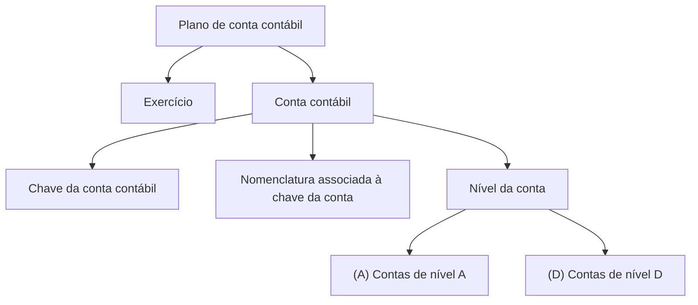

# Definição de Plano de Conta Contábil

## 1. Metadados do Documento
- **Arquivo de Origem:** Não identificado
- **Tipo de Documento:** Especificação Técnica
- **Domínio / Sistema:** Plano de conta contábil
- **Público-Alvo:** Negócio, analistas funcionais e desenvolvedores
- **Data/Versão Identificada:** Não identificada

---

## 2. Resumo Executivo & Contexto de Negócio

O documento define o propósito de um plano de conta contábil: determinar as contas que o compõem. A descrição fornecida está centrada na estrutura e nas propriedades gerais de cada conta contábil.

Cada definição de conta está associada a um exercício, uma chave de conta, uma nomenclatura e um nível estrutural. O exercício delimita o período para o qual o plano de contas é definido.

A estrutura apresentada categoriza explicitamente contas nos níveis `A` e `D`. O conteúdo não descreve regras de lançamento contábil, critérios de cálculo, integrações, validações, métodos HTTP, contratos de dados ou comportamentos operacionais adicionais.

---

## 3. Arquitetura, Componentes & Tecnologias Envolvidas

O conteúdo não descreve arquitetura de software, sistemas integrados, microsserviços, bancos de dados, tecnologias, ferramentas, ambientes ou fluxos técnicos. A estrutura conceitual identificada relaciona o plano de contas às propriedades de cada conta contábil.



**Nota de Análise:** o documento não detalha componentes técnicos, persistência, interfaces, integrações ou tecnologias associadas ao plano de conta contábil.

---

## 4. Regras de Negócio, Especificações Funcionais & Processos

1. O plano de conta contábil é definido para determinar as contas que o formam.
2. O exercício representa a chave do exercício para o qual o plano de contas é definido.
3. A conta representa a chave da conta contábil.
4. O nome representa a nomenclatura associada à chave de conta.
5. O nível da conta identifica o nível da estrutura ao qual a conta pertence.
6. O documento apresenta duas classificações de nível:
   - `(A)` Contas de nível A.
   - `(D)` Contas de nível D.

**Nota de Análise:** não foram fornecidos critérios para determinar quando uma conta deve pertencer ao nível `A` ou `D`, nem regras de obrigatoriedade, unicidade, validação ou hierarquia entre contas.

---

## 5. Tabelas de Parâmetros, Ambientes e Estruturas de Dados

| Item / Parâmetro | Descrição / Função | Tipo / Valores / Formato | Ambiente / Observações |
| :--- | :--- | :--- | :--- |
| Exercício | Chave do exercício para o qual o plano de contas é definido. | Não informado. | O documento não apresenta formato ou exemplos. |
| Conta | Chave da conta contábil. | Não informado. | O documento não apresenta formato ou exemplos. |
| Nome | Nomenclatura associada à chave de conta. | Não informado. | O documento não apresenta regras de nomenclatura. |
| Nível conta | Identifica o nível estrutural ao qual a conta pertence. | `(A)` ou `(D)`. | São citadas contas de nível A e contas de nível D. |
| `(A)` | Contas de nível A. | Valor de classificação de nível. | Sem detalhamento adicional. |
| `(D)` | Contas de nível D. | Valor de classificação de nível. | Sem detalhamento adicional. |

**Nota de Análise:** o conteúdo não fornece URLs, servidores, logs, variáveis de ambiente, ambientes de implantação ou estruturas técnicas de dados além das propriedades conceituais listadas.

---

## 6. Bateria de Perguntas & Respostas para RAG (FAQ Sintético)

### P1: Qual é o objetivo do plano de conta contábil descrito no documento?
**R:** O objetivo é determinar as contas que formam o plano de conta contábil.

### P2: O que representa o campo Exercício no plano de contas?
**R:** O campo Exercício representa a chave do exercício para o qual o plano de contas é definido.

### P3: O que é o campo Conta?
**R:** O campo Conta corresponde à chave da conta contábil.

### P4: Qual é a finalidade do campo Nome?
**R:** O campo Nome contém a nomenclatura associada à chave de conta.

### P5: O que o campo Nível conta identifica?
**R:** O campo Nível conta identifica o nível da estrutura ao qual a conta pertence.

### P6: Quais níveis de conta são explicitamente citados?
**R:** O documento cita `(A)` para contas de nível A e `(D)` para contas de nível D.

### P7: O documento explica os critérios para classificar uma conta no nível A ou no nível D?
**R:** Não. O documento apenas lista as contas de nível A e as contas de nível D, sem definir critérios de classificação.

### P8: Há informações sobre integrações ou microsserviços relacionados ao plano de contas?
**R:** Não. O conteúdo não descreve integrações, microsserviços, APIs, métodos HTTP ou contratos JSON.

### P9: O documento informa o formato da chave de conta contábil?
**R:** Não. O conteúdo informa apenas que Conta é a chave da conta contábil, sem especificar formato, tamanho ou regra de validação.

### P10: Existem regras de validação para o nome ou a nomenclatura da conta?
**R:** Não. O documento informa que o Nome é a nomenclatura associada à chave de conta, mas não apresenta regras de preenchimento ou validação.

---

## 7. Glossário de Termos, Siglas & Conceitos-Chave

- **Plano de conta contábil:** conjunto de contas cuja determinação é o objetivo do documento.
- **Exercício:** chave do exercício para o qual o plano de contas é definido.
- **Conta:** chave da conta contábil.
- **Nome:** nomenclatura associada à chave de conta.
- **Nível conta:** identificador do nível estrutural ao qual uma conta pertence.
- **(A):** classificação indicada para contas de nível A.
- **(D):** classificação indicada para contas de nível D.

---

## 8. Notas Críticas, Riscos & Limitações

- O arquivo de origem, a data e a versão do documento não foram identificados.
- Não há detalhamento sobre os critérios de negócio que distinguem contas de nível `A` das contas de nível `D`.
- Não há formato, cardinalidade, obrigatoriedade ou regra de validação para Exercício, Conta, Nome ou Nível conta.
- Não há informações sobre operações contábeis, lançamentos, integrações, APIs, segurança, auditoria ou gestão de erros.
- O trecho `CF` é apresentado sem contextualização; seu significado não pode ser inferido com fidelidade.

---

## 9. Conteúdo Bruto Estruturado (Referência Fiel)

```text
--- [PÁGINA 1 DE 2] ---

DEFINICIÓN de Plan de cuenta contable
Objetivo
Determinar las cuentas que forman el plan de cuenta contable.
Propiedades generales
Propiedades generales
Ejercicio
Clave del ejercicio para el que se define el plan de cuentas.
Cuenta
Clave de la cuenta contable.
Nombre
Nomenclatura asociada a la clave de cuenta.
Nivel cuenta
Identifica el nivel de la estructura al que pertenece la cuenta.
(A)Cuentas nivel A
(D)Cuentas nivel D
 /
 CF
Inicio Soluciones APIs Documentación Zeus
ES


--- [PÁGINA 2 DE 2] ---

[Página em branco ou apenas elementos visuais/imagem]
```
