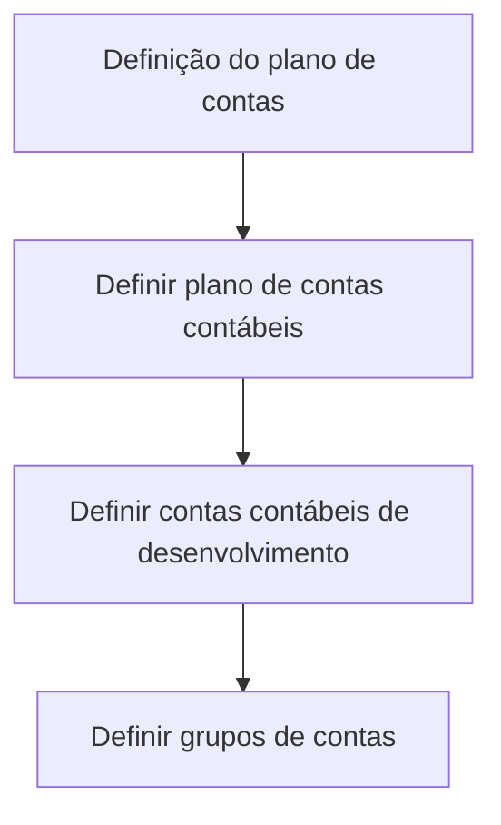

# Definição de Plano de Contas Contábeis — Processo em Construção

## 1. Metadados do Documento
- **Arquivo de Origem:** Não identificado
- **Tipo de Documento:** Procedimento
- **Domínio / Sistema:** Definição de plano de contas contábeis
- **Público-Alvo:** Negócio, Contabilidade e Operação
- **Data/Versão Identificada:** Não identificada

---

## 2. Resumo Executivo & Contexto de Negócio

O documento descreve, em estado de construção, a definição de um plano de contas para utilização pela companhia durante o exercício contábil. O objetivo declarado é estabelecer as contas utilizadas e os parâmetros correspondentes a cada conta.

O processo apresentado possui três atividades: definição do plano de contas contábeis, definição das contas contábeis de desenvolvimento e definição dos grupos de contas. A sequência visual sugere que essas atividades compõem o processo de configuração do plano de contas.

Não há detalhamento sobre responsáveis, critérios de validação, campos obrigatórios, integrações, sistemas operacionais, regras de classificação ou procedimentos de aprovação. O conteúdo também referencia “Home Solutions APIs Documentation Zeus”, sem explicar a relação dessa referência com o processo contábil.

---

## 3. Arquitetura, Componentes & Tecnologias Envolvidas

O documento não descreve arquitetura de software, tecnologias, APIs, ambientes ou integrações técnicas. Os componentes funcionais explicitamente citados são:

- Plano de contas contábeis.
- Contas contábeis de desenvolvimento.
- Grupos de contas.
- Referência textual: `Home Solutions APIs Documentation Zeus`.



> **Nota de Análise:** O documento apresenta um fluxo de três etapas, mas não detalha entradas, saídas, responsáveis, dependências nem regras de transição entre as atividades.

---

## 4. Regras de Negócio, Especificações Funcionais & Processos

### Objetivo declarado

Definir as contas utilizadas pela companhia dentro do exercício contábil e os parâmetros correspondentes a cada conta.

### Processo apresentado

1. **Definir plano de contas contábeis**
   - O documento identifica esta atividade como a primeira definição do processo.
   - Não há especificação dos atributos do plano de contas.

2. **Definir contas contábeis de desenvolvimento**
   - O documento identifica esta atividade como a segunda definição do processo.
   - Não há explicação do significado de “desenvolvimento”, nem critérios para criação ou classificação dessas contas.

3. **Definir grupos de contas**
   - O documento identifica esta atividade como a terceira definição do processo.
   - Não há regras de agrupamento, hierarquia, nomenclatura ou associação entre grupos e contas.

> **Nota de Análise:** O documento não fornece regras de negócio adicionais, parâmetros de cálculo, condições de validação, restrições ou fluxos de exceção.

---

## 5. Tabelas de Parâmetros, Ambientes e Estruturas de Dados

| Item / Parâmetro | Descrição / Função | Tipo / Valores / Formato | Ambiente / Observações |
| :--- | :--- | :--- | :--- |
| Plano de contas contábeis | Conjunto de contas utilizadas pela companhia no exercício contábil. | Não especificado. | Deve ser definido no processo apresentado. |
| Parâmetros por conta | Parâmetros correspondentes a cada conta utilizada pela companhia. | Não especificado. | O documento não detalha nomes, formatos ou valores permitidos. |
| Contas contábeis de desenvolvimento | Etapa de definição de contas contábeis identificadas como “de desenvolvimento”. | Não especificado. | Sem detalhamento funcional adicional. |
| Grupos de contas | Etapa de definição de agrupamentos de contas. | Não especificado. | Sem regras de associação ou hierarquia. |
| Home Solutions APIs Documentation Zeus | Referência textual exibida ao final do conteúdo. | Não especificado. | A relação com o processo não é explicada. |

---

## 6. Bateria de Perguntas & Respostas para RAG (FAQ Sintético)

### P1: Qual é o objetivo da definição do plano de contas?
**R:** O objetivo é definir as contas utilizadas pela companhia dentro do exercício contábil e os parâmetros correspondentes a cada conta.

### P2: Quais são as etapas apresentadas para a definição do plano de contas?
**R:** O documento apresenta três etapas: definir o plano de contas contábeis, definir as contas contábeis de desenvolvimento e definir os grupos de contas.

### P3: O documento especifica quais parâmetros devem ser configurados para cada conta?
**R:** Não. O documento informa que existem parâmetros correspondentes a cada conta, mas não identifica os parâmetros, seus tipos, formatos ou valores permitidos.

### P4: O que são contas contábeis de desenvolvimento?
**R:** O documento cita a definição de contas contábeis de desenvolvimento como uma etapa do processo, porém não fornece uma definição adicional nem critérios de uso.

### P5: Como os grupos de contas devem ser estruturados?
**R:** O documento indica que grupos de contas devem ser definidos, mas não descreve regras de estrutura, hierarquia, classificação ou associação com contas individuais.

### P6: Existem regras de validação para o plano de contas?
**R:** Não. O conteúdo não apresenta condições de validação, campos obrigatórios, controles ou regras de aprovação.

### P7: O documento descreve sistemas ou APIs usados no processo de plano de contas?
**R:** Não há descrição de sistemas ou APIs. Existe apenas a referência textual “Home Solutions APIs Documentation Zeus”, sem contexto técnico ou funcional adicional.

### P8: O processo está completo e detalhado?
**R:** Não. O conteúdo é identificado como “EN CONSTRUCCIÓN” e apresenta apenas o objetivo e as três atividades principais, sem detalhamento operacional.

---

## 7. Glossário de Termos, Siglas & Conceitos-Chave

- **Plano de contas contábeis:** Conjunto de contas utilizadas pela companhia dentro do exercício contábil, conforme o objetivo do documento.
- **Conta contábil:** Conta utilizada pela companhia no exercício contábil; o documento prevê parâmetros correspondentes para cada conta.
- **Contas contábeis de desenvolvimento:** Categoria ou etapa mencionada no processo; não possui definição adicional no conteúdo.
- **Grupos de contas:** Agrupamentos de contas que devem ser definidos no processo; não possuem critérios detalhados.
- **Zeus:** Termo presente na referência “Home Solutions APIs Documentation Zeus”; sem definição no documento.

---

## 8. Notas Críticas, Riscos & Limitações

- O documento está marcado como **“EN CONSTRUCCIÓN”**, indicando conteúdo ainda em desenvolvimento.
- Não foram identificados responsáveis, papéis, aprovações ou segregação de responsabilidades.
- Não há atributos, formatos, códigos, nomes, regras de validação ou exemplos de contas contábeis.
- Não há detalhamento sobre a finalidade ou o tratamento das contas contábeis de desenvolvimento.
- Não há critérios para criação, alteração, inativação ou agrupamento de contas.
- A referência a “Home Solutions APIs Documentation Zeus” não possui contexto suficiente para estabelecer uma dependência técnica ou funcional.

---

## 9. Conteúdo Bruto Estruturado (Referência Fiel)

```text
--- [PÁGINA 1 DE 1] ---

EN CONSTRUCCIÓN
DEFINICIÓN de plan de cuentas
Objetivo
Definición de las cuentas utilizadas por la compañía dentro del ejercicio contable y los parámetros
correspondientes a cada cuenta.
Proceso a seguir
DEFINIR plan
cuentas contables
(1)
DEFINIR cuentas
contables de
desarrollo
(2)
DEFINIR grupos
de cuentas
(3)
1. DEFINIR plan cuentas contables
1. DEFINIR cuentas contables de desarrollo
1. DEFINIR grupos de cuentas
 /
 CF
Home Solutions APIs Documentation Zeus
EN
```
