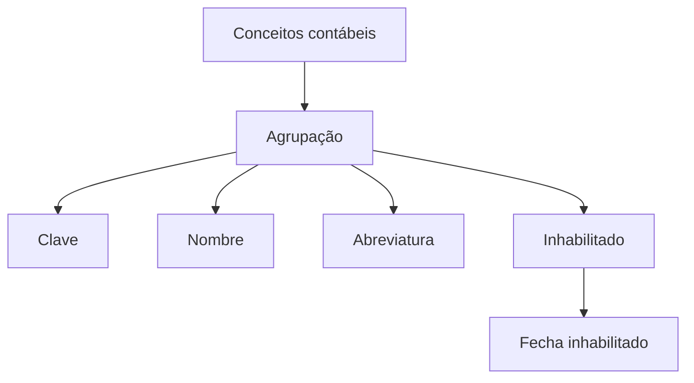

# Definição de Agrupação de Conceitos Contábeis

## 1. Metadados do Documento
- **Arquivo de Origem:** Não identificado
- **Tipo de Documento:** Especificação Técnica / Documentação Funcional
- **Domínio / Sistema:** Definição de agrupação de conceitos contábeis; Zeus
- **Público-Alvo:** Negócio, analistas funcionais e desenvolvedores
- **Data/Versão Identificada:** Não identificada

---

## 2. Resumo Executivo & Contexto de Negócio

O documento define a classificação usada para agrupar conceitos contábeis. O objetivo declarado é estabelecer a estrutura pela qual os conceitos contábeis serão organizados.

A definição de agrupação possui propriedades gerais destinadas a identificar e descrever cada agrupação. Essas propriedades incluem uma chave de identificação, nome, abreviatura e indicadores relacionados à ativação da definição.

O campo **Inhabilitado** determina se uma definição permanece ativa ou se não pode mais ser considerada. O campo **Fecha inhabilitado** registra a data em que a definição deixou de estar ativa.

O material não detalha operações de criação, alteração, consulta ou exclusão, nem expõe métodos HTTP, contratos JSON, regras de autorização ou integrações técnicas. A documentação disponível é predominantemente descritiva e funcional.

---

## 3. Arquitetura, Componentes & Tecnologias Envolvidas

Os elementos identificados no conteúdo são:

- **Agrupação:** entidade de classificação de conceitos contábeis.
- **Conceitos contábeis:** itens organizados por uma agrupação.
- **Zeus:** termo exibido na navegação/documentação.
- **Soluciones APIs Documentación:** termos presentes no rodapé ou navegação da fonte.
- **RS:** sigla exibida no conteúdo, sem definição disponível.



> **Nota de Análise:** O documento não descreve arquitetura de software, APIs, tecnologias de implementação, ambientes ou integrações entre sistemas.

---

## 4. Regras de Negócio, Especificações Funcionais & Processos

1. A classificação de agrupação deve ser usada para agrupar conceitos contábeis.
2. Cada agrupação é identificada por uma **Clave**, definida como a chave que identifica a agrupação de conceitos contábeis.
3. Cada agrupação possui um **Nombre**, correspondente à descrição associada à chave da agrupação do conceito contábil.
4. Cada agrupação possui uma **Abreviatura**, correspondente ao nome abreviado da agrupação do conceito contábil.
5. A propriedade **Inhabilitado** determina o estado da definição:
   - Quando a definição está ativa, ela pode ser considerada.
   - Quando a definição está inabilitada, ela não pode mais ser considerada.
6. A propriedade **Fecha inhabilitado** registra a data na qual a definição deixou de estar ativa.

> **Nota de Análise:** O documento não especifica valores permitidos, obrigatoriedade de campos, formatos de chave, formato de data, critérios de unicidade ou processo operacional para inabilitar uma definição.

---

## 5. Tabelas de Parâmetros, Ambientes e Estruturas de Dados

| Item / Parâmetro | Descrição / Função | Tipo / Valores / Formato | Ambiente / Observações |
| :--- | :--- | :--- | :--- |
| Agrupación | Classificação em que os conceitos contábeis serão agrupados. | Não especificado | Entidade funcional central do documento. |
| Clave | Chave que identifica a agrupação de conceitos contábeis. | Não especificado | O documento não informa formato ou regra de unicidade. |
| Nombre | Descrição associada à chave da agrupação do conceito contábil. | Não especificado | Nome descritivo da agrupação. |
| Abreviatura | Nome abreviado da agrupação do conceito contábil. | Não especificado | O documento não informa tamanho ou padrão. |
| Inhabilitado | Determina se a definição está ativa ou se não pode mais ser considerada. | Não especificado | Relacionado ao estado de ativação da definição. |
| Fecha inhabilitado | Data em que a definição deixou de estar ativa. | Data; formato não especificado | Aplicável quando a definição deixou de estar ativa. |
| Zeus | Termo presente na navegação da documentação. | Não especificado | Não há detalhamento sobre sua função. |
| RS | Sigla presente no conteúdo. | Não especificado | Significado não definido no documento. |

---

## 6. Bateria de Perguntas & Respostas para RAG (FAQ Sintético)

### P1: Qual é o objetivo da definição de agrupação de conceitos contábeis?
**R:** O objetivo é definir a classificação na qual os conceitos contábeis serão agrupados.

### P2: Qual campo identifica uma agrupação de conceitos contábeis?
**R:** O campo **Clave** identifica a agrupação de conceitos contábeis.

### P3: O que representa o campo Nombre em uma agrupação contábil?
**R:** O campo **Nombre** representa a descrição associada à chave da agrupação do conceito contábil.

### P4: Para que serve a Abreviatura da agrupação?
**R:** A **Abreviatura** representa o nome abreviado da agrupação do conceito contábil.

### P5: Como o documento determina se uma definição pode ser considerada?
**R:** A propriedade **Inhabilitado** determina se a definição está ativa ou se ela não pode mais ser considerada.

### P6: O que significa uma definição inabilitada?
**R:** Uma definição inabilitada é uma definição que já não pode ser levada em conta, conforme a descrição do campo **Inhabilitado**.

### P7: Qual é a finalidade do campo Fecha inhabilitado?
**R:** **Fecha inhabilitado** registra a data em que a definição deixou de estar ativa.

### P8: O documento informa o formato da Clave da agrupação?
**R:** Não. O documento apenas informa que a **Clave** identifica a agrupação de conceitos contábeis, sem definir formato, tamanho ou regra de unicidade.

### P9: O documento apresenta APIs ou contratos JSON para agrupações contábeis?
**R:** Não. O conteúdo não descreve métodos HTTP, endpoints, contratos JSON ou integrações de API.

### P10: O documento explica o significado da sigla RS?
**R:** Não. A sigla **RS** aparece no conteúdo, mas não possui definição adicional no texto disponível.

---

## 7. Glossário de Termos, Siglas & Conceitos-Chave

- **Agrupación:** classificação usada para agrupar conceitos contábeis.
- **Clave:** chave que identifica a agrupação de conceitos contábeis.
- **Nombre:** descrição associada à chave da agrupação do conceito contábil.
- **Abreviatura:** nome abreviado da agrupação do conceito contábil.
- **Inhabilitado:** propriedade que determina se a definição está ativa ou se não pode mais ser considerada.
- **Fecha inhabilitado:** data em que a definição deixou de estar ativa.
- **RS:** sigla apresentada sem significado definido no documento.
- **Zeus:** termo presente na navegação da documentação, sem detalhamento funcional no conteúdo.

---

## 8. Notas Críticas, Riscos & Limitações

- O documento não identifica arquivo de origem, autoria, data, versão ou responsável.
- Não são informados formatos, tipos, tamanhos, obrigatoriedade ou validações dos campos.
- Não há definição de fluxo de cadastro, alteração, inabilitação ou reativação de agrupações.
- Não há detalhamento de permissões, auditoria, tratamento de erros ou regras de consistência.
- O significado de **RS** e a função de **Zeus** não são explicados.
- Não há informações sobre APIs, banco de dados, URLs, ambientes, logs ou integrações.

---

## 9. Conteúdo Bruto Estruturado (Referência Fiel)

```text
--- [PÁGINA 1 DE 2] ---

DEFINICIÓN de Agrupación de conceptos
contables
Objetivo
Definir la clasificación en la que se agruparán los conceptos contables.
Propiedades generales
Propiedades generales
Agrupación
Clave que identifica la agrupación de conceptos contables.
Nombre
Descripción asociada a la clave de la agrupación del concepto contable.
Abreviatura
Nombre abreviado de la agrupación del concepto contable.
Inhabilitado
En este punto se determina si la definición está activa, o por el contrario ya no puede tenerse en
cuenta.
 /
 RS
Inicio Soluciones APIs Documentación Zeus
ES


--- [PÁGINA 2 DE 2] ---

Fecha inhabilitado
Fecha en la que la definición dejó de estar activa.
```
