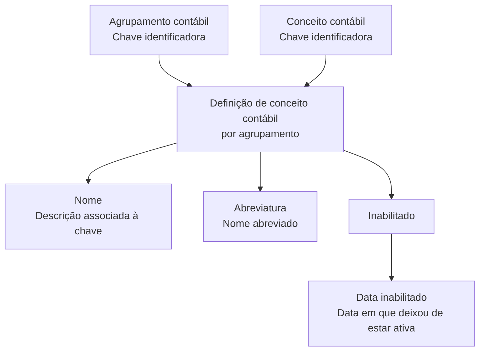

# Definição de Conceitos Contábeis por Agrupamento Contábil

## 1. Metadados do Documento
- **Arquivo de Origem:** Não identificado no conteúdo fornecido
- **Tipo de Documento:** Especificação Funcional
- **Domínio / Sistema:** Conceitos contábeis e agrupamentos contábeis; referência à documentação Zeus
- **Público-Alvo:** Analistas funcionais, desenvolvedores e operação
- **Data/Versão Identificada:** Não identificada

---

## 2. Resumo Executivo & Contexto de Negócio

O documento descreve a definição de conceitos contábeis associados a agrupamentos contábeis. O objetivo declarado é identificar quais conceitos contábeis estão incluídos em cada agrupamento contábil.

A estrutura funcional apresentada contém propriedades para identificar o agrupamento contábil, o conceito contábil, o nome, a abreviatura e a condição de inabilitação da definição. Cada agrupamento contábil é identificado por uma chave, e cada conceito contábil também é identificado por uma chave própria.

O documento estabelece que uma definição pode estar ativa ou inabilitada. Quando uma definição deixa de estar ativa, deve existir uma data de inabilitação que registre o momento em que a definição deixou de ser considerada.

O conteúdo fornecido não detalha operações de criação, alteração, consulta ou exclusão, nem especifica contratos de API, persistência de dados, perfis de acesso ou regras de validação adicionais.

---

## 3. Arquitetura, Componentes & Tecnologias Envolvidas

Os elementos identificados no conteúdo são:

- Agrupamento contábil
- Conceito contábil
- Definição de associação entre agrupamento contábil e conceito contábil
- Propriedades de nome e abreviatura do conceito contábil
- Estado de inabilitação da definição
- Data de inabilitação
- Referência de navegação/documentação: Zeus



> **Nota de Análise:** O conteúdo menciona “Zeus” no rodapé de navegação, mas não detalha a função técnica, integração, URL, APIs ou componentes internos relacionados a Zeus.

---

## 4. Regras de Negócio, Especificações Funcionais & Processos

1. A finalidade da definição é indicar os conceitos contábeis incluídos em cada agrupamento contábil.
2. Um agrupamento contábil é identificado por uma chave.
3. Um conceito contábil é identificado por uma chave.
4. O campo **Nome** corresponde à descrição associada à chave que identifica o conceito contábil.
5. O campo **Abreviatura** corresponde ao nome abreviado do conceito contábil.
6. A propriedade **Inabilitado** determina se a definição permanece ativa ou se não pode mais ser considerada.
7. Quando uma definição deixa de estar ativa, a **Data inabilitado** registra a data em que a definição deixou de estar ativa.
8. O documento não informa formatos de chave, obrigatoriedade de campos, regras de unicidade, valores permitidos para o indicador de inabilitação ou critérios para alteração da data de inabilitação.

---

## 5. Tabelas de Parâmetros, Ambientes e Estruturas de Dados

| Item / Parâmetro | Descrição / Função | Tipo / Valores / Formato | Ambiente / Observações |
| :--- | :--- | :--- | :--- |
| Agrupamento contábil | Chave que identifica o agrupamento contábil ao qual o conceito contábil é associado. | Chave; formato não informado. | Não informado. |
| Conceito contábil | Chave que identifica o conceito contábil. | Chave; formato não informado. | Não informado. |
| Nome | Descrição associada à chave que identifica o conceito contábil. | Texto; formato não informado. | Não informado. |
| Abreviatura | Nome abreviado do conceito contábil. | Texto; formato não informado. | Não informado. |
| Inabilitado | Determina se a definição está ativa ou se não pode mais ser considerada. | Indicador; valores não informados. | A condição inabilitada indica que a definição não deve ser considerada. |
| Data inabilitado | Data em que a definição deixou de estar ativa. | Data; formato não informado. | Aplicável quando a definição deixa de estar ativa. |
| Zeus | Referência exibida no conteúdo como parte da navegação/documentação. | Não informado. | Não há detalhamento funcional ou técnico. |

---

## 6. Bateria de Perguntas & Respostas para RAG (FAQ Sintético)

### P1: Qual é o objetivo da definição de conceitos contábeis por agrupamento?
**R:** O objetivo é definir os conceitos contábeis incluídos em cada agrupamento contábil.

### P2: Como um agrupamento contábil é identificado?
**R:** Um agrupamento contábil é identificado por uma chave que representa o agrupamento ao qual o conceito contábil está associado.

### P3: Como o conceito contábil é identificado na definição?
**R:** O conceito contábil é identificado por uma chave que o representa na definição associada ao agrupamento contábil.

### P4: O que representa o campo Nome?
**R:** O campo Nome representa a descrição associada à chave que identifica o conceito contábil.

### P5: Qual é a finalidade da abreviatura de um conceito contábil?
**R:** A abreviatura corresponde ao nome abreviado do conceito contábil.

### P6: O que significa uma definição marcada como inabilitada?
**R:** Uma definição inabilitada não está mais ativa e, portanto, não pode mais ser considerada.

### P7: O que a data de inabilitação registra?
**R:** A data de inabilitação registra a data em que a definição deixou de estar ativa.

### P8: O documento informa quais valores podem ser usados no campo Inabilitado?
**R:** Não. O documento explica apenas que o campo determina se a definição está ativa ou não pode mais ser considerada, sem informar valores permitidos ou formato técnico.

### P9: O documento especifica APIs, métodos HTTP ou contratos JSON para conceitos contábeis?
**R:** Não. O conteúdo fornecido não detalha métodos HTTP, endpoints, contratos JSON ou integrações técnicas.

### P10: Existe detalhamento sobre o sistema Zeus?
**R:** Não. “Zeus” aparece como referência na navegação/documentação, mas o documento não descreve suas responsabilidades, arquitetura ou interfaces.

---

## 7. Glossário de Termos, Siglas & Conceitos-Chave

- **Agrupamento contábil:** Entidade identificada por uma chave à qual um conceito contábil é associado.
- **Conceito contábil:** Entidade identificada por uma chave e incluída em um agrupamento contábil.
- **Definição:** Registro ou configuração que relaciona um conceito contábil a um agrupamento contábil.
- **Inabilitado:** Estado que indica que a definição não está mais ativa e não deve ser considerada.
- **Data inabilitado:** Data em que a definição deixou de estar ativa.
- **Zeus:** Termo exibido na navegação/documentação; sem significado funcional ou técnico detalhado no conteúdo fornecido.

---

## 8. Notas Críticas, Riscos & Limitações

- O documento não identifica o arquivo de origem, autor, data, versão ou ambiente.
- Não há detalhamento de formatos, tipos de dados, tamanhos, obrigatoriedade ou valores válidos para os campos.
- Não são apresentados fluxos de manutenção, aprovação, auditoria ou exclusão de definições contábeis.
- Não há informação sobre regras de unicidade entre agrupamento contábil e conceito contábil.
- Não há especificação de APIs, integrações, banco de dados, permissões ou tratamento de erros.
- **Nota de Análise:** O documento lista a referência “Zeus”, porém não detalha funcionalidades, métodos HTTP, contratos JSON ou responsabilidades técnicas associadas a Zeus.

---

## 9. Conteúdo Bruto Estruturado (Referência Fiel)

```text
--- [PÁGINA 1 DE 2] ---

DEFINICIÓN de Conceptos contables por
agrupación
Objetivo
Definir los conceptos contables incluidos en cada agrupación contable.
Propiedades generales
Propiedades generales
Agrupación contable
Clave que identifica la agrupación contable a la que se asocia el concepto contable.
Concepto contable
Clave que identifica el concepto contable.
Nombre
Descripción asociada a la clave que identifica el concepto contable.
Abreviatura
Nombre abreviado del concepto contable.
Inhabilitado
 / 
 CF
Inicio Soluciones APIs Documentación Zeus
ES


--- [PÁGINA 2 DE 2] ---

En este punto se determina si la definición está activa, o por el contrario ya no puede tenerse en
cuenta.
Fecha inhabilitado
Fecha en la que la definición dejó de estar activa.
```
