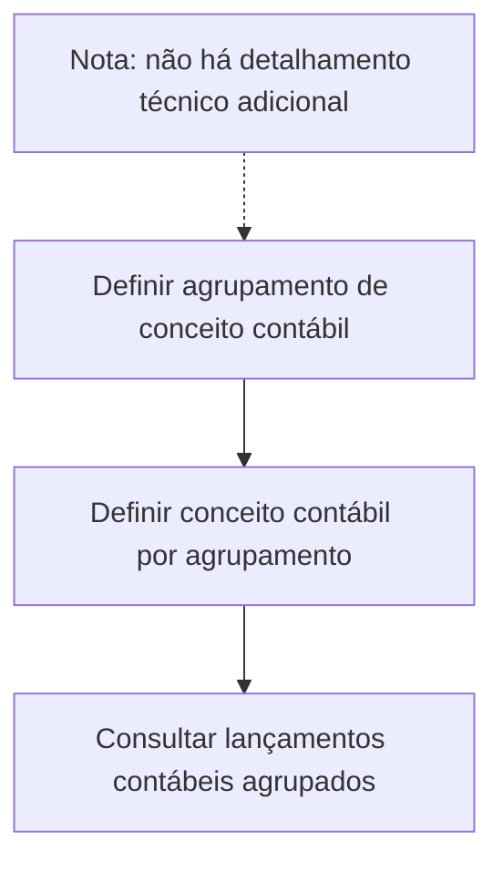

# Definição de Conceito Contábil — Procedimento em Construção

## 1. Metadados do Documento
- **Arquivo de Origem:** `Não informado`
- **Tipo de Documento:** `Procedimento`
- **Domínio / Sistema:** `Definição de conceito contábil`
- **Público-Alvo:** `Negócio, Operação e usuários responsáveis por definições contábeis`
- **Data/Versão Identificada:** `Não identificada`

---

## 2. Resumo Executivo & Contexto de Negócio

O documento apresenta um procedimento para definição de um **conceito contábil**. O objetivo explicitamente declarado é determinar identificadores que agrupam lançamentos contábeis para consulta posterior.

O processo descrito é composto por duas etapas: definir o agrupamento de conceito contábil e definir o conceito contábil para cada agrupamento. A sequência sugere que a definição do agrupamento antecede a associação de conceitos contábeis ao agrupamento.

O documento está identificado como **“EN CONSTRUCCIÓN”**, indicando que o conteúdo se encontra em construção. Não há detalhamento adicional sobre telas, campos, responsáveis, critérios de validação, regras de cálculo, métodos de consulta ou contratos de integração.

---

## 3. Arquitetura, Componentes & Tecnologias Envolvidas

O conteúdo não descreve uma arquitetura técnica, microsserviços, integrações, tecnologias, ambientes ou ferramentas. Os termos `CF`, `Home Solutions`, `APIs Documentation` e `Zeus` aparecem no trecho final, mas o documento não explica suas relações com o procedimento de conceito contábil.



> *Nota de Análise: O documento não detalha como os identificadores são criados, onde são armazenados, quais lançamentos contábeis são elegíveis ou como ocorre a consulta posterior.*

---

## 4. Regras de Negócio, Especificações Funcionais & Processos

### Objetivo funcional
Determinar os identificadores que agrupam os lançamentos contábeis para permitir consulta posterior.

### Processo descrito
1. **Definir agrupamento de conceito contábil:** estabelecer o agrupamento relacionado ao conceito contábil.
2. **Definir conceito contábil por agrupamento:** associar ou definir o conceito contábil correspondente para cada agrupamento definido.

### Restrições e ausência de detalhamento
- O documento não informa o formato dos identificadores.
- O documento não informa critérios para criação ou alteração de agrupamentos.
- O documento não informa se um agrupamento pode conter um ou vários conceitos contábeis.
- O documento não informa critérios de validação, aprovação ou auditoria.
- O documento não informa o mecanismo de consulta dos lançamentos contábeis após o agrupamento.

---

## 5. Tabelas de Parâmetros, Ambientes e Estruturas de Dados

| Item / Parâmetro | Descrição / Função | Tipo / Valores / Formato | Ambiente / Observações |
| :--- | :--- | :--- | :--- |
| Identificadores | Agrupam lançamentos contábeis para consulta posterior. | Não especificado. | O documento não informa formato, origem ou persistência. |
| Agrupamento de conceito contábil | Primeiro elemento definido no processo. | Não especificado. | Deve ser definido antes do conceito contábil por agrupamento. |
| Conceito contábil por agrupamento | Segundo elemento definido no processo. | Não especificado. | O documento não detalha cardinalidade ou critérios de associação. |
| Lançamentos contábeis | Registros que serão agrupados pelos identificadores. | Não especificado. | Não há descrição de estrutura, origem ou método de consulta. |
| CF | Termo exibido no conteúdo bruto. | Não especificado. | Sem explicação contextual no documento. |
| Home Solutions | Termo exibido no conteúdo bruto. | Não especificado. | Sem explicação contextual no documento. |
| APIs Documentation | Termo exibido no conteúdo bruto. | Não especificado. | Sem explicação contextual no documento. |
| Zeus | Termo exibido no conteúdo bruto. | Não especificado. | Sem explicação contextual no documento. |

---

## 6. Bateria de Perguntas & Respostas para RAG (FAQ Sintético)

### P1: Qual é o objetivo da definição de conceito contábil?
**R:** O objetivo é determinar os identificadores que agrupam os lançamentos contábeis para sua consulta posterior.

### P2: Qual é a primeira etapa do processo de conceito contábil?
**R:** A primeira etapa é definir o agrupamento de conceito contábil.

### P3: Qual atividade ocorre após definir o agrupamento de conceito contábil?
**R:** Após definir o agrupamento de conceito contábil, deve-se definir o conceito contábil por agrupamento.

### P4: O documento especifica o formato dos identificadores de agrupamento?
**R:** Não. O documento informa que identificadores devem agrupar os lançamentos contábeis, mas não especifica formato, estrutura ou regras de geração.

### P5: O documento informa como consultar os lançamentos contábeis agrupados?
**R:** Não. A consulta posterior é citada como objetivo do agrupamento, mas não são descritos tela, API, relatório, filtro ou processo de consulta.

### P6: Existe uma regra documentada sobre quantos conceitos contábeis podem pertencer a um agrupamento?
**R:** Não. O documento menciona a definição de conceito contábil por agrupamento, mas não informa cardinalidade ou restrições de associação.

### P7: O conteúdo descreve validações ou aprovações para os agrupamentos contábeis?
**R:** Não. Não há critérios de validação, responsáveis, aprovações ou trilhas de auditoria descritos.

### P8: O que significa o status “EN CONSTRUCCIÓN”?
**R:** “EN CONSTRUCCIÓN” indica que o documento está em construção. O texto não fornece detalhamento adicional sobre escopo pendente ou previsão de conclusão.

### P9: O documento descreve integrações técnicas relacionadas ao conceito contábil?
**R:** Não. Embora os termos `CF`, `Home Solutions`, `APIs Documentation` e `Zeus` apareçam no conteúdo, não há descrição de integração, arquitetura ou responsabilidade técnica.

### P10: Qual é a relação documentada entre agrupamento e conceito contábil?
**R:** A relação documentada é sequencial: primeiro define-se o agrupamento de conceito contábil; depois define-se o conceito contábil por agrupamento. O documento não fornece detalhes adicionais sobre essa associação.

---

## 7. Glossário de Termos, Siglas & Conceitos-Chave

- **Conceito contábil:** elemento cuja definição ocorre no contexto de um agrupamento contábil. O documento não fornece definição adicional.
- **Agrupamento de conceito contábil:** agrupamento que deve ser definido antes da definição do conceito contábil por agrupamento.
- **Identificadores:** elementos utilizados para agrupar lançamentos contábeis para consulta posterior.
- **Lançamentos contábeis:** apontamentos contábeis que serão agrupados por identificadores.
- **CF:** termo citado sem expansão ou contexto adicional.
- **Home Solutions:** termo citado sem definição ou relação detalhada com o processo.
- **APIs Documentation:** termo citado sem documentação de APIs, métodos ou contratos.
- **Zeus:** termo citado sem definição ou relação detalhada com o processo.

---

## 8. Notas Críticas, Riscos & Limitações

- O documento está marcado como **“EN CONSTRUCCIÓN”**.
- Não há definição do formato, ciclo de vida ou governança dos identificadores de agrupamento.
- Não há regras de cardinalidade entre agrupamentos e conceitos contábeis.
- Não há critérios de validação, responsabilidades operacionais, permissões ou trilha de auditoria.
- Não há detalhes de sistemas, integrações, APIs, bancos de dados, ambientes ou rotas de logs.
- Os termos `CF`, `Home Solutions`, `APIs Documentation` e `Zeus` não possuem explicação no conteúdo fornecido.

---

## 9. Conteúdo Bruto Estruturado (Referência Fiel)

```text
--- [PÁGINA 1 DE 1] ---

EN CONSTRUCCIÓN
DEFINICIÓN de concepto contable
Objetivo
Determinar los identificadores que agrupan los apuntes contables para su posterior consulta.
Proceso a seguir
DEFINIR agrupación
concepto contable
(1)
DEFINIR concepto
contable por
agrupación
(2)
1. DEFINIR agrupación concepto contable
1. DEFINIR concepto contable por agrupación
 /
 CF
Home Solutions APIs Documentation Zeus
EN
```
