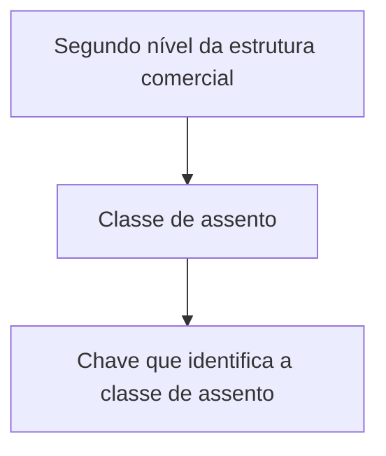

# Definição de Classes de Assentos por Estrutura Comercial

## 1. Metadados do Documento
- **Arquivo de Origem:** Não identificado
- **Tipo de Documento:** Especificação Técnica
- **Domínio / Sistema:** Estrutura comercial / classes de assentos
- **Público-Alvo:** Negócio, analistas funcionais e desenvolvedores
- **Data/Versão Identificada:** Não identificada

---

## 2. Resumo Executivo & Contexto de Negócio

O documento define o objetivo de determinar as diferentes classes de assento que cada nível 2 da estrutura comercial pode capturar. A relação central apresentada vincula um elemento organizacional denominado “segundo nível da estrutura comercial” a uma “classe de assento”.

A classe de assento é descrita como uma chave que identifica a própria classe. O texto não apresenta a estrutura do valor da chave, os valores permitidos, regras de obrigatoriedade, critérios de seleção ou validações associadas.

O conteúdo disponível é resumido e não detalha arquitetura de software, integrações, telas, APIs, métodos HTTP, contratos de dados, persistência, permissões ou procedimentos operacionais. Os termos “Inicio”, “Soluciones”, “APIs”, “Documentación”, “Zeus”, “ES” e “CF” aparecem no conteúdo bruto, sem explicação de seu significado ou papel funcional.

---

## 3. Arquitetura, Componentes & Tecnologias Envolvidas

O documento não descreve componentes técnicos, sistemas integrados, microsserviços, bancos de dados, ferramentas, ambientes ou tecnologias. A única relação funcional explicitamente apresentada é entre o segundo nível da estrutura comercial e a classe de assento que esse nível pode capturar.



**Nota de Análise:** O documento não fornece detalhes adicionais sobre implementação técnica, fluxo de integração, interfaces, APIs ou tecnologias associadas à definição de classes de assentos.

---

## 4. Regras de Negócio, Especificações Funcionais & Processos

1. O objetivo declarado é determinar as distintas classes de assento que cada nível 2 da estrutura comercial pode capturar.
2. O segundo nível da estrutura comercial é o nível explicitamente associado à captura de classes de assento.
3. A classe de assento é identificada por uma chave.
4. O documento não informa:
   - quais são as classes de assento existentes;
   - quais valores a chave pode assumir;
   - se uma mesma estrutura comercial pode capturar mais de uma classe de assento;
   - se uma classe de assento pode ser compartilhada por diferentes níveis 2;
   - regras de criação, alteração, exclusão ou consulta;
   - validações, exceções ou mensagens de erro;
   - responsáveis pela manutenção da estrutura comercial;
   - critérios para classificar ou habilitar uma classe de assento.

**Nota de Análise:** Não há fluxo passo a passo, regras condicionais ou critérios de cálculo descritos no material fornecido.

---

## 5. Tabelas de Parâmetros, Ambientes e Estruturas de Dados

| Item / Parâmetro | Descrição / Função | Tipo / Valores / Formato | Ambiente / Observações |
| :--- | :--- | :--- | :--- |
| Segundo nível da estrutura comercial | Nível da estrutura comercial para o qual devem ser determinadas as classes de assento capturáveis. | Não especificado | O documento cita “nivel 2” e “segundo nivel de la estructura comercial”. |
| Classe de assento | Classe que pode ser capturada pelo segundo nível da estrutura comercial. | Não especificado | Não há lista de classes nem critérios de associação. |
| Chave da classe de assento | Elemento que identifica a classe de assento. | Não especificado | O documento não define formato, tamanho, domínio ou valores permitidos. |
| CF | Termo presente no conteúdo bruto. | Não especificado | O significado não é detalhado. |
| Zeus | Termo presente no conteúdo bruto. | Não especificado | O significado e a relação com a estrutura comercial não são detalhados. |
| Inicio / Soluciones / APIs / Documentación / ES | Termos presentes no conteúdo bruto. | Não especificado | Podem representar elementos de navegação ou contexto documental, mas o documento não confirma essa interpretação. |

---

## 6. Bateria de Perguntas & Respostas para RAG (FAQ Sintético)

### P1: Qual é o objetivo da definição de classes de assentos por estrutura comercial?
**R:** O objetivo é determinar as distintas classes de assento que cada nível 2 da estrutura comercial pode capturar.

### P2: Qual nível da estrutura comercial é citado no documento?
**R:** O documento cita o segundo nível, também referido como “nivel 2”, da estrutura comercial.

### P3: O que é uma classe de assento no contexto do documento?
**R:** A classe de assento é um elemento associado ao segundo nível da estrutura comercial e é descrita como uma classe que pode ser capturada por esse nível.

### P4: Como a classe de assento é identificada?
**R:** A classe de assento é identificada por uma chave. O documento não especifica o formato ou os valores possíveis dessa chave.

### P5: O documento lista as classes de assento disponíveis?
**R:** Não. O documento declara que devem ser determinadas distintas classes de assento, mas não apresenta uma lista dessas classes.

### P6: Existem regras de validação para a chave da classe de assento?
**R:** Não há regras de validação descritas. O texto apenas informa que a chave identifica a classe de assento.

### P7: O documento descreve APIs ou contratos de integração para classes de assento?
**R:** Não. Embora o termo “APIs” apareça no conteúdo bruto, não são descritos métodos HTTP, endpoints, contratos JSON, integrações ou comportamentos de API.

### P8: O documento informa em quais ambientes a configuração deve ser aplicada?
**R:** Não. Não há ambientes, servidores, URLs, portas ou parâmetros de implantação identificados.

### P9: O que significa o termo “CF” apresentado no conteúdo?
**R:** O conteúdo bruto inclui o termo “CF”, mas não fornece definição, expansão da sigla ou relação funcional com a estrutura comercial.

### P10: Qual é a relação entre o segundo nível da estrutura comercial e a classe de assento?
**R:** O segundo nível da estrutura comercial é o elemento para o qual são determinadas as classes de assento que podem ser capturadas.

---

## 7. Glossário de Termos, Siglas & Conceitos-Chave

- **Classe de assento:** Classe que pode ser capturada pelo segundo nível da estrutura comercial; identificada por uma chave.
- **Estrutura comercial:** Estrutura organizacional mencionada no documento, com referência específica ao seu segundo nível.
- **Segundo nível da estrutura comercial / Nivel 2:** Nível da estrutura comercial para o qual devem ser determinadas as classes de assento capturáveis.
- **Chave:** Identificador da classe de assento. O formato não é especificado.
- **CF:** Termo presente no conteúdo bruto sem definição.
- **Zeus:** Termo presente no conteúdo bruto sem definição.
- **ES:** Termo presente no conteúdo bruto sem definição.

---

## 8. Notas Críticas, Riscos & Limitações

- O documento possui conteúdo extremamente resumido, limitado ao objetivo e à identificação da classe de assento por uma chave.
- Não há lista de classes de assento, chaves válidas, estruturas de dados, regras de associação ou exemplos.
- Não há detalhamento de arquitetura, persistência, interfaces, APIs, integrações, ambientes ou responsáveis.
- Os termos “CF”, “Zeus” e “ES” não são definidos; qualquer interpretação adicional seria especulativa.
- Não é possível determinar, com base no conteúdo disponível, se a relação entre nível 2 e classe de assento é um-para-um, um-para-muitos ou muitos-para-muitos.

---

## 9. Conteúdo Bruto Estruturado (Referência Fiel)

```text
--- [PÁGINA 1 DE 1] ---

DEFINICIÓN de Clases de asientos por
estructura comercial
Objetivo
Determinar las distintas clases de asiento que puede capturar cada nivel 2 de la estructura comercial.
Propiedades generales
Propiedades generales
Segundo nivel de la estructura comercial
segundo nivel de la estructura comercial.
Clase de asiento
Clave que identifica la clase de asiento.
 / 
 CF
Inicio Soluciones APIs Documentación Zeus
ES
```
