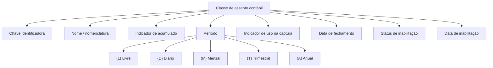

# Definição de Classes de Assentos Contábeis

## 1. Metadados do Documento
- **Arquivo de Origem:** Não identificado — trecho textual fornecido
- **Tipo de Documento:** Especificação Técnica / Documentação Funcional
- **Domínio / Sistema:** Classes de assentos contábeis
- **Público-Alvo:** Negócio, analistas funcionais e operação contábil
- **Data/Versão Identificada:** Não identificada

---

## 2. Resumo Executivo & Contexto de Negócio

O documento define a classificação de classes de assentos contábeis. A classe de assento é identificada por uma chave e possui uma nomenclatura associada.

A especificação apresenta propriedades que determinam características operacionais e de vigência da classe de assento, incluindo acumulado, período, disponibilidade para captura, data de fechamento e status de inabilitação.

O período da classe de assento pode ser Livre, Diário, Mensal, Trimestral ou Anual. A classificação de período fornece o enquadramento temporal aplicável à classe contábil.

O documento também estabelece controles de disponibilidade. A propriedade de captura indica se a classe pode ser utilizada na captura de assentos; a propriedade de inabilitação determina se a definição permanece ativa ou não pode mais ser considerada.

---

## 3. Arquitetura, Componentes & Tecnologias Envolvidas

Os componentes e conceitos explicitamente identificados são:

- **Classe de assento:** Entidade de classificação de assentos contábeis.
- **Captura de assentos:** Processo no qual uma classe de assento pode ou não ser utilizada.
- **Período:** Classificação temporal associada à classe de assento.
- **Inabilitação:** Controle que determina se uma definição permanece ativa.
- **Fecha cierre:** Data de fechamento.
- **Fecha inhabilitado:** Data em que a definição deixou de estar ativa.



> **Nota de Análise:** O conteúdo fornecido não detalha tecnologias, integrações, métodos HTTP, contratos JSON, banco de dados, componentes de infraestrutura ou ambientes.

---

## 4. Regras de Negócio, Especificações Funcionais & Processos

1. Uma **classe de assento** deve possuir uma **chave** que a identifica.
2. Uma **classe de assento** possui um **nome**, definido como a nomenclatura associada à classe.
3. A propriedade **Acumulado** indica se a classe de assento é de acumulados.
4. A propriedade **Período** define o período aplicável à classe de assento.
5. Os valores de período apresentados são:
   - **(L) Livre**
   - **(D) Diário**
   - **(M) Mensal**
   - **(T) Trimestral**
   - **(A) Anual**
6. A propriedade **Captura** indica se a classe de assento pode ser utilizada na captura de assentos.
7. A propriedade **Fecha cierre** corresponde à data de fechamento.
8. A propriedade **Inhabilitado** define se a classe de assento está ativa ou se não pode mais ser considerada.
9. A propriedade **Fecha inhabilitado** registra a data em que a definição deixou de estar ativa.

> **Nota de Análise:** O documento não especifica regras de validação para formato de chave, obrigatoriedade de campos, transições de estado, cálculo de acumulados ou comportamento da captura após a inabilitação.

---

## 5. Tabelas de Parâmetros, Ambientes e Estruturas de Dados

| Item / Parâmetro | Descrição / Função | Tipo / Valores / Formato | Ambiente / Observações |
| :--- | :--- | :--- | :--- |
| Classe de assento | Classificação de assentos contábeis. | Entidade funcional. | Não detalhado. |
| Chave | Identifica a classe de assento. | Não especificado. | Não há regra de formato informada. |
| Nome | Nomenclatura associada à classe de assento. | Não especificado. | Não há tamanho ou padrão informado. |
| Acumulado | Indica se a classe de assento é de acumulados. | Indicador; valores não especificados. | Não detalhado. |
| Período | Define o período da classe de assento. | Livre, Diário, Mensal, Trimestral ou Anual. | Valores exibidos com códigos L, D, M, T e A. |
| Captura | Indica se a classe pode ser utilizada na captura de assentos. | Indicador; valores não especificados. | Não detalhado. |
| Fecha cierre | Data de fechamento. | Data; formato não especificado. | Não detalhado. |
| Inhabilitado | Determina se a definição está ativa ou não deve mais ser considerada. | Indicador de status. | Não há valores técnicos informados. |
| Fecha inhabilitado | Data em que a definição deixou de estar ativa. | Data; formato não especificado. | Associada à inabilitação. |

| Código de Período | Descrição |
| :--- | :--- |
| L | Livre |
| D | Diário |
| M | Mensal |
| T | Trimestral |
| A | Anual |

---

## 6. Bateria de Perguntas & Respostas para RAG (FAQ Sintético)

### P1: Qual é o objetivo da definição de classes de assentos?
**R:** O objetivo é definir a classificação dos assentos contábeis por meio de uma classe de assento identificada por chave, nomenclatura e propriedades funcionais.

### P2: Qual atributo identifica uma classe de assento?
**R:** A chave identifica a classe de assento. O documento não informa formato, tamanho, unicidade ou regra de preenchimento para essa chave.

### P3: O que representa o campo Nome em uma classe de assento?
**R:** O campo Nome representa a nomenclatura associada à classe de assento.

### P4: Quais períodos podem ser atribuídos a uma classe de assento?
**R:** Os períodos apresentados são Livre (L), Diário (D), Mensal (M), Trimestral (T) e Anual (A).

### P5: O que significa o indicador Acumulado?
**R:** O indicador Acumulado informa se a classe de assento é uma classe de acumulados. O documento não detalha o efeito operacional dessa classificação.

### P6: Como saber se uma classe pode ser usada na captura de assentos?
**R:** A propriedade Captura indica se a classe de assento pode ser utilizada na captura de assentos. O documento não informa os valores possíveis desse indicador.

### P7: Qual é a finalidade do campo Inhabilitado?
**R:** Inhabilitado determina se a definição da classe de assento continua ativa ou se já não pode ser considerada.

### P8: O que registra a Fecha inhabilitado?
**R:** Fecha inhabilitado registra a data em que a definição da classe de assento deixou de estar ativa.

### P9: O que representa a Fecha cierre?
**R:** Fecha cierre representa a data de fechamento. O documento não detalha como essa data é calculada, validada ou aplicada.

### P10: O documento define como uma classe inabilitada se comporta na captura de assentos?
**R:** Não. O documento informa que uma definição inabilitada não pode mais ser considerada, mas não especifica efeitos técnicos ou operacionais sobre a captura de assentos.

---

## 7. Glossário de Termos, Siglas & Conceitos-Chave

- **Classe de assento:** Classificação aplicada a assentos contábeis.
- **Chave:** Identificador da classe de assento.
- **Nome:** Nomenclatura associada à classe de assento.
- **Acumulado:** Indicador que informa se a classe de assento é de acumulados.
- **Período:** Classificação temporal da classe de assento.
- **Captura:** Uso da classe de assento no processo de captura de assentos.
- **Fecha cierre:** Data de fechamento.
- **Inhabilitado:** Estado que indica que uma definição não está ativa ou não deve ser considerada.
- **Fecha inhabilitado:** Data em que uma definição deixou de estar ativa.

---

## 8. Notas Críticas, Riscos & Limitações

- O arquivo de origem, a data, a versão e o sistema corporativo responsável não foram identificados no conteúdo fornecido.
- Não há detalhamento de fluxos operacionais, permissões, APIs, integrações, ambientes ou rotas de log.
- Não foram informadas regras de obrigatoriedade, tipos de dados, formatos de data, validações ou valores possíveis para os indicadores Acumulado, Captura e Inhabilitado.
- O documento não descreve o impacto funcional de uma classe inabilitada sobre registros existentes ou processos de captura.
- O conteúdo apresenta uma definição funcional resumida; detalhes adicionais não estão disponíveis no trecho fornecido.

---

## 9. Conteúdo Bruto Estruturado (Referência Fiel)

```text
--- [PÁGINA 1 DE 2] ---

DEFINICIÓN de Clases de asientos
Objetivo
Definir la clasificación de los asientos contables.
Propiedades generales
Propiedades generales
Clase de asiento
Clave que identifica la clase de asiento.
Nombre
Nomenclatura asociada a la clase de asiento.
Acumulado
Indica si la clase de asiento es de acumulados.
Período
Período de la clase de asiento.
(L)Libre
(D)Diario
 / 
 CF
Inicio Soluciones APIs Documentación Zeus
ES


--- [PÁGINA 2 DE 2] ---

(M)Mensual
(T)Trimestral
(A)Anual
Captura
Indica si se puede utilizar en la captura de asientos.
Fecha cierre
Fecha de cierre.
Inhabilitado
En este punto se determina si la definición está activa, o por el contrario ya no puede tenerse en
cuenta.
Fecha inhabilitado
Fecha en la que la definición dejó de estar activa.
```
