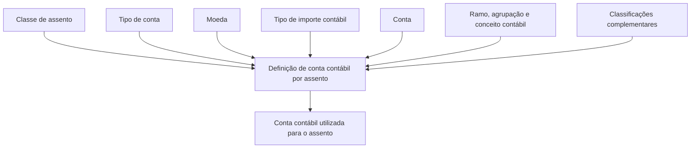

# Definição de Conta Contábil por Assento

## 1. Metadados do Documento
- **Arquivo de Origem:** Não identificado
- **Tipo de Documento:** Especificação Técnica
- **Domínio / Sistema:** Zeus — Definição de Conta Contábil por Assento
- **Público-Alvo:** Desenvolvedores, Arquitetos, Analistas Funcionais e Operação
- **Data/Versão Identificada:** Não identificada

---

## 2. Resumo Executivo & Contexto de Negócio

O documento descreve os atributos utilizados para identificar a conta contábil aplicável a cada assento. O objetivo declarado é determinar qual conta contábil deve ser utilizada em uma contabilização associada a uma classe de assento.

A definição contábil é composta por chaves, classificações e indicadores relacionados ao assento, à conta, à moeda, ao ramo e aos conceitos contábeis. Esses atributos permitem diferenciar o destino contábil conforme o tipo de operação.

O documento também inclui atributos relativos a retenção, exercício contábil, classificação de terceiro, coasseguro, tomador afiliado e localização de risco. Esses campos ampliam a segmentação da conta contábil aplicável.

> **Nota de Análise:** O conteúdo não detalha regras de precedência, critérios de obrigatoriedade, contratos de API, métodos HTTP, persistência de dados ou lógica de cálculo para seleção da conta contábil.

---

## 3. Arquitetura, Componentes & Tecnologias Envolvidas

Os elementos explicitamente citados são:
- **Zeus:** contexto de navegação/documentação.
- **APIs:** item presente na navegação do documento, sem detalhamento técnico.
- **Definição de Conta Contábil por Assento:** estrutura funcional para identificação da conta contábil.



> **Nota de Análise:** O diagrama representa exclusivamente a relação conceitual inferida do objetivo e dos atributos listados. O documento não apresenta arquitetura de software, integrações, servidores ou fluxo técnico de execução.

---

## 4. Regras de Negócio, Especificações Funcionais & Processos

1. A finalidade da definição é identificar a conta contábil utilizada para cada assento.
2. A **classe de assento** é uma chave que identifica a classe do assento.
3. O **tipo de conta** permite saber para qual conta contábil ocorre a contabilização.
4. O **nome** corresponde à descrição do tipo de conta.
5. A **moeda** é identificada por uma chave de moeda.
6. O **tipo de importe contábil** identifica o tipo de valor contábil e possui os valores:
   - **(D) Debe**
   - **(H) Haber**
7. A **conta** é a chave da conta contábil.
8. O **ramo contábil** é identificado por uma chave de ramo contábil.
9. A **agrupação contábil** é uma chave de agrupação de conceitos contábeis.
10. O **conceito contábil** é tratado como atributo da definição.
11. A condição de retenção possui os valores:
    - **(RE) Retención**
    - **(NR) No retención**
    - **(OT) Otros**
12. O **exercício** é identificado por uma chave de exercício contábil.
13. A **classificação do terceiro** determina se o terceiro é pessoa física ou pessoa jurídica.
14. O **coasseguro** identifica o tipo de coasseguro e possui os valores:
    - **(0) Exento**
    - **(1) Cedido**
    - **(2) Aceptado**
15. O atributo **tomador afiliado** marca se o tomador é afiliado.
16. A **localização de risco** identifica o tipo de localização do risco:
    - **(L) Local**
    - **(E) Extranjero**

> **Nota de Análise:** O documento não informa combinações válidas entre os atributos, critérios de seleção quando houver múltiplas definições, comportamento para campos ausentes ou regras de validação.

---

## 5. Tabelas de Parâmetros, Ambientes e Estruturas de Dados

| Item / Parâmetro | Descrição / Função | Tipo / Valores / Formato | Ambiente / Observações |
| :--- | :--- | :--- | :--- |
| Classe de assento | Chave que identifica a classe de assento | Chave | Não detalhado |
| Tipo de conta | Indica para qual conta contábil ocorre a contabilização | Tipo de conta | Não detalhado |
| Nome | Descrição do tipo de conta | Texto descritivo | Não detalhado |
| Moeda | Chave da moeda | Chave de moeda | Não detalhado |
| Tipo de importe contábil | Identifica o tipo de valor contábil | `(D) Debe`; `(H) Haber` | Não detalhado |
| Conta | Chave da conta contábil | Chave de conta contábil | Não detalhado |
| Ramo contábil | Chave do ramo contábil | Chave | Não detalhado |
| Agrupação contábil | Chave de agrupação de conceitos contábeis | Chave | Não detalhado |
| Conceito contábil | Conceito contábil associado | Não especificado | Não detalhado |
| Retenção | Classificação de retenção | `(RE) Retención`; `(NR) No retención`; `(OT) Otros` | Não detalhado |
| Exercício | Chave que identifica o exercício contábil | Chave de exercício | Não detalhado |
| Classificação do terceiro | Determina a natureza do terceiro | Pessoa física ou pessoa jurídica | Não detalhado |
| Coasseguro | Identifica o tipo de coasseguro | `(0) Exento`; `(1) Cedido`; `(2) Aceptado` | Não detalhado |
| Tomador afiliado | Marca o tomador como afiliado | Indicador, valores não detalhados | Não detalhado |
| Localização de risco | Identifica o tipo de localização de risco | `(L) Local`; `(E) Extranjero` | Não detalhado |

---

## 6. Bateria de Perguntas & Respostas para RAG (FAQ Sintético)

### P1: Qual é o objetivo da definição de conta contábil por assento?
**R:** O objetivo é identificar a conta contábil utilizada para cada assento.

### P2: Qual atributo identifica a classe de um assento?
**R:** A classe de assento é a chave que identifica a classe de assento.

### P3: Para que serve o tipo de conta?
**R:** O tipo de conta permite saber para qual conta contábil ocorre a contabilização.

### P4: Quais valores são previstos para o tipo de importe contábil?
**R:** O tipo de importe contábil possui os valores `(D) Debe` e `(H) Haber`.

### P5: O que representa o campo conta?
**R:** O campo conta corresponde à chave da conta contábil.

### P6: Como a retenção é classificada?
**R:** A retenção pode ser classificada como `(RE) Retención`, `(NR) No retención` ou `(OT) Otros`.

### P7: O que determina a classificação do terceiro?
**R:** A classificação do terceiro determina se o terceiro é pessoa física ou pessoa jurídica.

### P8: Quais tipos de coasseguro são apresentados?
**R:** Os tipos apresentados são `(0) Exento`, `(1) Cedido` e `(2) Aceptado`.

### P9: Qual é a função do tomador afiliado?
**R:** O atributo tomador afiliado marca se o tomador é afiliado. O documento não informa os valores possíveis nem a regra de uso desse indicador.

### P10: Quais valores são permitidos para a localização de risco?
**R:** A localização de risco pode ser `(L) Local` ou `(E) Extranjero`.

---

## 7. Glossário de Termos, Siglas & Conceitos-Chave

- **Assento:** entidade para a qual deve ser identificada uma conta contábil.
- **Conta contábil:** conta utilizada para contabilização de um assento.
- **Classe de assento:** chave que identifica a classe do assento.
- **Tipo de conta:** atributo utilizado para saber a que conta contábil se contabiliza.
- **Importe contábil:** tipo de valor contábil, classificado como Debe ou Haber.
- **Debe (D):** valor previsto para o tipo de importe contábil.
- **Haber (H):** valor previsto para o tipo de importe contábil.
- **Ramo contábil:** atributo identificado por uma chave de ramo contábil.
- **Agrupação contábil:** chave de agrupação de conceitos contábeis.
- **RE:** Retención.
- **NR:** No retención.
- **OT:** Otros.
- **Coasseguro:** tipo de coasseguro identificado pelos valores Exento, Cedido ou Aceptado.
- **Tomador afiliado:** indicador que marca um tomador como afiliado.
- **Localização de risco:** tipo de localização de risco, classificada como Local ou Extranjero.

---

## 8. Notas Críticas, Riscos & Limitações

- O arquivo de origem, a data e a versão do documento não foram identificados.
- O documento não descreve APIs, endpoints, contratos de requisição ou resposta, métodos HTTP ou formatos JSON.
- Não há especificação de tipos técnicos, tamanhos, obrigatoriedade, valores padrão ou validações dos campos.
- Não há regra explícita para resolver conflitos quando mais de uma definição de conta contábil atender aos mesmos critérios.
- Não são apresentados ambientes, URLs, servidores, rotas de log ou mecanismos de auditoria.
- Os termos estão predominantemente em espanhol; o documento não apresenta equivalências oficiais em português.

---

## 9. Conteúdo Bruto Estruturado (Referência Fiel)

```text
--- [PÁGINA 1 DE 3] ---

DEFINICIÓN de Cuenta contable por asiento
Objetivo
Identificar la cuenta contable que se utiliza para cada asiento.
Propiedades generales
Propiedades generales
Clase de asiento
Clave que identifica la clase de asiento.
Tipo de cuenta
Tipo de cuenta para saber a que cuenta contable se contabiliza.
Nombre
Descripción del tipo de cuenta.
Moneda
Clave de la moneda.
Tipo de importe contable
 /
 CF
Inicio Soluciones APIs Documentación Zeus
ES

--- [PÁGINA 2 DE 3] ---

Identifica el tipo de importe contable.
(D)Debe
(H)Haber
Cuenta
Clave de la cuenta contable
Ramo contable
Clave del ramo contable.
Agrupación contable
Clave de agrupación de conceptos contables.
Concepto contable
Concepto contable.
(RE)Retención
(NR)No retención
(OT)Otros
Ejercicio
Clave que identifica el ejercicio contable.
Clasificación del tercero
Determina si es persona física o persona jurídica.
Coaseguro
Identifica el tipo de coaseguro.
(0)Exento
(1)Cedido
(2)Aceptado
Tomador afiliado
Marca tomador afiliado.

--- [PÁGINA 3 DE 3] ---

Ubicación riesgo
Tipo de ubicación de riesgo.
(L)Local
(E)Extranjero
```
