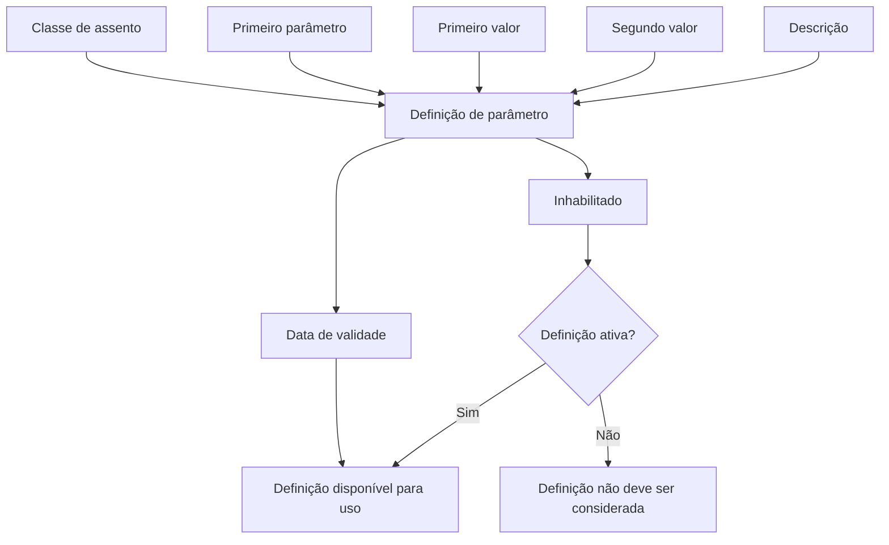

# Definição de Parâmetros de Assentos Contábeis

## 1. Metadados do Documento
- **Arquivo de Origem:** Não identificado no conteúdo fornecido
- **Tipo de Documento:** Especificação Funcional
- **Domínio / Sistema:** Definição de parâmetros de assentos contábeis
- **Público-Alvo:** Negócio, analistas funcionais e operação
- **Data/Versão Identificada:** Não identificada

---

## 2. Resumo Executivo & Contexto de Negócio

O documento descreve a funcionalidade de **definição de parâmetros de assentos contábeis**. O objetivo declarado é identificar os parâmetros que determinam o comportamento de cada assento contábil.

A definição é composta por propriedades gerais que associam uma classe de assento a uma chave de parâmetro, dois valores de parâmetro e uma descrição. Esses atributos permitem registrar as características de cada definição de parâmetro.

O documento também estabelece controles de vigência e ativação. A **data de validade** define quando uma definição pode ser utilizada e possibilita manter histórico das alterações realizadas. O indicador **Inhabilitado** determina se a definição permanece ativa ou se não deve mais ser considerada.

Não há detalhamento sobre telas, APIs, persistência, integrações, métodos HTTP, contratos JSON, perfis de acesso, regras de cálculo ou valores permitidos para os campos apresentados.

---

## 3. Arquitetura, Componentes & Tecnologias Envolvidas

O conteúdo fornecido não descreve arquitetura de software, microsserviços, bases de dados, ambientes técnicos ou tecnologias. Os únicos elementos funcionais identificados são a definição de parâmetros de assentos contábeis e os seus atributos.



**Nota de Análise:** O documento cita navegação ou elementos de portal, incluindo “Inicio”, “Soluciones”, “APIs”, “Documentación”, “Zeus”, “ES” e “CF”, mas não explica suas funções, relações com a definição de parâmetros ou tecnologias associadas.

---

## 4. Regras de Negócio, Especificações Funcionais & Processos

1. A definição de parâmetros tem como objetivo identificar os parâmetros que determinam o comportamento de cada assento contábil.
2. A **classe de assento** é uma chave que identifica a classe de assento.
3. O **primeiro parâmetro** é uma chave que identifica o parâmetro.
4. O **primeiro valor** representa o primeiro valor associado ao parâmetro.
5. O **segundo valor** representa o segundo valor associado ao parâmetro.
6. A **descrição** contém a descrição do parâmetro.
7. A **data de validade** determina quando a definição estará disponível para utilização.
8. O uso correto da data de validade permite manter um registro histórico das alterações efetuadas na definição.
9. O atributo **Inhabilitado** determina se uma definição está ativa.
10. Quando uma definição está inabilitada, ela não pode mais ser levada em consideração.

---

## 5. Tabelas de Parâmetros, Ambientes e Estruturas de Dados

| Item / Parâmetro | Descrição / Função | Tipo / Valores / Formato | Ambiente / Observações |
| :--- | :--- | :--- | :--- |
| Classe de assento | Chave que identifica a classe de assento. | Não especificado. | Propriedade geral da definição. |
| Primeiro parâmetro | Chave que identifica o parâmetro. | Não especificado. | Propriedade geral da definição. |
| Primeiro valor | Primeiro valor do parâmetro. | Não especificado. | Propriedade geral da definição. |
| Segundo valor | Segundo valor do parâmetro. | Não especificado. | Propriedade geral da definição. |
| Descrição | Descrição do parâmetro. | Texto não detalhado. | Propriedade geral da definição. |
| Data de validade | Determina quando a definição estará disponível para uso. | Data; formato não especificado. | Permite registrar o histórico de alterações na definição. |
| Inhabilitado | Indica se a definição está ativa ou se não deve mais ser considerada. | Indicador; valores não especificados. | Uma definição inabilitada não deve ser levada em consideração. |

---

## 6. Bateria de Perguntas & Respostas para RAG (FAQ Sintético)

### P1: Qual é o objetivo da definição de parâmetros de assentos contábeis?
**R:** O objetivo é identificar os parâmetros que determinam o comportamento de cada assento contábil.

### P2: O que identifica a classe de assento?
**R:** A classe de assento é identificada por uma chave associada à propriedade “Clase de asiento”.

### P3: Qual é a função do primeiro parâmetro?
**R:** O primeiro parâmetro é uma chave que identifica o parâmetro utilizado na definição de parâmetros de assentos contábeis.

### P4: Para que servem o primeiro valor e o segundo valor?
**R:** O documento informa que o primeiro valor é o primeiro valor do parâmetro e que o segundo valor é o segundo valor do parâmetro. Não são detalhados tipos, formatos ou regras de preenchimento.

### P5: Qual é a finalidade da descrição na definição de parâmetros?
**R:** A descrição registra a descrição do parâmetro. O documento não especifica tamanho, obrigatoriedade ou formato desse campo.

### P6: Como a data de validade afeta uma definição de parâmetro?
**R:** A data de validade determina quando a definição estará disponível para ser utilizada.

### P7: Por que a data de validade é importante para o histórico das definições?
**R:** O uso correto da data de validade permite manter um registro histórico das alterações efetuadas na definição.

### P8: O que significa o indicador Inhabilitado?
**R:** Inhabilitado determina se a definição está ativa ou se ela já não pode mais ser levada em consideração.

### P9: Uma definição inabilitada pode ser considerada na utilização?
**R:** Não. O texto informa que, quando a definição está inabilitada, ela não pode mais ser levada em consideração.

### P10: O documento informa quais valores podem ser utilizados nos parâmetros?
**R:** Não. O conteúdo apenas identifica os campos primeiro parâmetro, primeiro valor e segundo valor, sem apresentar domínios permitidos, exemplos ou validações.

---

## 7. Glossário de Termos, Siglas & Conceitos-Chave

- **Assento contábil:** Entidade cujo comportamento é determinado pelos parâmetros descritos no documento.
- **Classe de assento:** Chave que identifica a classe de assento.
- **Definição:** Registro que reúne propriedades gerais, data de validade e condição de ativação.
- **Data de validade:** Informação que determina quando uma definição estará disponível para utilização.
- **Inhabilitado:** Indicador que determina se uma definição permanece ativa ou não pode mais ser considerada.
- **Primeiro parâmetro:** Chave que identifica um parâmetro.
- **Primeiro valor:** Primeiro valor associado ao parâmetro.
- **Segundo valor:** Segundo valor associado ao parâmetro.
- **CF:** Sigla apresentada no conteúdo sem expansão ou explicação.
- **Zeus:** Termo apresentado no conteúdo sem explicação de função ou escopo.

---

## 8. Notas Críticas, Riscos & Limitações

- O documento não identifica o arquivo de origem, versão, data, autor ou sistema corporativo responsável.
- Não há especificação dos tipos de dados, formatos, obrigatoriedade ou valores aceitos pelos campos.
- Não são apresentadas regras para conflito, sobreposição ou término de períodos de validade.
- O comportamento exato do indicador **Inhabilitado** não é detalhado além de definir se a configuração deve ser considerada.
- Não há informação sobre APIs, bancos de dados, integrações, permissões, auditoria ou tratamento de erros.
- **Nota de Análise:** O documento lista o conceito de “parâmetros de assentos”, porém não detalha como os parâmetros são aplicados no processamento contábil.

---

## 9. Conteúdo Bruto Estruturado (Referência Fiel)

```text
--- [PÁGINA 1 DE 2] ---

DEFINICIÓN de Parámetros de asientos
Objetivo
Identificar los parámetros que determinan el comportamiento de cada asiento contable.
Propiedades generales
Clase de asiento
Clave que identifica la clase de asiento.
Primer parámetro
Clave que identifica el parámetro.
Primer valor
Primer valor del parámetro.
Segundo valor
Segundo valor del parámetro.
Descripción
Descripción del parámetro.
 /
 CF
Inicio Soluciones APIs Documentación Zeus
ES


--- [PÁGINA 2 DE 2] ---

Fecha de validez
Determina cuando la definición estará disponible para ser utilizada. Su correcto uso permite tener un
registro histórico de los cambios efectuados en la definición.
Inhabilitado
En este punto se determina si la definición está activa, o por el contrario ya no puede tenerse en
cuenta.
```
