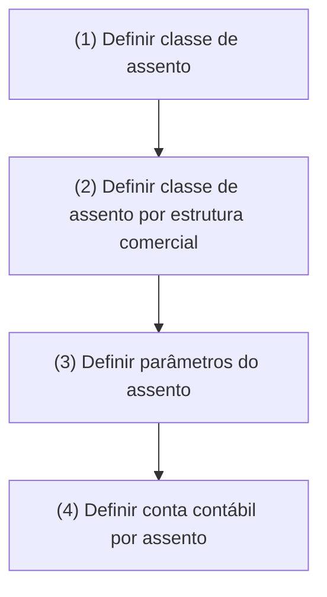

# Definição de Assentos Contábeis — Processo de Construção

## 1. Metadados do Documento
- **Arquivo de Origem:** Não identificado no conteúdo extraído
- **Tipo de Documento:** Procedimento
- **Domínio / Sistema:** Definição de assentos contábeis
- **Público-Alvo:** Negócio, Contabilidade e equipes responsáveis pela configuração de estruturas comerciais
- **Data/Versão Identificada:** Não identificada

---

## 2. Resumo Executivo & Contexto de Negócio

O documento descreve, em estado de construção, o processo para definir os tipos e as características dos assentos contábeis utilizados pela companhia. O objetivo declarado é estabelecer os elementos necessários para que a companhia trabalhe com classes, parâmetros e contas contábeis associadas aos assentos.

O processo apresentado possui quatro etapas sequenciais: definição da classe de assento, definição da classe de assento por estrutura comercial, definição dos parâmetros do assento e definição da conta contábil por assento. A sequência indica uma organização progressiva, partindo da classificação do assento até sua associação com uma conta contábil.

O conteúdo não apresenta critérios de validação, regras de cálculo, formatos de dados, responsáveis, sistemas de execução, métodos HTTP, contratos de integração ou exemplos de lançamentos. A única referência adicional exibida no rodapé é “CF Home Solutions APIs Documentation Zeus EN”, sem detalhamento de sua relação operacional com o processo de assentos contábeis.

---

## 3. Arquitetura, Componentes & Tecnologias Envolvidas

Os elementos explicitamente citados são:

- Assentos contábeis.
- Classe de assento.
- Classe de assento por estrutura comercial.
- Parâmetros do assento.
- Conta contábil por assento.
- Referências textuais no rodapé: `CF`, `Home Solutions`, `APIs Documentation`, `Zeus` e `EN`.



> **Nota de Análise:** O documento não descreve uma arquitetura de software, interfaces de integração, bancos de dados, microsserviços, ambientes ou tecnologias implementadas. As expressões “APIs Documentation” e “Zeus” aparecem apenas no rodapé e não possuem explicação adicional no conteúdo disponível.

---

## 4. Regras de Negócio, Especificações Funcionais & Processos

### Objetivo declarado

Definir os tipos e as características dos assentos contábeis com os quais a companhia trabalhará.

### Processo apresentado

1. **Definir classe de assento**
   - O processo começa pela definição da classe de assento.
   - O documento não informa quais classes existem, seus códigos, atributos ou critérios de classificação.

2. **Definir classe de assento por estrutura comercial**
   - Após definir a classe de assento, deve-se definir a classe de assento por estrutura comercial.
   - O documento não define o conceito de estrutura comercial, nem detalha relacionamentos, condições ou hierarquias aplicáveis.

3. **Definir parâmetros do assento**
   - O processo prevê a definição de parâmetros para o assento contábil.
   - O documento não especifica nomes de parâmetros, tipos, valores permitidos, obrigatoriedade ou regras de validação.

4. **Definir conta contábil por assento**
   - A etapa final consiste em definir a conta contábil associada ao assento.
   - O conteúdo não apresenta plano de contas, códigos contábeis, condições de associação ou regras para determinação da conta.

> **Nota de Análise:** O conteúdo apresenta somente as etapas de alto nível do processo. Não há detalhamento suficiente para derivar regras de negócio adicionais, validações, exceções, cálculos ou contratos funcionais.

---

## 5. Tabelas de Parâmetros, Ambientes e Estruturas de Dados

| Item / Parâmetro | Descrição / Função | Tipo / Valores / Formato | Ambiente / Observações |
| :--- | :--- | :--- | :--- |
| Assento contábil | Elemento contábil cujo tipo e características devem ser definidos. | Não especificado. | Aplicável à companhia mencionada no documento. |
| Classe de assento | Primeira definição do processo apresentado. | Não especificado. | Não há lista de classes ou critérios de classificação. |
| Classe de assento por estrutura comercial | Segunda definição do processo apresentado. | Não especificado. | O documento não define “estrutura comercial”. |
| Parâmetros do assento | Terceira definição do processo apresentado. | Não especificado. | Não há nomes, formatos ou valores de parâmetros. |
| Conta contábil por assento | Quarta definição do processo apresentado. | Não especificado. | Não há plano de contas, códigos ou regras de associação. |
| CF | Referência exibida no rodapé. | Não especificado. | O significado não é detalhado. |
| Home Solutions | Referência exibida no rodapé. | Não especificado. | A relação com os assentos contábeis não é detalhada. |
| APIs Documentation | Referência exibida no rodapé. | Não especificado. | Não há APIs, URLs, métodos ou contratos descritos. |
| Zeus | Referência exibida no rodapé. | Não especificado. | O significado e a função não são detalhados. |
| EN | Referência exibida no rodapé. | Não especificado. | O significado não é detalhado. |

---

## 6. Bateria de Perguntas & Respostas para RAG (FAQ Sintético)

### P1: Qual é o objetivo da definição de assentos contábeis?
**R:** O objetivo é definir os tipos e as características dos assentos contábeis com os quais a companhia trabalhará.

### P2: Quantas etapas compõem o processo de definição de assentos contábeis?
**R:** O processo possui quatro etapas: definir a classe de assento, definir a classe de assento por estrutura comercial, definir os parâmetros do assento e definir a conta contábil por assento.

### P3: Qual é a primeira etapa do processo de definição de assentos contábeis?
**R:** A primeira etapa é definir a classe de assento.

### P4: O que deve ser definido após a classe de assento?
**R:** Após a definição da classe de assento, o processo indica que deve ser definida a classe de assento por estrutura comercial.

### P5: Em que etapa são definidos os parâmetros do assento?
**R:** Os parâmetros do assento são definidos na terceira etapa do processo, após a definição da classe de assento e da classe de assento por estrutura comercial.

### P6: Qual é a etapa final do processo de definição de assentos contábeis?
**R:** A etapa final é definir a conta contábil por assento.

### P7: O documento especifica quais parâmetros devem ser configurados para um assento contábil?
**R:** Não. O documento informa que os parâmetros do assento devem ser definidos, mas não lista nomes, formatos, tipos, valores permitidos ou regras de validação.

### P8: O documento fornece códigos ou regras para associar uma conta contábil a um assento?
**R:** Não. O documento determina a definição de uma conta contábil por assento, mas não fornece códigos de contas, plano de contas ou regras de associação.

### P9: O que significa estrutura comercial no processo de definição de assentos?
**R:** O documento menciona “estrutura comercial” na etapa de definição da classe de assento por estrutura comercial, mas não define esse conceito nem detalha sua composição.

### P10: O documento descreve APIs, métodos HTTP ou contratos de integração?
**R:** Não. Embora o rodapé mencione “APIs Documentation”, o conteúdo disponível não descreve APIs, métodos HTTP, URLs, contratos JSON, serviços ou integrações.

### P11: O documento informa ambientes, servidores ou rotas de log?
**R:** Não. Não há informações sobre ambientes, servidores, URLs, portas, arquivos de configuração ou rotas de logs.

### P12: O documento está finalizado?
**R:** Não há confirmação de finalização. O conteúdo apresenta a expressão “EN CONSTRUCCIÓN”, indicando que o material está em construção.

---

## 7. Glossário de Termos, Siglas & Conceitos-Chave

- **Assento contábil:** Elemento contábil cujo tipo e características devem ser definidos no processo apresentado.
- **Classe de assento:** Classificação do assento contábil definida na primeira etapa do processo.
- **Classe de assento por estrutura comercial:** Classificação de assento relacionada a uma estrutura comercial, definida na segunda etapa do processo.
- **Parâmetros do assento:** Elementos de configuração do assento, mencionados na terceira etapa do processo.
- **Conta contábil por assento:** Conta contábil a ser definida para o assento, conforme a quarta etapa do processo.
- **CF:** Referência presente no rodapé; significado não detalhado.
- **Zeus:** Referência presente no rodapé; significado e função não detalhados.
- **EN:** Referência presente no rodapé; significado não detalhado.

---

## 8. Notas Críticas, Riscos & Limitações

- O documento está identificado como **“EN CONSTRUCCIÓN”**, o que sinaliza possível incompletude do conteúdo.
- Não há detalhamento de tipos de assento, classes, estruturas comerciais, parâmetros ou contas contábeis.
- Não há regras de validação, exceções, responsáveis, aprovações, critérios de obrigatoriedade ou mecanismos de auditoria.
- Não há informações sobre integrações, APIs, contratos, métodos HTTP, sistemas de origem ou sistemas de destino.
- Não há ambientes, URLs, servidores, versões, rotas de logs, credenciais ou configurações técnicas.
- As referências `CF`, `Home Solutions`, `APIs Documentation`, `Zeus` e `EN` aparecem no rodapé, mas não são explicadas.
- Não é possível inferir o significado de siglas ou a arquitetura técnica a partir do conteúdo fornecido sem introduzir informação não sustentada pelo documento.

---

## 9. Conteúdo Bruto Estruturado (Referência Fiel)

```text
--- [PÁGINA 1 DE 1] ---

EN CONSTRUCCIÓN
DEFINICIÓN de asiento contable
Objetivo
Definición de los tipos y características de los asientos contables con los que trabajará la compañía.
Proceso a seguir
DEFINIR clase
de asiento
(1)
DEFINIR clase
asiento por
estructura
comercial
(2)
DEFINIR
parámetros
asiento
(3)
DEFINIR cuenta
contable por
asiento
(4)
1. DEFINIR clase de asiento
2. DEFINIR clase asiento por estructura comercial
3. DEFINIR parámetros asiento
4. DEFINIR cuenta contable por asiento
 / 
 CF
Home Solutions APIs Documentation Zeus
EN
```
