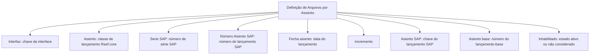

# Definição de Arquivos por Assento Contábil

## 1. Metadados do Documento
- **Arquivo de Origem:** Não identificado
- **Tipo de Documento:** Especificação Técnica
- **Domínio / Sistema:** Reef.core / SAP
- **Público-Alvo:** Não identificado
- **Data/Versão Identificada:** Não identificada

---

## 2. Resumo Executivo & Contexto de Negócio

O documento define as informações usadas para gerar o nome de um arquivo, identificando o tipo de lançamento contábil ao qual o arquivo corresponde. A definição relaciona atributos de interface, classe de lançamento no Reef.core e dados de lançamento no SAP.

A estrutura apresentada contempla chaves de identificação, números de série, número de lançamento, data, incremento e referência a um lançamento-base. Esses atributos constituem a informação disponível para distinguir e compor a identificação de arquivos por lançamento contábil.

O documento também apresenta o atributo **Inhabilitado**, utilizado para determinar se uma definição permanece ativa ou se não deve mais ser considerada. Não há detalhamento sobre regras de composição do nome do arquivo, formatos dos campos, algoritmos de incremento ou critérios de validação.

---

## 3. Arquitetura, Componentes & Tecnologias Envolvidas

| Componente / Tecnologia | Papel descrito no documento |
| :--- | :--- |
| Reef.core | Sistema no qual a classe de lançamento é identificada pelo campo **Asiento**. |
| SAP | Sistema referenciado por número de série, número de lançamento e chave de identificação do lançamento. |
| Definição de arquivos por lançamento | Estrutura que reúne atributos para gerar o nome de um arquivo conforme o tipo de lançamento contábil. |
| Interface | Chave que identifica a interface associada à definição. |

O texto não descreve uma arquitetura de integração, endpoints, protocolos, camadas ou fluxo de dados entre Reef.core e SAP. A relação abaixo representa exclusivamente as associações explícitas entre os campos documentados.



---

## 4. Regras de Negócio, Especificações Funcionais & Processos

1. A finalidade da definição é fornecer informações para gerar o nome de um arquivo.
2. O nome do arquivo deve permitir identificar o tipo de lançamento contábil correspondente.
3. O campo **Interfaz** contém a chave que identifica a interface.
4. O campo **Asiento** contém a chave que identifica a classe de lançamento no Reef.core.
5. O campo **Serie SAP** identifica o número de série do SAP.
6. O campo **Número Asiento SAP** contém o número do lançamento no SAP.
7. O campo **Fecha asiento** contém a data do lançamento.
8. O campo **Incremento** é listado como propriedade, mas não possui descrição adicional no conteúdo fornecido.
9. O campo **Asiento SAP** contém a chave usada para identificar o lançamento no SAP.
10. O campo **Asiento base** contém o número do lançamento-base.
11. O campo **Inhabilitado** determina se a definição está ativa ou se não deve mais ser levada em conta.

> **Nota de Análise:** O documento não detalha como os atributos são concatenados para formar o nome do arquivo, nem apresenta valores permitidos, obrigatoriedade, tipos de dados, contratos de integração ou regras de precedência entre os campos.

---

## 5. Tabelas de Parâmetros, Ambientes e Estruturas de Dados

| Item / Parâmetro | Descrição / Função | Tipo / Valores / Formato | Ambiente / Observações |
| :--- | :--- | :--- | :--- |
| Interfaz | Chave que identifica a interface. | Não especificado. | Associada à definição de arquivos por lançamento. |
| Asiento | Chave que identifica a classe de lançamento no Reef.core. | Não especificado. | Reef.core. |
| Serie SAP | Identifica o número de série do SAP. | Não especificado. | SAP. |
| Número Asiento SAP | Contém o número do lançamento no SAP. | Não especificado. | SAP. |
| Fecha asiento | Contém a data do lançamento. | Data; formato não especificado. | Não especificado. |
| Incremento | Propriedade listada sem explicação adicional. | Não especificado. | Não especificado. |
| Asiento SAP | Contém a chave que identifica o lançamento no SAP. | Não especificado. | SAP. |
| Asiento base | Contém o número do lançamento-base. | Não especificado. | Não especificado. |
| Inhabilitado | Determina se a definição está ativa ou se não deve ser considerada. | Estado lógico; valores não especificados. | Não especificado. |

---

## 6. Bateria de Perguntas & Respostas para RAG (FAQ Sintético)

### P1: Qual é o objetivo da definição de arquivos por lançamento?
**R:** O objetivo é definir as informações utilizadas para gerar o nome de um arquivo e identificar o tipo de lançamento contábil ao qual o arquivo corresponde.

### P2: Qual campo identifica a interface na definição de arquivo?
**R:** O campo **Interfaz** contém a chave que identifica a interface.

### P3: Como a classe de lançamento é identificada no Reef.core?
**R:** A classe de lançamento no Reef.core é identificada pelo campo **Asiento**, que contém a chave correspondente.

### P4: Quais informações relacionadas ao SAP estão presentes na definição?
**R:** A definição inclui **Serie SAP**, para o número de série; **Número Asiento SAP**, para o número do lançamento; e **Asiento SAP**, para a chave que identifica o lançamento no SAP.

### P5: O que representa o campo Fecha asiento?
**R:** O campo **Fecha asiento** contém a data do lançamento. O documento não especifica o formato dessa data.

### P6: Qual é a função do campo Asiento base?
**R:** O campo **Asiento base** contém o número do lançamento-base.

### P7: Como uma definição deixa de ser considerada?
**R:** O campo **Inhabilitado** determina se a definição está ativa ou se não pode mais ser levada em conta.

### P8: O documento explica como formar o nome final do arquivo?
**R:** Não. O documento informa que os campos são usados para gerar o nome do arquivo, mas não descreve a ordem, a concatenação, os separadores ou regras de formatação.

### P9: Qual é o significado do campo Incremento?
**R:** O campo **Incremento** é listado no documento, porém não recebe descrição funcional, formato ou regra de uso adicional.

---

## 7. Glossário de Termos, Siglas & Conceitos-Chave

- **Asiento:** Termo usado para lançamento contábil.
- **Asiento base:** Número do lançamento-base.
- **Asiento SAP:** Chave de identificação do lançamento no SAP.
- **CF:** Sigla exibida no conteúdo bruto, sem significado explicado.
- **Interfaz:** Chave que identifica a interface.
- **Reef.core:** Sistema citado como referência para a identificação da classe de lançamento.
- **SAP:** Sistema citado como origem ou referência de série, número e chave de lançamento.
- **Serie SAP:** Número de série associado ao SAP.

---

## 8. Notas Críticas, Riscos & Limitações

- Não há nome de arquivo, versão, autor, data de publicação ou público-alvo identificados no conteúdo fornecido.
- O documento não especifica tipos de dados, tamanhos, formatos, valores obrigatórios ou domínios válidos para os campos.
- Não há definição do comportamento do campo **Incremento**.
- Não há fórmula ou padrão de composição do nome do arquivo.
- Não são descritos métodos HTTP, contratos JSON, integrações, sincronização de dados ou tratamento de erros entre Reef.core e SAP.
- A sigla **CF** aparece no conteúdo bruto sem contexto suficiente para definição confiável.

---

## 9. Conteúdo Bruto Estruturado (Referência Fiel)

```text
--- [PÁGINA 1 DE 2] ---

DEFINICIÓN de Archivos por asiento
Objetivo
Definir la información utilizada para generar el nombre del archivo identificando el tipo de asiento
contable al que corresponde.
Propiedades generales
Propiedades generales
Interfaz
Clave que identifica la interfaz.
Asiento
Contiene la clave que identifica la clase de asiento de Reef.core.
Serie SAP
Identifica el número de serie de SAP.
Número Asiento SAP
Contiene el número del asiendo de SAP.
Fecha asiento
 / 
 CF
Inicio Soluciones APIs Documentación Zeus
ES


--- [PÁGINA 2 DE 2] ---

Contiene la fecha del asiento.
Incremento
Incremento
Asiento SAP
Contiene la clave con la que se identifica el asiento en SAP.
Asiento base
Contiene el número de asiento base.
Inhabilitado
En este punto se determina si la definición está activa, o por el contrario ya no puede tenerse en
cuenta.
```
