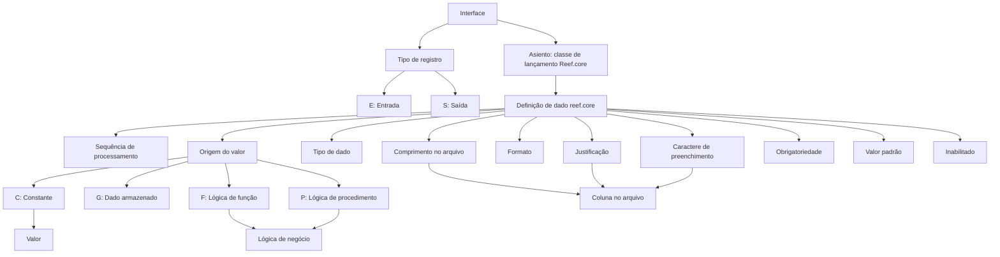

# Definição de Detalhe da Interface SAP para Dados reef.core

## 1. Metadados do Documento
- **Arquivo de Origem:** `Não identificado no conteúdo fornecido`
- **Tipo de Documento:** `Especificação Técnica`
- **Domínio / Sistema:** `Interface entre reef.core e SAP`
- **Público-Alvo:** `Desenvolvedores, analistas funcionais e responsáveis pela definição de interfaces`
- **Data/Versão Identificada:** `Não identificada`

---

## 2. Resumo Executivo & Contexto de Negócio

O documento define as características dos dados requeridos por SAP em uma interface alimentada por dados de reef.core. A finalidade declarada é identificar os dados incluídos na interface, o comprimento de apresentação, a forma de recuperar cada valor e demais propriedades necessárias para compor os registros de um arquivo.

A especificação organiza a definição da interface em propriedades gerais e propriedades de detalhe. As propriedades gerais identificam a interface, a classe de lançamento (“Asiento”) de Reef.core e o tipo de registro, que pode ser entrada (`E`) ou saída (`S`).

As propriedades de detalhe descrevem como cada dado de reef.core será processado, recuperado, formatado, justificado e preenchido no arquivo. A origem do valor pode ser uma constante, um dado armazenado, uma lógica do tipo função ou uma lógica do tipo procedimento.

O documento também estabelece atributos de controle para obrigatoriedade, valor padrão, descrição e inabilitação. Esses atributos permitem definir se um dado é obrigatório, qual valor usar como padrão e se determinada definição permanece ativa ou não deve mais ser considerada.

---

## 3. Arquitetura, Componentes & Tecnologias Envolvidas

Os componentes e conceitos explicitamente citados são:

| Componente / Conceito | Papel descrito no documento |
| :--- | :--- |
| `SAP` | Sistema que requer os dados definidos na interface. |
| `reef.core` / `Reef.core` | Origem dos dados e contexto das classes de lançamento, dados armazenados e lógicas de negócio. |
| Interface | Chave que identifica a interface. |
| Asiento | Chave que identifica a classe de lançamento de Reef.core. |
| Arquivo | Estrutura de destino em que as colunas possuem comprimento, justificação e caractere de preenchimento. |
| Lógica de função | Origem possível do valor de um dado; o nome da lógica de negócio é informado na propriedade `Lógica`. |
| Lógica de procedimento | Origem possível do valor de um dado; o nome da lógica de negócio é informado na propriedade `Lógica`. |
| `CF` | Termo apresentado junto a “Dato reef”; o conteúdo não detalha seu significado. |



> **Nota de Análise:** O documento cita SAP e reef.core, mas não detalha protocolos de integração, métodos HTTP, contratos JSON, endpoints, servidores, portas, tecnologias de transporte ou estrutura física completa do arquivo.

---

## 4. Regras de Negócio, Especificações Funcionais & Processos

### 4.1 Objetivo da definição de interface

A definição de detalhe da interface deve caracterizar os dados requeridos por SAP, identificando:

1. Os dados de reef.core que serão incluídos na interface.
2. O comprimento de apresentação de cada dado.
3. A forma de recuperação do valor de cada dado.
4. As propriedades adicionais necessárias para apresentação, processamento e formação das colunas no arquivo.

### 4.2 Identificação da interface e do registro

1. A propriedade **Interface** contém a chave que identifica a interface.
2. A propriedade **Asiento** contém a chave que identifica a classe de lançamento de Reef.core.
3. A propriedade **Tipo de registro** determina o tipo de registro:
   - `E`: Entrada.
   - `S`: Saída.

### 4.3 Definição e processamento do dado

1. A propriedade **Dato reef / CF** contém a chave que identifica o dado de Reef.core.
2. A propriedade **Secuencia** determina a ordem em que o dado será processado.
3. A propriedade **longitud** identifica o comprimento de apresentação do dado.
4. A propriedade **Tipo de dato** determina o tipo do dado de Reef.core, com exemplos de:
   - Numérico.
   - Data (`date`).
   - Caractere.

### 4.4 Regras para origem e obtenção do valor

A propriedade **Origen** determina a origem do valor do dado:

| Código | Origem | Regra associada |
| :--- | :--- | :--- |
| `C` | Constante | A propriedade `Valor` contém o valor do dado. |
| `G` | Dado armazenado | O valor é recuperado de um dado armazenado. |
| `F` | Lógica do tipo função | A propriedade `Lógica` contém o nome da lógica de negócio que devolve o valor do dado. |
| `P` | Lógica do tipo procedimento | A propriedade `Lógica` contém o nome da lógica de negócio que devolve o valor do dado. |

### 4.5 Regras de valor, lógica e formato

1. Quando a origem for `C` — constante — a propriedade **Valor** deve conter o valor correspondente.
2. Quando o dado for obtido por lógica do tipo função (`F`) ou procedimento (`P`), a propriedade **Lógica** deve conter o nome da lógica de negócio que devolve o valor.
3. A propriedade **Formato** deve conter o valor do formato quando for necessário informar o dado em um formato específico.
4. Para um dado do tipo data apresentado em formato numérico, com dia e mês de dois dígitos e ano de quatro dígitos, o formato indicado é `DDMMAAAA`.

### 4.6 Regras de apresentação no arquivo

1. A propriedade **Justificación** identifica o tipo de justificação do dado dentro do arquivo:
   - `D`: à direita da coluna.
   - `I`: à esquerda da coluna.
2. A propriedade **Relleno** determina o caractere de preenchimento utilizado para completar o comprimento da coluna no arquivo.
3. O comprimento, a justificação e o caractere de preenchimento participam da apresentação do valor na coluna do arquivo.

### 4.7 Regras de controle da definição

1. **Dato almacenado** indica se o valor será recuperado de um dado armazenado.
2. **Obligatorio** identifica se o dado é obrigatório.
3. **Valor defecto** define o valor padrão do dado.
4. **Descripción** contém informação sobre o registro, seu uso, motivo ou razão.
5. **Inhabilitado** determina se a definição permanece ativa ou se não pode mais ser considerada.

---

## 5. Tabelas de Parâmetros, Ambientes e Estruturas de Dados

| Item / Parâmetro | Descrição / Função | Tipo / Valores / Formato | Ambiente / Observações |
| :--- | :--- | :--- | :--- |
| Interface | Chave que identifica a interface. | Chave; formato não detalhado. | Interface que fornece dados requeridos por SAP. |
| Asiento | Chave que identifica a classe de lançamento de Reef.core. | Chave; formato não detalhado. | Relacionado a Reef.core. |
| Tipo de registro | Determina o tipo de registro. | `E` = Entrada; `S` = Saída. | Não há critérios adicionais descritos. |
| Dato reef / CF | Contém a chave que identifica o dado de Reef.core. | Chave; significado de `CF` não detalhado. | Relacionado ao dado de Reef.core. |
| Secuencia | Determina a ordem de processamento do dado. | Sequência; formato não detalhado. | Define a ordem em que o dado será processado. |
| longitud | Identifica o comprimento de apresentação do dado. | Comprimento; unidade não detalhada. | Aplicável à coluna no arquivo. |
| Tipo de dato | Determina o tipo do dado de Reef.core. | Numérico, `date`, caráter. | Não há enumeração completa de tipos. |
| Origen | Determina a origem do valor do dado. | `C`, `G`, `F`, `P`. | A origem condiciona o uso de `Valor` ou `Lógica`. |
| Valor | Contém o valor do dado quando a origem é constante. | Valor constante; formato não detalhado. | Aplicável quando `Origen = C`. |
| Lógica | Contém o nome da lógica de negócio que devolve o valor. | Nome de lógica de negócio. | Aplicável quando a origem é função ou procedimento. |
| Formato | Contém o formato específico de apresentação do dado. | Exemplo: `DDMMAAAA`. | Usado quando necessário informar o dado em formato específico. |
| Justificación | Identifica o tipo de justificação do dado no arquivo. | `D` = direita; `I` = esquerda. | Aplicável dentro da coluna do arquivo. |
| Relleno | Determina o caractere que completa o comprimento da coluna. | Caractere de preenchimento; não detalhado. | Usado para completar a longitude da coluna. |
| Dato almacenado | Indica se o valor será recuperado de dado armazenado. | Indicador; valores não detalhados. | Relacionado à recuperação do valor. |
| Obligatorio | Identifica se o dado é obrigatório. | Indicador; valores não detalhados. | Não há comportamento de validação detalhado. |
| Valor defecto | Define o valor padrão do dado. | Valor padrão; formato não detalhado. | Não há condição de aplicação adicional especificada. |
| Descripción | Registra informação sobre o registro, uso, motivo ou razão. | Texto descritivo. | Finalidade documental. |
| Inhabilitado | Define se a configuração está ativa ou não deve mais ser considerada. | Indicador; valores não detalhados. | Controle de vigência da definição. |

### Ambientes, URLs e servidores

| Item / Parâmetro | Descrição / Função | Tipo / Valores / Formato | Ambiente / Observações |
| :--- | :--- | :--- | :--- |
| Ambientes | Não descritos. | Não aplicável. | O conteúdo não informa ambientes. |
| URLs | Não descritas. | Não aplicável. | O conteúdo não informa URLs. |
| Servidores | Não descritos. | Não aplicável. | O conteúdo não informa servidores. |
| Rotas de logs | Não descritas. | Não aplicável. | O conteúdo não informa caminhos ou mecanismos de log. |

---

## 6. Bateria de Perguntas & Respostas para RAG (FAQ Sintético)

### P1: Qual é o objetivo da definição de detalhe da interface para SAP?
**R:** O objetivo é definir as características dos dados requeridos por SAP, identificando quais dados de reef.core serão incluídos na interface, o comprimento de apresentação desses dados e a forma de recuperar o valor de cada um.

### P2: O que identifica a propriedade Interface?
**R:** A propriedade `Interface` contém a chave que identifica a interface.

### P3: O que representa a propriedade Asiento na definição da interface?
**R:** A propriedade `Asiento` contém a chave que identifica a classe de lançamento de Reef.core.

### P4: Quais valores são permitidos para o tipo de registro?
**R:** O tipo de registro pode ser `E`, correspondente a Entrada, ou `S`, correspondente a Saída.

### P5: Como a ordem de processamento de um dado é definida?
**R:** A ordem em que o dado será processado é determinada pela propriedade `Secuencia`.

### P6: Quais são as origens possíveis para o valor de um dado da interface?
**R:** A propriedade `Origen` pode indicar `C` para constante, `G` para dado armazenado, `F` para lógica do tipo função ou `P` para lógica do tipo procedimento.

### P7: Quando a propriedade Valor deve ser preenchida?
**R:** A propriedade `Valor` deve conter o valor do dado quando a origem do dado for uma constante, identificada pelo código `C`.

### P8: Quando a propriedade Lógica deve ser preenchida?
**R:** A propriedade `Lógica` deve conter o nome da lógica de negócio que devolve o valor do dado quando o valor for obtido por uma lógica do tipo função (`F`) ou por uma lógica do tipo procedimento (`P`).

### P9: Como deve ser informado um dado de data em formato numérico com dia, mês e ano?
**R:** Quando uma data for apresentada de forma numérica, com dia e mês de dois dígitos e ano de quatro dígitos, a propriedade `Formato` deve utilizar o valor `DDMMAAAA`.

### P10: Quais opções de justificação existem para uma coluna no arquivo?
**R:** A propriedade `Justificación` permite `D` para justificação à direita da coluna e `I` para justificação à esquerda da coluna.

### P11: Qual é a finalidade da propriedade Relleno?
**R:** A propriedade `Relleno` determina o caractere de preenchimento utilizado para completar o comprimento da coluna no arquivo.

### P12: Como uma definição pode deixar de ser considerada pela interface?
**R:** A propriedade `Inhabilitado` determina se a definição está ativa ou se já não pode mais ser levada em conta.

---

## 7. Glossário de Termos, Siglas & Conceitos-Chave

- **Asiento:** Chave que identifica a classe de lançamento de Reef.core.
- **CF:** Termo exibido junto a `Dato reef`; o significado não é definido no conteúdo.
- **Dato almacenado:** Dado cujo valor é recuperado de uma informação armazenada.
- **Dato reef:** Dado identificado por uma chave associada a Reef.core.
- **DDMMAAAA:** Formato numérico de data com dia e mês de dois dígitos e ano de quatro dígitos.
- **Interface:** Estrutura identificada por uma chave e utilizada para definir dados requeridos por SAP.
- **Inhabilitado:** Indicador que determina se a definição está ativa ou não deve mais ser considerada.
- **Lógica de função:** Tipo de lógica de negócio que pode devolver o valor de um dado.
- **Lógica de procedimento:** Tipo de lógica de negócio que pode devolver o valor de um dado.
- **Reef.core / reef.core:** Sistema citado como origem dos dados, classes de lançamento e lógicas de negócio.
- **SAP:** Sistema que requer os dados definidos na interface; o documento não fornece expansão ou detalhes adicionais.
- **Secuencia:** Propriedade que determina a ordem de processamento de um dado.
- **Valor defecto:** Valor padrão de um dado.

---

## 8. Notas Críticas, Riscos & Limitações

- O conteúdo não apresenta nome do arquivo, data, versão, autor, histórico de alterações ou aprovação do documento.
- O termo `CF`, apresentado como `Dato reef / CF`, não possui definição adicional.
- O documento não detalha os valores possíveis para os indicadores `Dato almacenado`, `Obligatorio` e `Inhabilitado`.
- Não há especificação de protocolos, endpoints, URLs, ambientes, servidores, credenciais, logs, mecanismos de erro ou monitoramento.
- Não são informados layouts completos de registros, tamanhos numéricos concretos, caracteres de preenchimento específicos ou exemplos completos de arquivo.
- Não são definidos contratos de integração, métodos HTTP, estruturas JSON, mecanismos de transporte ou regras de transformação adicionais entre reef.core e SAP.
- **Nota de Análise:** O documento descreve propriedades de configuração do dado, mas não detalha como essas propriedades são persistidas, validadas ou executadas.

---

## 9. Conteúdo Bruto Estruturado (Referência Fiel)

```text
--- [PÁGINA 1 DE 3] ---

DEFINICIÓN de Detalle de la interfaz
Objetivo
Definir las características de los datos que requiere SAP, identificando los datos de reef.core que se
incluirán en la interfaz, la longitud de dichos datos, la forma de recuperar el valor, etc.
Propiedades generales
Propiedades generales
Interfaz
Clave que identifica la interfaz.
Asiento
Contiene la clave que identifica la clase de asiento de Reef.core.
Tipo de registro
Determina el tipo de registro.
(E)Entrada
(S)Salida
Dato reef
 / 
 CF
Inicio Soluciones APIs Documentación Zeus
ES


--- [PÁGINA 2 DE 3] ---

Contiene la clave que identifica el dato de Reef.core.
Secuencia
Determina el orden en que se procesará el dato.
longitud
Identifica la longitud de presentación del dato.
Tipo de dato
Determina el tipo del dato de Reef.core (numérico, date, carácter).
Origen
Determina el origen del valor del dato.
(C)Constante
(G)Dato almacenado
(F)Lógica de tipo función
(P)Lógica de tipo procedimiento
Valor
Si el origen del dato es constante, esta propiedad contendrá el valor de dicho dato.
Lógica
Si el dato se obtiene por una lógica de tipo función o una lógica de tipo procedimiento, esta propiedad
contiene el nombre de la lógica de negocio que devuelve el valor del dato.
Formato
Cuando sea necesario informar el dato en un formato específico, esta propiedad contiene el valor de
dicho formato.
Ejemplo: En datos que sean de tipo fecha se indicará cómo se informa esa fecha. Si es se indica en
forma numérica, siendo el día y mes de dos dígitos y el año de cuatro, tendrá el valor DDMMAAAA.
Justificación
Identifica el tipo de justificación que tendrá el dato dentro del archivo.
(D)A la derecha de la columna
(I)A la izquierda de la columna


--- [PÁGINA 3 DE 3] ---

Relleno
Determina el carácter de relleno para completar la longitud de la columna en el archivo.
Dato almacenado
indica si el valor será recuperado de un dato almacenado.
Obligatorio
Identifica si el dato es obligatorio.
Valor defecto
valor por defecto del dato.
Descripción
información del registro, uso, motivo, razón.
Inhabilitado
En este punto se determina si la definición está activa, o por el contrario ya no puede tenerse en
cuenta.
```
