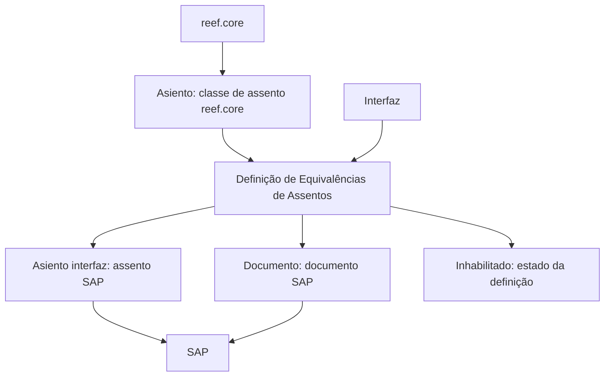

# Definição de Equivalências de Assentos entre reef.core e SAP

## 1. Metadados do Documento
- **Arquivo de Origem:** Não identificado no conteúdo fornecido
- **Tipo de Documento:** Especificação Técnica
- **Domínio / Sistema:** reef.core, SAP e interface Zeus
- **Público-Alvo:** Não identificado no conteúdo fornecido
- **Data/Versão Identificada:** Não identificada

---

## 2. Resumo Executivo & Contexto de Negócio

O documento descreve a funcionalidade **“Definición de Equivalencias de asientos”**, cujo objetivo é definir equivalências entre assentos do sistema `reef.core` e assentos do sistema SAP.

A definição de equivalência é composta por propriedades gerais que identificam uma interface, uma classe de assento no `reef.core`, o assento SAP produzido pela interface e o documento SAP associado.

A funcionalidade também contém o atributo **Inhabilitado**, usado para determinar se uma definição está ativa ou se não pode mais ser considerada. O documento não apresenta critérios adicionais, valores possíveis, procedimentos de alteração ou comportamento operacional detalhado.

O conteúdo extraído faz referência à navegação ou plataforma “Inicio Soluciones APIs Documentación Zeus”, mas não detalha a relação funcional ou técnica entre Zeus e o mecanismo de equivalências.

---

## 3. Arquitetura, Componentes & Tecnologias Envolvidas

Os componentes explicitamente citados são:

- **reef.core:** sistema que possui a classe de assento identificada pelo campo **Asiento**.
- **SAP:** sistema que possui o assento gerado pela interface e o documento associado.
- **Interfaz:** identificador da interface responsável por gerar o assento SAP.
- **Zeus:** termo presente na interface ou navegação exibida no conteúdo extraído; não há detalhamento adicional sobre sua responsabilidade.
- **Definición de Equivalencias de asientos:** configuração que relaciona assentos de `reef.core` com assentos de SAP.



> **Nota de Análise:** O documento identifica os elementos de mapeamento entre `reef.core` e SAP, porém não detalha protocolos de integração, métodos HTTP, contratos JSON, persistência, mecanismos de execução ou tratamento de erros.

---

## 4. Regras de Negócio, Especificações Funcionais & Processos

1. A funcionalidade tem como objetivo definir a equivalência entre assentos de `reef.core` e assentos de SAP.
2. A propriedade **Interfaz** contém a chave que identifica a interface.
3. A propriedade **Asiento** contém a chave que identifica a classe de assento de `reef.core`.
4. A propriedade **Asiento interfaz** contém a chave do assento SAP gerado pela interface.
5. A propriedade **Documento** contém o nome do documento SAP.
6. A propriedade **Inhabilitado** determina se a definição está ativa ou se a definição não pode mais ser considerada.
7. O documento não especifica:
   - Valores aceitos para **Inhabilitado**.
   - Formato ou tipo dos identificadores de interface, assento ou documento.
   - Regras de unicidade da equivalência.
   - Processo de criação, alteração, exclusão ou aprovação de equivalências.
   - Comportamento do sistema quando uma equivalência estiver inabilitada.
   - Métodos ou contratos de integração entre `reef.core` e SAP.

---

## 5. Tabelas de Parâmetros, Ambientes e Estruturas de Dados

| Item / Parâmetro | Descrição / Função | Tipo / Valores / Formato | Ambiente / Observações |
| :--- | :--- | :--- | :--- |
| Definición de Equivalencias de asientos | Define a equivalência entre assentos de `reef.core` e assentos de SAP. | Não especificado | Funcionalidade principal descrita no documento. |
| Interfaz | Chave que identifica a interface. | Não especificado | A interface gera o assento SAP mencionado no campo **Asiento interfaz**. |
| Asiento | Chave que identifica a classe de assento de `reef.core`. | Não especificado | Associado ao sistema `reef.core`. |
| Asiento interfaz | Chave do assento SAP gerado pela interface. | Não especificado | Associado ao sistema SAP. |
| Documento | Nome do documento SAP. | Não especificado | Associado ao sistema SAP. |
| Inhabilitado | Determina se a definição está ativa ou se não pode mais ser considerada. | Não especificado | O documento não informa valores permitidos nem efeitos técnicos detalhados. |
| reef.core | Sistema de origem da classe de assento identificada por **Asiento**. | Sistema | Não há versão ou ambiente identificado. |
| SAP | Sistema associado ao assento gerado pela interface e ao documento. | Sistema | Não há versão ou ambiente identificado. |
| Zeus | Termo exibido na navegação “Inicio Soluciones APIs Documentación Zeus”. | Não especificado | O conteúdo não descreve sua função. |

---

## 6. Bateria de Perguntas & Respostas para RAG (FAQ Sintético)

### P1: Qual é o objetivo da definição de equivalências de assentos?
**R:** A definição de equivalências de assentos tem como objetivo estabelecer a equivalência entre assentos do sistema `reef.core` e assentos do sistema SAP.

### P2: O que o campo Interfaz identifica?
**R:** O campo **Interfaz** contém a chave que identifica a interface associada à definição de equivalência de assentos.

### P3: O que representa o campo Asiento?
**R:** O campo **Asiento** contém a chave que identifica a classe de assento do sistema `reef.core`.

### P4: O que é armazenado no campo Asiento interfaz?
**R:** O campo **Asiento interfaz** contém a chave do assento SAP gerado pela interface identificada na definição de equivalência.

### P5: Qual é a finalidade do campo Documento?
**R:** O campo **Documento** contém o nome do documento SAP relacionado à definição de equivalência de assentos.

### P6: Para que serve o atributo Inhabilitado?
**R:** O atributo **Inhabilitado** é usado para determinar se a definição de equivalência está ativa ou se não pode mais ser levada em consideração.

### P7: O documento especifica quais valores podem ser usados em Inhabilitado?
**R:** Não. O documento informa apenas que **Inhabilitado** determina se a definição está ativa ou não pode mais ser considerada, sem apresentar valores, formato ou regras técnicas adicionais.

### P8: O documento detalha como a interface gera o assento SAP?
**R:** Não. O documento afirma que o campo **Asiento interfaz** contém a chave do assento SAP gerado pela interface, mas não descreve o processo de geração, integrações, contratos ou tecnologias envolvidas.

### P9: Há informações sobre APIs, métodos HTTP ou payloads entre reef.core e SAP?
**R:** Não. O conteúdo fornecido não descreve APIs, métodos HTTP, payloads JSON, protocolos de integração ou mecanismos de comunicação entre `reef.core` e SAP.

### P10: Qual sistema contém a classe de assento identificada pelo campo Asiento?
**R:** A classe de assento identificada pelo campo **Asiento** pertence ao sistema `reef.core`.

### P11: Qual sistema está associado ao campo Documento?
**R:** O campo **Documento** está associado ao SAP, pois contém o nome de um documento SAP.

### P12: O que é Zeus no contexto deste documento?
**R:** Zeus é citado na expressão “Inicio Soluciones APIs Documentación Zeus”. O documento não fornece explicação adicional sobre o papel, arquitetura ou responsabilidade de Zeus.

---

## 7. Glossário de Termos, Siglas & Conceitos-Chave

- **reef.core:** Sistema citado como origem da classe de assento identificada pelo campo **Asiento**.
- **SAP:** Sistema citado como destino ou referência para o assento gerado pela interface e para o documento associado.
- **Interfaz:** Chave que identifica a interface envolvida na definição de equivalência.
- **Asiento:** Chave que identifica a classe de assento no `reef.core`.
- **Asiento interfaz:** Chave do assento SAP gerado pela interface.
- **Documento:** Nome do documento SAP.
- **Inhabilitado:** Atributo que indica se a definição está ativa ou se não pode mais ser considerada.
- **Zeus:** Termo presente na navegação do conteúdo, sem definição funcional ou técnica adicional.

---

## 8. Notas Críticas, Riscos & Limitações

- O documento é conciso e não apresenta detalhamento de implementação.
- Não há versão, data, autor, ambiente, URL ou nome de arquivo identificados.
- Não são fornecidos contratos de integração, endpoints, autenticação, formatos de mensagem ou protocolos entre `reef.core` e SAP.
- O comportamento exato de uma equivalência marcada como **Inhabilitado** não é detalhado.
- Não há definição dos tipos, tamanhos, formatos ou regras de validação dos campos.
- Não há informações sobre auditoria, permissões, governança, tratamento de erros ou rastreabilidade.
- **Nota de Análise:** O documento lista a definição de equivalências entre `reef.core` e SAP, porém não detalha métodos de integração, contratos técnicos, regras de unicidade ou efeitos operacionais da inabilitação.

---

## 9. Conteúdo Bruto Estruturado (Referência Fiel)

```text
--- [PÁGINA 1 DE 2] ---

DEFINICIÓN de Equivalencias de asientos
Objetivo
Define la equivalencia entre los asientos de reef.core y los asientos de SAP.
Propiedades generales
Propiedades generales
Interfaz
Clave que identifica la interfaz.
Asiento
Contiene la clave que identifica la clase de asiento de Reef.core.
Asiento interfaz
Contiene la clave del asiento SAP que genera la interfaz.
Documento
Contiene el nombre del documento SAP.
Inhabilitado
 /
 CF
Inicio Soluciones APIs Documentación Zeus
ES


--- [PÁGINA 2 DE 2] ---

En este punto se determina si la definición está activa, o por el contrario ya no puede tenerse en
cuenta.
```
