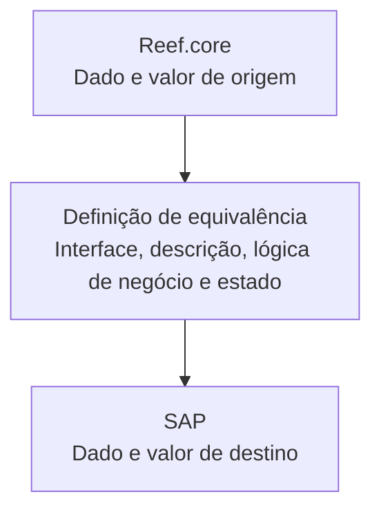

# Definição de Equivalências de Dados entre Reef.core e SAP

## 1. Metadados do Documento
- **Arquivo de Origem:** `Não identificado`
- **Tipo de Documento:** `Especificação Técnica`
- **Domínio / Sistema:** `Reef.core e SAP`
- **Público-Alvo:** `Desenvolvedores, Arquitetos e Analistas Funcionais`
- **Data/Versão Identificada:** `Não identificada`

---

## 2. Resumo Executivo & Contexto de Negócio

O documento define a equivalência entre chaves e valores de dados utilizados por **Reef.core** e os dados correspondentes utilizados por **SAP**. O objetivo declarado é estabelecer uma definição configurável que permita relacionar dados de origem no Reef.core com dados de destino no SAP.

A estrutura apresentada descreve uma definição de equivalência composta por identificadores de interface, dados de origem e destino, descrição, valores de origem e destino, lógica de negócio e estado de habilitação. Esses atributos permitem registrar tanto o mapeamento de campos quanto valores específicos assumidos em cada sistema.

O campo **Inhabilitado** controla se uma definição permanece ativa ou se deixa de ser considerada. O documento não apresenta regras adicionais sobre critérios de ativação, mecanismos de persistência, contratos de integração, métodos HTTP, formatos JSON, frequências de sincronização ou comportamento de tratamento de erros.

A documentação é resumida e descreve propriedades da definição de equivalência, sem detalhar implementações técnicas, fluxos de execução ou responsáveis operacionais.

---

## 3. Arquitetura, Componentes & Tecnologias Envolvidas

| Componente / Termo | Papel explicitamente descrito |
| :--- | :--- |
| Reef.core | Sistema que contém a chave e o valor de origem dos dados. |
| SAP | Sistema que contém a chave e o valor de destino dos dados. |
| Definição de equivalência de dados | Estrutura que relaciona dados utilizados pelo Reef.core aos dados utilizados pelo SAP. |
| Interface | Chave que identifica a interface associada à definição. |
| Lógica de negócio | Campo que armazena o nome da lógica de negócio. |



> **Nota de Análise:** O documento estabelece a relação entre Reef.core e SAP, mas não detalha componentes de integração, APIs, bancos de dados, protocolos, métodos HTTP ou contratos de dados.

---

## 4. Regras de Negócio, Especificações Funcionais & Processos

1. A definição de equivalência tem como objetivo definir a equivalência entre as chaves dos dados utilizados por **Reef.core** e as chaves dos dados utilizados por **SAP**.
2. A propriedade **Interfaz** contém a chave que identifica a interface.
3. A propriedade **Dato origen** contém a chave que identifica o dado no **Reef.core**.
4. A propriedade **Dato destino {#nom_campo_destino})** contém a chave que identifica o dado no **SAP**.
5. A propriedade **Descripción** representa a descrição do dado.
6. A propriedade **Valor origen** contém o valor do dado no **Reef.core**.
7. A propriedade **Valor destino** contém o valor que o dado assumirá no **SAP**.
8. A propriedade **Lógica de negocio** contém o nome da lógica de negócio.
9. A propriedade **Inhabilitado** determina se a definição está ativa ou se não pode mais ser levada em consideração.

> **Nota de Análise:** O documento não especifica tipos de dados, valores permitidos, obrigatoriedade de campos, precedência entre regras, algoritmo de transformação, validações ou critérios concretos para marcar uma definição como inabilitada.

---

## 5. Tabelas de Parâmetros, Ambientes e Estruturas de Dados

| Item / Parâmetro | Descrição / Função | Tipo / Valores / Formato | Ambiente / Observações |
| :--- | :--- | :--- | :--- |
| Interfaz | Chave que identifica a interface. | Não informado. | Relacionada à definição de equivalência. |
| Dato origen | Chave que identifica o dado no Reef.core. | Não informado. | Origem: Reef.core. |
| Dato destino {#nom_campo_destino}) | Chave que identifica o dado no SAP. | Não informado. | Destino: SAP. A expressão foi preservada conforme o conteúdo bruto. |
| Descripción | Descrição do dado. | Não informado. | Não há detalhamento adicional. |
| Valor origen | Valor do dado no Reef.core. | Não informado. | Origem: Reef.core. |
| Valor destino | Valor que o dado assumirá no SAP. | Não informado. | Destino: SAP. |
| Lógica de negocio | Nome da lógica de negócio. | Não informado. | Não há descrição da lógica ou de sua execução. |
| Inhabilitado | Determina se a definição está ativa ou não pode mais ser considerada. | Estado ativo/inabilitado; representação não informada. | Não há critérios ou valores técnicos detalhados. |

---

## 6. Bateria de Perguntas & Respostas para RAG (FAQ Sintético)

### P1: Qual é o objetivo da definição de equivalências de dados?
**R:** O objetivo é definir a equivalência entre as chaves dos dados utilizados pelo Reef.core e as chaves dos dados utilizados pelo SAP.

### P2: Qual campo identifica a interface na definição de equivalência?
**R:** O campo **Interfaz** contém a chave que identifica a interface.

### P3: O que representa o campo Dato origen?
**R:** O campo **Dato origen** contém a chave que identifica o dado no sistema Reef.core.

### P4: O que representa o campo Dato destino?
**R:** O campo **Dato destino {#nom_campo_destino})** contém a chave que identifica o dado no SAP.

### P5: Onde é registrado o valor do dado no Reef.core?
**R:** O valor do dado no Reef.core é registrado no campo **Valor origen**.

### P6: Onde é definido o valor que o dado assumirá no SAP?
**R:** O campo **Valor destino** contém o valor que o dado tomará no SAP.

### P7: Qual campo registra a lógica de negócio associada à equivalência?
**R:** O campo **Lógica de negocio** contém o nome da lógica de negócio associada à definição de equivalência.

### P8: Como uma definição de equivalência deixa de ser considerada?
**R:** O campo **Inhabilitado** determina se a definição está ativa ou se já não pode ser levada em consideração. O documento não especifica os valores técnicos ou critérios usados para esse estado.

### P9: O documento define APIs, métodos HTTP ou contratos JSON para a integração entre Reef.core e SAP?
**R:** Não. O documento apenas descreve campos de uma definição de equivalência entre Reef.core e SAP; não detalha APIs, métodos HTTP, contratos JSON, protocolos ou mecanismos de integração.

### P10: O documento informa os tipos de dados aceitos para os campos da equivalência?
**R:** Não. Nenhum tipo, formato, tamanho, obrigatoriedade ou domínio de valores é informado para os campos apresentados.

---

## 7. Glossário de Termos, Siglas & Conceitos-Chave

- **Reef.core:** Sistema citado como origem das chaves e valores de dados na definição de equivalência.
- **SAP:** Sistema citado como destino das chaves e valores de dados na definição de equivalência.
- **Interfaz:** Campo que contém a chave identificadora da interface.
- **Dato origen:** Campo que identifica o dado no Reef.core.
- **Dato destino:** Campo que identifica o dado no SAP.
- **Valor origen:** Valor do dado no Reef.core.
- **Valor destino:** Valor que o dado assumirá no SAP.
- **Lógica de negocio:** Nome da lógica de negócio.
- **Inhabilitado:** Estado que determina se a definição está ativa ou se já não deve ser considerada.

---

## 8. Notas Críticas, Riscos & Limitações

- O documento não identifica arquivo de origem, data, versão, autor ou responsável pela manutenção da definição.
- Não há detalhamento de formatos, tipos de dados, validações, obrigatoriedade ou valores aceitos para os campos.
- Não são descritos métodos de integração, APIs, contratos JSON, mecanismos de autenticação, tratamento de erros ou logs.
- O documento não define a semântica técnica do estado **Inhabilitado**, como valores possíveis, data de desativação ou regras de auditoria.
- A expressão `Dato destino {#nom_campo_destino})` aparece no conteúdo original com essa formatação; o significado da expressão não é explicado.
- O conteúdo menciona “Soluciones”, “APIs”, “Documentación” e “Zeus” na navegação extraída, mas não fornece contexto suficiente para caracterizá-los como componentes da arquitetura.

---

## 9. Conteúdo Bruto Estruturado (Referência Fiel)

```text
--- [PÁGINA 1 DE 2] ---

DEFINICIÓN de Equivalencias de datos
Objetivo
Definir la equivalencia entre las claves de los datos utilizados por Reef.core y los utilizados por SAP.
Propiedades generales
Propiedades generales
Interfaz
Clave que identifica la interfaz.
Dato origen
Contiene la clave que identifica el dato de Reef.core.
Dato destino {#nom_campo_destino})
Contiene la clave que identifica el dato en SAP.
Descripción
Descripción del dato.
Valor origen
 /
 CF
Inicio Soluciones APIs Documentación Zeus
ES


--- [PÁGINA 2 DE 2] ---

Contiene el valor del dato en Reef.core.
Valor destino
Contiene el valor que tomará el dato en SAP.
Lógica de negocio
Nombre de la lógica de negocio.
Inhabilitado
En este punto se determina si la definición está activa, o por el contrario ya no puede tenerse en
cuenta.
```
