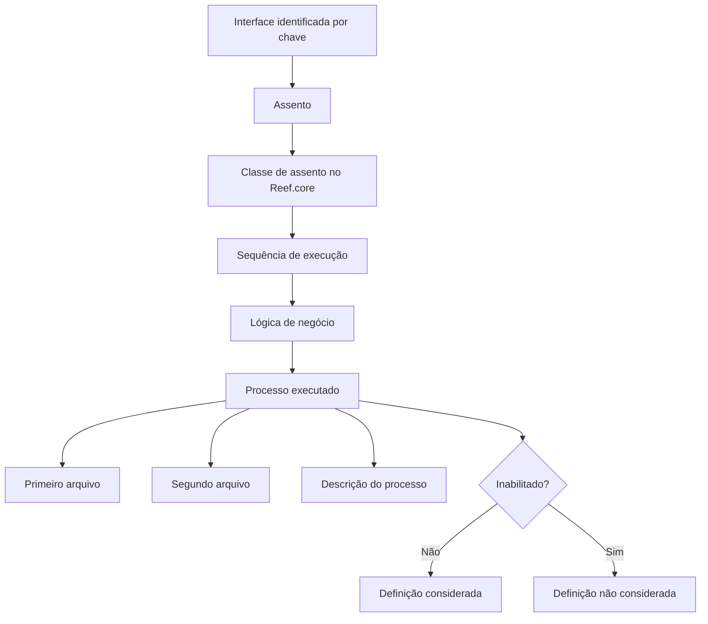

# Definição de Processos por Assento para Interface no Reef.core

## 1. Metadados do Documento
- **Arquivo de Origem:** Não identificado
- **Tipo de Documento:** Especificação Técnica
- **Domínio / Sistema:** Reef.core / Interface
- **Público-Alvo:** Desenvolvedores, Arquitetos, Operação
- **Data/Versão Identificada:** Não identificada

---

## 2. Resumo Executivo & Contexto de Negócio

O documento define a configuração de processos executados por cada assento processado por uma interface. A definição pode variar conforme a necessidade da interface ou conforme as informações que serão processadas.

A configuração associa uma interface a uma classe de assento do Reef.core, determina a sequência de execução e informa a lógica de negócio responsável pelo processo. Também registra os nomes de primeiro e segundo arquivos relacionados ao processo.

A definição possui um indicador de inativação. Esse indicador determina se a definição permanece ativa ou se não deve mais ser considerada durante o processamento da interface.

---

## 3. Arquitetura, Componentes & Tecnologias Envolvidas

Os elementos identificados são:

| Componente | Papel identificado |
| :--- | :--- |
| Interface | Identificada por uma chave; processa assentos. |
| Assento | Contém a chave que identifica a classe de assento do Reef.core. |
| Reef.core | Sistema no qual está definida a classe de assento. |
| Processo | Execução associada a uma interface e a uma classe de assento. |
| Lógica de negócio | Componente nomeado que contém o processo a executar. |
| Primeiro arquivo | Nome do primeiro arquivo associado ao processo. |
| Segundo arquivo | Nome do segundo arquivo associado ao processo. |
| Inabilitado | Indicador que define se a configuração está ativa ou não deve ser considerada. |



---

## 4. Regras de Negócio, Especificações Funcionais & Processos

1. A definição estabelece os processos que serão executados para cada assento processado por uma interface.
2. A definição de processos pode variar conforme:
   - A necessidade da interface.
   - A informação que será processada.
3. A chave de **Interface** identifica a interface à qual a definição pertence.
4. O campo **Assento** contém a chave que identifica a classe de assento do Reef.core.
5. O campo **Sequência** determina a ordem de execução do processo dentro da interface para a classe de assento definida.
6. O campo **Lógica** contém o nome da lógica de negócio que inclui o processo a ser executado.
7. Os campos **Primeiro arquivo** e **Segundo arquivo** contêm os nomes dos arquivos associados ao processo.
8. O campo **Descrição** registra a descrição do processo a executar.
9. O campo **Inabilitado** define o estado da definição:
   - Se a definição estiver ativa, ela pode ser considerada.
   - Se a definição não puder mais ser considerada, ela deve estar inabilitada.

**Nota de Análise:** O documento não detalha os métodos HTTP, contratos JSON, tipos de arquivo, valores permitidos para os campos, mecanismo de execução da lógica de negócio ou critérios técnicos para processamento de assentos.

---

## 5. Tabelas de Parâmetros, Ambientes e Estruturas de Dados

| Item / Parâmetro | Descrição / Função | Tipo / Valores / Formato | Ambiente / Observações |
| :--- | :--- | :--- | :--- |
| Interface | Chave que identifica a interface. | Chave; formato não detalhado. | Associada ao processamento de assentos. |
| Assento | Contém a chave que identifica a classe de assento. | Chave; formato não detalhado. | Classe de assento do Reef.core. |
| Sequência | Determina a ordem de execução do processo. | Ordem de execução; formato não detalhado. | Aplicável dentro da interface para a classe de assento definida. |
| Lógica | Nome da lógica de negócio que contém o processo. | Nome; formato não detalhado. | Responsável pelo processo a executar. |
| Primeiro arquivo | Contém o nome do primeiro arquivo. | Nome de arquivo; tipo não detalhado. | Associado ao processo. |
| Segundo arquivo | Contém o nome do segundo arquivo. | Nome de arquivo; tipo não detalhado. | Associado ao processo. |
| Descrição | Descreve o processo a executar. | Texto; formato não detalhado. | Documentação do processo. |
| Inabilitado | Determina se a definição está ativa ou não deve mais ser considerada. | Indicador; valores não detalhados. | Controla a consideração da definição. |

---

## 6. Bateria de Perguntas & Respostas para RAG (FAQ Sintético)

### P1: Qual é o objetivo da definição de processos por assento?
**R:** O objetivo é definir os processos que serão executados para cada assento processado por uma interface.

### P2: A definição de processos é fixa para todas as interfaces?
**R:** Não. A definição pode variar conforme a necessidade da interface ou conforme a informação que será processada.

### P3: Qual campo identifica uma interface?
**R:** O campo **Interface** contém a chave que identifica a interface.

### P4: Como a classe de assento do Reef.core é identificada?
**R:** O campo **Assento** contém a chave que identifica a classe de assento do Reef.core.

### P5: Como é definida a ordem de execução de processos?
**R:** O campo **Sequência** determina a ordem de execução do processo dentro da interface para a classe de assento definida.

### P6: Onde é informado o processo de negócio a executar?
**R:** O campo **Lógica** informa o nome da lógica de negócio que contém o processo a executar.

### P7: Para que servem os campos Primeiro arquivo e Segundo arquivo?
**R:** O campo **Primeiro arquivo** contém o nome do primeiro arquivo, e o campo **Segundo arquivo** contém o nome do segundo arquivo associado ao processo.

### P8: Qual é a finalidade do campo Descrição?
**R:** O campo **Descrição** contém a descrição do processo a executar.

### P9: O que significa uma definição inabilitada?
**R:** Uma definição inabilitada é uma definição que não pode mais ser considerada no processamento.

### P10: O documento especifica formatos de arquivos ou valores possíveis para Inabilitado?
**R:** Não. O documento menciona os nomes de primeiro e segundo arquivos e o indicador Inabilitado, mas não detalha formatos, extensões ou valores permitidos.

---

## 7. Glossário de Termos, Siglas & Conceitos-Chave

- **Assento:** Elemento que contém a chave identificadora da classe de assento do Reef.core.
- **Interface:** Elemento identificado por uma chave e responsável pelo processamento de assentos.
- **Lógica:** Nome da lógica de negócio que contém o processo a executar.
- **Reef.core:** Sistema citado como origem da classe de assento.
- **Sequência:** Ordem de execução de um processo dentro da interface para uma classe de assento.

---

## 8. Notas Críticas, Riscos & Limitações

- O documento não identifica arquivo de origem, autor, data, versão ou ambiente.
- Não há detalhamento de tipos de dados, obrigatoriedade, validações, valores permitidos ou chaves únicas dos campos.
- Não são descritos contratos de integração, métodos HTTP, protocolos, mecanismos de persistência ou tratamento de erros.
- Não há definição do formato, localização ou ciclo de vida do primeiro e do segundo arquivo.
- Não são descritos os valores técnicos que representam uma definição ativa ou inabilitada.

---

## 9. Conteúdo Bruto Estruturado (Referência Fiel)

```text
--- [PÁGINA 1 DE 2] ---

DEFINICIÓN de Procesos por asiento
Objetivo
Definir los procesos que se van a ejecutar por cada asiento por cada asiento que será procesado por
la interfaz.
Esta definición puede variar según la necesidad de la interfaz o la información que se vaya a
procesar.
Propiedades generales
Propiedades generales
Interfaz
Clave que identifica la interfaz.
Asiento
Contiene la clave que identifica la clase de asiento de Reef.core.
Secuencia
Determina el orden de ejecución del proceso dentro de la interfaz, para la clase de asiento definido.
Lógica
Nombre de la lógica de negocio que contiene el proceso a ejecutar.
 /
 CF
Inicio Soluciones APIs Documentación Zeus
ES


--- [PÁGINA 2 DE 2] ---

Primer archivo
Contiene el nombre del primer archivo.
Segundo archivo
Contiene el nombre del segundo archivo.
Descripción
Descripción del proceso a ejecutar.
Inhabilitado
En este punto se determina si la definición está activa, o por el contrario ya no puede tenerse en
cuenta.
```
