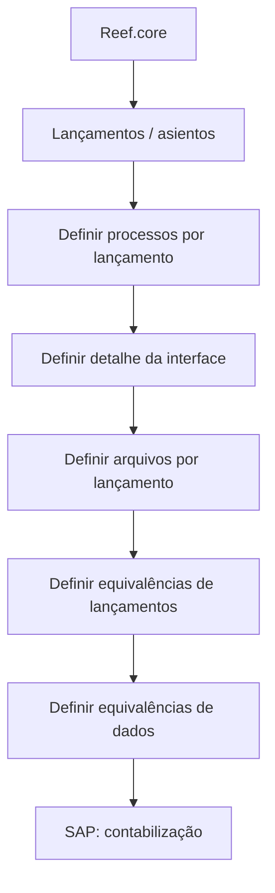

# Definição de Interface com SAP para Contabilização de Lançamentos do Reef.core

## 1. Metadados do Documento
- **Arquivo de Origem:** Não identificado no conteúdo fornecido
- **Tipo de Documento:** Apresentação Executiva
- **Domínio / Sistema:** Interface SAP e Reef.core
- **Público-Alvo:** Arquitetos, desenvolvedores e equipes funcionais envolvidas na contabilização
- **Data/Versão Identificada:** Não identificada

---

## 2. Resumo Executivo & Contexto de Negócio

O documento, identificado como “EN CONSTRUCCIÓN”, apresenta a definição inicial de uma interface com SAP. O objetivo declarado é definir os componentes necessários para gerar os arquivos requeridos pelo SAP para a contabilização dos lançamentos (“asientos”) provenientes do Reef.core.

O processo proposto organiza a construção da interface em etapas de definição: processos por lançamento, detalhe da interface, arquivos por lançamento, equivalências de lançamentos e equivalências de dados. A apresentação não detalha formatos de arquivo, contratos de integração, campos, protocolos, tecnologias, ambientes ou responsáveis.

O foco corporativo explícito é viabilizar a contabilização no SAP a partir de informações geradas pelo Reef.core. O artefato deve ser tratado como uma visão de planejamento ou estruturação inicial, pois não contém especificações técnicas suficientes para implementação direta.

---

## 3. Arquitetura, Componentes & Tecnologias Envolvidas

Os componentes explicitamente mencionados são:

| Componente / Termo | Papel identificado no documento |
| :--- | :--- |
| Reef.core | Sistema de origem dos lançamentos que precisam ser contabilizados. |
| SAP | Sistema que requer arquivos para contabilização dos lançamentos do Reef.core. |
| Interface com SAP | Elemento a ser definido para gerar os arquivos necessários ao SAP. |
| Arquivos por lançamento | Artefatos de saída previstos para contabilização no SAP. |
| Equivalências de lançamentos | Etapa prevista no processo de definição da interface. |
| Equivalências de dados | Etapa prevista no processo de definição da interface. |
| CF | Termo exibido no rodapé, sem detalhamento. |
| Home Solutions APIs Documentation Zeus | Texto exibido no rodapé, sem relação arquitetural explicitada. |



> **Nota de Análise:** O documento declara a necessidade de gerar arquivos para SAP, mas não informa layout, extensão, transporte, frequência de geração, mecanismos de autenticação, métodos HTTP, contratos JSON, estruturas de dados ou tratamento de erros.

---

## 4. Regras de Negócio, Especificações Funcionais & Processos

O objetivo funcional apresentado é:

1. Definir os componentes necessários para gerar os arquivos requeridos pelo SAP.
2. Utilizar esses arquivos para a contabilização dos lançamentos originados no Reef.core.

O processo listado no documento contém as seguintes etapas:

1. **Definir processos por lançamento:** identificar ou estabelecer os processos associados a cada lançamento.
2. **Definir detalhe da interface:** especificar o detalhe da interface com SAP.
3. **Definir arquivos por lançamento:** definir os arquivos necessários para cada lançamento.
4. **Definir equivalências de lançamentos:** definir equivalências relacionadas aos lançamentos.
5. **Definir equivalências de dados:** definir equivalências relacionadas aos dados.

> **Nota de Análise:** O fluxograma visual atribui o número “(4)” tanto a “DEFINIR equivalencias asientos” quanto a “DEFINIR equivalencias datos”. Contudo, a lista textual posterior enumera “equivalencias datos” como etapa 5. O documento não explica a divergência de numeração.

> **Nota de Análise:** Não foram fornecidas regras de validação, critérios de cálculo, mapeamentos contábeis, condições de rejeição, regras de reprocessamento ou critérios de aprovação.

---

## 5. Tabelas de Parâmetros, Ambientes e Estruturas de Dados

| Item / Parâmetro | Descrição / Função | Tipo / Valores / Formato | Ambiente / Observações |
| :--- | :--- | :--- | :--- |
| Objetivo da interface | Gerar arquivos necessários para contabilização de lançamentos do Reef.core no SAP. | Não especificado | Aplicável à interface SAP–Reef.core. |
| Processos por lançamento | Primeira etapa de definição do processo apresentado. | Não especificado | O documento não descreve os processos. |
| Detalhe da interface | Segunda etapa de definição. | Não especificado | Não há contrato, protocolo ou formato descrito. |
| Arquivos por lançamento | Terceira etapa de definição. | Não especificado | Não há layout, nome, extensão ou periodicidade informados. |
| Equivalências de lançamentos | Quarta etapa da lista textual. | Não especificado | Exibida como “equivalencias asientos”. |
| Equivalências de dados | Quinta etapa da lista textual. | Não especificado | O fluxograma a numera como “(4)”. |
| SAP | Destino funcional para contabilização. | Não especificado | Não há URL, ambiente ou versão. |
| Reef.core | Origem dos lançamentos a contabilizar. | Não especificado | Não há versão, ambiente ou interface de saída. |

---

## 6. Bateria de Perguntas & Respostas para RAG (FAQ Sintético)

### P1: Qual é o objetivo da definição de interface com SAP?
**R:** O objetivo é definir os componentes necessários para gerar os arquivos que o SAP precisa para contabilizar os lançamentos provenientes do Reef.core.

### P2: Qual sistema é a origem dos lançamentos que serão contabilizados?
**R:** O documento identifica o Reef.core como a origem dos lançamentos (“asientos”) que precisam ser contabilizados no SAP.

### P3: Qual sistema utiliza os arquivos gerados pela interface?
**R:** O SAP utiliza os arquivos previstos pela interface para realizar a contabilização dos lançamentos do Reef.core.

### P4: Quais são as etapas do processo de definição da interface com SAP?
**R:** As etapas são definir processos por lançamento, definir o detalhe da interface, definir arquivos por lançamento, definir equivalências de lançamentos e definir equivalências de dados.

### P5: O documento especifica o layout dos arquivos destinados ao SAP?
**R:** Não. O documento afirma que arquivos devem ser definidos por lançamento, mas não apresenta layout, extensão, campos, codificação ou convenção de nomenclatura.

### P6: O documento descreve os contratos técnicos da interface SAP–Reef.core?
**R:** Não. Não há descrição de protocolos, endpoints, métodos HTTP, contratos JSON, mecanismos de transferência, autenticação ou tratamento de falhas.

### P7: O que deve ser definido para cada lançamento no processo apresentado?
**R:** O processo prevê a definição de processos por lançamento e de arquivos por lançamento. O documento não detalha quais processos ou quais arquivos devem existir.

### P8: Quais tipos de equivalência precisam ser definidos?
**R:** O documento menciona equivalências de lançamentos (“equivalencias asientos”) e equivalências de dados (“equivalencias datos”), sem detalhar os campos, códigos ou regras de conversão envolvidos.

### P9: Existe uma inconsistência na numeração das etapas?
**R:** Sim. O fluxograma atribui o número “(4)” às equivalências de lançamentos e às equivalências de dados. A lista textual, porém, apresenta equivalências de dados como a quinta etapa.

### P10: O documento identifica ambientes, URLs ou versões do SAP e do Reef.core?
**R:** Não. O conteúdo fornecido não identifica ambientes, URLs, versões, servidores ou parâmetros de conexão.

---

## 7. Glossário de Termos, Siglas & Conceitos-Chave

- **SAP:** Sistema mencionado como destinatário dos arquivos necessários para contabilização. O documento não expande a sigla.
- **Reef.core:** Sistema mencionado como origem dos lançamentos a serem contabilizados.
- **Asientos:** Termo em espanhol utilizado para “lançamentos” no contexto de contabilização.
- **Interface:** Integração a ser definida para produzir arquivos requeridos pelo SAP.
- **Equivalencias asientos:** Equivalências de lançamentos previstas como etapa do processo.
- **Equivalencias datos:** Equivalências de dados previstas como etapa do processo.
- **CF:** Termo exibido no rodapé sem definição no documento.
- **Zeus:** Termo exibido no rodapé sem definição no documento.

---

## 8. Notas Críticas, Riscos & Limitações

- O documento está marcado como **“EN CONSTRUCCIÓN”**, indicando conteúdo em elaboração.
- Não há especificação de formato, layout ou estrutura dos arquivos necessários para SAP.
- Não há mapeamento de dados entre Reef.core e SAP.
- Não há detalhamento de equivalências de lançamentos ou equivalências de dados.
- Não há identificação de ambientes, URLs, versões, credenciais, protocolos ou mecanismos de transporte.
- Não há definição de tratamento de erros, validações, reprocessamento, auditoria ou monitoramento.
- A numeração das etapas apresenta divergência entre o fluxograma e a lista textual.
- Os termos “CF”, “Home Solutions APIs Documentation” e “Zeus” aparecem no rodapé, sem contextualização suficiente para estabelecer responsabilidades ou dependências.

---

## 9. Conteúdo Bruto Estruturado (Referência Fiel)

```text
--- [PÁGINA 1 DE 1] ---

EN CONSTRUCCIÓN
DEFINICIÓN de interfaz con SAP
Objetivo
Definir los componentes necesarios para generar los archivos que precisa SAP para la
contabilización de los asientos de Reef.core.
Proceso a seguir
DEFINIR
procesos
por asiento
(1)
DEFINIR
detalle
interfaz
(2)
DEFINIR
archivos
por asiento
(3)
DEFINIR
equivalencias
asientos
(4)
DEFINIR
equivalencias
datos
(4)
1. DEFINIR procesos por asiento
2. DEFINIR detalle interfaz
3. DEFINIR archivos por asiento
4. DEFINIR equivalencias asientos
5. DEFINIR equivalencias datos
 / 
 CF
Home Solutions APIs Documentation Zeus
EN
```
