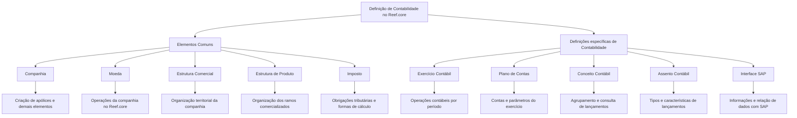

# Definição de Contabilidade no Reef.core: Elementos Comuns e Definições Específicas do Módulo Contábil

## 1. Metadados do Documento
- **Arquivo de Origem:** Não informado no conteúdo extraído
- **Tipo de Documento:** Apresentação Executiva
- **Domínio / Sistema:** Reef.core — módulo de Contabilidade
- **Público-Alvo:** Negócio, Analistas Funcionais, Desenvolvedores e Arquitetos
- **Data/Versão Identificada:** Não identificada

---

## 2. Resumo Executivo & Contexto de Negócio

O documento descreve a definição de Contabilidade no sistema Reef.core e apresenta os elementos que participam dessa definição, bem como a sequência conceitual em que devem ser tratados. A estrutura é dividida entre elementos comuns, necessários para a configuração corporativa, e definições específicas do módulo de Contabilidade.

O nível **Comum** concentra definições que não pertencem exclusivamente ao módulo contábil, mas são pré-requisitos para sua configuração. Esse nível inclui Companhia, Moeda, Estrutura Comercial, Estrutura de Produto e Imposto. Esses elementos suportam a organização das entidades, operações, divisas, ramos comercializados e obrigações tributárias relacionadas à operação da companhia.

O nível específico de **Contabilidade** inclui Exercício Contábil, Plano de Contas, Conceito Contábil, Assento Contábil e Interface SAP. Essas definições organizam o período contábil, as contas utilizadas pela companhia, o agrupamento de lançamentos, as características dos lançamentos contábeis e a integração de informações com SAP.

O documento não detalha telas, contratos técnicos, métodos HTTP, estruturas JSON, rotinas de execução, permissões de usuário, regras de fechamento, fórmulas tributárias ou mapeamentos específicos para SAP. O conteúdo funciona como uma visão conceitual de alto nível sobre a ordem e os elementos envolvidos na parametrização contábil no Reef.core.

---

## 3. Arquitetura, Componentes & Tecnologias Envolvidas

Os componentes e conceitos identificados são:

- **Reef.core:** Sistema citado como responsável por realizar operações com as divisas definidas para a companhia.
- **Módulo de Contabilidade:** Área que concentra as definições específicas de Exercício Contábil, Plano de Contas, Conceito Contábil, Assento Contábil e Interface SAP.
- **SAP:** Sistema de destino para informações contábeis, cuja relação de dados com Reef.core deve ser definida.
- **Companhia:** Entidade ou entidades com as quais serão criadas as apólices e os demais elementos.
- **Moeda:** Divisas usadas pelo Reef.core nas operações da companhia.
- **Estrutura Comercial:** Organização territorial da companhia.
- **Estrutura de Produto:** Organização dos ramos comercializados.
- **Imposto:** Tipos de obrigações tributárias, características e formas de cálculo.
- **Exercício Contábil:** Período em que as operações contábeis serão realizadas.
- **Plano de Contas:** Contas utilizadas pela companhia no exercício contábil e seus parâmetros.
- **Conceito Contábil:** Identificador para agrupamento e consulta posterior de lançamentos contábeis.
- **Assento Contábil:** Tipos e características dos lançamentos contábeis usados pela companhia.
- **Interface SAP:** Informação enviada ao SAP e relação dos dados entre Reef.core e SAP.



**Nota de Análise:** O diagrama representa a hierarquia conceitual apresentada no documento. O material não especifica integrações técnicas, protocolos, formatos de arquivo, APIs, mecanismos de sincronização ou direção de envio dos dados da Interface SAP.

---

## 4. Regras de Negócio, Especificações Funcionais & Processos

### 4.1 Ordem conceitual para definição da Contabilidade

O documento informa que existem elementos que intervêm na definição de Contabilidade e que esses elementos possuem uma ordem de realização. A extração apresenta primeiro o nível Comum e, em seguida, as definições específicas do módulo de Contabilidade.

1. Definir elementos do nível Comum necessários para a configuração contábil.
2. Definir a Companhia ou as Companhias.
3. Definir as Moedas ou divisas usadas nas operações da companhia no Reef.core.
4. Definir a Estrutura Comercial para estabelecer a organização territorial da companhia.
5. Definir a Estrutura de Produto para organizar os ramos comercializados.
6. Definir os Impostos, incluindo obrigações tributárias, características e formas de cálculo.
7. Definir o Exercício Contábil no qual serão realizadas as operações contábeis.
8. Após cada fechamento de exercício, definir um novo Exercício Contábil.
9. Definir o Plano de Contas e os parâmetros correspondentes a cada conta.
10. Definir o Conceito Contábil que agrupa lançamentos contábeis para consulta posterior.
11. Definir os tipos e características dos Assentos Contábeis.
12. Definir as informações que serão levadas ao SAP e a relação entre os dados de Reef.core e SAP.

### 4.2 Elementos comuns

#### Companhia

A Companhia representa a entidade ou as entidades com as quais serão criadas as apólices e, por consequência, os demais elementos. O documento não especifica atributos obrigatórios, identificadores, regras de cadastro, relacionamento entre companhias ou restrições para criação de apólices.

#### Moeda

A Moeda representa a definição das divisas com as quais o Reef.core realizará as diferentes operações da companhia. O documento não informa códigos de moeda, regras de conversão, taxas cambiais, precisão decimal ou fontes de cotação.

#### Estrutura Comercial

A Estrutura Comercial define como será estabelecida a organização territorial da companhia. O documento não detalha níveis territoriais, regiões, hierarquias, responsáveis ou critérios de associação territorial.

#### Estrutura de Produto

A Estrutura de Produto define como estarão organizados os ramos comercializados. O documento não informa quais ramos existem, códigos de produto, critérios de agrupamento ou relação entre ramos e contas contábeis.

#### Imposto

O Imposto define os tipos de obrigações tributárias que devem ser considerados, assim como suas características e formas de cálculo. O documento não apresenta impostos específicos, percentuais, bases de cálculo, periodicidade, regras de retenção ou exceções tributárias.

### 4.3 Definições específicas do módulo de Contabilidade

#### Exercício Contábil

O Exercício Contábil define o período de tempo em que serão realizadas as operações contábeis. Após cada fechamento de exercício, deve ser definido um novo exercício.

**Regra explicitamente apresentada:**
- Depois de cada fechamento de exercício, é obrigatório definir um novo Exercício Contábil.

O documento não informa a duração do exercício, os critérios de fechamento, usuários autorizados, bloqueios de lançamentos, calendário fiscal ou processo de reabertura.

#### Plano de Contas

O Plano de Contas define as contas utilizadas pela companhia dentro do exercício contábil e os parâmetros correspondentes a cada conta. O documento não especifica estrutura hierárquica, natureza de contas, regras de débito e crédito, códigos contábeis ou associação com impostos e produtos.

#### Conceito Contábil

O Conceito Contábil define o identificador que agrupa os lançamentos contábeis para consulta posterior. O documento não detalha formato do identificador, critérios de agrupamento, índices de consulta ou relação entre Conceito Contábil e Plano de Contas.

#### Assento Contábil

O Assento Contábil define os tipos e as características dos lançamentos contábeis com os quais a companhia trabalhará. O documento não especifica eventos geradores, campos de lançamento, validações, reversões, contabilização automática ou manual.

#### Interface SAP

A Interface SAP define a informação que será levada ao SAP e a relação dos dados entre Reef.core e SAP. O documento não detalha o mecanismo de integração, frequência de envio, formato de dados, mensagens de erro, campos mapeados ou responsabilidade por reconciliação.

---

## 5. Tabelas de Parâmetros, Ambientes e Estruturas de Dados

| Item / Parâmetro | Descrição / Função | Tipo / Valores / Formato | Ambiente / Observações |
| :--- | :--- | :--- | :--- |
| Reef.core | Sistema que realiza operações da companhia usando as divisas definidas. | Sistema corporativo | O documento cita Reef.core, mas não informa versão ou ambiente. |
| Contabilidade | Módulo que concentra definições específicas de operações contábeis. | Módulo funcional | Inclui Exercício Contábil, Plano de Contas, Conceito Contábil, Assento Contábil e Interface SAP. |
| Comum | Nível de definições não exclusivas de Contabilidade, mas necessárias para configurá-la. | Grupo conceitual | Precede ou suporta a definição do módulo de Contabilidade. |
| Companhia | Entidade ou entidades com as quais serão criadas apólices e demais elementos. | Entidade organizacional | Não há atributos, identificadores ou regras de cadastro detalhados. |
| Moeda | Divisas utilizadas pelo Reef.core nas operações da companhia. | Configuração de divisa | Não há códigos, taxas ou regras de conversão especificadas. |
| Estrutura Comercial | Definição da organização territorial da companhia. | Estrutura organizacional | Não há níveis territoriais detalhados. |
| Estrutura de Produto | Definição da organização dos ramos comercializados. | Estrutura de produtos/ramos | Não há lista de ramos ou produtos apresentada. |
| Imposto | Definição de obrigações tributárias, características e formas de cálculo. | Configuração tributária | Não há impostos, alíquotas ou fórmulas identificados. |
| Exercício Contábil | Período em que as operações contábeis serão realizadas. | Período contábil | Após cada fechamento, deve ser definido um novo exercício. |
| Plano de Contas | Contas usadas pela companhia no exercício contábil e os parâmetros de cada conta. | Estrutura contábil | Não há códigos, classificações ou hierarquia de contas. |
| Conceito Contábil | Identificador que agrupa lançamentos contábeis para consulta posterior. | Identificador de agrupamento | Não há formato de identificador informado. |
| Assento Contábil | Tipos e características dos lançamentos contábeis usados pela companhia. | Configuração de lançamentos | Não há tipologias ou campos descritos. |
| Interface SAP | Definição da informação enviada ao SAP e da relação de dados entre os sistemas. | Integração entre sistemas | Não há protocolo, formato, periodicidade ou mapeamento técnico informado. |
| SAP | Sistema que recebe informações definidas pela Interface SAP. | Sistema externo | Não há versão, módulo SAP ou ambiente indicado. |
| Home Solutions APIs Documentation Zeus | Texto presente na extração bruta. | Referência textual não contextualizada | O documento não explica a relação desse texto com a definição de Contabilidade. |

---

## 6. Bateria de Perguntas & Respostas para RAG (FAQ Sintético)

### P1: Qual é o objetivo da definição de Contabilidade no Reef.core?
**R:** O objetivo é estabelecer os elementos necessários para configurar a Contabilidade no Reef.core. O documento divide esses elementos entre definições Comuns, necessárias como base para a configuração, e definições específicas do módulo de Contabilidade.

### P2: Quais elementos fazem parte do nível Comum necessário para a Contabilidade?
**R:** O nível Comum inclui Companhia, Moeda, Estrutura Comercial, Estrutura de Produto e Imposto. Essas definições não pertencem exclusivamente ao módulo de Contabilidade, mas são necessárias para realizar a definição contábil.

### P3: Qual é a finalidade da definição de Companhia?
**R:** A definição de Companhia estabelece a entidade ou as entidades com as quais serão criadas as apólices e, por consequência, os demais elementos relacionados. O documento não apresenta atributos, identificadores ou regras de cadastro para Companhia.

### P4: Como a Moeda é utilizada no Reef.core?
**R:** A Moeda define as divisas com as quais o Reef.core realizará as diferentes operações da companhia. O material não detalha códigos de moeda, regras de conversão, taxas cambiais ou critérios de arredondamento.

### P5: O que a Estrutura Comercial define no contexto da Contabilidade?
**R:** A Estrutura Comercial define como será estabelecida a organização territorial da companhia. O documento não detalha regiões, níveis territoriais, unidades organizacionais ou regras de vínculo entre territórios e companhias.

### P6: Qual é a finalidade da Estrutura de Produto?
**R:** A Estrutura de Produto define como estarão organizados os ramos que são comercializados. O conteúdo não lista os ramos, produtos, códigos ou relacionamentos entre a estrutura de produto e o Plano de Contas.

### P7: Quais informações devem ser definidas para Imposto?
**R:** Devem ser definidos os tipos de obrigações tributárias que devem ser considerados, bem como suas características e formas de cálculo. O documento não informa tributos específicos, alíquotas, bases de cálculo ou exceções fiscais.

### P8: O que é um Exercício Contábil e qual regra ocorre após seu fechamento?
**R:** O Exercício Contábil é o período de tempo em que serão realizadas as operações contábeis. O documento determina que, depois de cada fechamento de exercício, deve ser definido um novo exercício contábil.

### P9: O que o Plano de Contas representa?
**R:** O Plano de Contas representa a definição das contas usadas pela companhia dentro do exercício contábil, incluindo os parâmetros correspondentes a cada conta. O documento não detalha códigos de contas, classificações, natureza contábil ou regras de lançamento.

### P10: Para que serve o Conceito Contábil?
**R:** O Conceito Contábil define um identificador que agrupa os lançamentos contábeis para consulta posterior. O material não informa o formato do identificador nem os critérios técnicos ou funcionais usados para o agrupamento.

### P11: O que são Assentos Contábeis no documento?
**R:** Assentos Contábeis correspondem à definição dos tipos e das características dos lançamentos contábeis com os quais a companhia trabalhará. O documento não apresenta os tipos de lançamento, regras de débito e crédito, eventos de origem ou validações.

### P12: O que a Interface SAP deve definir?
**R:** A Interface SAP deve definir a informação que será levada ao SAP e a relação dos dados entre Reef.core e SAP. O documento não detalha o mecanismo de integração, a frequência de transmissão, o formato das mensagens ou o mapeamento de campos entre os sistemas.

---

## 7. Glossário de Termos, Siglas & Conceitos-Chave

- **Reef.core:** Sistema citado no documento como responsável por realizar operações da companhia com as divisas definidas.
- **Contabilidade:** Módulo que contém definições específicas para operações contábeis.
- **Companhia:** Entidade ou entidades com as quais serão criadas as apólices e demais elementos.
- **Moeda:** Divisas usadas pelo Reef.core nas operações da companhia.
- **Estrutura Comercial:** Organização territorial da companhia.
- **Estrutura de Produto:** Organização dos ramos comercializados.
- **Imposto:** Configuração dos tipos de obrigações tributárias, suas características e formas de cálculo.
- **Exercício Contábil:** Período de tempo em que são realizadas as operações contábeis.
- **Plano de Contas:** Conjunto de contas utilizado pela companhia dentro de um exercício contábil, com os parâmetros de cada conta.
- **Conceito Contábil:** Identificador que agrupa lançamentos contábeis para consulta posterior.
- **Assento Contábil:** Tipos e características dos lançamentos contábeis usados pela companhia.
- **Interface SAP:** Definição das informações levadas ao SAP e da relação entre dados de Reef.core e SAP.
- **SAP:** Sistema citado como destino ou sistema relacionado às informações definidas pela Interface SAP.
- **Apólice:** Elemento que será criado com a Companhia definida; o documento não apresenta detalhamento funcional adicional sobre apólices.

---

## 8. Notas Críticas, Riscos & Limitações

- **Detalhamento limitado:** O conteúdo extraído apresenta uma visão conceitual resumida, sem detalhamento de implementação técnica, modelos de dados, telas, APIs, integrações, permissões ou procedimentos operacionais.
- **Integração SAP não especificada:** O documento cita a Interface SAP, mas não informa tecnologia de integração, protocolo, formato de dados, frequência, tratamento de erros, reconciliação ou mapeamento de campos.
- **Regras de fechamento ausentes:** Embora determine que um novo Exercício Contábil deve ser definido após cada fechamento, o documento não descreve etapas, validações, responsáveis ou impactos do fechamento.
- **Parâmetros tributários ausentes:** O Imposto contempla obrigações tributárias, características e formas de cálculo, mas não contém tipos de tributo, alíquotas, fórmulas ou vigências.
- **Plano de Contas sem estrutura técnica:** Não há códigos, hierarquia, classificação, natureza contábil ou parâmetros concretos das contas.
- **Terminologia sem expansão:** O documento não expande siglas, não especifica versões de Reef.core ou SAP e não contextualiza a expressão “Home Solutions APIs Documentation Zeus”.
- **Nota de Análise:** O documento lista componentes fundamentais da configuração contábil, porém não detalha contratos técnicos, métodos de integração, atributos de cadastro ou regras operacionais completas para cada componente.

---

## 9. Conteúdo Bruto Estruturado (Referência Fiel)

```text
--- [PÁGINA 1 DE 2] ---

EN CONSTRUCCIÓN
DEFINICIÓN DE CONTABILIDAD
 Elementos que intervienen en la definición y orden en el que se debe realizar.
COMÚN
En este nivel se encuentran definiciones que no pertenecen
exclusivamente al módulo de contabilidad, pero son necesarias para
poder realizar la definición de dicho módulo
COMPAÑÍA 
Definición de la entidad o entidades con las
que se van a crear las pólizas y por
consiguiente el resto de elementos
MONEDA 
Definición de las divisas con las que
Reef.core va a realizar las distintas
operaciones de la compañía
ESTRUCTURA COMERCIAL 
 ESTRUCTURA PRODUCTO 
 / 
 CF
Home Solutions APIs Documentation Zeus
EN


--- [PÁGINA 2 DE 2] ---

Definición de como se va a establecer la
organización territorial de la compañía
Definición de como estarán organizados los
ramos que se comercializan
IMPUESTO
Definir los tipos de obligaciones tributarias
que se deben tener en cuenta, así como sus
características y formas de cálculo
CONTABILIDAD
Definiciones específicas del módulo de Contabilidad
EJERCICIO CONTABLE 
Se define el periodo de tiempo en el que se
realizarán las operaciones contables.
Después de cada cierre de ejercicio se debe
definir el nuevo ejercicio
PLAN DE CUENTAS 
Definición de las cuentas utilizadas por la
compañía dentro del ejercicio contable y los
parámetros correspondientes a cada cuenta
CONCEPTO CONTABLE
Se define el identificador que agrupa los
apuntes contables para su posterior consulta
ASIENTO CONTABLE
Definición de los tipos y características de los
asientos contables con los que trabajará la
compañía
INTERFAZ SAP
Definición de la información que se llevará a
SAP así como la relación de los datos de
ambos sistemas
```
