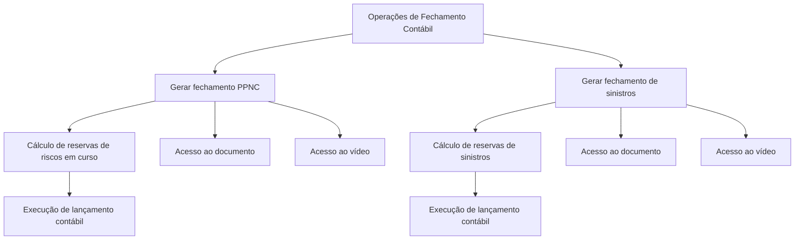

# Documentação de Operação de Contabilidade — Fechamentos

## 1. Metadados do Documento
- **Arquivo de Origem:** Não identificado
- **Tipo de Documento:** Procedimento
- **Domínio / Sistema:** Contabilidade — Fechamentos
- **Público-Alvo:** Operação
- **Data/Versão Identificada:** Não identificada

---

## 2. Resumo Executivo & Contexto de Negócio

O documento apresenta uma página de documentação de operação de contabilidade voltada a processos de fechamentos. Os fechamentos são descritos como operações que realizam cálculos prévios aos lançamentos contábeis.

Foram identificados dois processos de fechamento: geração do fechamento de provisão de prêmio não consumido (PPNC) e geração do fechamento de sinistros. Ambos calculam reservas antes da execução do respectivo lançamento contábil.

A página disponibiliza, para cada processo, acesso a um documento e a um vídeo. O conteúdo extraído não descreve os procedimentos internos, parâmetros de execução, responsáveis, sistemas envolvidos ou resultados dos cálculos.

---

## 3. Arquitetura, Componentes & Tecnologias Envolvidas

Os elementos identificados são:
- Documentação de Operação de Contabilidade — Fechamentos.
- Processo de provisão de prêmio não consumido (PPNC).
- Processo de sinistros.
- Cálculo de reservas de riscos em curso.
- Cálculo de reservas de sinistros.
- Execução de lançamento contábil.
- Recursos de apoio: documento e vídeo.



> **Nota de Análise:** O documento não identifica aplicações, microsserviços, tecnologias, interfaces, métodos HTTP, contratos de integração, bancos de dados ou ambientes técnicos.

---

## 4. Regras de Negócio, Especificações Funcionais & Processos

1. Os processos de fechamento realizam cálculos antes da execução de lançamentos contábeis.
2. O processo **GENERAR Cierre proceso provisión prima no consumida (PPNC)** realiza o cálculo das reservas de riscos em curso antes da execução do lançamento contábil.
3. O processo **GENERAR Cierre proceso siniestros** realiza o cálculo das reservas de sinistros antes da execução do lançamento contábil.
4. Cada um dos dois processos possui referências para acesso a um documento e a um vídeo.
5. O conteúdo extraído não informa fórmulas, critérios de cálculo, periodicidade, gatilhos de execução, validações, dados de entrada, saídas, tratamento de erros ou procedimentos de contingência.

---

## 5. Tabelas de Parâmetros, Ambientes e Estruturas de Dados

| Item / Parâmetro | Descrição / Função | Tipo / Valores / Formato | Ambiente / Observações |
| :--- | :--- | :--- | :--- |
| Cierres | Operações que realizam cálculos prévios aos lançamentos contábeis. | Processo operacional | Ambiente não identificado |
| PPNC | Processo de provisão de prêmio não consumido. | Sigla e processo de fechamento | Calcula reservas de riscos em curso antes do lançamento contábil |
| Reservas de riscos em curso | Reserva calculada no processo PPNC. | Cálculo não detalhado | Fórmula e dados de entrada não identificados |
| Fechamento de sinistros | Processo de geração de fechamento para sinistros. | Processo operacional | Calcula reservas de sinistros antes do lançamento contábil |
| Reservas de sinistros | Reserva calculada no processo de sinistros. | Cálculo não detalhado | Fórmula e dados de entrada não identificados |
| Documento | Recurso de apoio disponível para os processos de fechamento. | Link ou acesso indicado | URL não extraída |
| Vídeo | Recurso audiovisual de apoio disponível para os processos de fechamento. | Link ou acesso indicado | URL não extraída |
| CF | Elemento exibido na navegação da página. | Sigla não definida | Sem detalhamento adicional |
| Zeus | Item exibido na navegação da página. | Nome não detalhado | Relação com os fechamentos não especificada |
| Reef | Item exibido na navegação da página. | Nome não detalhado | Relação com os fechamentos não especificada |

---

## 6. Bateria de Perguntas & Respostas para RAG (FAQ Sintético)

### P1: Qual é o objetivo dos processos de fechamento de contabilidade?
**R:** Os processos de fechamento realizam cálculos prévios aos lançamentos contábeis.

### P2: O que é realizado no fechamento do processo de provisão de prêmio não consumido (PPNC)?
**R:** O fechamento do processo PPNC realiza o cálculo das reservas de riscos em curso antes da execução do lançamento contábil.

### P3: O que significa PPNC no contexto do documento?
**R:** PPNC significa provisão de prêmio não consumido, conforme o nome do processo “GENERAR Cierre proceso provisión prima no consumida (PPNC)”.

### P4: O que é calculado antes do lançamento contábil no processo de PPNC?
**R:** O processo PPNC calcula as reservas de riscos em curso antes da execução do lançamento contábil.

### P5: O que é realizado no fechamento do processo de sinistros?
**R:** O fechamento do processo de sinistros realiza o cálculo das reservas de sinistros antes da execução do lançamento contábil.

### P6: Os cálculos de reservas ocorrem antes ou depois dos lançamentos contábeis?
**R:** Os cálculos de reservas ocorrem antes da execução dos lançamentos contábeis.

### P7: Existem materiais de apoio para os processos de fechamento?
**R:** Sim. Para o processo PPNC e para o processo de sinistros, a página indica acesso a um documento e a um vídeo.

### P8: O documento informa as fórmulas usadas para calcular reservas de riscos em curso?
**R:** Não. O conteúdo apenas informa que as reservas de riscos em curso são calculadas antes do lançamento contábil; não apresenta fórmulas, variáveis ou critérios de cálculo.

### P9: O documento informa as fórmulas usadas para calcular reservas de sinistros?
**R:** Não. O conteúdo apenas informa que o processo calcula reservas de sinistros antes do lançamento contábil; não apresenta fórmulas, variáveis ou critérios de cálculo.

### P10: Quais sistemas ou microsserviços executam os fechamentos contábeis?
**R:** O documento não identifica sistemas, microsserviços, aplicações ou integrações responsáveis pela execução dos fechamentos.

### P11: Há URLs para os documentos e vídeos de apoio?
**R:** A página indica “Accede al documento” e “Accede al vídeo”, mas as URLs correspondentes não estão presentes no conteúdo extraído.

### P12: Quais processos de fechamento são explicitamente listados?
**R:** São listados o processo de provisão de prêmio não consumido (PPNC) e o processo de sinistros.

---

## 7. Glossário de Termos, Siglas & Conceitos-Chave

- **PPNC:** Provisión Prima No Consumida; provisão de prêmio não consumido.
- **Cierres:** Fechamentos; operações que realizam cálculos prévios aos lançamentos contábeis.
- **Reservas de riesgos en curso:** Reservas de riscos em curso, calculadas no processo PPNC antes do lançamento contábil.
- **Reservas de siniestros:** Reservas de sinistros, calculadas no processo de fechamento de sinistros antes do lançamento contábil.
- **Asientos contables:** Lançamentos contábeis.
- **CF:** Sigla exibida na navegação, sem significado definido no conteúdo extraído.
- **Zeus:** Item exibido na navegação, sem detalhamento funcional.
- **Reef:** Item exibido na navegação, sem detalhamento funcional.

---

## 8. Notas Críticas, Riscos & Limitações

- O documento está marcado como **“EN CONSTRUCCIÓN”**, indicando possível incompletude ou evolução do conteúdo.
- Não há detalhamento operacional dos cálculos de reservas de riscos em curso ou reservas de sinistros.
- Não são informados critérios, fórmulas, fontes de dados, periodicidade, responsáveis, aprovações ou validações dos fechamentos.
- Não são identificados sistemas, componentes técnicos, integrações, ambientes, logs, mecanismos de autenticação ou tratamento de falhas.
- Os links de acesso a documento e vídeo são mencionados, mas seus destinos não foram extraídos.
- A navegação contém referências a “Zeus”, “Reef” e “CF”, porém o documento não define a função desses elementos no processo de fechamento.

---

## 9. Conteúdo Bruto Estruturado (Referência Fiel)

```text
--- [PÁGINA 1 DE 1] ---

EN CONSTRUCCIÓN
DOCUMENTACIÓN de OPERACIÓN de CONTABILIDAD - CIERRES
CIERRES
Operaciones que realizan cálculos previos a los asientos contables
GENERAR Cierre proceso provisión prima no consumida (PPNC)
Realiza el cálculo de las reservas de riesgos en curso previo a la
ejecución del asiento
 Accede al documento
 Accede al vídeo
GENERAR Cierre proceso siniestros
Realiza el cálculo de las reservas de siniestros previo a la ejecución del
asiento
 Accede al documento
 Accede al vídeo
 / 
 CF
Search Home Solutions Architectures APIs Events Components Cloud Documentation Zeus Reef Help News
EN
```
