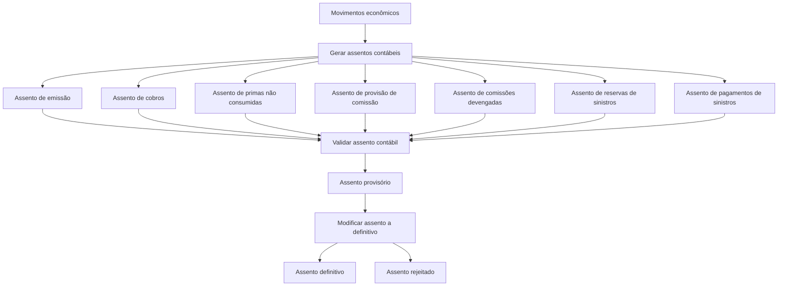

# Documentação de Operação de Contabilidade — Assentos Contábeis

## 1. Metadados do Documento
- **Arquivo de Origem:** Não identificado
- **Tipo de Documento:** Manual Operacional
- **Domínio / Sistema:** Contabilidade — Assentos contábeis
- **Público-Alvo:** Operação, Contabilidade e Negócio
- **Data/Versão Identificada:** Não identificada

---

## 2. Resumo Executivo & Contexto de Negócio

O documento apresenta uma página de documentação operacional de **Contabilidade — Assentos**. O objetivo declarado é registrar contabilmente as entradas e saídas dos diferentes movimentos econômicos.

A documentação organiza operações para gerar lançamentos contábeis relacionados a emissões e suplementos de apólices, cobranças, prêmios não consumidos, provisões de comissão, comissões devengadas, reservas de sinistros e pagamentos de sinistros. Cada operação possui, quando indicado, acesso a documento e/ou vídeo complementar.

O processo também inclui controles posteriores à geração dos lançamentos. A operação **VALIDAR Asiento contable** verifica se os lançamentos estão balanceados e se todos os dados estão corretos para que possam ser criados como provisórios. Em seguida, **MODIFICAR Asiento a definitivo** permite transformar lançamentos provisórios em definitivos ou rejeitá-los.

O conteúdo não detalha sistemas de origem, contratos de integração, usuários responsáveis, periodicidade operacional além das referências mensais presentes em algumas operações, nem regras de contabilização por conta contábil.

---

## 3. Arquitetura, Componentes & Tecnologias Envolvidas

O documento não apresenta uma arquitetura técnica de software, microsserviços, APIs, bancos de dados, servidores, URLs de ambiente ou tecnologias de implementação. O conteúdo descreve um fluxo operacional de geração, validação e definição do estado de assentos contábeis.

### Componentes operacionais identificados

| Componente / Operação | Finalidade descrita |
| :--- | :--- |
| GENERAR Asiento de emisión | Realiza a anotação contábil mensal dos movimentos de apólice correspondentes a novas emissões e suplementos. |
| GENERAR Asiento de cobros | Realiza a anotação contábil pelo valor de prêmios cobrados e anulados de cobrança no mês. |
| GENERAR Asiento de primas no consumidas | Corresponde à anotação contábil da reserva de riscos em curso. |
| GENERAR Asiento de provisión de comisión | Gera a anotação contábil das comissões pendentes de liquidação. |
| GENERAR Asiento de comisiones devengadas | Corresponde à anotação contábil das comissões pagas a intermediários. |
| GENERAR Asiento de reservas de siniestros | Realiza a anotação contábil das provisões de sinistros pelo valor bruto das reservas no fechamento mensal. |
| GENERAR Asiento de pagos de siniestros | Corresponde à anotação contábil de pagamentos de sinistros realizados por indenizações, honorários e gastos no mês. |
| VALIDAR Asiento contable | Valida o balanceamento e a correção dos dados dos assentos para criá-los como provisórios. |
| MODIFICAR Asiento a definitivo | Converte assentos provisórios em definitivos ou os rejeita. |



> **Nota de Análise:** O diagrama representa a sequência operacional inferida a partir das operações listadas. O documento não especifica se todas as modalidades de geração devem obrigatoriamente passar pelo mesmo processamento técnico ou em que ordem devem ser executadas.

---

## 4. Regras de Negócio, Especificações Funcionais & Processos

### 4.1 Objetivo operacional

As operações de assentos estão orientadas ao registro, na contabilidade, das entradas e saídas associadas aos diferentes movimentos econômicos.

### 4.2 Geração de assentos por tipo de movimento

1. **Assento de emissão**
   - Realiza a anotação contábil mensal dos movimentos de apólice.
   - Abrange movimentos correspondentes a novas emissões e suplementos.

2. **Assento de cobranças**
   - Realiza a anotação contábil pelo valor das primas cobradas.
   - Inclui anulados de cobrança ocorridos no mês.

3. **Assento de prêmios não consumidos**
   - Corresponde à anotação contábil da reserva de riscos em curso.

4. **Assento de provisão de comissão**
   - Gera a anotação contábil associada às comissões pendentes de liquidação.

5. **Assento de comissões devengadas**
   - Corresponde à anotação contábil das comissões pagas a intermediários.

6. **Assento de reservas de sinistros**
   - Realiza a anotação contábil das provisões de sinistros.
   - Considera o valor bruto das reservas no fechamento de mês.

7. **Assento de pagamentos de sinistros**
   - Corresponde à anotação contábil dos pagamentos de sinistros realizados no mês.
   - Os pagamentos mencionados incluem indenizações, honorários e gastos.

### 4.3 Validação e estado dos assentos

1. A operação **VALIDAR Asiento contable** deve validar que os assentos contábeis estão quadrados.
2. A operação **VALIDAR Asiento contable** deve verificar que todos os dados estão corretos.
3. Após a validação, os assentos podem ser criados como **provisórios**.
4. A operação **MODIFICAR Asiento a definitivo** permite:
   - Passar assentos provisórios para definitivos; ou
   - Rejeitar assentos provisórios.

> **Nota de Análise:** O documento não define critérios matemáticos de quadratura, campos obrigatórios, códigos de rejeição, responsáveis pela aprovação ou condições para reprocessamento de um assento rejeitado.

---

## 5. Tabelas de Parâmetros, Ambientes e Estruturas de Dados

| Item / Parâmetro | Descrição / Função | Tipo / Valores / Formato | Ambiente / Observações |
| :--- | :--- | :--- | :--- |
| Movimentos econômicos | Entradas e saídas a serem registradas na contabilidade. | Não especificado | Contexto geral das operações de assentos. |
| Movimentos de apólice | Movimentos associados a novas emissões e suplementos. | Mensal | Usados no assento de emissão. |
| Primas cobradas | Valores de prêmios cobrados. | Não especificado | Usados no assento de cobranças. |
| Anulados de cobrança | Anulações de cobrança ocorridas no mês. | Mensal | Usados no assento de cobranças. |
| Reserva de riscos em curso | Reserva objeto de anotação contábil. | Não especificado | Usada no assento de prêmios não consumidos. |
| Comissões pendentes de liquidação | Comissões que ainda não foram liquidadas. | Não especificado | Usadas no assento de provisão de comissão. |
| Comissões pagas a intermediários | Comissões associadas a intermediários. | Não especificado | Usadas no assento de comissões devengadas. |
| Provisões de sinistros | Provisões de sinistros registradas contabilmente. | Valor bruto; fechamento mensal | Usadas no assento de reservas de sinistros. |
| Pagamentos de sinistros | Pagamentos realizados por indenizações, honorários e gastos. | Mensal | Usados no assento de pagamentos de sinistros. |
| Estado do assento | Situação do assento no processo. | Provisório; definitivo; rejeitado | O documento cita a criação como provisório e a posterior definição como definitivo ou rejeitado. |
| Documento complementar | Material acessível pela indicação “Accede al documento”. | Documento | Disponível para todas as operações listadas. |
| Vídeo complementar | Material acessível pela indicação “Accede al vídeo”. | Vídeo | Não indicado para “primas no consumidas” nem para “reservas de siniestros”. |

---

## 6. Bateria de Perguntas & Respostas para RAG (FAQ Sintético)

### P1: Qual é o objetivo das operações de assentos contábeis?
**R:** As operações de assentos contábeis estão focadas em registrar, na contabilidade, as entradas e saídas dos diferentes movimentos econômicos.

### P2: O que registra o assento de emissão?
**R:** O assento de emissão realiza a anotação contábil mensal dos movimentos de apólice correspondentes a novas emissões e suplementos.

### P3: Quais movimentos são considerados pelo assento de cobranças?
**R:** O assento de cobranças realiza a anotação contábil pelo valor das primas cobradas e dos anulados de cobrança ocorridos no mês.

### P4: A que se refere o assento de prêmios não consumidos?
**R:** O assento de prêmios não consumidos corresponde à anotação contábil da reserva de riscos em curso.

### P5: Qual é a finalidade do assento de provisão de comissão?
**R:** O assento de provisão de comissão gera a anotação contábil correspondente às comissões pendentes de liquidação.

### P6: O que são as comissões tratadas no assento de comissões devengadas?
**R:** O assento de comissões devengadas corresponde à anotação contábil das comissões pagas a intermediários.

### P7: Como são registradas as reservas de sinistros?
**R:** O assento de reservas de sinistros realiza a anotação contábil correspondente às provisões de sinistros pelo valor bruto das reservas no fechamento de mês.

### P8: Quais tipos de pagamentos são contemplados no assento de pagamentos de sinistros?
**R:** O assento de pagamentos de sinistros contempla pagamentos realizados por indenizações, honorários e gastos no mês.

### P9: O que a operação VALIDAR Asiento contable verifica?
**R:** A operação VALIDAR Asiento contable valida que os assentos contábeis estão quadrados e que todos os dados estão corretos para que possam ser criados como provisórios.

### P10: Qual é a diferença entre um assento provisório e um definitivo no processo descrito?
**R:** Após a validação, os assentos podem ser criados como provisórios. A operação MODIFICAR Asiento a definitivo permite então passar os assentos provisórios para definitivos ou rejeitá-los.

### P11: O documento especifica métodos HTTP, contratos JSON ou integrações técnicas para os assentos?
**R:** Não. O documento apresenta operações funcionais de contabilidade, mas não detalha métodos HTTP, contratos JSON, APIs, microsserviços, bancos de dados ou mecanismos técnicos de integração.

### P12: Quais operações possuem indicação de acesso a vídeo?
**R:** O documento indica acesso a vídeo para os assentos de emissão, cobranças, provisão de comissão, comissões devengadas, reservas de sinistros, pagamentos de sinistros, validação de assento contábil e modificação de assento a definitivo.

---

## 7. Glossário de Termos, Siglas & Conceitos-Chave

- **Asiento:** Lançamento ou anotação contábil.
- **Asiento provisional:** Assento criado após validação, antes de sua conversão em definitivo ou rejeição.
- **Asiento definitivo:** Assento provisório que foi passado ao estado definitivo.
- **Asiento rechazado:** Assento provisório que não foi convertido em definitivo.
- **Cobros:** Cobranças; no documento, refere-se a primas cobradas e anulados de cobrança.
- **Comisiones devengadas:** No contexto do documento, comissões pagas a intermediários.
- **Emisión:** Novas emissões de apólices.
- **Primas no consumidas:** Prêmios não consumidos; associados à reserva de riscos em curso.
- **Provisión de comisión:** Provisão relacionada a comissões pendentes de liquidação.
- **Provisiones de siniestros:** Provisões de sinistros registradas pelo valor bruto das reservas no fechamento de mês.
- **Siniestros:** Sinistros; associados a provisões e pagamentos por indenizações, honorários e gastos.
- **Suplementos:** Movimentos de apólice incluídos no assento de emissão.

---

## 8. Notas Críticas, Riscos & Limitações

- O documento está identificado como **“EN CONSTRUCCIÓN”**, indicando que o conteúdo pode estar incompleto ou em evolução.
- Não há identificação de arquivo, data, versão, autor, proprietário do processo ou responsável operacional.
- Não são fornecidos detalhes sobre sistemas, integrações, APIs, bancos de dados, URLs, ambientes, rotas de logs ou tecnologias.
- Não são definidos os critérios técnicos ou contábeis para considerar um assento “cuadrado”.
- Não são detalhados os campos validados, as causas de rejeição, os procedimentos de correção ou o reprocessamento de assentos.
- O documento lista acessos a documentos e vídeos, mas não fornece os respectivos links ou conteúdos.
- As operações de **primas no consumidas** e **reservas de siniestros** apresentam acesso a documento, mas não apresentam indicação de acesso a vídeo.
- A sigla **CF** aparece no rodapé, mas seu significado não é explicado no conteúdo.

---

## 9. Conteúdo Bruto Estruturado (Referência Fiel)

```text
--- [PÁGINA 1 DE 1] ---

EN CONSTRUCCIÓN
DOCUMENTACIÓN de OPERACIÓN de CONTABILIDAD - ASIENTOS
ASIENTOS
Operaciones enfocadas a registrar en la contabilidad las entradas y salidas de los distintos movimientos
económicos
GENERAR Asiento de emisión
Realiza la anotación contable
mensual de movimientos de póliza
correspondientes a nuevas
emisiones y suplementos
 Accede al documento
 Accede al vídeo
GENERAR Asiento de cobros
Realiza la anotación contable por
el importe de primas cobradas y
anulados de cobro en el mes
 Accede al documento
 Accede al vídeo
GENERAR Asiento de primas no
consumidas
Corresponde a la anotación
contable de la reserva de riesgos
en curso
 Accede al documento
GENERAR Asiento de provisión
de comisión
Genera la anotación contable
correspondiente a las comisiones
pendientes de liquidar
 Accede al documento
 Accede al vídeo
GENERAR Asiento de
comisiones devengadas
Corresponde a la anotación
contable de las comisiones
pagadas a intermediarios
 Accede al documento
 Accede al vídeo
GENERAR Asiento de reservas
de siniestros
Realiza la anotación contable
correspondiente a provisiones de
siniestros por el importe bruto de
las reservas al cierre de mes
 Accede al documento
 Accede al vídeo
GENERAR Asiento de pagos de
siniestros
Corresponde a la anotación
contable de pagos de siniestros
realizados por indemnizaciones,
honorarios y gastos en el mes.
 Accede al documento
 Accede al vídeo
VALIDAR Asiento contable
Proceso que valida que los
asientos contables están
cuadrados y todos los datos son
correctos para crearlos como
provisionales
 Accede al documento
 Accede al vídeo
MODIFICAR Asiento a definitivo
Esta operación permite pasar los
asientos provisionales a definitivos
o bien rechazarlos
 Accede al documento
 Accede al vídeo
 / 
 CF
Search Home Solutions Architectures APIs Events Components Cloud Documentation Zeus Reef Help News
EN
```
