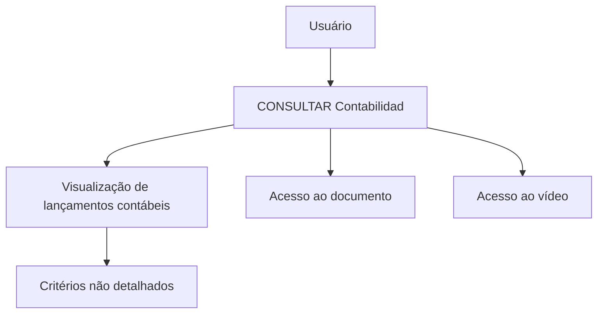

# Documentação de Operação de Contabilidade — Consultas

## 1. Metadados do Documento
- **Arquivo de Origem:** Não identificado
- **Tipo de Documento:** Manual Operacional
- **Domínio / Sistema:** Contabilidade — Consultas
- **Público-Alvo:** Operação
- **Data/Versão Identificada:** Não identificada

---

## 2. Resumo Executivo & Contexto de Negócio

O documento apresenta uma seção de documentação operacional denominada **“DOCUMENTACIÓN de OPERACIÓN de CONTABILIDAD - CONSULTAS”**. O escopo explicitamente identificado é o de consultas de contabilidade.

A funcionalidade descrita como **“CONSULTAR Contabilidad”** permite visualizar informações de lançamentos contábeis (“apuntes contables”) segundo diferentes critérios. O texto não detalha quais são esses critérios, quais filtros estão disponíveis nem quais dados compõem cada lançamento contábil.

A página contém referências de acesso a um documento e a um vídeo, sem informar URLs, caminhos, títulos, credenciais ou procedimentos de acesso. Também exibe um menu de navegação com áreas como Search, Home, Solutions, Architectures, APIs, Events, Components, Cloud, Documentation, Zeus, Reef, Help e News.

O conteúdo disponível é resumido e não descreve arquitetura técnica, integrações, regras de autorização, contratos de API, ambientes, parâmetros de consulta ou fluxos operacionais detalhados.

---

## 3. Arquitetura, Componentes & Tecnologias Envolvidas

Os únicos elementos funcionais explicitamente citados são a área de **Contabilidade**, a operação de **Consulta de Contabilidade**, o acesso a um **documento** e o acesso a um **vídeo**. O menu também menciona as categorias ou áreas Search, Home, Solutions, Architectures, APIs, Events, Components, Cloud, Documentation, Zeus, Reef, Help e News.



**Nota de Análise:** O documento não detalha componentes de software, microsserviços, APIs, protocolos, bancos de dados, tecnologias, ambientes ou relações técnicas entre Zeus, Reef e a funcionalidade de consultas contábeis.

---

## 4. Regras de Negócio, Especificações Funcionais & Processos

1. A seção de consultas trata de operações pelas quais é possível visualizar informações registradas.
2. A operação identificada é **“CONSULTAR Contabilidad”**.
3. A operação de consulta exibe informações de lançamentos contábeis por diferentes critérios.
4. A tela ou conteúdo disponibiliza acesso a um documento.
5. A tela ou conteúdo disponibiliza acesso a um vídeo.

**Restrições de detalhamento identificadas:**
- Os critérios de consulta dos lançamentos contábeis não são especificados.
- Não há descrição de campos, filtros, ordenações, paginação ou formato dos resultados.
- Não há fluxo passo a passo para execução da consulta.
- Não há regras de validação, cálculo, tratamento de erro ou matriz de permissões.
- Não há detalhamento sobre o conteúdo do documento ou do vídeo acessíveis.

---

## 5. Tabelas de Parâmetros, Ambientes e Estruturas de Dados

| Item / Parâmetro | Descrição / Função | Tipo / Valores / Formato | Ambiente / Observações |
| :--- | :--- | :--- | :--- |
| CONSULTAS | Seção relativa a operações para visualização de informações registradas. | Seção funcional | Não detalhado |
| CONSULTAR Contabilidad | Operação de consulta contábil. | Funcionalidade | Exibe informações de lançamentos contábeis por critérios não especificados |
| Apuntes contables | Lançamentos contábeis cuja informação pode ser consultada. | Informação contábil | Estrutura e campos não detalhados |
| Accede al documento | Referência para acesso a documento. | Link ou ação de acesso | Destino não informado |
| Accede al vídeo | Referência para acesso a vídeo. | Link ou ação de acesso | Destino não informado |
| Search | Item de navegação exibido na página. | Menu | Sem detalhamento adicional |
| Home | Item de navegação exibido na página. | Menu | Sem detalhamento adicional |
| Solutions | Item de navegação exibido na página. | Menu | Sem detalhamento adicional |
| Architectures | Item de navegação exibido na página. | Menu | Sem detalhamento adicional |
| APIs | Item de navegação exibido na página. | Menu | Sem detalhamento adicional |
| Events | Item de navegação exibido na página. | Menu | Sem detalhamento adicional |
| Components | Item de navegação exibido na página. | Menu | Sem detalhamento adicional |
| Cloud | Item de navegação exibido na página. | Menu | Sem detalhamento adicional |
| Documentation | Item de navegação exibido na página. | Menu | Sem detalhamento adicional |
| Zeus | Item de navegação exibido na página. | Menu | Relação com consultas contábeis não detalhada |
| Reef | Item de navegação exibido na página. | Menu | Relação com consultas contábeis não detalhada |
| Help | Item de navegação exibido na página. | Menu | Sem detalhamento adicional |
| News | Item de navegação exibido na página. | Menu | Sem detalhamento adicional |
| EN | Indicador exibido na página. | Código textual | O documento não define o significado no contexto apresentado |
| CF | Sigla exibida na página. | Sigla textual | O documento não define o significado |

---

## 6. Bateria de Perguntas & Respostas para RAG (FAQ Sintético)

### P1: Qual é o objetivo da operação “CONSULTAR Contabilidad”?
**R:** A operação “CONSULTAR Contabilidad” mostra informações dos lançamentos contábeis (“apuntes contables”) por diferentes critérios.

### P2: Quais informações podem ser visualizadas na seção de consultas de contabilidade?
**R:** A seção permite visualizar informações registradas relacionadas a lançamentos contábeis. O documento não especifica os campos ou atributos exibidos.

### P3: Quais critérios podem ser usados para consultar os lançamentos contábeis?
**R:** O documento informa que os lançamentos contábeis podem ser visualizados por diferentes critérios, mas não identifica nem descreve quais são esses critérios.

### P4: O documento descreve os filtros disponíveis na consulta de contabilidade?
**R:** Não. O conteúdo apenas afirma que a consulta ocorre por diferentes critérios; filtros, parâmetros e valores aceitos não são detalhados.

### P5: Existe material complementar para a consulta de contabilidade?
**R:** Sim. A página indica “Accede al documento” e “Accede al vídeo”, sinalizando acesso a um documento e a um vídeo. Os destinos e conteúdos desses materiais não são informados.

### P6: A documentação informa APIs ou contratos de integração para “CONSULTAR Contabilidad”?
**R:** Não. Embora “APIs” apareça no menu de navegação, não há métodos HTTP, URLs, contratos JSON, autenticação ou detalhes de integração associados à consulta de contabilidade.

### P7: O documento identifica ambientes, servidores ou URLs para a operação de consulta?
**R:** Não. Não há ambientes, servidores, portas, URLs ou caminhos técnicos especificados no conteúdo disponível.

### P8: Qual é a relação de Zeus e Reef com a consulta de contabilidade?
**R:** Zeus e Reef aparecem como itens do menu de navegação. O documento não explica sua relação funcional ou técnica com a operação “CONSULTAR Contabilidad”.

### P9: A documentação define permissões para acessar os lançamentos contábeis?
**R:** Não. O documento não apresenta perfis de usuário, matriz de permissões, requisitos de autenticação ou regras de autorização.

### P10: A documentação descreve como tratar falhas ou resultados sem dados na consulta?
**R:** Não. Não existem regras de tratamento de erro, mensagens operacionais, exceções ou comportamento para consultas sem resultados.

---

## 7. Glossário de Termos, Siglas & Conceitos-Chave

- **CONSULTAS:** Seção que reúne operações pelas quais é possível visualizar informações registradas.
- **CONSULTAR Contabilidad:** Operação de consulta que mostra informações de lançamentos contábeis por diferentes critérios.
- **Contabilidad:** Termo em espanhol para contabilidade, conforme apresentado no documento.
- **Apuntes contables:** Termo em espanhol para lançamentos contábeis.
- **APIs:** Sigla exibida no menu; o documento não fornece sua definição nem descreve APIs associadas ao processo.
- **Zeus:** Nome exibido no menu de navegação; sem definição adicional.
- **Reef:** Nome exibido no menu de navegação; sem definição adicional.
- **EN:** Código exibido na página; significado não definido no conteúdo.
- **CF:** Sigla exibida na página; significado não definido no conteúdo.

---

## 8. Notas Críticas, Riscos & Limitações

- O conteúdo disponível possui caráter resumido e não apresenta detalhamento operacional suficiente para executar a consulta de contabilidade passo a passo.
- Os critérios usados para consultar lançamentos contábeis não são identificados.
- Não há especificação de dados de entrada, campos de saída, filtros, regras de validação ou regras de negócio adicionais.
- Não há detalhes sobre autenticação, autorização, perfis de acesso ou auditoria.
- Não são informados ambientes, URLs, APIs, contratos, tecnologias, integrações ou componentes técnicos.
- As referências ao documento e ao vídeo não incluem destino, título ou conteúdo.
- **Nota de Análise:** Zeus, Reef, APIs e outros itens aparecem somente no menu; o documento não permite inferir seu papel na arquitetura ou na operação de consultas de contabilidade.

---

## 9. Conteúdo Bruto Estruturado (Referência Fiel)

```text
--- [PÁGINA 1 DE 1] ---

EN CONSTRUCCIÓN
DOCUMENTACIÓN de OPERACIÓN de CONTABILIDAD - CONSULTAS
CONSULTAS
Operaciones por las que se puede ver la información registrada
CONSULTAR Contabilidad
Muestra la información de los apuntes contables por distintos criterios
 Accede al documento
 Accede al vídeo
 / 
 CF
Search Home Solutions Architectures APIs Events Components Cloud Documentation Zeus Reef Help News
EN
```
