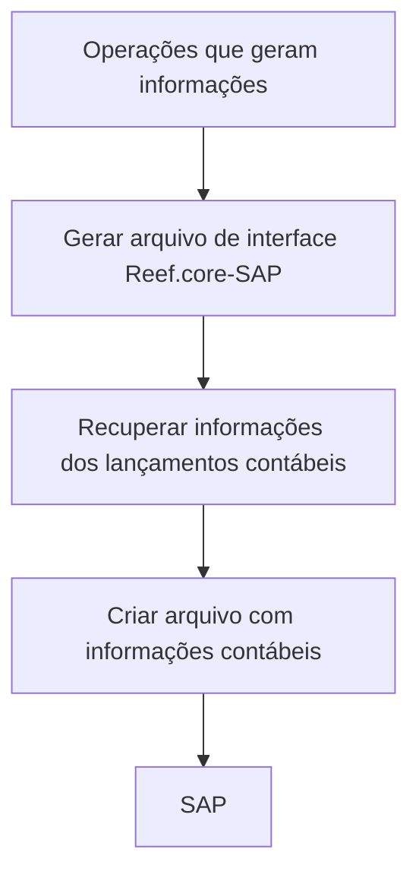

# Documentação de Operação de Contabilidade — Interface Reef.core-SAP

## 1. Metadados do Documento
- **Arquivo de Origem:** `Não identificado`
- **Tipo de Documento:** `Manual Operacional`
- **Domínio / Sistema:** `Contabilidade, Reef.core e SAP`
- **Público-Alvo:** `Operação`
- **Data/Versão Identificada:** `Não identificada`

---

## 2. Resumo Executivo & Contexto de Negócio

O conteúdo descreve uma documentação de operação relacionada à interface SAP no contexto de contabilidade. A finalidade declarada é tratar operações que geram informações para integração com outros sistemas.

A operação identificada como **“GENERAR Archivo interfaz Reef.core-SAP”** recupera informações de lançamentos contábeis (“asientos”) e cria um arquivo com informações contábeis destinadas ao SAP.

O documento também indica a disponibilidade de acesso a um documento e a um vídeo associados à operação. Entretanto, o conteúdo fornecido não apresenta URLs, procedimentos detalhados, pré-requisitos, critérios de execução, estrutura do arquivo gerado ou regras de erro.

O material aparenta ser uma página resumida de documentação ou portal de conhecimento, contendo navegação para elementos como soluções, arquiteturas, APIs, eventos, componentes, nuvem e documentação.

---

## 3. Arquitetura, Componentes & Tecnologias Envolvidas

### Componentes identificados

| Componente / Termo | Papel identificado no conteúdo |
| :--- | :--- |
| Reef.core | Origem ou contexto da geração do arquivo de interface contábil. |
| SAP | Sistema de destino das informações contábeis presentes no arquivo de interface. |
| Interface Reef.core-SAP | Operação que gera o arquivo para integração de informações contábeis. |
| Asientos | Informações de lançamentos contábeis recuperadas pela operação. |
| Documento | Material acessível associado à operação. |
| Vídeo | Material acessível associado à operação. |



> **Nota de Análise:** O conteúdo menciona a interface Reef.core-SAP, mas não detalha protocolos de integração, formato de arquivo, métodos de transmissão, contratos, URLs, autenticação, ambientes ou mecanismos de confirmação de processamento no SAP.

---

## 4. Regras de Negócio, Especificações Funcionais & Processos

### Processo identificado: geração do arquivo de interface Reef.core-SAP

1. Existem operações que geram informações para integração com outros sistemas.
2. A operação denominada **“GENERAR Archivo interfaz Reef.core-SAP”** é indicada como uma dessas operações.
3. A operação recupera informações dos lançamentos contábeis.
4. A operação cria um arquivo contendo informações contábeis para SAP.
5. O usuário pode acessar um documento e um vídeo relacionados à operação.

### Restrições de detalhamento

- O conteúdo não especifica quais lançamentos contábeis são recuperados.
- O conteúdo não informa filtros, períodos, critérios de seleção ou condições de elegibilidade dos lançamentos.
- O conteúdo não define o layout, extensão, codificação, nomenclatura ou diretório do arquivo gerado.
- O conteúdo não descreve como o arquivo é entregue, importado ou processado pelo SAP.
- O conteúdo não apresenta tratamento de falhas, logs, reprocessamento, reconciliação ou validações.

---

## 5. Tabelas de Parâmetros, Ambientes e Estruturas de Dados

| Item / Parâmetro | Descrição / Função | Tipo / Valores / Formato | Ambiente / Observações |
| :--- | :--- | :--- | :--- |
| Operação | Geração do arquivo de interface entre Reef.core e SAP. | `GENERAR Archivo interfaz Reef.core-SAP` | Não detalhado. |
| Informação de origem | Dados recuperados pela operação para criação do arquivo. | Lançamentos contábeis (“asientos”) | Não detalhado. |
| Informação de destino | Informações contábeis criadas no arquivo para SAP. | Arquivo de informações contábeis | Layout não detalhado. |
| Sistema de origem/contexto | Sistema citado no nome da interface. | Reef.core | Não detalhado. |
| Sistema de destino | Sistema que recebe as informações contábeis. | SAP | Não detalhado. |
| Material de apoio | Recurso documental associado à operação. | Documento | Link não fornecido. |
| Material de apoio | Recurso audiovisual associado à operação. | Vídeo | Link não fornecido. |
| Idioma exibido | Idioma indicado na navegação do portal. | `EN` | O conteúdo principal está em espanhol. |
| Navegação do portal | Categorias presentes na página. | Search, Home, Solutions, Architectures, APIs, Events, Components, Cloud, Documentation, Zeus, Reef, Help, News | Função de cada categoria não detalhada. |
| Elemento adicional | Texto isolado presente no conteúdo. | `CF` | Significado não identificado. |

---

## 6. Bateria de Perguntas & Respostas para RAG (FAQ Sintético)

### P1: Qual é o objetivo da operação “GENERAR Archivo interfaz Reef.core-SAP”?
**R:** A operação tem o objetivo de recuperar informações de lançamentos contábeis e criar um arquivo com informações contábeis para SAP.

### P2: Quais informações são recuperadas pela interface Reef.core-SAP?
**R:** A interface Reef.core-SAP recupera informações dos lançamentos contábeis, identificados no texto como “asientos”.

### P3: Qual sistema é mencionado como destino das informações contábeis geradas?
**R:** O SAP é mencionado como o sistema de destino das informações contábeis incluídas no arquivo criado pela operação.

### P4: O documento informa o formato do arquivo de interface Reef.core-SAP?
**R:** Não. O conteúdo informa apenas que a operação cria um arquivo com informações contábeis para SAP, sem especificar formato, extensão, layout ou codificação.

### P5: O documento descreve como o arquivo contábil é enviado ao SAP?
**R:** Não. Não há detalhes sobre transporte, importação, protocolo, diretório, integração automática ou execução manual do arquivo no SAP.

### P6: Há materiais de apoio para a operação de geração do arquivo?
**R:** Sim. O conteúdo indica que é possível acessar um documento e um vídeo relacionados à operação, embora não forneça os respectivos links ou conteúdos.

### P7: Quais regras de validação dos lançamentos contábeis são apresentadas?
**R:** Nenhuma regra de validação é apresentada. O conteúdo não especifica critérios de seleção, filtros, período contábil, obrigatoriedade de campos ou validações antes da geração do arquivo.

### P8: O que significa a expressão “Operaciones que generan información para integrar con otros sistemas”?
**R:** A expressão indica que existem operações voltadas à geração de informações para integração com outros sistemas. A operação de geração do arquivo Reef.core-SAP é apresentada como uma dessas operações.

### P9: O documento informa ambientes, URLs ou servidores da interface?
**R:** Não. Não há URLs de ambiente, identificação de servidores, portas, caminhos de arquivos ou dados de conectividade.

### P10: O documento explica o tratamento de erros ou o reprocessamento da interface?
**R:** Não. O conteúdo não descreve erros, logs, alertas, reconciliação, reprocessamento ou procedimentos de contingência.

---

## 7. Glossário de Termos, Siglas & Conceitos-Chave

- **SAP:** Sistema citado como destino das informações contábeis geradas pela interface.
- **Reef.core:** Nome citado na operação de geração do arquivo de interface com SAP.
- **Interface Reef.core-SAP:** Operação que recupera lançamentos contábeis e cria um arquivo com informações contábeis para SAP.
- **Asientos:** Termo em espanhol usado para indicar lançamentos contábeis.
- **CF:** Texto presente no conteúdo original; significado não identificado.
- **APIs:** Categoria de navegação apresentada no portal; não detalhada no conteúdo.
- **Zeus:** Categoria de navegação apresentada no portal; não detalhada no conteúdo.

---

## 8. Notas Críticas, Riscos & Limitações

- O conteúdo é resumido e não descreve o procedimento operacional completo.
- Não há especificação do layout do arquivo contábil destinado ao SAP.
- Não foram identificados dados sobre ambientes, servidores, URLs, credenciais, permissões ou mecanismos de autenticação.
- Não há definição de critérios para recuperação dos lançamentos contábeis.
- Não há informações sobre validação, conciliação, monitoramento, logs, reprocessamento ou tratamento de exceções.
- Os links para o documento e o vídeo são mencionados, mas não foram fornecidos no conteúdo bruto.
- **Nota de Análise:** O documento lista a operação de interface Reef.core-SAP, porém não detalha métodos de integração, contratos de dados ou comportamento do SAP após a criação do arquivo.

---

## 9. Conteúdo Bruto Estruturado (Referência Fiel)

```text
--- [PÁGINA 1 DE 1] ---

EN CONSTRUCCIÓN
DOCUMENTACIÓN de OPERACIÓN de CONTABILIDAD - INTERFAZ SAP
INTERFAZ SAP
Operaciones que generan información para integrar con otros sistemas
GENERAR Archivo interfaz Reef.core-SAP
Recupera información de los asientos y crea archivo con información contable para SAP
 Accede al documento
 Accede al vídeo
 / 
 CF
Search Home Solutions Architectures APIs Events Components Cloud Documentation Zeus Reef Help News
EN
```
