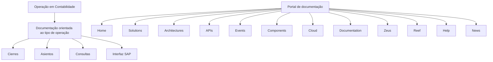

# Operação em Contabilidade — Documentação por Tipo de Operação

## 1. Metadados do Documento
- **Arquivo de Origem:** Não identificado
- **Tipo de Documento:** Manual Operacional
- **Domínio / Sistema:** Operação em Contabilidade
- **Público-Alvo:** Operação, Negócio e usuários de Contabilidade
- **Data/Versão Identificada:** Não identificada

---

## 2. Resumo Executivo & Contexto de Negócio

O documento apresenta uma visão de navegação e organização da documentação para o domínio de **Operação em Contabilidade**. A documentação é explicitamente orientada ao tratamento operacional conforme o tipo de operação.

Os tipos de operação identificados são **Cierres**, **Asientos**, **Consultas** e **Interfaz SAP**. O conteúdo sugere que esses temas constituem categorias funcionais principais para consulta na documentação de Contabilidade.

Também são identificados elementos de navegação de uma plataforma de documentação, incluindo *Home*, *Solutions*, *Architectures*, *APIs*, *Events*, *Components*, *Cloud*, *Documentation*, *Zeus*, *Reef*, *Help* e *News*. O documento apresenta ainda a seleção de idioma **EN**.

O conteúdo disponível é resumido e não descreve procedimentos, regras de cálculo, integrações técnicas, responsabilidades, métodos, contratos ou detalhes operacionais para os tipos de operação listados.

---

## 3. Arquitetura, Componentes & Tecnologias Envolvidas

O documento não apresenta arquitetura técnica, tecnologias, servidores, microsserviços, APIs, protocolos, bancos de dados ou ambientes. O único sistema externo citado nominalmente é **SAP**, no contexto de uma categoria denominada **Interfaz SAP**.

A estrutura abaixo representa exclusivamente a organização conceitual de navegação e categorias apresentada no conteúdo.



> **Nota de Análise:** O documento menciona a categoria **Interfaz SAP**, mas não detalha mecanismos de integração, métodos de comunicação, contratos, formatos de mensagens ou processos de sincronização com SAP.

---

## 4. Regras de Negócio, Especificações Funcionais & Processos

O conteúdo estabelece que a documentação de Contabilidade está organizada por tipo de operação. Os tipos de operação apresentados são:

1. **Cierres**
2. **Asientos**
3. **Consultas**
4. **Interfaz SAP**

Não há regras de negócio explícitas, critérios de validação, condições de execução, parâmetros de cálculo, sequência operacional, exceções, perfis de acesso ou fluxos detalhados no texto fornecido.

> **Nota de Análise:** Não há detalhamento adicional sobre o significado operacional de **Cierres**, **Asientos**, **Consultas** ou **Interfaz SAP**. O documento apenas os lista como tipos de operação.

---

## 5. Tabelas de Parâmetros, Ambientes e Estruturas de Dados

| Item / Parâmetro | Descrição / Função | Tipo / Valores / Formato | Ambiente / Observações |
| :--- | :--- | :--- | :--- |
| Operação em Contabilidade | Domínio principal da documentação | Título do conteúdo | Não informado |
| Documentação orientada à operação | Organização documental por tipo de operação | Diretriz documental | Não informado |
| Cierres | Tipo de operação listado | Categoria operacional | Sem detalhamento adicional |
| Asientos | Tipo de operação listado | Categoria operacional | Sem detalhamento adicional |
| Consultas | Tipo de operação listado | Categoria operacional | Sem detalhamento adicional |
| Interfaz SAP | Tipo de operação listado associado a SAP | Categoria de integração | Sem contrato ou fluxo técnico descrito |
| SAP | Sistema citado pelo nome | Sistema externo | Relação limitada à categoria “Interfaz SAP” |
| EN | Idioma exibido no portal | Código de idioma apresentado | Não há informação sobre outros idiomas |
| Zeus | Item de navegação do portal | Seção ou produto citado | Não detalhado |
| Reef | Item de navegação do portal | Seção ou produto citado | Não detalhado |

---

## 6. Bateria de Perguntas & Respostas para RAG (FAQ Sintético)

### P1: Qual é o objetivo da documentação de Operação em Contabilidade?
**R:** O objetivo apresentado é disponibilizar documentação orientada à operação, organizada conforme o tipo de operação de Contabilidade.

### P2: Quais tipos de operação estão listados para Contabilidade?
**R:** O documento lista quatro tipos de operação: **Cierres**, **Asientos**, **Consultas** e **Interfaz SAP**.

### P3: O documento descreve como executar operações de Cierres?
**R:** Não. O documento apenas lista **Cierres** como um tipo de operação e não fornece passos, validações, responsáveis ou regras operacionais.

### P4: O que o documento informa sobre Asientos?
**R:** **Asientos** é apresentado como um tipo de operação na documentação de Contabilidade. Não há definição funcional, processo ou regra adicional no conteúdo fornecido.

### P5: Existem instruções para realizar Consultas?
**R:** Não. **Consultas** aparece somente como uma categoria de tipo de operação, sem instruções de uso, filtros, telas, campos ou resultados esperados.

### P6: Como funciona a Interfaz SAP?
**R:** O documento identifica **Interfaz SAP** como um tipo de operação, mas não descreve como a integração funciona. Não são informados protocolos, APIs, arquivos, mensagens, rotinas, frequências ou contratos.

### P7: SAP é a única tecnologia explicitamente citada?
**R:** Sim. No conteúdo fornecido, **SAP** é o único sistema ou tecnologia citado nominalmente, vinculado à categoria **Interfaz SAP**.

### P8: Quais seções de navegação estão visíveis no portal de documentação?
**R:** As seções visíveis são: **Home**, **Solutions**, **Architectures**, **APIs**, **Events**, **Components**, **Cloud**, **Documentation**, **Zeus**, **Reef**, **Help** e **News**.

### P9: O documento informa ambientes, URLs ou servidores?
**R:** Não. Não há URLs, nomes de servidores, ambientes, portas, variáveis de configuração ou rotas de log no conteúdo extraído.

### P10: Há uma versão ou data identificada para o documento?
**R:** Não. O conteúdo fornecido não contém data, versão, histórico de revisões ou identificação de arquivo.

---

## 7. Glossário de Termos, Siglas & Conceitos-Chave

- **Operação em Contabilidade:** Título e domínio principal do conteúdo apresentado.
- **Cierres:** Tipo de operação listado no documento; não possui definição adicional no texto.
- **Asientos:** Tipo de operação listado no documento; não possui definição adicional no texto.
- **Consultas:** Tipo de operação listado no documento; não possui definição adicional no texto.
- **Interfaz SAP:** Tipo de operação relacionado a SAP; o documento não detalha a interface.
- **SAP:** Sistema citado no nome da categoria **Interfaz SAP**.
- **EN:** Indicador de idioma exibido no portal.
- **Zeus:** Item de navegação citado no portal, sem explicação adicional.
- **Reef:** Item de navegação citado no portal, sem explicação adicional.

---

## 8. Notas Críticas, Riscos & Limitações

- O conteúdo é altamente resumido e não fornece detalhamento operacional para nenhum dos tipos de operação listados.
- Não há instruções executáveis para **Cierres**, **Asientos**, **Consultas** ou **Interfaz SAP**.
- Não há documentação de arquitetura, fluxos de dados, integrações, APIs, eventos, campos, permissões ou ambientes.
- A referência a **SAP** não é suficiente para inferir tecnologia de integração, responsabilidade de sistemas, formato de dados ou comportamento operacional.
- Não há arquivo de origem, data, versão, autor, área responsável ou classificação documental identificados.

---

## 9. Conteúdo Bruto Estruturado (Referência Fiel)

```text
--- [PÁGINA 1 DE 1] ---

OPERACIÓN en CONTABILIDAD
 Documentación orientada a la operación por tipo de operación.
TIPOS DE OPERACIÓN
CIERRES ASIENTOS CONSULTAS INTERFAZ SAP
 / 
 CF
Search Home Solutions Architectures APIs Events Components Cloud Documentation Zeus Reef Help News
EN
```
