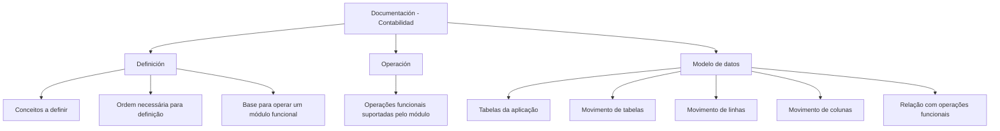

# Documentação — Contabilidade: Estrutura Funcional do Sistema

## 1. Metadados do Documento
- **Arquivo de Origem:** Não identificado
- **Tipo de Documento:** Manual Operacional
- **Domínio / Sistema:** Contabilidade / Zeus Home Solutions APIs Documentation
- **Público-Alvo:** Operação, analistas funcionais e equipes que consultam a documentação do sistema
- **Data/Versão Identificada:** Não identificada

---

## 2. Resumo Executivo & Contexto de Negócio

O conteúdo apresenta a seção de documentação relacionada à funcionalidade de **Contabilidade**. A página inicial identifica o contexto de navegação como “Home Solutions APIs Documentation Zeus”, com idioma indicado como “EN”, enquanto o conteúdo funcional está redigido em espanhol.

A documentação de Contabilidade é organizada em três áreas: **Definição**, **Operação** e **Modelo de Dados**. Essa segmentação separa o estabelecimento de conceitos funcionais, a execução de operações suportadas pelo módulo e a consulta às estruturas de dados da aplicação.

A área de **Definição** reúne documentos que detalham os conceitos que devem ser configurados ou definidos e a ordem necessária para realizar essas definições, permitindo posteriormente a operação de um módulo funcional.

A área de **Operação** concentra documentos sobre as operações funcionais suportadas pelo módulo. O material fornecido não descreve operações específicas, fluxos transacionais, usuários responsáveis ou critérios de execução.

A área de **Modelo de Dados** é orientada às tabelas da aplicação e descreve detalhadamente o movimento de elementos como tabelas, linhas e colunas em função das operações funcionais.

---

## 3. Arquitetura, Componentes & Tecnologias Envolvidas

O documento menciona os seguintes elementos:

- **Contabilidade:** área funcional documentada.
- **Home Solutions APIs Documentation Zeus:** identificação exibida na página inicial.
- **Definição:** categoria documental para conceitos e sequência de definição.
- **Operação:** categoria documental para operações funcionais do módulo.
- **Modelo de Dados:** categoria documental para tabelas e movimentação de elementos estruturais.



**Nota de Análise:** O documento não detalha arquitetura de software, interfaces, APIs, tecnologias de implementação, contratos HTTP, URLs de ambiente, servidores, credenciais, logs ou integrações entre sistemas.

---

## 4. Regras de Negócio, Especificações Funcionais & Processos

### Estrutura documental da funcionalidade de Contabilidade

1. A documentação relacionada à funcionalidade do sistema é dividida em:
   - Definição;
   - Operação;
   - Modelo de Dados.

2. A categoria **Definição** abrange documentos que:
   - detalham os conceitos que precisam ser definidos;
   - estabelecem a ordem que deve ser seguida para obter a definição necessária;
   - permitem que um módulo funcional possa ser operado após a definição necessária.

3. A categoria **Operação** abrange documentos relacionados às operações funcionais que o módulo suporta.

4. A categoria **Modelo de Dados** abrange documentação:
   - orientada às tabelas da aplicação;
   - que descreve detalhadamente o movimento de tabelas, linhas e colunas;
   - que relaciona esses movimentos às operações funcionais.

**Nota de Análise:** Não foram fornecidos critérios de validação, fórmulas de cálculo, regras de autorização, estados operacionais, nomes de tabelas, atributos de colunas ou operações funcionais concretas.

---

## 5. Tabelas de Parâmetros, Ambientes e Estruturas de Dados

| Item / Parâmetro | Descrição / Função | Tipo / Valores / Formato | Ambiente / Observações |
| :--- | :--- | :--- | :--- |
| Área funcional | Contabilidade | Área de documentação funcional | Não há ambiente informado |
| Contexto de navegação | Home Solutions APIs Documentation Zeus | Texto exibido na página inicial | Não há detalhes técnicos adicionais |
| Idioma exibido | EN | Indicador apresentado na página inicial | O conteúdo funcional disponível está em espanhol |
| Definição | Documentos sobre conceitos a definir e a sequência necessária para defini-los | Categoria documental | Necessária para viabilizar a operação de um módulo funcional |
| Operação | Documentos relacionados às operações funcionais suportadas | Categoria documental | Operações específicas não foram detalhadas |
| Modelo de Dados | Documentação sobre tabelas da aplicação e movimentação de elementos | Categoria documental | Inclui tabelas, linhas e colunas vinculadas a operações funcionais |
| Tabelas da aplicação | Estruturas tratadas pelo Modelo de Dados | Estrutura de dados | Nomes e esquemas não informados |
| Linhas | Elementos cuja movimentação é descrita no Modelo de Dados | Estrutura de dados | Sem detalhamento de operações |
| Colunas | Elementos cuja movimentação é descrita no Modelo de Dados | Estrutura de dados | Sem detalhamento de atributos |

---

## 6. Bateria de Perguntas & Respostas para RAG (FAQ Sintético)

### P1: Qual é o escopo da documentação de Contabilidade?
**R:** A documentação de Contabilidade aborda a funcionalidade do sistema e está dividida em três áreas: Definição, Operação e Modelo de Dados.

### P2: Quais são as divisões da documentação de Contabilidade?
**R:** A documentação de Contabilidade é dividida nos apartados Definição, Operação e Modelo de Dados.

### P3: O que a seção Definição documenta?
**R:** A seção Definição documenta os conceitos que precisam ser definidos e a ordem que deve ser seguida para alcançar a definição necessária que permita operar um módulo funcional.

### P4: Por que a ordem das definições é relevante para o módulo funcional?
**R:** Segundo o documento, a ordem das definições deve ser seguida para obter a definição necessária que viabiliza a operação de um módulo funcional. O conteúdo não detalha quais conceitos ou etapas compõem essa ordem.

### P5: O que está coberto pela seção Operação?
**R:** A seção Operação contém documentos relacionados às operações funcionais suportadas pelo módulo. O material não identifica operações específicas nem descreve seus passos.

### P6: Qual é o objetivo da seção Modelo de Dados?
**R:** A seção Modelo de Dados fornece documentação orientada às tabelas da aplicação e descreve detalhadamente o movimento de tabelas, linhas e colunas conforme as operações funcionais.

### P7: O documento informa os nomes das tabelas de Contabilidade?
**R:** Não. O documento afirma que o Modelo de Dados é orientado às tabelas da aplicação, mas não fornece nomes de tabelas, colunas, chaves, tipos de dados ou relacionamentos.

### P8: Existem detalhes sobre APIs, métodos HTTP ou contratos JSON?
**R:** Não. Embora a página inicial contenha a identificação “Home Solutions APIs Documentation Zeus”, o conteúdo fornecido não descreve APIs, métodos HTTP, endpoints, contratos JSON ou integrações.

### P9: O documento identifica servidores, ambientes ou URLs de acesso?
**R:** Não. Não há servidores, ambientes, URLs, portas, caminhos de log ou variáveis de configuração no conteúdo disponibilizado.

### P10: O que o documento diz sobre movimentação de dados?
**R:** O documento informa que o Modelo de Dados descreve detalhadamente a movimentação de elementos como tabelas, linhas e colunas, considerando as operações funcionais. Não são apresentados exemplos ou regras concretas dessa movimentação.

---

## 7. Glossário de Termos, Siglas & Conceitos-Chave

- **Contabilidade:** área funcional cuja documentação é apresentada.
- **Definição:** conjunto documental que descreve conceitos a definir e a ordem necessária para permitir a operação de um módulo funcional.
- **Operação:** conjunto documental relativo às operações funcionais suportadas pelo módulo.
- **Modelo de Dados:** documentação orientada às tabelas da aplicação e ao movimento de tabelas, linhas e colunas associado às operações funcionais.
- **Módulo funcional:** módulo que pode ser operado após a realização das definições necessárias.
- **Home Solutions APIs Documentation Zeus:** texto de contexto exibido na página inicial; o documento não explica seu significado técnico ou organizacional.
- **EN:** indicador de idioma exibido na página inicial; o documento não fornece explicação adicional.

---

## 8. Notas Críticas, Riscos & Limitações

- O nome do arquivo de origem não foi disponibilizado.
- Não há data, versão, autoria ou responsável identificado.
- O conteúdo disponível possui apenas duas páginas extraídas.
- Não há detalhamento de operações funcionais específicas do módulo de Contabilidade.
- Não há nomes de tabelas, campos, relacionamentos, tipos de dados ou esquemas de banco.
- Não há descrição de APIs, integrações, endpoints, contratos de dados, servidores ou ambientes.
- **Nota de Análise:** O texto usa a identificação “Home Solutions APIs Documentation Zeus”, porém não detalha a relação dessa identificação com a funcionalidade de Contabilidade.
- **Nota de Análise:** O documento afirma que há descrição detalhada da movimentação de tabelas, linhas e colunas, mas essa descrição detalhada não está presente no trecho fornecido.

---

## 9. Conteúdo Bruto Estruturado (Referência Fiel)

```text
--- [PÁGINA 1 DE 2] ---

/
CF
Home Solutions APIs Documentation Zeus
EN


--- [PÁGINA 2 DE 2] ---

DOCUMENTACIÓN - CONTABILIDAD
En este apartado se aborda todo aquello relacionado con la funcionalidad del sistema. La
información se encuentra dividida en los apartados siguientes:
Definición
Operación
Modelo de datos

DEFINICIÓN
Documentos que detallan aquellos conceptos que se han de definir y el orden que se ha de seguir
para conseguir la definición necesaria con lo que poder operar un módulo funcional.

OPERACIÓN
Documentos relacionados con las operaciones funcionales que el módulo soporta.

MODELO DE DATOS
Documentación orientada hacia las tablas de la aplicación. Adicionalmente, se describe con detalle el
movimiento de distintos elementos como tablas, filas y columnas atendiendo a las operaciones
funcionales.
```
