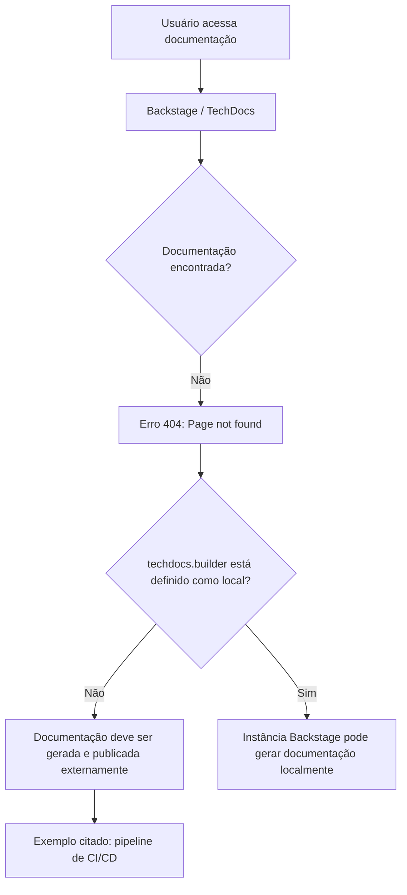

# Página de Erro 404 do Backstage TechDocs — Documentação Não Encontrada

## 1. Metadados do Documento
- **Arquivo de Origem:** Não identificado
- **Tipo de Documento:** Procedimento / Página de erro de documentação
- **Domínio / Sistema:** Backstage TechDocs; Zeus; Home Solutions APIs Documentation
- **Público-Alvo:** Desenvolvedores, Arquitetos e Operação
- **Data/Versão Identificada:** Não identificada

---

## 2. Resumo Executivo & Contexto de Negócio

O conteúdo fornecido corresponde a uma página de erro **404 (Page not found)** exibida no contexto de uma aplicação Backstage com navegação para documentação técnica. A página indica que a documentação solicitada não foi encontrada.

A mensagem aponta que a configuração `techdocs.builder` não está definida como `local`. Nesse modo de configuração, a instância Backstage não gera documentação quando os artefatos de documentação não são localizados.

O texto orienta que a documentação do projeto deve ser gerada e publicada por um processo externo, exemplificado como um pipeline de **CI/CD**. Como alternativa, o texto sugere configurar `techdocs.builder` como `local` para permitir a geração de documentação pela própria instância Backstage.

A interface exibida contém referências de navegação para `Home`, `Solutions`, `APIs`, `Documentation`, `Zeus` e seleção de idioma `EN`. O conteúdo não fornece detalhes sobre o projeto, serviço, repositório ou documento específico que deveria estar disponível.

---

## 3. Arquitetura, Componentes & Tecnologias Envolvidas

Os elementos explicitamente citados são:

- **Backstage:** aplicação que exibe a página de erro e hospeda a experiência de documentação.
- **TechDocs:** componente/configuração de documentação identificado pela propriedade `techdocs.builder`.
- **Builder `local`:** opção indicada para gerar documentação pela própria instância Backstage.
- **Processo externo:** mecanismo alternativo para gerar e publicar a documentação.
- **Pipeline de CI/CD:** exemplo de processo externo citado para geração e publicação.
- **Zeus:** item de navegação/contexto exibido na página.
- **Home Solutions APIs Documentation:** elementos de navegação exibidos na interface.



> **Nota de Análise:** O conteúdo não identifica a URL solicitada, o projeto afetado, o repositório de origem, o mecanismo de publicação externo nem a configuração completa do Backstage.

---

## 4. Regras de Negócio, Especificações Funcionais & Processos

1. Quando a documentação solicitada não é localizada, a aplicação apresenta o erro `ERROR 404: Page not found`.
2. A ausência de `techdocs.builder: local` implica que a instância Backstage não gerará automaticamente a documentação que não for encontrada.
3. Nesse cenário, os documentos do projeto devem ser gerados e publicados por um processo externo.
4. O conteúdo cita um pipeline de CI/CD como exemplo de processo externo para geração e publicação da documentação.
5. Como alternativa ao processo externo, a configuração `techdocs.builder` pode ser alterada para `local`, permitindo que a instância Backstage gere a documentação.
6. A página oferece navegação de retorno por meio de `Go back`.
7. A página também orienta o usuário a entrar em contato com o suporte caso considere que o erro seja um defeito.

---

## 5. Tabelas de Parâmetros, Ambientes e Estruturas de Dados

| Item / Parâmetro | Descrição / Função | Tipo / Valores / Formato | Ambiente / Observações |
| :--- | :--- | :--- | :--- |
| `ERROR 404` | Indica que a página/documentação não foi encontrada. | Código de erro HTTP exibido como texto. | Página Backstage/TechDocs. |
| `techdocs.builder` | Configuração que define o mecanismo de geração de documentação TechDocs. | Propriedade de configuração. | O texto informa que não está definida como `local`. |
| `local` | Valor sugerido para permitir geração de documentação pela instância Backstage. | Valor de configuração. | Alternativa à geração/publicação externa. |
| Processo externo | Processo responsável por gerar e publicar documentação não encontrada pela instância. | Processo operacional. | O documento fornece CI/CD como exemplo. |
| CI/CD pipeline | Exemplo de processo externo para geração e publicação de documentação. | Pipeline de integração contínua e entrega/implantação contínua. | Não há ferramenta, estágio ou repositório identificado. |
| Backstage | Aplicação que apresenta a página e a mensagem de TechDocs. | Plataforma/aplicação. | Não há versão identificada. |
| Zeus | Item exibido na navegação da página. | Nome/contexto de navegação. | Sem detalhamento adicional. |
| `EN` | Idioma exibido na interface. | Código de idioma. | Contexto visual da página. |

---

## 6. Bateria de Perguntas & Respostas para RAG (FAQ Sintético)

### P1: O que significa o erro “ERROR 404: Page not found” exibido na documentação?
**R:** O erro indica que a página ou documentação solicitada não foi encontrada pela aplicação Backstage/TechDocs.

### P2: Por que o Backstage não gera a documentação ausente automaticamente?
**R:** A mensagem informa que `techdocs.builder` não está configurado como `local`. Portanto, essa instância Backstage não gera documentos quando eles não são encontrados.

### P3: Qual configuração é mencionada para permitir geração local de documentação?
**R:** O conteúdo cita o valor `local` para a propriedade `techdocs.builder`. Alterar essa configuração para `local` é apresentado como alternativa para que a instância Backstage gere a documentação.

### P4: Como a documentação deve ser disponibilizada quando `techdocs.builder` não está como `local`?
**R:** A documentação do projeto deve ser gerada e publicada por algum processo externo à instância Backstage.

### P5: Qual exemplo de processo externo é fornecido para publicar a documentação?
**R:** O texto cita um pipeline de CI/CD como exemplo de processo externo capaz de gerar e publicar a documentação.

### P6: O conteúdo identifica qual documento ou projeto está ausente?
**R:** Não. A página apenas informa que a página não foi encontrada; ela não identifica o documento, projeto, URL ou repositório de origem.

### P7: O que o usuário pode fazer se acreditar que o erro 404 é um defeito?
**R:** A página orienta o usuário a entrar em contato com o suporte caso considere que o problema seja um bug.

### P8: Quais opções de navegação aparecem na página de erro?
**R:** A interface mostra `Home`, `Solutions`, `APIs`, `Documentation`, `Zeus`, seleção de idioma `EN` e a ação `Go back`.

---

## 7. Glossário de Termos, Siglas & Conceitos-Chave

- **404:** Código de erro exibido para indicar que uma página não foi encontrada.
- **Backstage:** Aplicação mencionada na mensagem de erro como a instância que não gerará a documentação ausente sob a configuração atual.
- **TechDocs:** Componente ou contexto de documentação referido pela configuração `techdocs.builder`.
- **`techdocs.builder`:** Propriedade de configuração relacionada ao mecanismo de geração de documentação TechDocs.
- **`local`:** Valor de configuração sugerido para permitir a geração de documentação pela instância Backstage.
- **CI/CD:** Termo citado como exemplo de pipeline externo para gerar e publicar documentação.
- **Zeus:** Nome exibido na navegação da página, sem explicação adicional no conteúdo.

---

## 8. Notas Críticas, Riscos & Limitações

- O conteúdo representa exclusivamente uma página de erro, não uma especificação funcional ou arquitetura completa.
- Não há identificação do arquivo de origem, da URL com falha, do serviço responsável, do repositório, do owner ou do ambiente afetado.
- Não são fornecidos detalhes sobre como configurar `techdocs.builder`, onde aplicar a alteração ou qual ferramenta de CI/CD deve publicar a documentação.
- A geração local é apresentada como alternativa, mas o conteúdo não descreve impactos operacionais, requisitos ou permissões associados.
- **Nota de Análise:** O texto cita `Zeus`, porém não detalha sua função, relação com o Backstage ou responsabilidade sobre a publicação da documentação.

---

## 9. Conteúdo Bruto Estruturado (Referência Fiel)

```text
--- [PÁGINA 1 DE 1] ---

ERROR 404: j: Page not found.
Note that techdocs.builder is not set to 'local' in
your config, which means this Backstage app will
not generate docs if they are not found. Make sure
the project's docs are generated and published by
some external process (e.g. CI/CD pipeline). Or
change techdocs.builder to 'local' to generate docs
from this Backstage instance.
Looks like someone
dropped the mic!
Go back... or please  if you
think this is a bug.
contact support
 / 
 CF
Home Solutions APIs Documentation Zeus
EN
```
