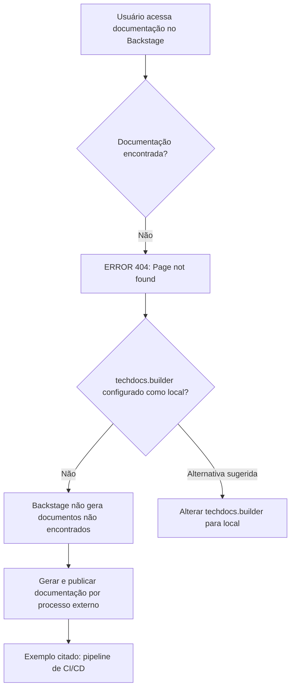

# Backstage TechDocs — Página Não Encontrada (ERROR 404)

## 1. Metadados do Documento
- **Arquivo de Origem:** Não informado
- **Tipo de Documento:** Procedimento / Página de erro de documentação
- **Domínio / Sistema:** Backstage TechDocs / Zeus
- **Público-Alvo:** Desenvolvedores, Arquitetos, Operação
- **Data/Versão Identificada:** Não identificada

---

## 2. Resumo Executivo & Contexto de Negócio

O conteúdo apresenta uma página de erro `ERROR 404` do Backstage TechDocs, indicando que a documentação solicitada não foi localizada. A interface informa que `techdocs.builder` não está configurado como `local`.

Segundo a mensagem, a instância Backstage não gera documentação quando os documentos não são encontrados. A publicação e geração da documentação precisam ocorrer por um processo externo, sendo o pipeline de CI/CD citado como exemplo.

Como alternativa, a mensagem sugere alterar `techdocs.builder` para `local`, permitindo que a documentação seja gerada pela própria instância Backstage. O conteúdo não especifica o arquivo de configuração, o procedimento técnico, permissões necessárias ou impactos dessa alteração.

A página também disponibiliza elementos de navegação para retorno e suporte, além de referências visuais a `Home`, `Solutions`, `APIs`, `Documentation`, `Zeus`, idioma `EN` e `CF`.

---

## 3. Arquitetura, Componentes & Tecnologias Envolvidas

Componentes e termos identificados:

| Componente / Tecnologia | Papel identificado no conteúdo |
| :--- | :--- |
| Backstage | Instância que exibe a página de documentação e o erro 404. |
| TechDocs | Recurso de documentação referido pela configuração `techdocs.builder`. |
| `techdocs.builder` | Configuração que, segundo a mensagem, não está definida como `local`. |
| CI/CD pipeline | Processo externo citado como exemplo para gerar e publicar documentação. |
| `local` | Valor de configuração sugerido para permitir geração de documentação pela instância Backstage. |
| Zeus | Nome exibido na navegação da página; o conteúdo não detalha sua função. |
| CF | Sigla exibida na página; o conteúdo não define seu significado. |



> **Nota de Análise:** O conteúdo não identifica o projeto, repositório, endpoint, mecanismo de publicação, configuração completa do Backstage ou pipeline de CI/CD responsável pela documentação.

---

## 4. Regras de Negócio, Especificações Funcionais & Processos

1. A ausência da documentação solicitada resulta na exibição de `ERROR 404: Page not found`.
2. Quando `techdocs.builder` não está definido como `local`, a instância Backstage não gera documentos que não foram encontrados.
3. A mensagem orienta garantir que a documentação do projeto seja gerada e publicada por um processo externo.
4. Um pipeline de CI/CD é citado como exemplo de processo externo para geração e publicação da documentação.
5. Como alternativa, a mensagem sugere configurar `techdocs.builder` como `local` para habilitar a geração de documentação pela instância Backstage.
6. A página fornece uma ação de retorno (`Go back`) e uma orientação para contato com suporte caso o erro seja considerado um defeito.

---

## 5. Tabelas de Parâmetros, Ambientes e Estruturas de Dados

| Item / Parâmetro | Descrição / Função | Tipo / Valores / Formato | Ambiente / Observações |
| :--- | :--- | :--- | :--- |
| Código de erro | Indica que a página de documentação não foi encontrada. | `ERROR 404` | Exibido pela página Backstage TechDocs. |
| `techdocs.builder` | Configuração relacionada à geração de documentação pelo Backstage. | Valor mencionado: `local` | O conteúdo informa que não está definido como `local`. |
| Geração externa | Processo responsável por gerar e publicar documentação quando não gerada localmente. | Processo externo | Pipeline de CI/CD é apresentado como exemplo. |
| `Go back` | Ação de navegação para retorno. | Link ou ação de interface | Não há detalhamento do destino. |
| `contact support` | Orientação de suporte em caso de possível defeito. | Canal de suporte não especificado | Não há contato, URL ou equipe informada. |
| Idioma | Idioma exibido na navegação. | `EN` | Não há informação sobre internacionalização. |
| Navegação | Itens de navegação exibidos. | `Home`, `Solutions`, `APIs`, `Documentation`, `Zeus` | A relação entre os itens não é detalhada. |
| Sigla exibida | Texto visível na página. | `CF` | Significado não identificado. |

---

## 6. Bateria de Perguntas & Respostas para RAG (FAQ Sintético)

### P1: O que significa o erro `ERROR 404: Page not found` exibido no Backstage TechDocs?
**R:** O erro indica que a página de documentação solicitada não foi encontrada pela instância Backstage TechDocs.

### P2: Por que o Backstage não gera automaticamente a documentação ausente?
**R:** A mensagem informa que `techdocs.builder` não está configurado como `local`. Nessa condição, a instância Backstage não gera documentação quando ela não é encontrada.

### P3: Qual configuração é mencionada como alternativa para gerar documentação no próprio Backstage?
**R:** O conteúdo sugere alterar a configuração `techdocs.builder` para `local`, permitindo que a documentação seja gerada por essa instância Backstage.

### P4: Como a documentação pode ser gerada se `techdocs.builder` não estiver configurado como `local`?
**R:** A documentação deve ser gerada e publicada por um processo externo. A mensagem cita um pipeline de CI/CD como exemplo desse processo.

### P5: O documento informa qual pipeline de CI/CD deve ser utilizado?
**R:** Não. O conteúdo apenas menciona um pipeline de CI/CD como exemplo de processo externo, sem identificar ferramenta, repositório, arquivo de pipeline ou etapas de publicação.

### P6: O que deve ser verificado quando uma página TechDocs não é encontrada?
**R:** Deve-se verificar se a documentação do projeto foi gerada e publicada por um processo externo e se a configuração `techdocs.builder` está definida como `local`, caso a geração pela própria instância Backstage seja desejada.

### P7: A página fornece uma forma de retornar após o erro 404?
**R:** Sim. A interface exibe a opção `Go back`, mas não detalha para qual página ou rota a ação direciona.

### P8: O que fazer se o erro 404 for considerado um defeito?
**R:** A página orienta o usuário a entrar em contato com o suporte, mas não informa canal, endereço ou equipe responsável.

### P9: O que é `Zeus` no contexto apresentado?
**R:** `Zeus` aparece como um item na navegação da página. O conteúdo não descreve sua função, domínio funcional ou relação com Backstage TechDocs.

### P10: O que significa a sigla `CF` exibida na página?
**R:** O conteúdo exibe `CF`, mas não fornece definição ou contexto suficiente para expandir a sigla.

---

## 7. Glossário de Termos, Siglas & Conceitos-Chave

- **Backstage:** Plataforma ou instância mencionada na mensagem de erro e responsável por exibir a página de documentação.
- **TechDocs:** Recurso de documentação associado à configuração `techdocs.builder`.
- **`techdocs.builder`:** Parâmetro de configuração relacionado à geração de documentação no Backstage.
- **`local`:** Valor de configuração sugerido para que a instância Backstage gere a documentação.
- **CI/CD:** Termo citado como exemplo de pipeline externo para geração e publicação da documentação. O conteúdo não expande a sigla.
- **ERROR 404:** Código de erro exibido para indicar que a página solicitada não foi encontrada.
- **Zeus:** Item exibido na navegação; significado não detalhado.
- **CF:** Sigla exibida na página; significado não identificado.

---

## 8. Notas Críticas, Riscos & Limitações

- O conteúdo não informa qual documentação, projeto ou URL resultou no erro 404.
- Não há instruções técnicas para alterar `techdocs.builder`, nem indicação do arquivo de configuração correspondente.
- Não são fornecidos detalhes sobre o processo externo de publicação, ferramenta de CI/CD, permissões ou responsáveis operacionais.
- Configurar `techdocs.builder` como `local` é apenas uma sugestão da página; o conteúdo não descreve impactos, pré-requisitos ou riscos dessa configuração.
- `Zeus` e `CF` são exibidos sem definição contextual.
- Não há URL, contato ou procedimento específico para acionar o suporte.

---

## 9. Conteúdo Bruto Estruturado (Referência Fiel)

```text
--- [PÁGINA 1 DE 1] ---

ERROR 404: j: Page not found.
Note that techdocs.builder is not set to 'local' in
your config, which means this Backstage app will
not generate docs if they are not found. Make sure
the project's docs are generated and published by
some external process (e.g. CI/CD pipeline). Or
change techdocs.builder to 'local' to generate docs
from this Backstage instance.
Looks like someone
dropped the mic!
Go back... or please  if you
think this is a bug.
contact support
 / 
 CF
Home Solutions APIs Documentation Zeus
EN
```
